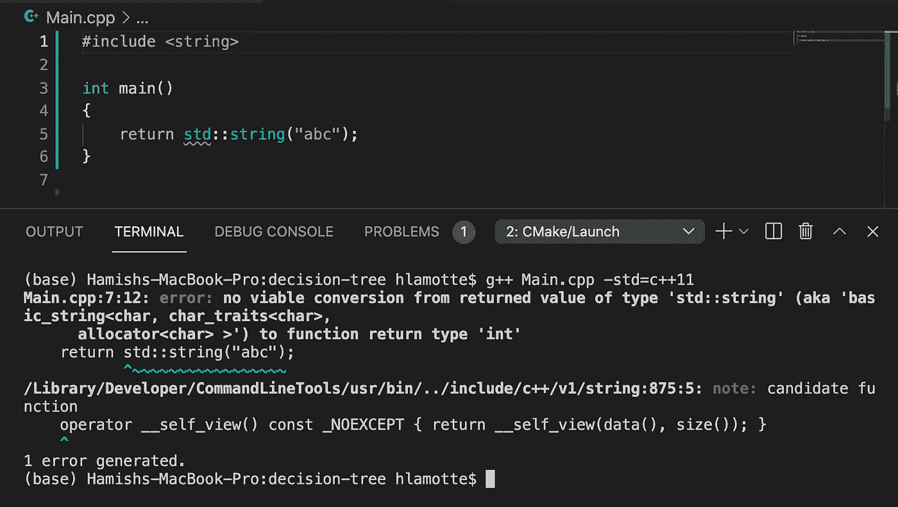
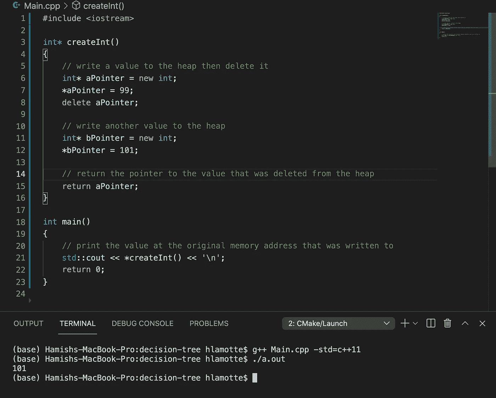
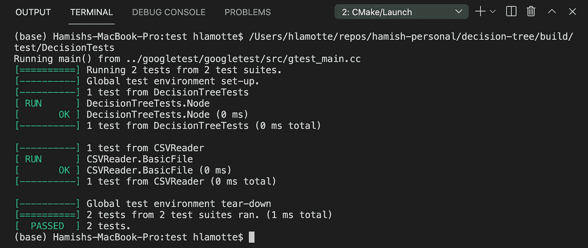
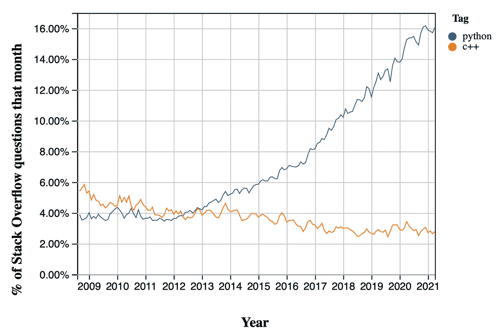

# 使用 C++从头开始实现决策树

> 原文：<https://towardsdatascience.com/implementing-a-decision-tree-from-scratch-using-c-57be8377156c?source=collection_archive---------16----------------------->

# 来自数据科学家的教训

Python 已经成为数据科学的语言之王。大多数新的数据科学家和程序员继续学习 Python 作为他们的第一语言。这是有充分理由的；Python 有很浅的学习曲线，强大的社区和丰富的图书馆数据科学生态系统。

我从 Python 开始了我的数据科学之旅，它仍然是我解决数据科学问题最常用的工具。我感兴趣的是更好地理解 Python 从你那里抽象出了什么，以及用更高性能的语言编写更快的代码的成本与收益。

为了获得 C++的典型介绍，我需要一个典型的应用程序，C++将是一个合适的选择。从头开始实现分类决策树分类器似乎是一个适当的挑战。事实证明，这是一次考验但有益的学习之旅，我想分享一些我在这一过程中的主要收获。

主要学习内容:

1.  C++很少提供指导或保护
2.  尽早做出好的架构决策
3.  从长远来看，编写测试将会拯救你
4.  一门语言的在线社区很有价值
5.  便携性是一个重要的考虑因素

# C++很少提供指导或保护

在 Python 中你可以逃避很多。你可以创建一个变量，随心所欲地改变它的类型，然后不用担心如何处理它。这可以让你在实现某件事情的中途改变想法。非常适合动态迭代原型。

在 C++中，你必须预先决定你希望你的变量是什么类型。你还必须预先决定你希望你的函数返回什么类型。如果你声明错误，例如试图从一个被声明为返回整数的函数中返回一个字符串，你的进程将会停止。在这种情况下，编译器会阻止你编译你的程序，通常会显示一个复杂的错误信息。尽管这可能令人沮丧，但编译器是你的朋友，它会在这个问题导致以后的问题之前提醒你。在 Python 中，当发现问题时已经太晚了，例如在代码进入生产阶段之后，这种情况并不少见。



在上面的例子中，编译器捕捉到一个被定义为返回整数的函数试图返回一个字符串。

也有编译器不支持你的时候。有可能访问一个被认为存储在特定内存地址的变量，却收到一个垃圾值，因为该变量已经被删除了。在这里，您通常不会在编译时收到一个错误，并且很容易在代码中留下错误，而您对此并不知情。



在上面的例子中，即使我们试图访问一个已经被删除的变量的内存地址的值，编译也不会给出错误。

# 尽早做出好的架构决策

在 Python 中，在试图解决问题的过程中，很容易在早期就开始编写解决方案。由于 C++的不灵活性和较慢的开发速度，这种方法在使用 C++时效果不佳。

我在这个项目中遭受了痛苦，因为最初使用我的 Pythonic 方法，只是编写代码，而没有制定端到端的解决方案。最终，我坐下来想出了一个总体架构来解决这个问题。

下面列出了在决策树分类器的实现中开发的关键对象。这些包括一个`Node`类和一个`Tree`类，以及它们相关的属性和方法，并且大部分可以在编写任何代码之前定义:

```
*Node* - Node constructor
- Node destuctor
- Attributes
   - children nodes
   - data
   - best split feature chosen
   - best split category chosen
- Methods
   - giniImpurity() - metric for scoring quality of split
   - bestSplit() - best split feature and category*Tree* - Tree constructor
- Tree destructor
- Attributes
   - root node of tree
- Methods
   - traverse() - traverse nodes of tree
   - fit() - fit tree to dataset
   - predict() - make predictions classes with unseen data
   - CSVReader() - read a csv
```

决策树项目的核心文件(不包括测试文件)如下所示，以供参考。

```
. 
├── CMakeLists.txt 
├── CSVReader.cpp 
├── CSVReader.hpp 
├── DecisionTree.cpp 
├── DecisionTree.hpp 
├── Main.cpp 
├── Node.cpp 
├── Node.hpp 
└── README.md
```

一旦这种架构就位，解决方案自然随之而来。类及其成员函数(类和函数参数以及返回的对象)的接口的前瞻性设计也可以使事情变得更加简单。

# 从长远来看，编写测试将会拯救你

C++缺乏安全性，这使得测试代码的每一部分是否成功完成其预期功能变得至关重要。使用 CMake 构建的用于 C++的 [Google Test](https://google.github.io/googletest/primer.html) 测试框架很好地服务于这个项目。

预先以可测试的方式编写代码使得识别和隔离 bug 更加容易。方法是为实现的类编写静态定义的成员函数。静态定义的成员函数可以在没有父类实例化的情况下独立执行。这使得能够为这些功能中的每一个编写特定的、独立的测试用例，从而完成决策树的业务逻辑的一个方面。



上面显示了 Google Test 通过终端测试后的输出。

# 在线社区很有价值

Python 开发人员有一个开发人员社区，他们使用 Stack Overflow 和博客等工具贡献集体知识。这个资源是 Python 数据科学的命脉。C++没有对等的社区。在谷歌上搜索开发 C++代码时遇到的许多问题和错误信息通常会导致无益的结果。一门语言的社区价值很大。



从上面我们可以看到，现在每月回答的 Python 相关问题比 C++多 4 倍多。在此查看这些统计数据[的当前状态。](https://insights.stackoverflow.com/trends?tags=c%2B%2B%2Cpython)

# 便携性是一个重要的考虑因素

在 Python 中，你可以确信任何安装了 Python 解释器的系统都能够执行你的 Python 程序。在 C++中，你不再有这种奢侈。由于 C++是一种编译语言，所以在运行程序之前，必须先对其进行编译，并且必须针对要运行程序的主机的体系结构进行编译。

当试图使用 Github 动作远程测试代码时，这成为一个重大问题。由于主机是不同的操作系统和架构，因此需要先编译代码，然后在虚拟机上进行测试。这是部署代码时需要管理的额外开销。

# 结论

学习像 C++这样的低级语言会让你接触到更快的程序所需的许多核心概念，比如内存管理、数据结构和编译语言。它让人们意识到，Python 中预先实现的数据结构(如 Pandas DataFrames)将拥有用于处理内存管理的系统，这些系统必须做出一系列假设，因此具有[限制](https://www.practicaldatascience.org/html/views_and_copies_in_pandas.html)。

在实践中，不太可能有很多数据科学家会使用 C++来解决实验数据科学问题，但是在一些问题上，Python 不再是最好的工具，例如编写快速数据解析器或实现昂贵的算法。即使在这种情况下，我也将探索现代低级语言，如 Go-lang 和 Rust，而不是 C++。C++语法让人感觉冗长，而且它缺少许多你可以从这些现代语言中获得的安全特性。

你可以从头开始查看 C++决策树分类器的完整源代码[点击这里](https://github.com/hlamotte/decision-tree)。你还可以找到一个 Jupyter 笔记本的例子，它直接从 Python 调用实现的决策树分类器，并在 Titanic 数据集[上训练决策树。](https://github.com/hlamotte/decision-tree/blob/main/notebooks/titanic_predictions.ipynb)

*原载于*[*https://data munch . tech*](https://datamunch.tech/posts/decision-tree-cpp/)*。*