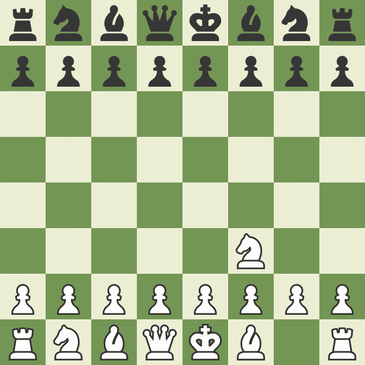
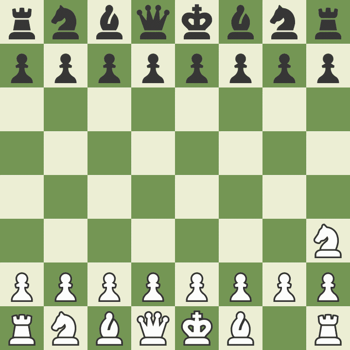

# 从零开始实现深度学习象棋引擎

> 原文：<https://towardsdatascience.com/implementing-a-deep-learning-chess-engine-from-scratch-275e5c9b9e21?source=collection_archive---------5----------------------->

## 实践教程

## 用极小极大和深度学习平衡直觉和计算

[JESHOOTS.COM](https://unsplash.com/@jeshoots?utm_source=unsplash&utm_medium=referral&utm_content=creditCopyText)在 [Unsplash](https://unsplash.com/s/photos/chess?utm_source=unsplash&utm_medium=referral&utm_content=creditCopyText) 上拍照

# 目录:

*   [简介 ](#0730)
*   [**神经网络**](#bb2c)
*   [**极大极小树**](#d991)
*   [**混合算法**](#3fe4)
*   [**解析游戏**](#ef39)
*   [**结论**](#29db)

***注意:所有代码都是片段形式，单独执行时无法工作。完整代码可以在我的 github 页面*** [***这里***](https://linktr.ee/victorsi) ***找到。***

# 简介:

由[安德斯·吉尔登](https://unsplash.com/@andersjilden?utm_source=unsplash&utm_medium=referral&utm_content=creditCopyText)在 [Unsplash](https://unsplash.com/s/photos/architecture?utm_source=unsplash&utm_medium=referral&utm_content=creditCopyText) 上拍摄的照片

国际象棋中出现的一个常见主题是直觉和计算之间的权衡。直觉是找到在这个位置上“感觉正确”和“运作良好”的招式，而计算则是精确地寻找对手可以用来反驳你的招式的招式。

直觉通常与位置游戏联系在一起，而计算与战术游戏联系在一起。然而，没有直觉就找不到战术打法，没有一些计算就无法进行位置打法。在这个项目中，我将尝试把两个算法联系起来，一个基于直觉的算法和一个基于计算的算法，以形成一个比它们各自更强大的算法。

# 神经网络:

神经网络是混合算法的直观和定位端。它是在数以千计的大师级国际象棋比赛中训练出来的。

左边的这个游戏是在两个神经网络之间进行的。当查看引擎播放的移动时，很明显网络已经学习了一些基本的位置概念。

例如，您可以看到引擎将骑士推到中心，将主教固定，并推动卒来获得空间。引擎也城堡，以保护他们的国王和部队棋子的中心。

当你看到双方都犯的错误和失去的机会时，神经网络的弱点就很明显了。黑棋在游戏中错过了一个岔口，白棋不断地将他的骑士放在兵的正前方。这可以归因于这样一个事实，即对成千上万个游戏进行归纳会导致精确度降低，尤其是在应用于特定情况时。

这证明了神经网络是强大的，但如果没有其他工具来防止失误并允许战术发挥作用，神经网络是无用的。

# 实施:

这些是定义和运行神经网络所需的先决条件。棋盘转换是存储库中的另一个文件，包含将棋盘转换为矩阵的函数。文件中有太多的小细节需要在这里解释，但文件中定义的函数是运行神经网络所必需的。

有必要将神经网络定义为一个类，以便它可以适当地用于混合算法中。混合算法中的每个预测算法都必须具有相同的输入集，并且都必须具有预测函数来生成输出。

我用作概念验证的神经网络是一个基本的卷积网络:

该网络将经过处理的棋盘作为输入数据，并输出一个 64 乘 64 的矩阵。每个单元格描述了棋盘上可以进行的一步棋。我们可以把列想象成棋子开始的方块，把行想象成棋子结束的方块。

自然，在一个位置上，不是所有的移动都是合法的。要获得合法移动，必须使用过滤器来删除所有非法移动。

这个函数通过创建一个掩码矩阵来删除所有的非法移动。该矩阵与网络的输出矩阵大小相同，但由 1 和 0 组成。1 放在代表合法移动的单元格中，而 0 放在代表非法移动的单元格中。当我们将输出矩阵乘以合法移动矩阵时，我们得到一个矩阵，其中所有非零值都是合法移动。

然后，我们找到新矩阵中的最大值，并找到单元格代表的移动。然后，我们输出该移动作为算法生成的最终移动。

# 极大极小树:

极大极小树的工作原理是将某个位置一定深度内可以到达的所有位置可视化。然后，它评估所有可以达到的最终位置，并追溯到第一组合法移动的评估。

为了做到这一点，我们假设我们会走能给我们带来最大利益的那一步，并假设对手会走能给我们带来最小利益的那一步。因此，极大极小树的名字。

这个游戏是由两棵极大极小树玩的。你可以看到所有的移动都是围绕着保护或获得材料。这些动作中的大部分你在真实游戏中是看不到的。例如，在游戏早期推车来保护棋子。然而，这些错误在使用极大极小树时很容易发生，因为它只关心材料。

极大极小树的另一个问题是最终位置的数量随着深度的增加呈指数增加。因此极小极大树不能实现延伸超过其深度的计划/战术。

# 实施:

这些是极大极小树的先决条件。极大极小树给出了混合算法的搜索深度和目标物质计算。

驱动极大极小树的主要函数是材料计数器算法和可能性连续算法。材料计数器计算位置中的材料。这是用来判断位置的评价函数。

可能性延续是用于扩展极大极小树的函数。对于从给定位置开始的每个可能的合法移动，该函数在给定棋盘上执行每个移动并返回它。每当树的深度增加时，这个函数就迭代一次。

极大极小树是一个相当复杂的算法，因为成千上万的板子需要追溯到它们的源头。为了使流程更加整洁，必须定义一个节点类。

极小极大树将从这些节点构建。每个节点包含它所代表的棋盘，以及所有“子节点”的列表(该位置的所有可能延续)。

evaluate 函数用于计算每个节点的效用。通过将 child_nodes 作为节点的一个属性，您可以轻松地在树的各个层中传播，以获得正确的效用值。

定义了节点之后，我们就可以构造极大极小树了。极大极小树是用类定义的，所以我们可以在函数执行后读取信息。

我们首先创建一个根节点。所有未来的节点都可以追溯到根节点。

之后，我们可以构造极大极小树。在给定深度的情况下，我们扩展树，将上一代的子代添加到树的底部。

然后，我们定义将作用于树的每一层的函数。我们为所有涉及我们所下的棋的层设置一个最大值函数，为所有涉及对手所下的棋的层设置一个最小值函数。请记住，评估函数是从我们的角度来看的，因此对手移动上的最小函数意味着我们找到了对手可能的最佳移动。

为了让这个算法适合象棋引擎，我们必须包含一个预测函数。它返回预测的移动以及有效性值。该值在混合算法中进行权衡，以选择要使用的算法。

# 混合算法:

混合算法是这个项目中最薄弱的环节。我不得不将这两种算法联系起来的许多想法太复杂，无法立即实现。

例如，我的一个想法是让每个算法产生一个输出矩阵。通过将输出矩阵相乘，我们得到一个“集合”矩阵，然后可以将其转换为移动。然而，我需要以某种方式将极大极小树的输出转换成 64 乘 64 的矩阵，这在不改变数据的情况下是不可能的。

# 实施:

这是混合算法设置的源代码。它需要神经网络和极大极小算法中描述的所有代码。

当产生一步棋时，它判断不同算法输出的效力值，并找出哪个算法具有最高的效力值。

请注意，如果两种算法具有相同的有效性值，则只输出由算法列表中第一个列出的算法输出的移动。这是由于 argmax 的特性，它从左到右查看列表。

该文件是一个故障排除工具，也是查看混合算法运行输出的一种方式。混合算法自己下一百步棋，输出棋盘。它还显示了两种算法输出的有效性值。

我添加到文件中的另一个功能是可以粘贴到 PGN 文件中的字符串。这保存了游戏的所有数据，然后可以用它来分析引擎更强的游戏。

请注意，该文件的输出仅在使用 python notebook 时可见，因为它使用 IPython 工具渲染电路板。

# 分析游戏:

这个游戏是由两种混合算法来玩的。虽然移动本身可能并不完美(可能是由于混合算法的糟糕设计)，但它完美地封装了算法使用的计算和直觉。

以下是我对这个游戏的一些观察:

# 开场:

## 奇怪的开场:

尽管在许多不同的游戏中训练过神经网络，但它扮演了一个几乎不会在任何游戏中出现的角色。这可能是因为该算法所玩的开局可能是它所看到的所有开局的某种平均值。

## 错误的判断:

似乎有很多动作试图在开场赢得素材。这通常不应该发生在开局，因为它可能会导致残局失败。这证明了用于评估游戏移动的有效性可能是错误的，并且在错误的时间被激活。

# 中局:

## 战术别针:

在中局中，黑王被压在车下。这使得白赢得车。这个战术其实很幸运。创建图钉的移动是由神经网络完成的，但是取车是由极大极小树完成的。这肯定是事实，因为最小最大树不会比神经网络有更高的有效性值，因为没有直接的捕获。

## 将死尝试:

象棋引擎的另一个明显的盲点是缺乏一个处理和执行将死的系统。白方王后拿走后排的车，并检查黑方国王。黑棋只能用女王挡。然后白方用车过黑王。然而，白车会立即被取走。这出戏是由神经网络完成的，表明这种位置很常见，足以对神经网络产生真正的影响。然而，没有足够的计算和系统来检查将死，所以车最终丢失了。

# 终局:

## 推动通过的棋子:

神经网络在残局中完成了大部分繁重的工作，因为没有太多的战术机会。它的想法是推动卒晋升为皇后，并试图阻止对手传递的卒。这表明神经网络已经清楚地从数据中学习了如何推动棋子。

## 重复:

游戏在重复中结束。令人失望但绝对在意料之中。国际象棋引擎的一个问题是，它往往会经常重复移动。一个可能的原因是这两种算法都是从左向右解析合法的移动。如果逆转前一步棋的棋又是第一个合法的棋，那么很可能会被下。算法中应该有某种机制来防止三重重复。

# 结论:

有了向混合算法添加更多算法的框架和极大极小树的适应性，我认为有很多方法可以提高算法的能力。

## 1.阿尔法-贝塔剪枝

这项技术将加快极大极小树的速度，从而增加计算每一步棋的深度。

## 2.更多算法

如果我们增加象棋引擎中的算法数量，并找到一种可靠的方法将它们组合在一起，这个引擎会产生更好的结果。

## 3.内置故障保险

如果我们防止三重重复，赋予请求和棋的能力，并添加一个检查将死的系统，引擎将更有能力与更强的玩家进行游戏。

# 我的链接:

如果你想看更多我的内容，点击这个 [**链接**](https://linktr.ee/victorsi) 。