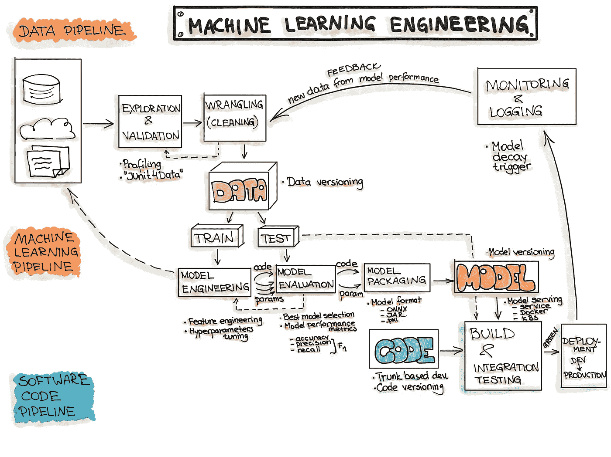
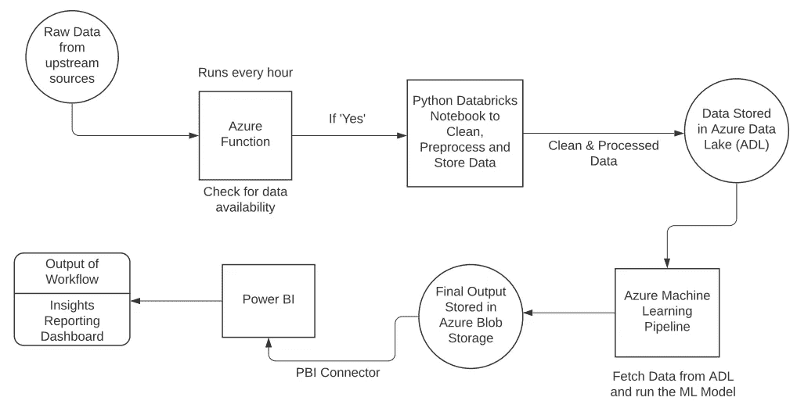
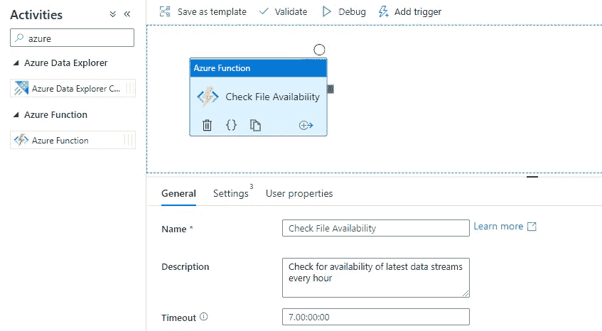
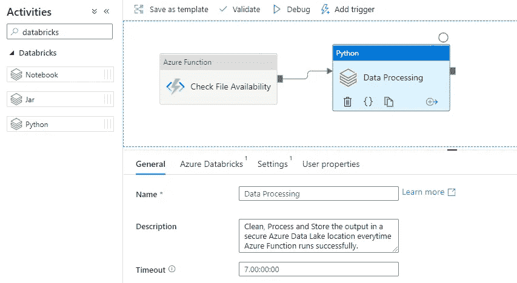
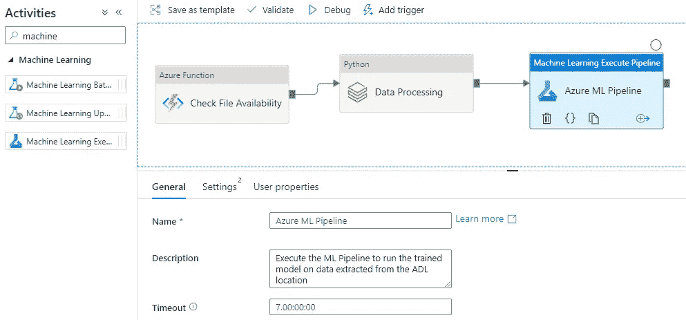
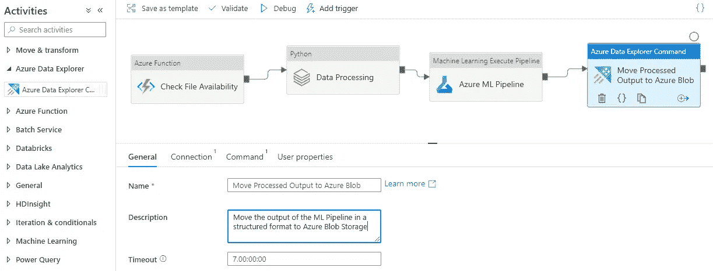
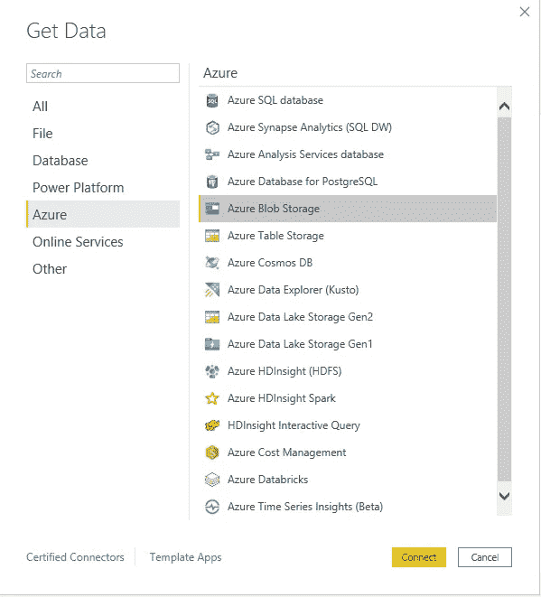
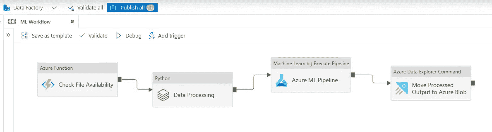

# 使用 Azure Data Factory 实现端到端的机器学习工作流

> 原文：<https://towardsdatascience.com/implementing-an-end-to-end-machine-learning-workflow-with-azure-data-factory-f16cbeeffd94?source=collection_archive---------4----------------------->

## 从收集数据到发送结果，ADF 在一个屏幕上构建了正确的 MLOps 生命周期

我在 3 年前实现机器学习的印象是，用 Python 构建一个模型，并将项目部署到自动化 CI/CD 管道中。虽然它解决了执行预测的基本标准，但它永远也不能被称为端到端工作流，因为数据存储和报告是该工作流中缺少的两个重要组件，必须分开处理。在这篇文章中，我将走过一个完整的机器学习操作周期，并展示如何使用 Azure Data Factory (ADF)建立每一步。是的，这是可能的，容易的，非常可靠的。另外，它还会自动设置您接收整个流程中出现的任何类型的数据异常的警报，因此您不必担心手动监控工作流程。

现在是时候坐下来放松一下，而 ADF 做所有的重活|图片由[约书亚阿拉贡](https://unsplash.com/@goshua13?utm_source=medium&utm_medium=referral)在 [Unsplash](https://unsplash.com?utm_source=medium&utm_medium=referral) 上

## 你如何定义一个端到端(E2E) ML 工作流程？

我对完整工作流程的定义是，从数据开始流入系统开始，到最终报告准备好呈现给目标受众时结束。该流程需要数据收集、存储、后端工程、中间件和前端工程。这是产品准备发货的时候。我们将通过 Azure Data Factory 实现整个工作流程。

*   **数据工程**:数据采集、准备、预处理、管理存储。
*   **ML 模型工程**:模型建立、训练、测试、提炼、发布。
*   **代码工程**:将 ML 模型集成到最终产品后端(服务结构 API 等)。)
*   **报告:**数据可视化和讲故事。

机器学习周期从开始到结束的完美呈现| [图片来源:MLOps](https://ml-ops.org/content/end-to-end-ml-workflow) (以[知识共享署名 4.0 国际公共许可](https://creativecommons.org/licenses/by/4.0/)发布，并与署名(" INNOQ ")一起使用)

## 什么是 Azure 机器学习？

机器学习是一种数据科学技术，属于更大的人工智能范畴，允许计算机使用历史数据负载来预测未来的行为、结果和趋势。通过使用机器学习或人工智能，计算机可以在没有显式编程的情况下学习执行任务。来自机器学习的预测或预言可以使应用程序和设备更加智能。例如，当你在网上购物时，机器学习会根据你在过去六个月里购买的东西，帮助推荐你可能想要的其他产品。或者当你的信用卡被刷时，机器学习会将交易与交易数据库进行比较，并帮助检测欺诈。

Azure Machine Learning 是微软 Azure 提供的一项服务，可用于各种机器学习任务，从经典的 ML 到深度、有监督、无监督和强化学习。无论是使用 Python/R SDK 编写代码，还是使用 ML Studio 实现低代码/无代码模型，都可以在 Azure Machine Learning Workspace 中构建、训练和跟踪机器学习和深度学习模型。

Azure 允许你在本地机器上开始训练，然后扩展到云端。该服务还与流行的深度学习和强化开源工具互操作，如 PyTorch、TensorFlow、sci-kit-learn 和 Ray RLlib。

## 逐步完成工作流程

在下面详述的五个步骤中，我们将执行所有必需的任务，从数据收集、处理、建模、培训到为客户构建预测分析报告。在我们开始深入细节之前，我在下面的图表中用简短的描述表示了所有的步骤。

完整机器学习系统的流程图|图片作者

# 1.Azure 函数为管道创建触发器

我们通过定义一个函数来开始我们的工作流，该函数将评估管道何时应该开始运行。这通常被称为“触发器”。这是一个启动工作流的事件。 ***每个数据管道都需要数据来开始工作。*** 这种数据可以以结构化流的形式(。ss 文件)、文本文件(。csv，。tsv 等)或者它可以是来自 Azure 事件中心的火花流。在我们的场景中，假设我们有结构化的数据流，每 6-12 个小时被转储到一个 Cosmos 位置(COSMOS 是 Azure 的 NoSQL 商店)。为了通知机器学习服务上游文件可用并且新的原始数据存在以供运行，Azure 函数每小时运行一次以检查是否有新文件到达。只有当这个 Azure 函数返回 **True** 并指定存在新数据时，工作流的剩余部分才会执行。

第一步。添加 Azure 函数来检查我们使用的原始数据流的可用性。

> a.Azure Function 每小时运行一次，检查是否有新数据可用。如果有新数据可用，它返回一个真布尔值，进而触发工作流的剩余部分。如果没有新文件，它返回 False，什么也不做。它会在一小时后再次运行，以执行相同的检查。

# 2.Azure 数据块用于数据预处理和存储到数据湖

ADF 支持所有现代数据结构，包括通过数据湖和数据仓库等存储服务输入的结构化和非结构化数据流。但是处理数据的最好方法是将 ADF 与 Azure Databricks 笔记本集成。这是一个典型的 Python 环境，运行在 Azure**中创建的工作空间之上，可以执行 Python 有能力运行的每一个机器学习和数据处理活动。

一旦 Azure 函数发出新数据可供处理的信号，[数据块集群](https://docs.microsoft.com/en-us/azure/databricks/clusters/)被激活，笔记本开始运行。我们使用 Python 导入数据，执行初始清理、排序和其他预处理工作，如输入 null 和无效输入，拒绝不会用于机器学习模型的数据。准备好发送到机器学习管道的经过处理的干净数据被安全地放入 ADLS (Azure 数据湖存储)Gen2 位置。数据湖是满足临时和永久存储需求的快速存储选项，可以由 ML 活动直接访问。

第二步。构建数据处理 Python 笔记本，该笔记本可清理原始数据、运行预处理脚本并将输出存储在 ADL 位置|按作者分类的图像中

> a.一旦 Azure 函数返回 **True，**data bricks Python 笔记本开始收集新数据。
> b .该数据由笔记本进行清理和处理，并为 ML 模型做好准备。然后，它被推送到数据湖存储服务，ML 活动可以从那里获取它并运行模型。

**创建 Databricks 工作空间以及使用该工作空间使用 Python 执行数据处理的详细步骤在本教程中进行了说明— [使用 Databricks 笔记本转换数据。](https://docs.microsoft.com/en-us/azure/data-factory/transform-data-using-databricks-notebook)

# 3.使用 Azure 机器学习从存储的数据中构建和训练模型

我们现在到达了机器学习工作流程的核心——奇迹发生的地方！Azure 机器学习提供了两种构建 ML 管道的方式。

> 您可以选择使用 Python 或 R SDK 来构建、训练和测试 ML 模型，或者使用 Azure ML Studio 来创建无代码的拖放管道

为了从头开始运行并遵循为您的 ML 模型创建训练和测试模型的步骤，下面的存储库中显示了一个详细的示例。

<https://github.com/MicrosoftDocs/pipelines-azureml>  

无论您选择哪种方法，ADF 都会公正地对待管道。管道从 ADL 存储帐户读取数据，并对新数据运行其训练和预测脚本，并在每次运行时刷新模型，以微调已训练的算法。这个机器学习管道的输出是一个结构化的数据集，作为日常输出文件存储在 Azure Blob 存储中。

第三步。从步骤 2 ADL 位置读取数据，并在其上运行机器学习模型|作者图片

> a.连接到 ADL 存储帐户以获取已处理的数据。
> b .对数据运行 ML 模型。c .将输出和预测指标发送到 Azure Blob 存储。

**使用机器学习管道的替代方法是直接使用 Databricks 环境实现 MLFlow。这个实现的详细教程可以在这里找到——[用 MLflow 跟踪 Azure Databricks ML 实验](https://docs.microsoft.com/en-us/azure/machine-learning/how-to-use-mlflow-azure-databricks)

# 4.将最终输出推入 Azure Blob 存储

第四步。将基于架构的结构化输出推送到 Azure Blob Storage | Image by Author

Azure Blob Storage 是一项基于云的服务，可帮助您为分析需求创建数据湖，并提供存储来构建强大的云原生和移动应用。存储是可扩展的，定价与使用的存储量成反比。Blobs 是通过使用基于 SSD 的存储架构从头开始构建的，建议用于无服务器应用程序，如 Azure Functions。我使用 Blob 存储的主要原因是它与 Power BI 无缝连接的能力。完整的执行教程可以在[这里看到。](https://www.sqlshack.com/how-to-access-data-from-azure-blob-storage-using-power-bi/)

> a.将分析的数据安全地存储在专用 blobs 中。
> b .连接 Power BI 检索数据，进行数据可视化。

# 5.从 Power BI 访问 Blob 存储以构建报告仪表板

留在微软 Azure 生态系统中的最大好处是在同一个堆栈中可以使用 Power BI。Power BI 是一个非常强大的工具，可以用来构建报告和呈现从模型中提取的洞察力。因此，我个人通过在每次 ADF 管道完成运行时更新 Power BI 仪表板来结束我的工作流。它提供了每天在给定时间更新数据的选项，因此所有洞察、表格、指标和可视化都是最新的，并与数据处理工作流保持同步。

第五步。连接您的 Azure Blob 存储以按作者检索 Power BI | Image 中的数据

> “讲故事”是任何分析过程中最重要的部分。

工作流的客户或消费者永远不会对将预测带到桌面上的代码感兴趣。他们只会对提交产品需求时所提问题的答案感兴趣。因此，在我的字典中，只有在可交付成果在手之后，工作流才被称为**完成**。这里的结果是显示机器学习模型预测了什么和它每天预测了什么，指标如何改进，以及需要哪些增强的报告。这是机器学习赋予我们执行能力的决策科学艺术。

> a.将 Power BI 与 Azure Blob 存储连接以获取数据。
> b .设置 Power BI 每天刷新，所以所有数据都是更新的。

## 警报、监控和异常检测

每个 DevOps 或 MLOps 工作流都有一项非常繁琐但又极其艰巨的任务，那就是警报和监控。需要这些监视器来检查数据，避免数据过时，或者在分析的任何步骤中发现任何类型的异常或意外结果时得到通知。Azure Data Factory (ADF)方便地允许我们在 ADF 监控仪表板上设置几个警报。

> ***可以设置的警报示例:***

*   从上游接收的数据陈旧。
*   管道故障或执行时间超过给定阈值。
*   存储在数据湖(ADLS)中的结果与过去的数据有很大不同。
*   从上游接收或由工作流生成的文件大小异常大或异常小。

> 可以设置警报，以便在检测到异常或故障时通知电子邮件组别名、安全组或在 DevOps 门户中创建事件/错误。

> ***一个端到端的 MLOps 存储库托管在下面:***

<https://github.com/microsoft/MLOps>  

## 结论

构建机器学习工作流有多种方式，几乎每个云提供商都有自己的实现方式。对我来说，使用 Azure Data Factory (ADF)已经被证明是最简单的方法，具有最少的设计和架构需求。从收集数据到报告见解，一切都可以在一个地方完成，并通过触发器自动化。最棒的是，ADF 内置了警报、监控和异常检测功能，因此无需任何人工干预。本教程的目的是说明使用 ADF 的 ML 管道的工作流程。下面提到的所有参考资料都可以用来更深入地研究代码的每个步骤。

完整的处理流程|作者图片

## 关于我

我是一名数据工程师和人工智能研究员，目前在微软 Xbox game analytics 工作，我在日常工作中实现了类似的管道，以分析游戏收购、使用和健康情况。除了我的专业工作，我还在研究如何实施人工智能来平衡世界各地受多年来逐渐气候变化影响的地区的经济。如果您有任何想要合作的讨论、问题或项目，请随时通过 [Twitter](https://twitter.com/rjrahul24) 或 [LinkedIn](https://www.linkedin.com/in/rjrahul24/) 与我联系。

## [参考文献]

1.  【https://ml-ops.org/content/end-to-end-ml-workflow 
2.  [https://docs . Microsoft . com/en-us/azure/machine-learning/how-to-data-ingest-ADF](https://docs.microsoft.com/en-us/azure/machine-learning/how-to-data-ingest-adf)
3.  [https://docs . Microsoft . com/en-us/azure/machine-learning/how-to-use-ml flow-azure-data bricks](https://docs.microsoft.com/en-us/azure/machine-learning/how-to-use-mlflow-azure-databricks)
4.  [https://www . blue granite . com/blog/monitoring-azure-data-factory-v2-using-power-bi](https://www.bluegranite.com/blog/monitoring-azure-data-factory-v2-using-power-bi)
5.  [https://docs . Microsoft . com/en-us/azure/data-factory/常见问题解答](https://docs.microsoft.com/en-us/azure/data-factory/frequently-asked-questions)
6.  [https://www . sqlshack . com/how-to-access-data-from-azure-blob-storage-using-power-bi/](https://www.sqlshack.com/how-to-access-data-from-azure-blob-storage-using-power-bi/)