# 在 Python 3+上从头开始实现反向传播

> 原文：<https://towardsdatascience.com/implementing-backpropagation-with-style-in-python-da4c2f49adb4?source=collection_archive---------2----------------------->

## 让我们看看理论和实践是不是一回事。

在[的最后一个故事](/backpropagation-the-natural-proof-946c5abf63b1)中，我们从头开始推导了所有必要的反向传播方程。我们还介绍了所用的符号，并掌握了算法的工作原理。在这个故事中，我们将着重于用 python 实现这个算法。

让我们首先为我们的神经网络提供一些结构

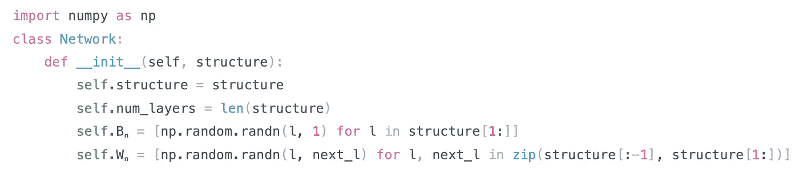

我们将让属性`structure`成为一个**列表**，它包含神经网络的每一层中神经元的数量。所以如果我们做`model = Network([784, 30, 10])`，那么我们的模型有三层。具有 *784* 个神经元的输入层，具有 *30* 个神经元的隐藏层，以及具有 *10* 个神经元的输出层。请注意，当涉及到偏差和权重等参数时，我们不会考虑输入层。正如我们在乐谱中讨论的。

下一个重要属性是`Bₙ`，这将是一个**列表**，包含整个网络中的所有偏置向量(bᴸ)，逐层排序。让我们停下来谈谈这里的符号。我们已经抛弃了索引符号，取而代之的是逐层(矢量)符号；`Bₙ`只有下标表示它拥有**网络**中的所有偏置向量。
如你所见`Bₙ`是通过从第一个隐藏层开始迭代所有层，并创建一个长度等于每个层神经元数量的随机 NumPy 数组(偏置向量)构建的。所以本质上，对于我们刚刚讨论的网络，列表`Bₙ`将涉及分别为(30，1)和(10，1)的两个 NumPy 数组(偏置向量)。

类似于前面的属性，我们也有`Wₙ`，正如你所猜测的，它将是一个**列表**，包含每一层的权重矩阵(Wᴸ).也就是说，对于我们的设置，有两个维数为(784，30)和(30，10)的 NumPy 数组。至于它是如何构造的，`zip()`使得同时在多个集合上循环成为可能；这里使用它来循环两个版本的`structure`列表，这样我们总是有当前层和下一层中神经元的数量，并且可以使用它们来初始化正确维度的随机权重矩阵。关于随机性的最后一点是，我们使用 NumPy 的`randn()`函数，它从标准正态分布中提取值。这对于防止由于像 Sigmoid 这样的一些激活引起的消失梯度问题特别有用，因为我们的大多数值将在 0 附近，这是 Sigmoid 具有强梯度的地方。

既然我们已经定义了网络的结构，我们就可以开始处理反向传播了。让我们从提出我们可能需要的所有方程开始。

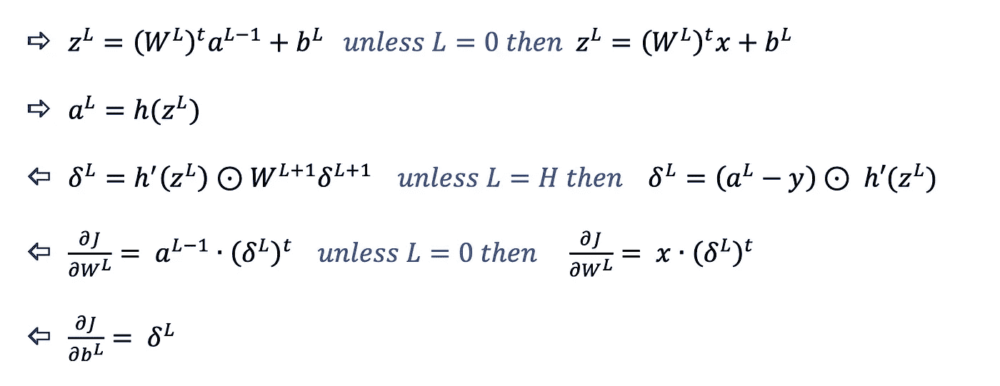

当我们在实现中使用它们时，我们将引用它们。

现在让我们直接行动吧。

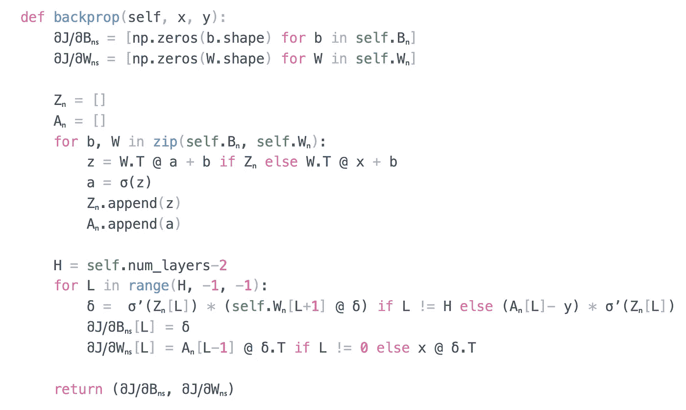

整个功能。

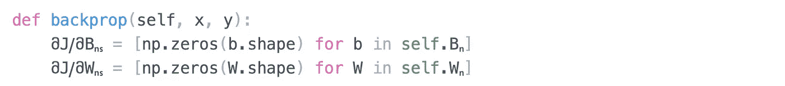

初始化

在这里，我们从数据集中的一个例子开始。我们的目标是使用它来查找∂j/∂bᴸ∂j/∂wᴸ的每一层，以便最小化给定示例的成本。因此，我们首先初始化两个变量`მJⳆმWₙₛ`和`მJⳆმBₙₛ`，它们看起来与`Wₙ`和`Bₙ`相同，但都是零。因此，一旦我们完成，如果`Wₙ[L]`具有与某层 l 相关联的权重矩阵，那么`მJⳆმWₙₛ[L]`将是该层的∂J/∂Wᴸ。这同样适用于`Bₙ[L]`和`მJⳆმBₙₛ`。对两者来说，下标“s”只是提醒，这些是偏导数，只因为一个例子。

如果你还记得的话，这个算法包括两遍。首先，通过网络向前传递，其中它使用前两个方程来使用当前权重和偏差找到所有层的 *a* ᴸ和 zᴸ向量，然后再向后传递，其中我们从δᴴ开始，使用之前找到的 zᴸ's 和 *a* ᴸ's 来找到每层的δᴸ，从而找到∂J/∂Wᴸ和∂J/∂bᴸ。

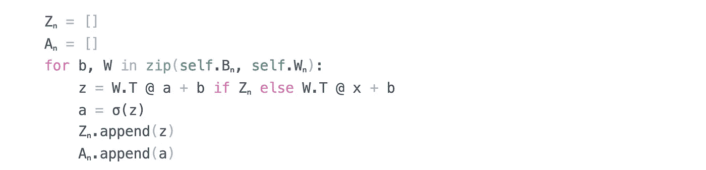

向前传球

正向传递在函数中的第一个 for 循环中传递。我们首先创建两个空列表`Zₙ`和`Aₙ`，它们最终将包括我们网络中的所有 zᴸ's 和ᴸ's。然后我们开始逐层循环，同时保持当前层的偏移向量和权重矩阵(NumPy 数组)。
对于每一层，我们使用权重矩阵和偏置向量以及来自前一层的激活(或 *x* 如果是第一层),根据前两个等式(在上图中)找到 *a* ᴸ和 zᴸ。)

如果还不清楚，行`z = W.T @ a + b if Zₙ else W.T @ x + b`使用 NumPy 的`.T`进行转置，使用 NumPy 的`@`乘以 NumPy 数组(矩阵乘积)，如果`Zₙ`不为真，只使用 else 旁边右边的表达式；这意味着它是空的，因此它必须是第一次迭代(第一层)。

下一行简单地在 zᴸ上应用激活来查找*一个* ᴸ.(第二个等式。)在这个实现中，我们使用 sigmoid 函数作为激活；因此，我们也在类外定义了函数

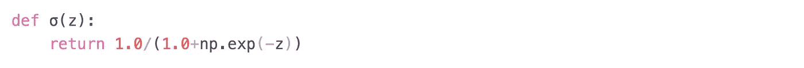

h(z) = σ(z)像我们预期的那样，按元素方式处理向量。

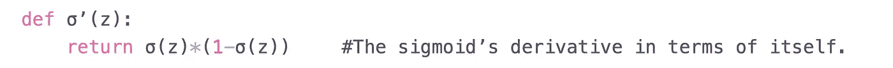

我们以后会用这个。

最后两行只是负责将为当前层计算的 zᴸ和ᴸ添加到我们之前介绍的两个列表中。
所以这里的概要是，一旦这个循环完成，我们就把我们网络的所有 zᴸ's 和一个ᴸ's 逐层存储在`Zₙ`和`Aₙ`中。

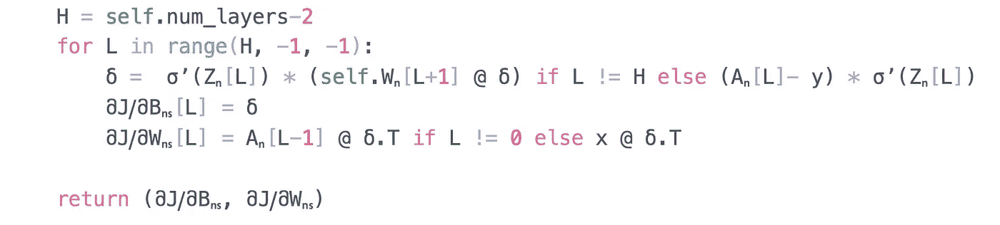

向后传球

现在，就向后传递而言，我们从计算最后一层的索引开始。因为我们从第一个隐藏层 0 开始计数，所以这个数字将等于我们网络的总层数减去 2(或者我们在前面的故事中提到的隐藏层数)。)一旦我们准备好了，我们就用它来在我们网络中循环。带有`range(H, -1, -1)`的 for 循环意味着我们从 H 开始，每次迭代减去 1(最后一个参数)，只要没有达到-1，我们就会继续下去。(因此，最后一次迭代将涉及 L = 0，这是第一个隐藏层。)至于我们在 for 循环体中做了什么，我们只是简单地使用了最后三个等式，非常简单。

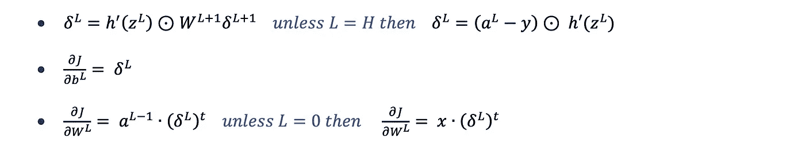

注意，在代码中，我们使用了`*`来表示虚线圆。(for 循环中的第一行。)这是因为当乘以 NumPy 数组时，默认情况下通过`*`的乘法是元素方式的。除此之外，一切都应该说得通。一旦 for 循环完成，意味着它已经遍历了 h 层到 0 层，并更新了每个层的∂J/∂Bᴸ & ∂J/∂Wᴸ，是时候简单地

今天到此为止。

现在剩下的就是实现一个函数来处理我们的小批量数据集，为每个内部观察调用`backprop(x,y)`,并使用梯度下降更新我们网络的权重。也就是说，一些简单的事情

梯度下降

这就是了

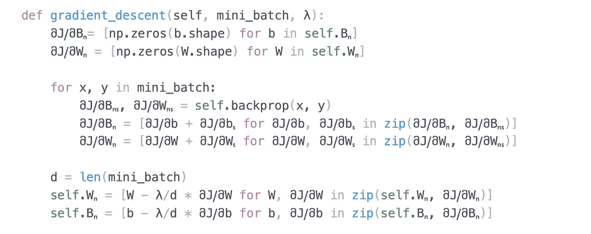

整个功能

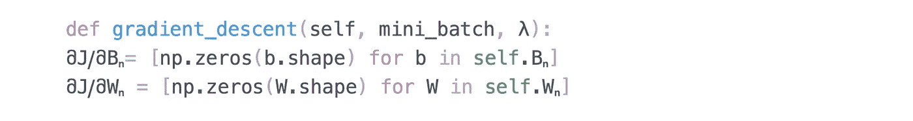

初始化

类似于我们在`backprop(x,y)`函数中所做的，我们首先初始化两个变量`მJⳆმWₙ`和`მJⳆმBₙ`，它们看起来与`Wₙ`和`Bₙ`相同，但都是零。这一次我们去掉了 s 下标，因为这些将累积所有的`მJⳆმWₙₛ`和`მJⳆმBₙₛ`由于小批量中的例子，我们将准备使用它们更新权重`Wₙ`和`Bₙ`。

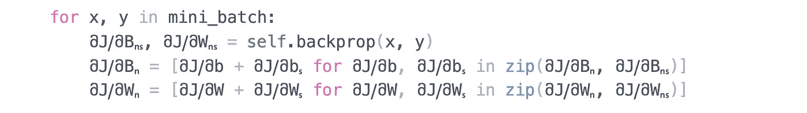

累积梯度

在 for 循环中，我们检查小批量中的每个示例，使用`backprop(x, y)`函数找到因其产生的`მJⳆმBₙₛ`和`მJⳆმWₙₛ`，然后通过列表理解将结果逐层累积到`მJⳆმBₙ`和`მJⳆმWₙ`中。
这两行可以分别替换为`მJⳆმBₙ = np.add(მJⳆმBₙ ,მJⳆმBₙₛ)`和`მJⳆმWₙ = np.add(მJⳆმWₙ + მJⳆმWₙₛ)`，但是这将导致警告，除非您在指定`dtype=object`的同时将列表转换为 NumPy 数组。最后重要的是，一旦这个 for 循环结束，`მJⳆმBₙ`和`მJⳆმWₙ`已经在所有的`მJⳆმBₙₛ`和`მJⳆმWₙₛ`中累加，由于小批量中的所有例子，这意味着下面公式中的两个和已经准备好了。

梯度下降

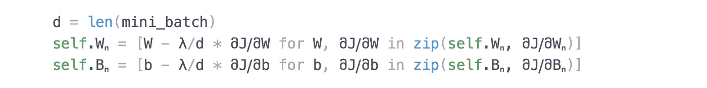

使用这些公式

在最后两行，我们用上面的两个公式更新了每一层的 bᴸ和 Wᴸ。您应该会多次调用该函数，这取决于历元数(整个数据集的迭代次数)和您的小批量大小。如果您的数据集被分成 40 个小批，并且您的历元计数是 20，那么您将调用 20x40=800 次。负责的功能如下所示

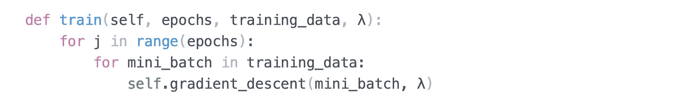

训练网络

此时，您可以尝试初始化网络，并向其输入一些随机的小批量数据，看看这会如何改变权重和偏差。

最后，您可能想知道我使用的 Python 变量名是怎么回事。事实证明，只要你的角色在世界范围内的某种语言的字母表/字符集中，Python 就不会有问题。例如，`მJⳆმWₙ`中的ⳇ和მ都是随机字母表中的字母。出于某种原因，unicode 下标对 Python 来说也不成问题。这是我在给变量名时利用的两个事实，以避免做变量名决定，并使它看起来尽可能数学化。

如果你喜欢阅读，并希望看到更多这样的故事，那么请考虑给帖子一些掌声，并跟我来。下次见，再见。

**学习资源:**

尼尔森迈克尔。*神经网络和深度学习*。2019，CHP。1,2.