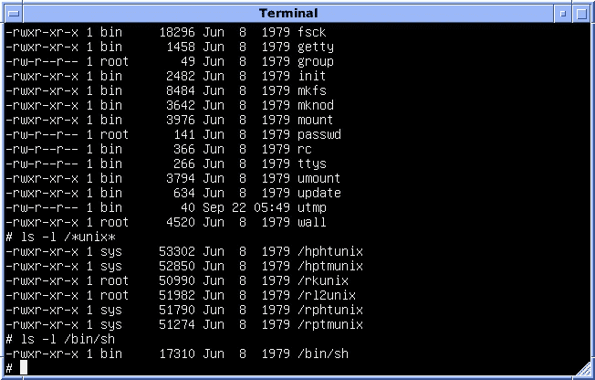
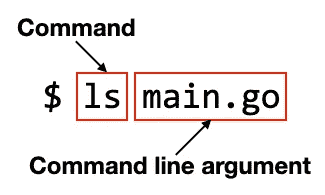
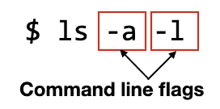
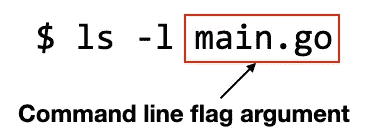

# 在 Go 中实现命令行选项

> 原文：<https://towardsdatascience.com/implementing-command-line-options-in-go-a5f1610c8ac3?source=collection_archive---------14----------------------->

## 了解如何编写接受 Go 中命令行标志和选项的控制台应用程序


照片由[汉娜·乔舒亚](https://unsplash.com/@hannahjoshua?utm_source=medium&utm_medium=referral)在 [Unsplash](https://unsplash.com?utm_source=medium&utm_medium=referral) 拍摄

虽然今天人们使用的大多数应用程序都是基于 GUI 的，但控制台应用程序仍然非常活跃，而且看起来不会很快消失。控制台应用程序更简单，开发成本更低，更健壮，是自动化不可或缺的工具。也许唯一让用户却步的是控制台应用程序并不容易使用——你经常不得不记住许多命令和选项，满屏的文本让许多有网络恐惧症的人感到害怕。



来源:[https://en . Wikipedia . org/wiki/Command-line _ interface #/media/File:Version _ 7 _ UNIX _ SIMH _ PDP 11 _ Kernels _ shell . png](https://en.wikipedia.org/wiki/Command-line_interface#/media/File:Version_7_UNIX_SIMH_PDP11_Kernels_Shell.png)

与用户使用鼠标进行交互的基于 GUI 的应用程序不同，控制台应用程序通过由文本字符串组成的*命令行选项*与用户进行交互。使用命令行选项，用户可以指定应用程序正常工作所需的各种信息。

在本文中，我将向您展示如何构建一个支持各种命令行选项的简单 Go 应用程序。

# 了解不同类型的命令行选项

谈到命令行选项，您需要了解三种主要类型:

*   命令行参数
*   命令行标志
*   命令行标志参数

理解以上类型的最简单的方法是用例子。如果你是一个 Unix 用户，你应该熟悉`ls`命令(用于*列表*)。

要列出一个特定的文件，你使用文件名作为 ***命令行参数*** :



如果你想以 *long* 格式列出*当前目录下的所有*文件，你使用`-a`和`-l` ***命令行标志*** :



如果您想以长格式列出一个特定的文件，使用`-l`标志和一个 ***命令行标志参数*** :



# 在 Go 中实现命令行参数

现在您已经对各种命令行选项有了清晰的了解。让我们编写一个 Go 程序来实现所有这些功能。

首先，在终端(或命令提示符)中创建一个名为**命令行**的目录:

```
$ mkdir ~/commandline
```

然后，创建一个名为 **main.go** 的新文件，并保存在**命令行**目录中。用以下语句填充 **main.go** 文件:

```
package mainimport (
    "fmt"
    "os"
    "reflect"
)func main() {
    fmt.Println(os.Args)
    fmt.Println(os.Args[1:])
    for _, arg := range os.Args[1:] {
        fmt.Print(arg, " ")
        fmt.Println(reflect.TypeOf(arg))
    }
}
```

下面是上述程序的工作原理。要检索命令行参数，可以使用`os`包。`os`包中的`Args`变量以一段字符串的形式返回所有命令行参数:

```
 fmt.Println(os.Args)
```

结果包括程序的名称，如果您不想包括它，请对字符串切片执行切片:

```
 fmt.Println(os.Args[1:])
```

您可以遍历切片并打印出每个参数:

```
 for _, arg := range os.Args[1:] {
        fmt.Print(arg, " ")
        fmt.Println(reflect.TypeOf(arg))
    }
```

要测试上面的程序，首先构建它，然后运行它的可执行文件。在下面的例子中，我用下面的参数运行程序—“`hello 100 3.14`”:

```
$ **go build main.go** 
$ **./main hello 100 3.14**
[./main hello 100 3.14]    // all the arguments incl app name
[hello 100 3.14]           // all the arguments excl app name
hello string               // first argument
100 string                 // second argument
3.14 string                // third argument; all string types
```

注意，传入程序的每个参数都表示为一个`string`类型，从上面显示的输出中可以明显看出。

# 在 Go 中实现命令行标志

实现命令行标志比实现命令行参数稍微复杂一些。为此，让我们编写一个程序，允许用户多次打印一条消息，并可以选择在打印的字符串之间插入空格。我不想给你看代码，我想先介绍一下我们的程序是如何工作的。只有这样，我们才会看代码。

## 案例 1

当程序在没有任何标志的情况下运行时，您会打印一条默认消息“Hello，World！”：

```
$ ./main
Hello, World!
```

## 案例 2

`-msg`标志指定要打印的消息:

```
$ ./main **-msg Cool!** Cool!
```

消息“酷！”是标志参数。默认情况下，消息打印一次。

## 案例 3

您可以在命令行标志后指定一个“=”字符:

```
$ ./main **-msg=Cool!** Cool!
```

消息“酷！”是标志参数。默认情况下，消息打印一次。

## 案例 4

您可以使用`-times`标志来指示打印消息的次数。默认情况下，所有消息都用空格字符分隔:

```
$ ./main **-msg Cool! -times 3**
Cool! Cool! Cool!
```

## **案例五**

`-spacing`标志指定要重复的消息是否使用空格字符隔开:

```
$ ./main **-msg Cool! -times 3 -spacing=false**
Cool!Cool!Cool!
```

> 请注意，对于 Go 程序，当指定布尔标志参数时，必须使用“=”字符。

## 案例 6

指定标志时，也可以使用双“`-`”:

```
$ ./main **--msg Cool! --times 3 --spacing=false**
Cool!Cool!Cool!
```

## 案例 7

如果指定无法识别的命令行标志，将显示一条错误消息:

```
% ./main **-message "Hello"**
flag provided but not defined: -message
Usage of ./main:
  -msg string
        Message to print on console (default "Hello, World!")
  -spacing
        Insert a space between messages (default true)
  -times int
        Number of times to print message on console (default 1)
```

## 案例 8

除了传入标志及其相关参数之外，程序还可以接受非标志命令行参数:

```
$ ./main **--msg Cool! --times 3 --spacing=false additional message 10 3.14**
Cool!Cool!Cool!
string - additional
string - message
string - 10
string - 3.14
```

## 编写程序

我们现在准备编写程序来接受各种标志和参数。首先，使用`flag`包中的各种函数定义各种标志:

```
 msgPtr := flag.String("msg", "Hello, World!", 
                          "Message to print on console") timesPtr := flag.Int("times", 1, 
                "Number of times to print message on console") spacingPtr := flag.Bool("spacing", true, 
                  "Insert a space between messages")
```

例如，对于`-msg`标志，您使用了`flag.String`函数。该函数的第一个参数指定标志名称，第二个参数指定标志的默认值，最后一个参数指定该标志的用法说明(向用户显示)。在`-msg`标志的情况下，您指出该标志接受类型为`string`的参数。对于`-times`标志，数据类型为`int`，而对于`-spacing`标志，数据类型为`bool`。这些函数中的每一个都返回一个指向标志值的指针。您将利用这个指针来检索用户传入的标志参数值。

接下来，调用`Parse`函数将命令行解析成定义的标志:

```
 flag.Parse()
```

现在，您可以根据用户指定的参数打印消息:

```
 //---print out the message---
    for i := 0; i < *timesPtr; i++ {
        fmt.Print(*msgPtr)
        if *spacingPtr == true {
            fmt.Print(" ")
        }
    }
    fmt.Println()
```

记住参数可以通过指针引用。

最后，您可以打印出所有其他非标志参数:

```
 //---returns all the non-flags arguments---
    for _, arg := range flag.Args() {
        fmt.Print(arg, " ")
        fmt.Println(reflect.TypeOf(arg))
    }
```

整个程序如下所示:

```
//===main.go===
package mainimport (
    "flag"
    "fmt"
    "os"
    "reflect"
)func main() {
    //---Define the various flags---
    msgPtr := flag.String("msg", "Hello, World!", 
                          "Message to print on console") timesPtr := flag.Int("times", 1, 
                "Number of times to print message on console") spacingPtr := flag.Bool("spacing", true, 
                  "Insert a space between messages") //---parse the command line into the defined flags---
    flag.Parse() //---print out the message---
    for i := 0; i < *timesPtr; i++ {
        fmt.Print(*msgPtr)
        if *spacingPtr == true {
            fmt.Print(" ")
        }
    }
    fmt.Println() //---returns all the non-flags arguments---
    for _, arg := range flag.Args() {
        fmt.Print(arg, " ")
        fmt.Println(reflect.TypeOf(arg))
    }
}
```

# 摘要

控制台应用程序在计算中有很多重要的用途。这些无名英雄在幕后默默工作，让您的服务保持正常运行。希望这篇文章能让您轻松开始编写接受命令行参数的控制台应用程序。