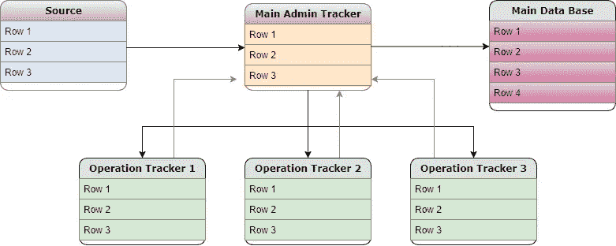
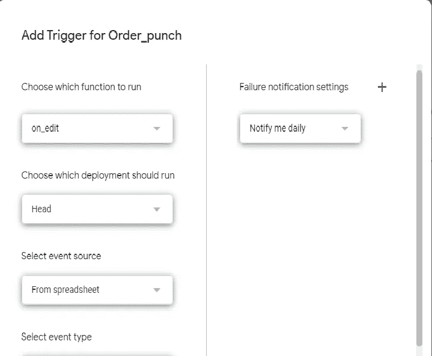

# Google sheets 上的 CRM

> 原文：<https://towardsdatascience.com/implementing-crm-solution-on-google-apps-script-922c9ceadf53?source=collection_archive---------35----------------------->

## 如何在 Google Apps 脚本上为您的企业实施 CRM 解决方案？

我们大多数人可能都听过数学家 Clive Humby 的名言“数据是新的石油”,一些行业领袖对此表示同意。他们的大多数观点都指出，在现代商业时代，数据已经变得多么重要。

许多 IT 巨头和初创公司正在利用他们的数据科学能力进行更好的预测，改进他们的产品，提供更好的见解，并做出数据驱动的决策。有些人甚至成功地用他们聪明的广告位置惹恼了整个世界(有意幽默)。这些只是一小部分应用，之所以成为可能，完全是因为正确使用了数据。本文重点关注小企业主、制造商和初创企业，以及他们如何建立数据收集和分析基础设施，并帮助他们的业务增长。


弗兰基·查马基在 [Unsplash](https://unsplash.com?utm_source=medium&utm_medium=referral) 上拍摄的照片

为了满足中小型企业的数据需求，Google Sheets 是一个有效的选择。Google Sheets 是一个基于云的电子表格应用程序，企业使用它来管理他们的数据。它提供了一个用户友好的界面，强大的功能和一个由 [GCP](https://cloud.google.com/) (谷歌云控制台)支持的脚本编辑器工具，你可以在那里编写脚本来自动化流程。

首先，我将描述总体架构/蓝图，然后使用 Google Apps 脚本(Google 应用程序中的编程语言，类似于 JavaScript)在工作表中实现它。

# 体系结构

为了方便起见，我考虑了并行操作工作流。所有三个操作同时进行。虽然它可能看起来类似于 ER 图，但这只是一个基本的数据流程图，每个块都是一个不同的跟踪器(google sheet ),箭头代表数据流。



作者图片

**Source** :作为一个数据源，订单的必要参数将在其中填写，可以是一个 web 表单或链接到回应表的 google 表单。用于生成订单/请求/工作等。每一行代表一个唯一的订单，可以通过一个唯一的键(在这种情况下是表单响应 id)来标识。

**主管理跟踪器:**主订单跟踪器(google sheet)包含来自源表单的所有字段和关于处理订单所需的所有操作的信息。这些行将被同时导出到各个操作跟踪器，只显示与特定操作相关的字段。该表可用于监控正在进行的订单，以跟踪流程的哪一端被卡住。订单完成后，该行条目可从该表中移除，并移至档案表(主数据库)。

**运营追踪器:**所有的业务都运行在某一组运营上，通常有不同的团队(或个人)处理不同的任务。要成功处理订单，必须完成所有任务。操作跟踪器将监控特定任务的状态，并将相关信息反馈给主管理跟踪器。

**主数据库:**最后，当所有操作完成，所有相关信息反馈到主跟踪器时，订单处于已实现状态，可以迁移到主数据库。该表作为所有订单的存档，包含来自源表和操作表的所有信息，以分析数据并做出数据驱动的决策。该表可以直接用于任何开源可视化工具来创建仪表板/摘要。

请注意，在上图中，黑色箭头表示流程，蓝色箭头表示来自操作单的反馈。这两个流程都将实现自动化，以减少人工干预并简化工作流程。这是最基本的设计，可以根据业务需求/工作流程添加/编辑元素。

# 履行

**步骤 1:创建一个 google 表单，作为创建订单的源表单**

*   创建表单并添加描述订单的必要问题，可以包括客户详细信息，还可以创建客户数据库。

**步骤 2:为创建的每个订单分配一个唯一的键**

*   现在我们有了创建订单的数据源，我们需要跟踪所有单独的行(订单)。这可以通过为每一行分配一个唯一的键来实现。
*   创建一个响应表(转到 responses 选项卡并单击电子表格图标)，创建一个列以打开脚本编辑器(工具> >脚本编辑器)，并粘贴下面给出的代码以生成每个订单的唯一键。

```
function generate_key()
{

  var form = FormApp.openById("formid");//Found in form URL
  Logger.log("function started"); 
  var ss =  SpreadsheetApp.openById(form.getDestinationId());
  var s = ss.getSheetByName("your sheet name");// sheet
  var resp= form.getResponses();
  var resp_id = resp[resp.length-1].getId();//fetch response id

  var h= s.getRange(1,1,1,s.getLastColumn()).getValues();//headers
  var last_row = s.getLastRow();   
  var key_column = h[0].indexOf("key")+1;//Enter your Col name
  s.getRange(last_row,key_column).setValue(resp_id);
  Logger.log("function completed");}
```

**步骤 3:创建主管理跟踪器，操作跟踪器，并添加一个功能，以添加新行，编辑行和删除行**

*   创建单独的电子表格管理跟踪器，不同的操作跟踪器，最后你的主数据库表。
*   在管理跟踪器和操作跟踪器中，我们将添加以下功能:

1.  import_data() ->从源工作表导入新行。
2.  on _ Edit()-->捕捉用户操作并传递/存储相关信息，例如标记日期、更改状态等。
3.  archive()-->从跟踪器中删除该行，并将其移动到存档的数据库表中

我在下面演示了这些函数的实现

```
function import_data()
{
  var source = SpreadsheetApp.openById("sourcesheetId")
  var destination = SpreadsheetApp.openById("destinationsheetId")
  var source_headers =   source.getRange(1,1,1,source.getLastColumn()).getValues()[0]
  var destination_headers =   destination.getRange(1,1,1,destination.getLastColumn()).getValues()[0]
  var source_data = source.getDataRange().getValues()
//"Unique_Id" is the column name for unique reference Id 
  var destination_ids = destination.getDataRange.getValues().map(function(x){return x.slice(destination_headers.indexOf("Unique_Id"),destination_headers.indexOf("Unique_Id")+1)})
  var destination_keys = []
  destination_keys =    destination_keys.concat.apply(destination_keys,destination_ids) for (var i =0;i<source_data.length();i++)
 {
  if(destination_ids.indexOf(source_data[i][source_headers.indexOf("unique_id")]) >= 0)
  {
    destination.appendRow(source_data[i]) }
 }
}function on_edit()
{var tracker = SpreadsheetApp.getActive().getSheetByName(sheetname)
  var headers = 
tracker.getRange(1,1,1,tracker.getLastColumn()).getValues()
  var actRange = tracker.getActiveRange()
  var edit_row = actRange.getRowIndex()
  var edit_col = actRange.getColumn()

  if(edit_row>=2 && edit_col == headers.indexOf("Opeartion_task_1")+1)
 {
    traker.getRange(edit_row,headers.indexOf("operation_date")).setValue(new Date())
  tracker.getRange(edit_row,hheaders.indexOf("operation_column")).setValue(Value) }
}function archive()
{
 var tracker = SpreadsheetApp.getActive().getSheetByName(sheetname)
 var archive_sheet = SpreadsheetApp.openById("archiveshetId")
 var headers = 
tracker.getRange(1,1,1,tracker.getLastColumn()).getValues()
  var actRange = tracker.getActiveRange()
  var edit_row = actRange.getRowIndex()
  var edit_col = actRange.getColumn()

  if(edit_row>=2 && edit_col == headers.indexOf("archive")+1)
  {
    var row_data = tracker.getRange(edit_row,1,1,tracker.getLastColumn()).getValues()[0]
    archive_sheet.appendRow(row_data)
    tracker.deleteRow(edit_row) }}
```

**第四步:为你编写的函数添加触发器**

要向您的函数添加触发器，请单击左侧的时钟图标，一个新窗口将会打开，然后单击右下角的添加触发器。将弹出如下所示的触发窗口



作者图片

触发器可以是-

1.  基于表单的事件
2.  基于电子表格的事件
3.  基于时间的事件

在这个演示中，我使用基于表单和基于电子表格的事件。

对于 on_edit 和 archive 函数，我使用基于电子表格的 on_edit 触发器。选择函数名。选择事件来源为电子表格，事件类型为编辑时，然后单击保存。您已经为函数添加了一个触发器，它们将在每次编辑电子表格时运行。

类似地，您可以为 generate_key 和 import_data 添加触发器。对于 generate_key，选择“事件源”作为表单，选择“事件类型”作为表单提交。对于 import_data，将事件源用作电子表格，将事件类型用作打开时，以便在每次打开电子表格时更新数据并提取新行。您可以根据需要选择不同的功能触发组合。

快乐编码:)