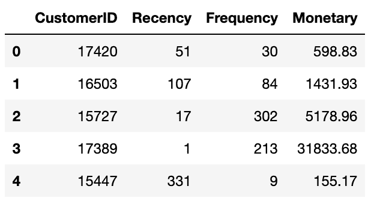
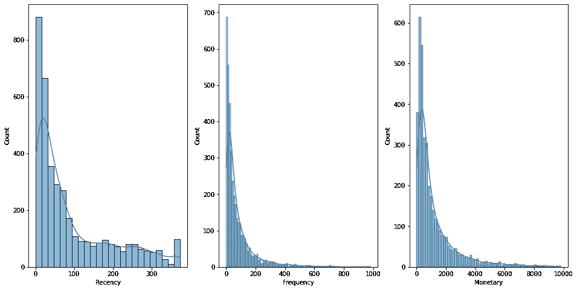
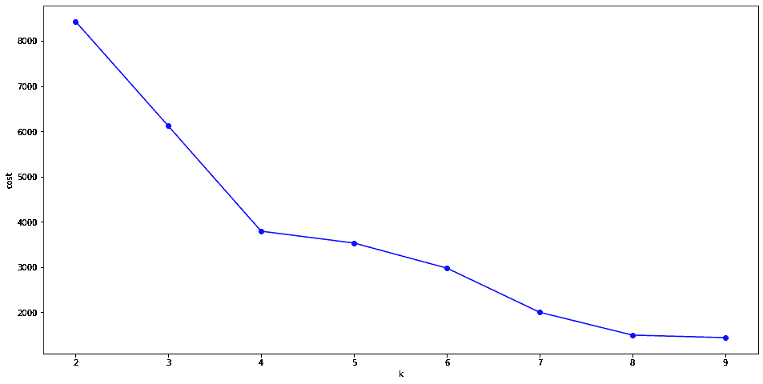
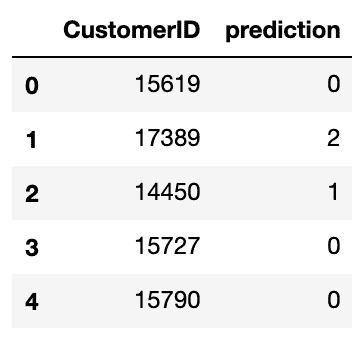
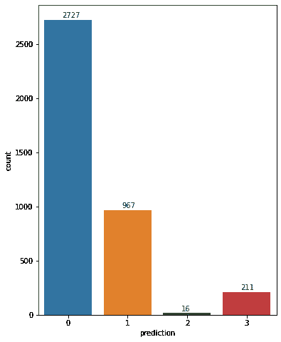
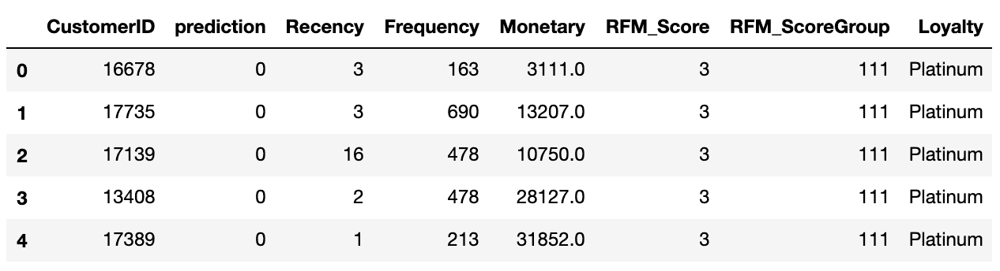
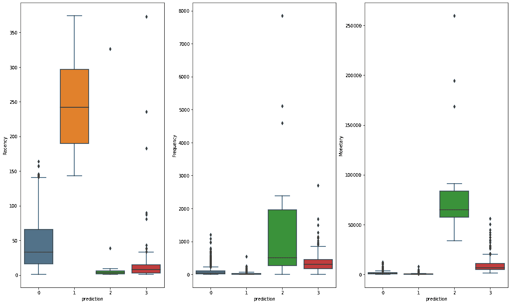
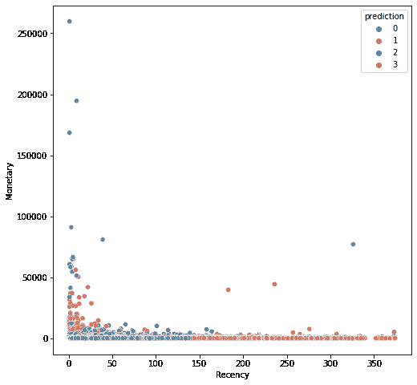
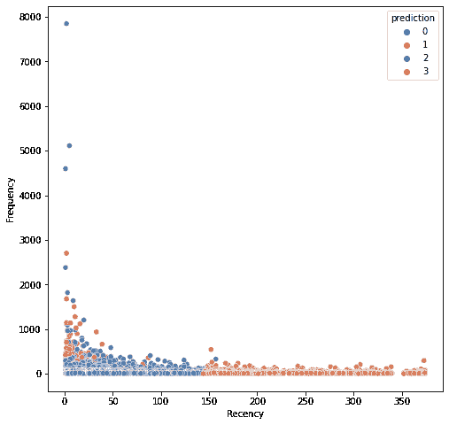
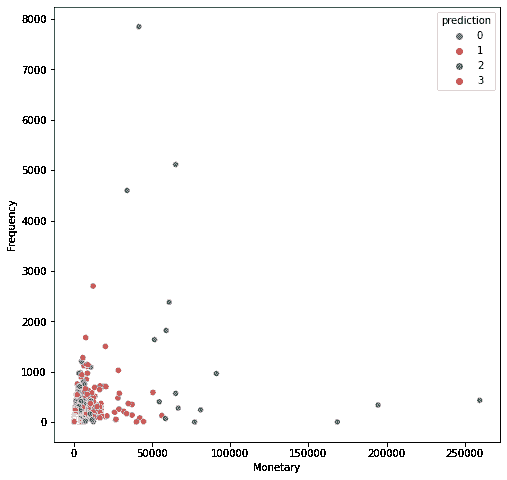

# 使用 PySpark 的 K-Means 聚类实现客户细分

> 原文：<https://towardsdatascience.com/implementing-customer-segmentation-using-k-means-clustering-with-pyspark-2e597a1456a6?source=collection_archive---------18----------------------->

## 通过 Python 和 Apache Spark (PySpark)使用 K-Means 集群实现客户细分的分步指南


照片由[莎拉·柴](https://www.pexels.com/@sarah-chai?utm_content=attributionCopyText&utm_medium=referral&utm_source=pexels)从[派克斯](https://www.pexels.com/photo/jars-with-various-raw-pasta-and-nuts-7262772/?utm_content=attributionCopyText&utm_medium=referral&utm_source=pexels)拍摄

在之前的[文章](/implementing-customer-segmentation-using-rfm-analysis-with-pyspark-3aed363f1d53)中，我们看到了如何根据消费者最近的购买、交易频率和其他购买习惯对他们进行分类。在那里，我们利用了 RFM 分析，一种管理细分方法。在本帖中，我们将了解如何使用机器学习算法 k-means clustering 对相同的客户数据集进行细分，使我们能够更好地为客户服务，同时提高盈利能力。

和以前一样，本文中使用的完整代码和数据集可以在 [GitHub](https://github.com/asish012/dataanalytics) 上获得。

```
· [Introduction](#495c)
· [Dataset](#b1d3)
· [Feature Engineering](#bf94)
· [Find the optimal number of clusters](#c533)
· [Implementing K-Means Clustering](#9145)
· [Observation](#a758)
· [Conclusion](#e0b4)
```

# 介绍

K-Means 是最流行的无监督聚类算法之一。它可以通过简单地利用输入向量进行推断，而不参考已知或标记的结果。输入参数“k”代表我们希望在给定数据集中形成的聚类或组的数量。

我们不会讨论 k-means 算法的数学细节，因为这超出了本文的范围。相反，我们将专注于业务需求:使用算法识别不同的客户群，看看我们如何更好地为客户服务。

> 我推荐以下站点来了解更多关于 k-means 算法、其应用、优点和缺点的信息:

</k-means-clustering-algorithm-applications-evaluation-methods-and-drawbacks-aa03e644b48a>  

要应用 k-means 聚类，我们所要做的就是告诉算法我们想要多少个聚类，它就会把数据集划分成所请求数量的聚类。有几种方法可以确定最佳的集群数量。我们将在本文中使用的*肘*方法就是其中之一。

本质上，我们将使用不同的 k 值(例如 2-10)运行聚类算法几次，然后计算并绘制每次迭代产生的成本函数。随着聚类数量的增加，平均失真将减少，每个数据点将更接近其聚类质心。然而，平均失真的改善将随着 k 的增加而下降。最后，我们将得到一个图表(其中我们绘制了每个 k 的平均失真),它类似于一只胳膊有一个弯曲的肘部。失真的改善在臂弯曲最严重的 k 值处下降最多。这个点被称为肘部，这将是最佳的集群大小。

# 资料组

我们将从上一篇文章中的一个半准备好的数据集开始，其中已经计算了每个唯一客户的最近值、频率和货币值。如果你想从原始数据集开始，你可以参考我以前的[文章](/implementing-customer-segmentation-using-rfm-analysis-with-pyspark-3aed363f1d53)以及 [GitHub](https://github.com/asish012/dataanalytics) 上的代码。

```
rfm_numbers = spark.read.csv("retail_rfm_numbers.csv", 
                             inferSchema=True, 
                             header=True)
```



我们有三个显著的特点:

*   **最近度:**顾客购买的时间。
*   **频率:**为了简单起见，我们将统计每位顾客购物的次数。
*   他们花掉的钱的总数。

## 使用 Pandas+Seaborn 探索数据集

为了更好地理解数据集，让我们使用分布图来看看数据集的特性。

```
import seaborn as snsrfm_scores_df = rfm_scores.toPandas()

fig, ax = plt.subplots(1, 3, figsize=(16, 8))

*# Recency distribution plot*
sns.histplot(rfm_scores_df['Recency'], kde=True, ax=ax[0])

*# Frequency distribution plot*
sns.histplot(rfm_scores_df.query('Frequency < 1000')['Frequency'], kde=True, ax=ax[1])

*# Monetary distribution plot*
sns.histplot(rfm_scores_df.query('Monetary < 10000')['Monetary'], kde=True, ax=ax[2])
```



# 特征工程

正如我们可以看到的，所有三个特征(最近、频率和货币)都是右偏的[并且处于不同的尺度和范围，因此我们需要标准化数据，以便 ML 算法可以评估特征之间的相对距离并识别特征之间的趋势。令人欣慰的是，Spark ML 为我们提供了一个类" *StandardScaler* "，它允许我们轻松地缩放和标准化这些特性。](https://en.wikipedia.org/wiki/Skewness)

在以下代码中，我们执行这些特征工程步骤:

1.  从*货币*列中删除零和负值
2.  向量化所有的特征(从 Spark ML 到工作的 K-Means 是强制性的)
3.  标准化特征向量

```
*# Remove zero and negative numbers*rfm_data = (
    rfm_numbers.withColumn("Monetary", 
        F.when(F.col("Monetary") <= 0, 1)
         .otherwise(F.col("Monetary")))
)*# Identifying feature columns*
features = rfm_data.columns[1:]*# vectorize all the features*
assembler = VectorAssembler(
    inputCols=features, 
    outputCol="rfm_features")
assembled_data = assembler.transform(rfm_data)
assembled_data = assembled_data.select(
    'CustomerID', 'rfm_features')*# Standardization*
scaler = StandardScaler(inputCol='rfm_features',outputCol='rfm_standardized')
data_scale = scaler.fit(assembled_data)
scaled_data = data_scale.transform(assembled_data)
```

# 找到最佳的聚类数

正如我们在开始时所讨论的，我们将使用肘方法来确定数据集的最佳聚类数。

```
costs = {}*# Apply k-means with different value of k*
for k in range(2, 10):
    k_means = KMeans(featuresCol='rfm_standardized', k=k)
    model = k_means.fit(scaled_data)
    costs[k] = model.computeCost(scaled_data)

*# Plot the cost function*
fig, ax = plt.subplots(1, 1, figsize =(16, 8))

ax.plot(costs.keys(), costs.values())
ax.set_xlabel('k')
ax.set_ylabel('cost')
```



在 k=4 的值处，线看起来像肘部一样弯曲(失真的改善下降最多)。所以我们可以假设 k=4 是最佳的聚类数。

# 实现 K 均值聚类

在这一步中，我们将使用聚类数“k”等于 4，并对整个数据集最后一次运行 k-means 算法，我们将在名为“prediction”的列中获得每个客户的预测聚类数。

```
k_means = KMeans(featuresCol='rfm_standardized', k=4)
model = k_means.fit(scaled_data)
predictions = model.transform(scaled_data)

result = predictions.select('CustomerID', 'prediction')
```



# 观察

让我们将预测与起始数据集连接起来，这样我们就可以用一些图表来检查结果。

```
*# Join other information with the prediction result-set*

rfm_score = spark.read.csv(retail_rfm_numbers.csv', 
                           inferSchema=True, 
                           header=True)
rfm_score = rfm_score.select("CustomerID", "Recency", "Frequency", "Monetary", "RFM_Score", "RFM_ScoreGroup", "Loyalty")combined_result = result.join(rfm_score, on='CustomerID', how='inner')
```



现在，为了更好地理解预测结果，我们在箱线图中绘制了每个聚类的最近值、频率和货币值。生成的图表揭示了这些关键点:

*   c*cluster 2*与其他聚类相比明显具有更高的频率和货币数字，并且与其他聚类相比具有最低的新近值。
*   另一方面,*群 1* 具有最高的新近数字，但是最低的频率和货币数字。
*   其他集群(1 和 3)位于中间。

这一观察表明，我们的顾客被分成不同的群体，其中某些群体表现出最佳表现顾客的特征(聚类 2)，而其他群体对与我们一起购物失去了兴趣(聚类 1，他们已经很久没有光顾我们了)。其他顾客(第 0 类和第 3 类)可能需要更多的关注/激励，以便更频繁地与我们一起购物。基于这种分析，企业可以对不同的客户群体做出不同的反应，以增加利润。

```
analysis_df = combined_result.toPandas()

fig, ax = plt.subplots(1, 3, figsize=(20, 12))
sns.boxplot(x='prediction', y='Recency', data=analysis_df, ax=ax[0])
sns.boxplot(x='prediction', y='Frequency', data=analysis_df, ax=ax[1])
sns.boxplot(x='prediction', y='Monetary', data=analysis_df, ax=ax[2])
```



我们还可以查看成对特征比较，以了解这些特征如何影响每个分段。

```
*# Monetary vs Frequency (combined)*
fig, ax = plt.subplots(1, 1, figsize=(8, 8))
sns.scatterplot(x='Recency', y='Monetary', 
                data=selected_result_df, 
                hue='prediction', 
                palette="deep")

*# Monetary vs Frequency (combined)*
fig, ax = plt.subplots(1, 1, figsize=(8, 8))
sns.scatterplot(x='Recency', y='Frequency', 
                data=selected_result_df, 
                hue='prediction', 
                palette="deep")

*# Monetary vs Frequency (combined)*
fig, ax = plt.subplots(1, 1, figsize=(8, 8))
sns.scatterplot(x='Monetary', y='Frequency', 
                data=selected_result_df, 
                hue='prediction', 
                palette="deep")
```



# 结论

K-means 聚类是最流行和广泛使用的数据聚类分析技术之一。但是，它的性能通常不如其他复杂的聚类技术。但它仍然可以为我们提供很好的见解，帮助我们理解数据。你对 K-means 聚类有什么想法？