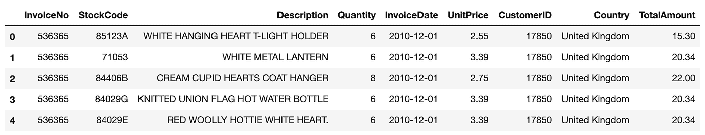
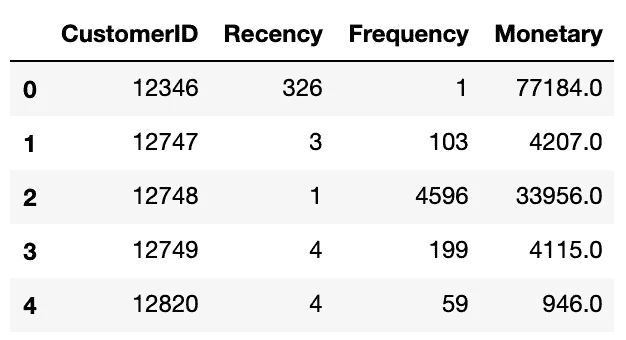
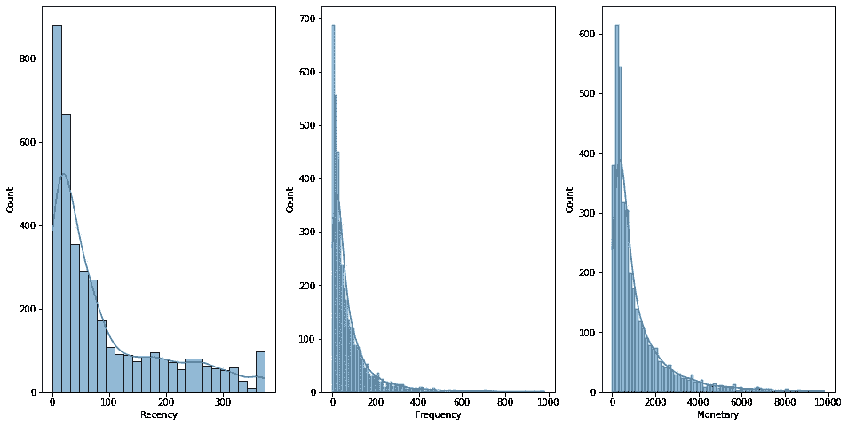
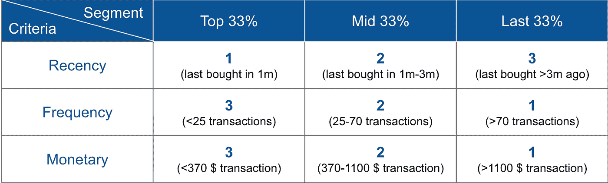
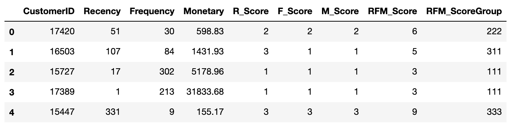
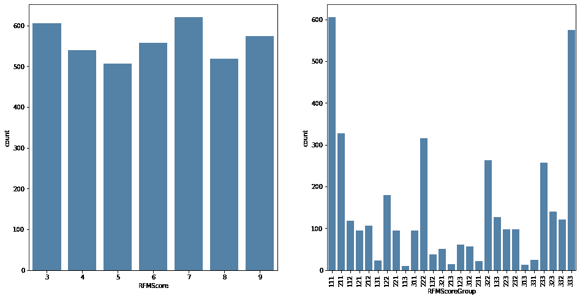
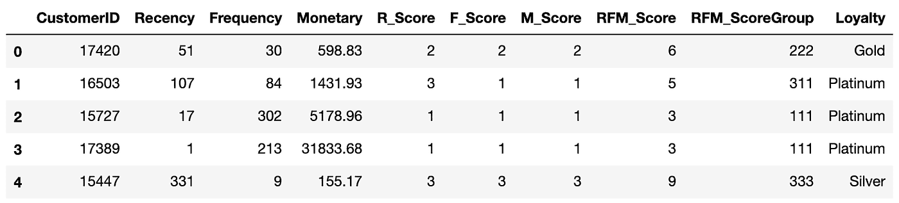
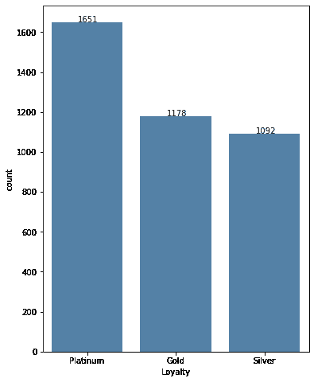
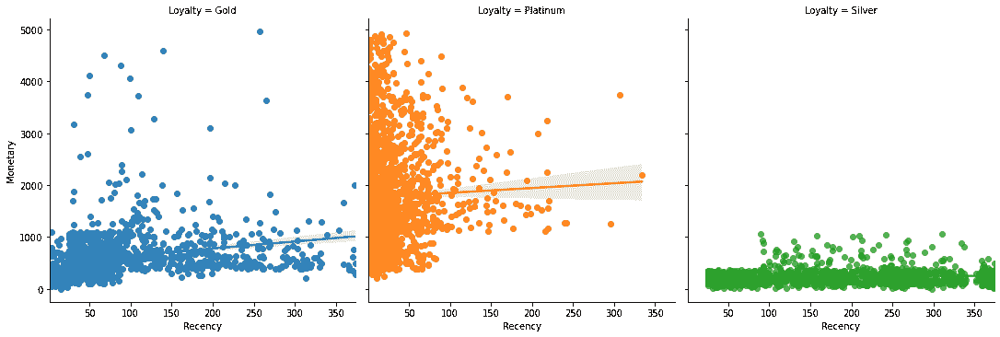
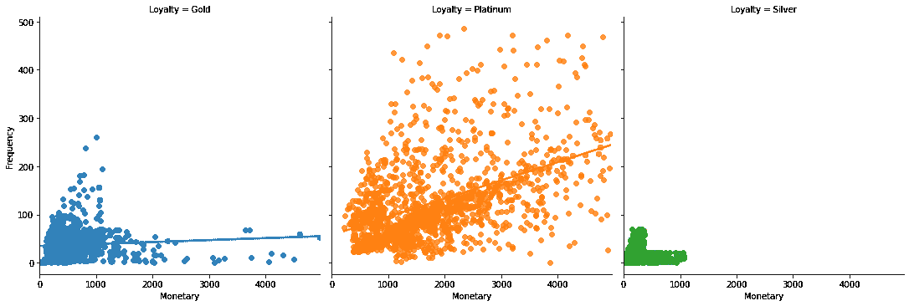

# 使用 PySpark 的 RFM 分析实现客户细分

> 原文：<https://towardsdatascience.com/implementing-customer-segmentation-using-rfm-analysis-with-pyspark-3aed363f1d53?source=collection_archive---------5----------------------->

## 使用 Python 和 Apache Spark 的 RFM 方法实现客户细分的分步指南。


德文·艾弗里在 [Unsplash](https://unsplash.com/?utm_source=unsplash&utm_medium=referral&utm_content=creditCopyText) 上的照片

客户细分是一种营销工具，根据共同特征对客户进行分组，以便您可以有效地关注和营销每个群体，并最大限度地提高每个客户对企业的价值。

像许多其他学科一样，在商业领域，我们也看到了古老的 80-20 法则。其中 80%的收入来自 20%的客户。这就是为什么要增加你的业务，你需要了解你的客户。

客户细分至少有两个主要目标:

1.  继续为您最好的客户提供最好的服务。
2.  关注与你的最佳客户相似的潜在客户。

## **目录**

```
 ∘ [RFM Model](#e548)
  ∘ [Dataset](#6803)
  ∘ [Recency, Frequency & Monetary value calculation](#87d9)
  ∘ [RFM score calculation](#221f)
  ∘ [Segmentation based on RFM Score](#a4f5)
  ∘ [Segmentation results](#aac0)
  ∘ [Conclusion](#1ef1)
```

## RFM 模型

[RFM 代表近期、频率和货币](https://en.wikipedia.org/wiki/RFM_(market_research))，这是一个高度灵活的管理客户细分模型。

本文将通过最流行的分布式数据处理框架 [PySpark](https://spark.apache.org/) 使用 RFM 模型逐步细分客户群。在未来，我们将看到如何利用机器学习算法(如 K-Means)来改善细分过程，甚至尝试预测客户流失。

本文中使用的完整代码可以在 [GitHub](https://github.com/asish012/dataanalytics) 上获得。

## **数据集**

对于本文，我们将使用 Kaggle 的一个公开的在线零售交易数据集[数据集](https://www.kaggle.com/vijayuv/onlineretail)，它包含了来自世界各地的每个客户的交易信息。它包括发票号、发票日期、客户 id、产品描述、购买数量和客户居住的国家等信息。为了保持文章简短，我将排除数据探索和数据准备步骤，从一个干净的数据集开始。

由于超过 90%的数据点来自英国，我们将只考虑这些数据点。让我们读取干净的数据集并检查它。



## 新近性、频率和货币价值计算

我们首先要计算的是 RFM 分析的三个关键因素(近期、频率和货币)。

*   **最近度:**顾客购买的时间。
*   **频率:**为了简单起见，我们将统计每位顾客购物的次数。
*   **货币:**他们总共花了多少钱。

我们将通过按客户分组来计算这三个关键因素，并将“2011/12/10”作为我们的参考结束日期，因为这是我们数据集中列出的最后一个交易日期。



**使用熊猫+海牛探索 RFM 价值观**

一旦我们计算出每个客户的个人最近次数、频率和货币价值，我们希望看到分布图来更好地理解数据。不幸的是，Apache Spark 不太适合可视化。这就是为什么我们在这部分会用熊猫和 Seaborn。



## RFM 分数计算

正如我们在图表中看到的，我们的近期、频率和货币价值在不同的尺度和范围上，所有三个指标都是右偏的。对于 RFM 细分模型来说，这不是问题，但是如果我们想要使用机器学习模型进行细分(我们将在未来这样做)，我们必须将这些数据标准化。

先说细分。首先，我们将为每个客户分配一个特定的分数，以反映他们个人的近期、频率和货币价值。然后，我们将汇总这些单独的分数，得到一个组合的细分分数。就像大学成绩一样。你个人的科目分数会被转换成科目成绩，然后通过合并个人成绩计算出最终成绩。

我们将把我们的客户分成三个相等的部分(每个部分 33%)，并给每个部分打分，从 1 到 3(最好到最差)。

对于最近，我们将为最近购买的客户(前 33%)分配分数“1”，为中间组分配分数“2”，为第三组分配分数“3”(最后一次购买是在很久以前)。由于最近购买的客户更有可能再次做生意，我们会给他们更高的分数。

但是对于频率和金钱，我们会给最后 33%的顾客打分“1”，这些顾客购物更频繁，花费更多。并将“3”分配给前 33%的购物频率较低且花费较少的客户。

最后，我们将得到一个从“111”到“333”(最好到最差)的分段等级，以及一个从 3 到 9 的总分数。

我们的评分矩阵如下:



让我们看看 RFM 得分的代码。评分基准将取决于每个指标的百分比。



**使用熊猫+海豹探索 RFM 分数**



正如我们在左图中看到的，我们汇总了客户的个人 rfm 得分，我们得到了一个分布相当均匀的图表。但是当我们查看元素方面的分数(右图)时，我们看到它们并不是均匀分布的，并且由于聚合，我们丢失了重要的细节。例如，rfm 得分“5”(在左图中)可以通过元素得分“212”或“131”或“221”甚至“113”来实现。但它们并不相同。

## 基于 RFM 分数的分割

到目前为止，我们已经计算了我们客户的个人新近度、频率和货币价值，然后是他们单独的 r_score、f_score 和 m_score，最后是一个聚合的 rfm-score。我们还保留了元素方面的 rfm 分数。

现在，根据业务需求，我们可以按照我们想要的方式划分客户群。但是，为简单起见，我们将根据 rfm 总分将我们的客户群分为 3 个部分，并分配一个忠诚度徽章(白金、黄金、白银):

*   第 1 部分**(白金)**:前 33%
*   第二段**(黄金)** : 33% — 66%
*   第三部分**(银)**:最后 33%



**使用熊猫+海豹来检查我们的 3 个忠诚度等级**



## 检查结果

最后，让我们用分布图来看看分割结果。

有趣的是，当我们观察*近期与货币*和*近期与频率*图表时，可以观察到我们的*白金*和*白银*客户之间的明显对比。看起来白金顾客比其他人购物更频繁，花费更多(这很好)。也许银顾客可能已经失去了和我们一起购物的兴趣。他们购物更少，消费更少(这并不太好)。但是，*黄金*客户处于中间位置，看起来最近*黄金*客户的交易更加活跃。

因此，从分析中可以得出的结论是，我们需要思考如何才能继续满足我们的白金顾客继续与我们一起购物。我们可能还需要考虑如何影响我们的*黄金*客户来增加与我们的接触。而且追究那些银卡用户可能为时已晚。

**货币与近期**



**频率与新近度**


**货币 vs 频率**



## 结论

RFM 细分模型非常有洞察力，是了解你的客户的有力工具。在本文中，我试图展示如何用 PySpark 实现 RMF 管理细分模型。我希望这篇文章是有帮助的。我将在以后的帖子中尝试向您展示一种机器学习方法来进行客户细分。