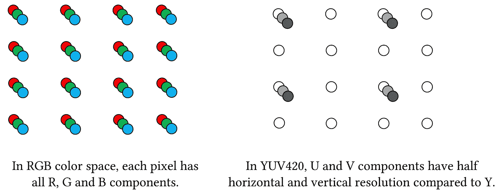
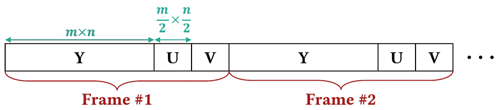
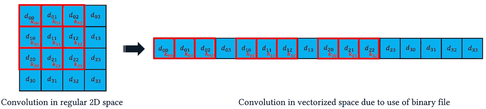
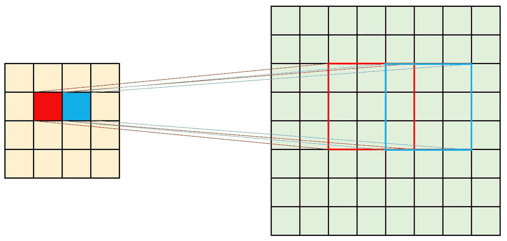
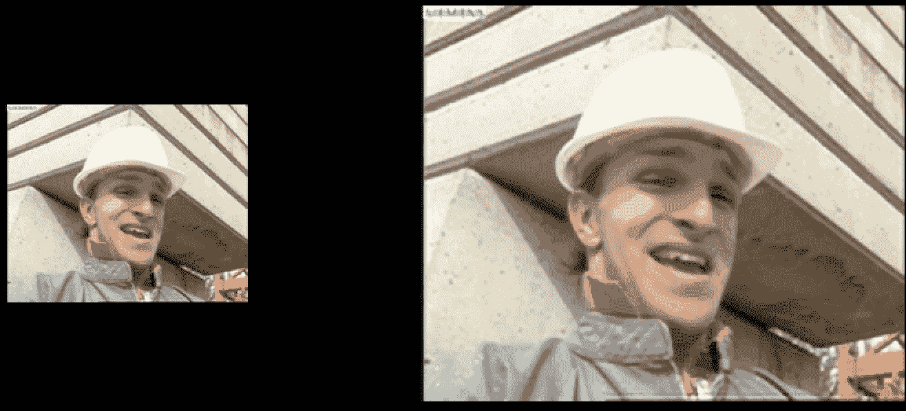

# 不用外部库用 C 语言实现深度卷积神经网络

> 原文：<https://towardsdatascience.com/implementing-deep-convolutional-neural-networks-in-c-without-external-libraries-b30464f64d02?source=collection_archive---------9----------------------->

## YUV 视频超分辨率案例研究


罗伯特·库伦尼在 [Unsplash](https://unsplash.com?utm_source=medium&utm_medium=referral) 上拍摄的照片

在本帖中，我们将讨论如何在没有任何外部库的情况下，用 C 语言实现一个预先训练好的深度卷积神经网络(CNN)的推理。此代码是为 YUV 视频超分辨率应用程序开发的。然而，这些功能是模块化的，稍加修改就可以应用于其他应用程序和网络结构。由于这段代码是用纯 C 编写的，没有任何外部库，因此可以很容易地集成到其他框架中。在这篇文章中，假设读者熟悉 C 编程和 CNN 的基本主题。在下文中，首先，我们简要讨论 YUV 视频格式和用于超分辨率的 theFSRCNN 算法。然后更详细地讨论了用于 YUV 视频超分辨率的这种深度 CNN 的实现。代码可以在[这里](https://github.com/miladabd/DeepC)找到。

# **YUV 4:2:0 视频格式**

YUV 是和 RGB 一样的色彩空间。在 YUV 视频中，每一帧都有三个组成部分。y 是亮度分量，它是 R、G 和 B 分量的加权平均值:

*Y = k₁R + k₂G + k₃B*

使用 U 和 V 分量作为色差或色度来表示颜色信息。YUV 等亮度/色度系统的一个主要优势是兼容黑白模拟电视，因为 Y 分量保存所有黑白数据。然而，YUV 色彩空间相对于 RGB 的主要优势在于，U 和 V 可以用比 Y 更低的分辨率来表示，因为人类视觉系统(HVS)对色彩的敏感度低于亮度。这减少了表示色度分量所需的数据量，而没有明显的视频质量差异。



RGB 和 YUV420 色彩空间中 4×4 像素网格的组件数。(图片由作者提供，灵感来自[视频编解码器设计](https://www.wiley.com/en-gb/Video+Codec+Design%3A+Developing+Image+and+Video+Compression+Systems-p-9780471485537))

YUV 的一种流行模式是 4:2:0(也称为 YUV420)，这意味着 U 和 V 分量的水平和垂直分辨率都是 y 的一半。例如，对于 4×4 像素网格，RGB 使用 8×16×3 位，而 YUV420 使用 8×(16+4+4)。这样，YUV420 视频平均每像素使用 12 位，而在 RGB 色彩空间中每像素使用 24 位。这意味着节省 50%的带宽，而对质量没有明显的影响。

像 HEVC 或 H.264/AVC 这样的视频编码器对这种 YUV420 视频进行编码，压缩后的输出用于存储或通信。为了播放视频，视频播放器解码压缩的比特流。在视频分辨率较低的情况下，我们可以在播放视频之前使用超分辨率(SR)方法人工提高视频的分辨率。接下来，我们将讨论一种简单而有效的 SR 方法。

# **使用 FSRCNN 的视频超分辨率**

快速超分辨率卷积神经网络( [FSRCNN](https://arxiv.org/abs/1608.00367) )是一种简单而有效的算法，用于将低分辨率(LR)输入图像映射到高分辨率(HR)图像。它包括五个主要部分，前四部分是卷积层，第五部分是去卷积(逆卷积)。为简单起见，我们使用 Conv( *k* ， *o* ， *i* )来表示一个卷积层，其内核大小为 *k* ， *i* 个输入通道，以及 *o* 个滤波器。与 DeConv *(k，o，i)* 相同的符号用于去卷积层(逆卷积)。

*   第一部分是提取 LR 特征的**特征提取器**。
*   第二部分是**收缩**以降低 LR 特征的维度。
*   **非线性映射**由 4 个卷积层组成，将 LR 特征映射到 HR 特征。
*   **扩展**增加 HR 特征的尺寸，使其为重建做好准备。
*   最后，**去卷积**用一组去卷积滤波器对 HR 特征进行上采样和聚合。

参数整流线性单元( **PReLU** )用作激活功能，定义如下:

*f(xᵢ)= max(xᵢ,0)+aᵢmin(xᵢ,0)*

参数 *aᵢ* 是可学习的负部分的系数。PReLU 用于避免死特征。连接这五个部分形成一个八层网络:Conv(5，56，1) —普雷卢— Conv(1，12，56) —普雷卢— 4 × {Conv(3，12，12) —普雷卢} — Conv(1，56，12) —普雷卢—德孔夫(9，1，12)。有关 FSRCNN 设计细节的更多信息，请参考[原文](https://arxiv.org/abs/1608.00367)。

# **用 C 语言实现**

我们对 YUV420 视频的 Y 分量应用 FSRCNN。由于 HVS 对 U 和 V 的敏感度较低，因此可以使用双三次等更简单的插值算法对这些分量进行上采样。因此，在这篇文章中，我们关注于在 C 上实现 CNN，对于上采样 U 和 V 分量，我们简单地重复现有的元素来填充未知的位置。为了在 C 中实现预训练深度 CNN 的推断，我们需要执行以下步骤:

*   读取输入数据
*   实施所需的操作(Conv、DeConv、PReLU 等)。)
*   读取预训练网络的权重

## 用 C 语言读取 YUV 视频

为了用 C 读取 YUV 文件，我们需要知道视频的维度(宽度和高度)。那么 YUV 文件可以被认为是一个二进制文件，其中对于每一帧，首先是 Y 分量的数据，然后是 U 和 V 分量的数据。空间分辨率为 *m×n* 的视频示例如下所示:



YUV 视频作为二进制文件。在具有 m×n 空间分辨率的视频中，对于每一帧，第一个 m×n 字节的数据属于 Y 分量，然后随后的两个 m×n/4 字节分别属于 U 和 V 分量。(图片由作者提供)

然后我们可以使用 C 语言的[函数读取二进制文件。以下代码片段显示了如何从终端获取输入 YUV 视频的名称，并返回一个指示视频文件开头的指针:](https://www.delftstack.com/howto/c/read-binary-file-in-c/)

## 实施所需的操作

因为我们是用纯 C 实现 CNN 的，所以我们需要实现所需的函数，包括卷积、填充、反卷积和 PReLU。

**卷积。**我们不会深入研究卷积运算符的数学细节，但会尝试回忆它如何以矩阵形式处理图像。然后将其更改为二进制数据情况，其中所有行都连接在一起并形成一个向量。在 2D 卷积中，有一个称为核的权重矩阵。这个内核在 2D 数据上“滑动”,对它当前所在的输入部分执行逐元素乘法，然后将结果相加到单个输出像素中。


一个简单的 2D 卷积运算

我们实现的挑战部分是，我们没有数据矩阵，只有一个指向二进制文件开头的指针。因此，我们需要正确地使用这个指针来模拟 2D 卷积中出现的确切情况。下图显示了一个将卷积内核应用于二进制文件的示例，其中输入数据为 4 × 4，内核为 3 × 3:



传统的 2D 卷积映射到二进制文件的矢量化空间(图片由作者提供)。

我们将该卷积运算实现为以下 imfilter 函数:

这个函数接受以下指针作为输入:*img，*kernel 和*img_fltr。例如，*img 指向内存中输入图像的开始元素。使用这个指针，我们可以通过添加偏移值来访问输入图像的每个元素。例如，输入图像的第三个元素(2D 空间中的行 0，列 2)可以由*(img+2)访问。请注意，因为我们使用指针修改值，所以 imfilter 函数隐式地应用更改，并且不返回任何内容(void 函数)。

为了开始这个过程，我们首先在卷积之前填充输入图像。为此，我们使用 [pad_image](https://github.com/miladabd/DeepC/blob/2a5286e8dc1a052f8327e65f3bd93bfb9b867ec5/source.c#L715) 函数，该函数简单地重复填充位置的边界像素值。假设 *kernel_size=k，*和 *padsize=(k-1)/2* 。然后，对于输入图像中的每个像素位置，我们确定一个 *k×k* 区域，该像素位于该区域的中心。由于每个帧的 raw 都连接在二进制文件中，因此我们的代码中该像素的偏移值将是*CNT =(I-padsize)* cols+(j-padsize)*。接下来，我们在内核和确定的区域之间执行逐元素乘法。为此，我们循环遍历内核的位置，并以相同的方式找到相邻像素的偏移值:*CNT _ pad =(I+k1)* cols _ pad+j+k2*。然后可以通过 **(img_pad+cnt_pad)* 访问每个邻居像素的值。为了访问内核中的值，我们使用一个简单的增量计数器 *cnt_krnl* 。

**预科。**该函数非常简单，因为它对每个像素值独立执行。以下代码片段显示了我们对 YUV 过滤帧的 PReLU 的 C 实现:

**反卷积。**fsr CNN 中使用的反卷积层可以认为是反卷积过程。对于卷积，如果滤波器以步幅*与图像进行卷积，输出将是输入的 ***1/s*** 倍。那么，如果我们交换输入和输出的位置，输出将是输入的 ***s*** 倍。通过选择 **s** 作为期望的放大因子(在我们的实现中为 2)，输出将直接是 HR 图像。*

**

*反卷积可以被认为是将步长参数设置为放大因子的反卷积。(图片由作者提供，灵感来自 [FSRCNN](https://arxiv.org/abs/1608.00367) )*

*考虑到这一点，我们可以实现类似于 imfilter 函数的反卷积，但方式相反。C 语言中反卷积函数的代码可以在这里找到[。](https://github.com/miladabd/DeepC/blob/2a5286e8dc1a052f8327e65f3bd93bfb9b867ec5/source.c#L814)*

## *读取预训练网络的参数*

*在实现所需的功能后，下一步将是在 C 中加载预训练网络的权重。由于在深度学习框架(如 PyTorch 或 TensorFlow)中训练的网络的保存文件格式在 C 语言中不受支持，我们可以使用一个简单的技巧来加载参数。我们将网络的参数(包括权重和偏差)保存为 **。txt* 文件，并使用 fread 在 c 中访问它们。以下代码片段是读取第一层的权重和偏差的示例:*

*重要的一点是，由于权重是 3D 张量格式，我们应该按行连接它们。转换后的权重和偏差可以在 GitHub 页面上以 txt 文件的形式获得。*

# *把所有东西放在一起，然后编译*

*在实现所需的功能，并找到读取网络参数的方法后，我们通过调用[主函数](https://github.com/miladabd/DeepC/blob/main/source.c)中所需的功能来实现网络的不同层。作为一个例子，我们在 [foreman_qcif.yuv](http://trace.eas.asu.edu/yuv/) 视频上运行这个。为了在 Linux 终端中编译和运行代码，我们使用以下命令:*

```
*gcc source.c -o videosr
./videosr foreman_qcif_146x144.yuv output_foreman_352x288.yuv*
```

*这是一个看起来像这样的例子:*

**

*左:输入视频，右:上采样视频。(图片由作者提供)*

*注意，你需要一个 YUV 视频播放器来播放这些视频！*