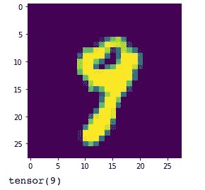

# 用 PyTorch 编码深度学习—图像识别

> 原文：<https://towardsdatascience.com/implementing-deep-learning-with-pytorch-image-recognition-d403d5da98ea?source=collection_archive---------15----------------------->

## 通过编写一个能够识别手写数字图像的简单神经网络，开始深度学习

乔治——【stock.adobe.com】T2。作者购买的[标准许可](https://stock.adobe.com/ie/license-terms#standardLicenses)。

在这篇文章中，我使用 [PyTorch 框架](https://pytorch.org/get-started/locally/)解释了一个简单的神经网络实现。我遍历了代码的每一步，最后，你应该从实用的角度学习深度学习的基本概念。

神经网络在数据集(MNIST)上训练，该数据集包括数千个手写数字的 28×28 像素图像。每张图片都有各自的标签——是 1 吗？一个 7？等等。

这篇文章分为，

*   先决条件和库
*   加载和转换数据
*   定义和初始化神经网络
*   培养
*   验证培训
*   玩模型
*   **全代码**
*   最后的想法

让我们深入研究一下。

# 先决条件和库

首先必须安装 Python ( [指令](https://medium.com/programming-for-beginners/python-for-beginners-install-and-run-your-first-code-50e51d6b8896))、PyTorch ( [指令](https://pytorch.org/get-started/locally/))和 torchvision 库(pip install torchvision)。总共需要八次导入。让我们逐一查看。

*   **火炬:**py torch 的组件之一。这是一个[库](https://pypi.org/project/torch/)用来帮助[张量](https://www.kdnuggets.com/2018/05/wtf-tensor.html)工作。它类似于 NumPy，但它有强大的 [GPU](https://www.intel.com/content/www/us/en/products/docs/processors/what-is-a-gpu.html) 支持。
*   火炬视觉:PyTorch 项目的计算机视觉库的一部分。您必须安装 [torchvision](https://pytorch.org/vision/stable/index.html) 和 pip install torchvision。
*   **matplotlib.pyplot:** 一组用于以类似 MATLAB 的方式绘图的函数。
*   PyTorch 模块有助于使用神经网络。
*   **torch.nn.functional:** 它包含了处理神经网络时有用的函数。
*   **torch.optim:** 各种优化算法的包。
*   **转换:**一个 torchvision 子包，用于帮助图像转换，比如转换为张量格式、裁剪、翻转等。
*   **数据集:**由图像和视频数据集组成的 torchvision 子包。

# 加载和转换数据

首先要做的是将数据分成训练集和测试集。您可以通过设置 train=True/False 来实现这一点。

从用于训练的样本中定义测试集很重要。因为一种方法是只进行训练，然后在训练之后，使用部分训练数据进行验证。

但是这样做有点像让开发人员也成为测试人员。测试肯定会有偏差。测试集必须包含机器以前没有遇到过的数据。

批量大小对应于一次传递给模型的数据量。使用批量的好处不多:

*   内存更少。在深度学习中，数据往往有数百万条记录。将所有内容一次性传递到模型可能不适合计算机内存。
*   权重更新更快。批处理越大，更新操作花费的时间就越长。

Shuffle (shuffle=True)有助于数据的泛化。它增加了方差，因此减少了偏差和过度拟合。

假设数据按顺序有许多“1”值。假设机器将变得过于专业，只能识别 1。当另一个数字到来时，机器在识别特定类型的数据时过于“博学”(过度拟合)，发现自己陷入了困境。

# 定义和初始化神经网络

这里我们定义神经网络。它由四层组成。一个输入层、两个隐藏层和一个输出层。fc1 表示全连接网络 1，fc2 表示全连接网络 2，以此类推。

类型是线性的，这意味着常规的神经网络。它不是递归的(RNN)，也不是卷积的(ConvNet)，而是一个简单的神经网络。

对于每一层，您必须定义输入和输出数。一层的输出数就是下一层的输入。

输入层有 784 个节点。784 是 28 乘以 28(图像像素)的结果。第一层定义为输出 86。因此，第一个隐藏层必须有 86 和输入值。同样的逻辑也适用于第二个隐藏层。

86 是一个任意的数字。它可以是另一个值。

输出层包含 10 个节点，因为图像表示从 0 到 9 的数字。

接下来，我声明数据经过的路径。每当数据通过一个层时，数据就被馈送给一个激活函数。

有几个激活函数，本教程中使用的一个被称为 [ReLU —整流激活函数](https://www.kaggle.com/dansbecker/rectified-linear-units-relu-in-deep-learning)。如果值为负，函数返回 0，如果值为正，函数返回值。

激活函数是最后一层(输出)的 softmax。Softmax 将值规格化。最后，它给出了一个概率——例如，数字 1 的 80%，数字 5 的 30%，等等。选择最高的概率。

更多关于激活功能[这里](/why-do-neural-networks-need-an-activation-function-3a5f6a5f00a)。由[卢西亚诺·斯特里卡](https://medium.com/u/56f7cdc8c678?source=post_page-----d403d5da98ea--------------------------------)分享的文章

# 培养

现在是训练阶段。简而言之，优化器计算实际数据和预测数据之间的差异(损失)，调整权重，再次计算损失，并循环进行，直到损失最小。

一个历元相当于数据向前和向后传递一次。定义三个时期意味着数据将前进和后退三次。

zero_grad:由于数据是成批处理的，因此损失计算和累积是特定于正在处理的当前批的。目标是不要将损失从一批转移到另一批。

optimizer.step 是更新权重的时间。

# 验证培训

在这里，它将基础事实与模型(模型=训练好的神经网络)做出的预测进行比较。在本教程中，它给出了很高的准确性，这意味着该模型非常善于识别每个数字。

但是现实世界的问题往往不是这样。高精度可能意味着过度拟合，应谨慎分析。

# 玩模型

现在让我们通过显示某个数字的图像并将其传递给模型来测试它，看看它是否能正确识别。

它确实认出了那是一个 9！

# 密码

实现有很多资源作为参考，因为我也在学习深度学习。但是主要是来自[pythonprogramming.net](https://pythonprogramming.net/introduction-deep-learning-neural-network-pytorch/)

# 最后的想法

浏览代码对我理解概念有很大帮助。我希望我在这篇教程中对你也有所帮助。我打算继续为其他神经网络类型撰写类似的帖子。

如果你觉得运行代码太慢，你可能想试试[谷歌合作实验室](/4-reasons-why-you-should-use-google-colab-for-your-next-project-b0c4aaad39ed)(文章由[Orhan g . Yal Zan](https://medium.com/u/ff47ab81282a?source=post_page-----d403d5da98ea--------------------------------)分享)，因为你可以使用 [GPU](https://www.intel.com/content/www/us/en/products/docs/processors/what-is-a-gpu.html) 。Google Colab 允许你在浏览器中运行 Python 代码。这是谷歌云上的免费 Jupyter 笔记本。

下次见。感谢阅读。