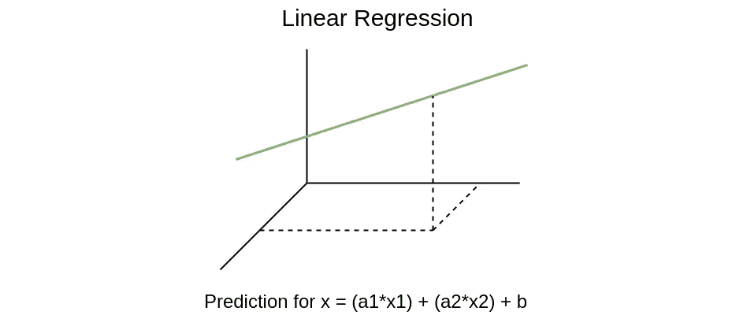
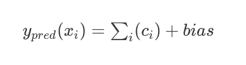
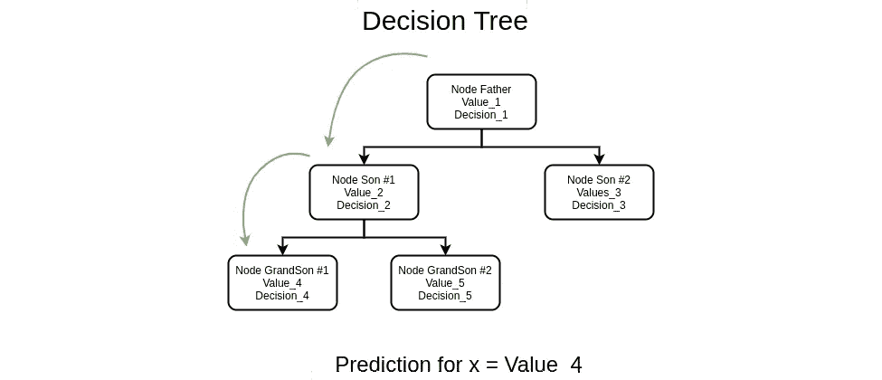
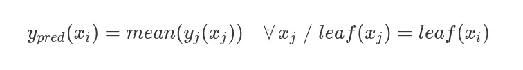
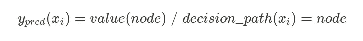
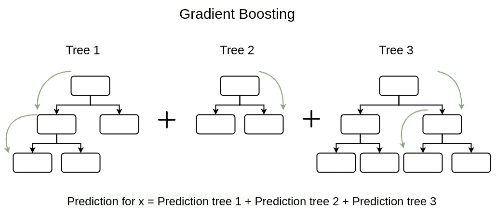
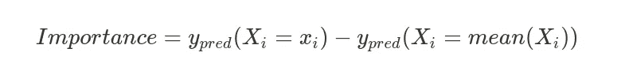
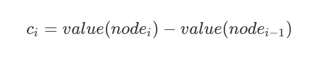
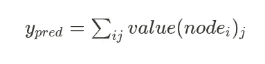

# 实现梯度推进树的可解释性

> 原文：<https://towardsdatascience.com/implementing-explainability-for-gradient-boosting-trees-9dde33ecdabd?source=collection_archive---------12----------------------->

## 梯度推进中的决策路径实现证明了无需任何 XAI 方法的局部可解释性。


特雷弗·派伊的照片:我们喜欢这片森林，因为我们喜欢可解释性

*作者*:[Bea hernández](https://medium.com/u/57438069e6ab?source=post_page-----9dde33ecdabd--------------------------------)@[chucheria](https://twitter.com/Chucheria)，[angel Delgado](https://medium.com/u/7462ba410e23?source=post_page-----9dde33ecdabd--------------------------------)[@ thin baker](https://twitter.com/thinbaker)

# 1.动机

在机器学习中，树模型的**集合**如随机森林(RF)和梯度推进(GB)已经在分类和回归问题(如房价预测)中给出了很好的结果。

我和一个朋友一直在做一个房价预测项目，我们意识到，尽管 GB 的结果很好，但人们仍继续使用线性回归(LR)模型来解决这类问题。这是因为 LR 具有的一个重要特征:**不仅模型可解释，而且特征对模型预测有贡献。**

RF 和 GB 就是这种黑盒模型的例子。然而，它们是建立在完全可解释的决策树之上的，所以我们可以基于系综的可解释性为系综**建立一个解释算法。**

# 2.可解释性

据说，如果我们能够回答这个问题，那么这个模型就是可解释的。”。这主要取决于模型的算法，有些模型不支持这个问题。

与 LR 相比，更高容量的模型可以学习更复杂的模式来进行预测。然而，代价是预测是不可解释的，这意味着我们既不能说出这种预测的原因，也不能说出每个特征的贡献大小。这种不可解释的模型被称为**黑箱模型。**

同时，有多种方法来解释预测。

*   **全局可解释性**:我们试图回答“一般来说，一个特性对预测有多大贡献？”。例如，在房价问题中，我们想要找出“特征平方米是否比浴室数量对预测有更大的影响”。
*   **局部可解释性**:我们试图回答是什么特征值给了我们一个特定的预测。例如，“在这个样本中，预测值是某一个，因为房间数是 4，并且房子位于这个特定的街道上”。

目前，绝大多数机器学习模型的性能都比 LR 好得多。之所以还是热门机型，是因为一个 LR 的可解释性很强。有了 LR，你不仅可以理解预测，还可以量化**每个特征对预测的贡献**，因为 LR 公式的本质。



作者图片:线性回归预测贡献

LR 中的预测由下式给出:


这可以解释为



其中 *c_i* 是第 *i 个*特征的贡献。

除此之外，还有一些可解释的模型**，在最终决策中没有每个特征**的贡献。比如决策树。决策树执行一组分层决策以获得解决方案(例如*房间数量> 3* )，从而获得最终结果。每个决策都是一次针对一个特性做出的，但是每个决策对最终结果都没有贡献(至少，我们会直接提出一个解决方案)。



作者图片:决策树逐节点预测

在决策树中，预测是:



其中 *leaf(x)* 是样本 *x* 所在的树的叶节点



GB(以及 RF)是决策树模型的集合。集成意味着 GB 是一组共同执行预测的决策树。一个树的集合比它单独的任何一个树表现得好得多，然而，问题是**这个集合不是局部可解释的**，因为每棵树都有它自己的完全独立于其他树的决策路径，我们只能知道哪些特征在总体上更重要(全局解释)。

具体来说，GB 集成算法基于一种叫做**剩余可加性**的东西。这意味着系综的每一棵树都从之前的树的预测和真实值(残差)中学习差异，因此最终的预测是所有树的预测(贡献)的总和(可加性)。



作者图片:在树贡献级别解释梯度推进预测

你可能想知道为什么可解释性对我们如此重要。原因是因为在某些问题上，**解释和**预测一样重要。在房价预测中，您想知道是什么使某个房子如此便宜/昂贵，或者如果某个特征值不同，价格会变化多少。

考虑到所有这些信息，并考虑到 GB 为回归问题提供的巨大结果，我们开发了一种算法，以某种方式聚合模型所有树的贡献，以理解预测。

# 3.GB 决策路径

我们已经提到，模型的可解释性只取决于它的算法，有可解释的模型和那些不是根据它的算法的模型，但从统计上来说，我们总是可以分析模型返回的结果来理解它们。

这些统计方法允许**模型不可知的解释性分析**。例如，一种常见的分析方法是分解法。如果我们仅仅改变一个特征，这种分解允许我们测量一个预测改变了多少。预测中的差异给出了特定特征在最终结果中的贡献的估计。

特征分解贡献 *X_i* :



值得注意的是，这个*重要性*度量并不完全精确，而是一个**统计估计**。

即使 GB 的性质没有给出其预测的解释，树算法预测一次执行每个决策值。这种性质以及剩余活动允许我们自然地将分解特征贡献的想法包含在梯度增强算法中。

# 算法

# 1.节点贡献

对于每棵树，通过一组特征决策分割(例如浴室数量> 3)进行预测，并且它们中的每一个对应于树中的一个节点。这些节点中的每一个都分配有预测值。树的预测是最后一个节点的值。

类似于分解分析，我们可以将每个决策的贡献估计为该节点的值与前一个节点的值之间的差:



其中 *c_i* 是决策 *i* 的贡献。

# 2.树贡献

这是由于来自梯度增强系综的剩余添加。最终的预测是所有树的预测之和，所以每棵树的贡献就是它的预测:


其中 *treePred_i* 是第*棵*棵的预测。

# 3.决策贡献

我们的目的是了解每个决策对最终结果的贡献有多大，因此，按照前面的两个步骤，我们可以根据决策的贡献来编写预测:



其中 *value(node_i)_j* 是树 *j* 的节点 *i* 的值。

# 4.特征贡献

如果我们意识到每个决策都有一个与之绑定的特征，我们不仅可以获得每个决策的贡献，还可以根据特征将它们分组并求和，这样我们就可以获得**特征贡献和局部可解释性。**

所以解释应该是

*   决策 1(特征 j)-贡献节点 1
*   决策 2(特征 k)-贡献节点 2

由于我们一直在与 ScikitLearn、 [**的 GB 合作，我们已经在库**](https://github.com/scikit-learn/scikit-learn/issues/19294) 内部实现了我们的方法。ScikitLearn 是最受欢迎的机器学习库之一，因此在其中实现可解释性对许多人来说非常有帮助(我们仍在等待我们的 PR 被接受)。


作者图片:我们对节点贡献可解释性的实现

# 4.代码示例

为了在实践中解释整个算法，我们将展示如何使用 ScikitLearn GB 类来解释 Boston House Pricing 数据集的预测(正如我们提到的，我们已经打开了 [**一个问题**](https://github.com/scikit-learn/scikit-learn/issues/19294) ，其中我们在 decision_path 方法中实现了我们的解决方案)。

# a.决策可解释性示例

```
import numpy as np
from sklearn.datasets import load_boston
from sklearn.ensemble import GradientBoostingRegressor
from sklearn.model_selection import train_test_splitX, y = load_boston(return_X_y=True)
X_train, X_test, y_train, y_test = train_test_split(X, y, random_state=0)reg = GradientBoostingRegressor(random_state=0, n_estimators=5)
reg.fit(X_train, y_train)init, values, explanations = reg.decision_path(X[0:1])print("Prediction for X_i: ", reg.predict(X[0:1]))
print("init: ", init)
print("values: ", np.nansum(values), "\\n")print("Breakdown:")
for val, exp in zip(values.tolist()[0],explanations):
    if ~np.isnan(val) and val!=0:
        print("contribution of ", round(val,5),
                "\\t because column ", round(exp[0])," ", exp[1], " ", round(exp[2],2))Prediction for X_i:  23.48966781
Init:    22.608707124010557 
values:  0.8809606811142934Breakdown:
contribution of   0.85498 	 because column  12  <   8.13
contribution of  -0.27826 	 because column  5   <   7.43
contribution of  -0.36345 	 because column  5   <   6.66
contribution of   0.67168 	 because column  12  <   9.63
contribution of  -0.36681 	 because column  5   <   7.01
contribution of  -0.04358 	 because column  7   >   1.48
contribution of  -0.24703 	 because column  5   <   6.84
contribution of   0.2979 	 because column  12  <   14.4
contribution of  -0.02668 	 because column  7   >   1.47
contribution of   0.63668        because column  12  <   8.13
contribution of  -0.325 	 because column  5   <   7.01
contribution of  -0.04324 	 because column  7   >   1.48
contribution of   0.48953	 because column  12  <   9.71
contribution of  -0.33782 	 because column  5   <   6.8
contribution of  -0.03794 	 because column  0   <   4.73
```

正如我们所看到的，预测值(23.48)是初始平均值(22.60)加上分解中可以看到的特征贡献值(0.88)之和。

# b.特征可解释性示例

正如我们之前提到的，利用之前的结果，我们可以按特征对决策进行分组，以获得特征贡献

```
from collections import defaultdict
counter = defaultdict(float)
cols = [i[0] if i else None for i in explanations]for col,val in zip(cols, values.tolist()[0]):
    if ~np.isnan(val) and val!=0:
        counter[col]+=valfor col, val in counter.items():
    print("column ", col, "\\tcontributed ", val)column  12 	contributed   2.9507737309447437
column  5 	contributed  -1.918373871627328
column  7 	contributed  -0.11350035836622434
column  0 	contributed  -0.03793881983689874
```

我们不仅可以看到这个决策最重要的特性是第 12、5、7、0 列，还可以看到每一列对最终结果的贡献。

# 5.结论

1.  在某些问题中，可解释性是一个关键概念，不仅是为了理解预测，也是为了衡量每个特征对最终结果的影响。模型的可解释性是它固有的东西。
2.  除了模型的可解释性，还有一些统计工具可以让我们理解和估计每个值对模型的最终预测的影响，比如分解。
3.  GB 的性质(即来自树的剩余学习和决策路径)允许内在地估计每个决策和每个特征对预测的贡献，因此即使它们不是可解释的，它们也是可解释的。


马克·泰格霍夫在 Unsplash 上的照片:我们也喜欢这个盆景

# 参考

*   [比切克、普热米斯劳和布日科夫斯基、托马兹。解释性模型分析](https://ema.drwhy.ai/)
*   [Gosiewska、Alicja 和 Przemyslaw Biecek。2019.iBreakDown:非加性预测模型的模型解释的不确定性](https://arxiv.org/abs/1903.11420v1)
*   [决策路径 GitHub 问题](https://github.com/scikit-learn/scikit-learn/issues/19294)
*   [Scikit-Learn 集成:梯度推进回归器](https://scikit-learn.org/stable/modules/generated/sklearn.ensemble.GradientBoostingRegressor.html)

**感谢阅读！💖**