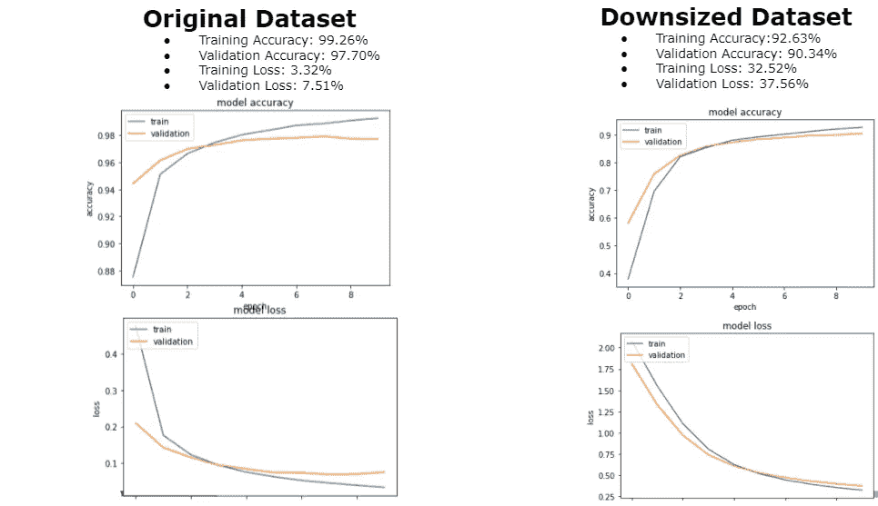

# 实现生成对抗网络以提高卷积神经网络的性能

> 原文：<https://towardsdatascience.com/implementing-generative-adversarial-networks-gans-for-increasing-a-convolutional-neural-networks-f871e17fe271?source=collection_archive---------8----------------------->

布雷特·乔丹在 [Unsplash](https://unsplash.com?utm_source=medium&utm_medium=referral) 上的照片

# **简介**

机器学习已经成为分析高级数据集和推断隐藏信息的最先进领域。出于各种原因，在机器学习中创建模型，例如用于分类或预测任务。具体来说，[卷积神经网络(CNN](https://arxiv.org/abs/1605.09081) s)在图像分析和特征提取方面显示出巨大的潜力。在图像上训练机器学习模型的一个问题是使用小的和缺乏多样性的数据集导致无效和不准确的模型。为了克服这个问题，可以在小数据集中扩充图像，以增加数据集的大小，并为要完成的任务创建更有效的模型。

有多种数据扩充技术可用于创建新样本来增加影像数据集的大小。这些技术包括裁剪、添加噪声、调整大小、翻转、旋转和改变图像的颜色。使用这些技术的一个缺点是没有向模型中引入“新”数据。模型已经在不同的状态下观察到这些样本(例如:将图像旋转 45 度向模型显示相同的图像，只是状态不同，其中状态是图像的角度)。虽然模型可以对不同州的相同样本进行分类很重要，但使用相同的数据可能不会对模型的概化能力产生很大影响。 ***概化*** 是模型正确识别和理解未观测数据样本的能力[【1】](http://. Goodfellow,  Y. Bengio,  and A. Courville,Deep learning.MITpress, 2016)。

生成对抗网络(GANs)是一种数据增强技术，它产生**新的**数据样本。GANs 从潜在空间获取随机噪声，并生成模拟原始数据集特征分布的独特图像。一个 GAN 在其架构中包含两个不同的网络，它们竞争实现纳什均衡(更多关于博弈论和什么是纳什均衡可以在[这里](https://www.pnas.org/content/101/12/3999)找到)。在这项研究中，GAN 网络是根据 [DCGAN](https://arxiv.org/abs/1511.06434) 和 [WGAN](https://arxiv.org/abs/1701.07875) 建模的，它们使用卷积神经网络作为其两个竞争模型的框架。 [WGAN](https://arxiv.org/abs/1701.07875) 使用与 DCGAN 类似的结构，但其损失函数采用 Wasserstein-1 距离，将鉴别器变成预测样本来自原始数据集的可能性的“评论家”。

GAN 中的“鉴别器”的唯一目的是分析假样本和真样本，将每个样本标记为“假”或“真”真实样本的批次从原始数据集被馈送到鉴别器，而假样本来自生成器。顾名思义，“生成器”的目的是从潜在空间获取随机噪声作为输入，并生成“假”数据提供给鉴别器。生成器的目标是创建如此逼真的图像，以至于鉴别器认为它们是真实的。通过使用反向传播来随着时间的推移更新这些模型的权重和偏差，生成器将慢慢学会创建模拟原始数据集的物理和数学分布的样本。

虽然 GANs 的实现涉及到大量的数学知识，但我只想提供一个基本的框架(提示！关于 GANs 的未来文章将更深入地讨论这一数学问题！)Goodfellow 等人[3]在 2014 年概述了 GAN 的一般损失函数。

网络的损失函数是:

等式:GAN 损失函数

其中鉴别器希望最大化函数值，而生成器希望最小化函数值。***【x】***是样本为“真”的概率 ***D(G(z))*** 是样本为“假”的概率。'

鉴频器的损失函数为:

等式:鉴别器的损失函数

发电机的损耗函数为:

等式:发电机的损耗函数

后来改成了:

等式:发电机的损耗函数

Goodfellow 后来改变了发电机的损耗函数，以提高稳定性并克服饱和问题。虽然 GAN 由于不稳定性而有些难以训练(更多关于 GAN 不稳定性的信息[此处](https://developers.google.com/machine-learning/gan/problems))，但是如果您能够用您的给定数据训练 GAN，您就可以增加更接近原始数据集的数据，以及分类模型从未见过的数据，这对于提高模型的概化能力是必要的。这就是使用 GANs 优于其他数据增强技术的理由。我们能够成功地为数据创建新的样本，而不必亲自出去获取，并且我们可以确信，如果经过适当的训练，扩充的数据遵循原始数据的类似概率分布。

# **数据集**

用于该分析的数据集是手写数字的 [MNIST](http://yann.lecun.com/exdb/mnist/) 数据集。在此分析中，使用了两种不同大小的数据集。一个称为“原始数据集”的数据集是 MNIST 的原始大小，有 60，000 个样本用于训练，10，000 个样本用于测试。称为“缩减数据集”的第二个数据集是从 MNIST 中随机选择的 3000 幅图像用于训练数据集，10000 幅图像用于测试数据集。

表:MNIST 数据集中的类分布

# 预处理

由于分析主要是使用 [Keras](https://keras.io/) API 进行的，灰度、28x28 图像必须首先转换为 NumPy 数组。然后，这些数组被转换为“float32”格式，并除以 255 以进行像素缩放。

**CNN 分类模型**

创建了两个不同的模型，一个用于原始数据集，一个用于缩减后的数据集。如上所示，除了卷积层中的神经元数量之外，这些模型在架构上非常相似。在两次实验中，模型没有改变，以观察来自 GAN 的增强数据将如何影响现有架构。

## **生成性对抗网络**

我大部分的 GAN 学习来自 Jason Brownlee 的书[Python 中的生成对抗网络](https://machinelearningmastery.com/generative_adversarial_networks/)。(强烈推荐！超级有帮助！).我还在 Coursera 上学习了[生成对抗网络专业化课程](https://www.coursera.org/specializations/generative-adversarial-networks-gans)，该课程真正深入理解了 GANs 的理论和实现。

创建了两种不同类型的 gan。创建的第一种 GAN 是[条件 GAN (cGAN)](https://arxiv.org/abs/1411.1784) ，创建的第二种 GAN 是 [Wasserstein GAN (WGAN)](https://arxiv.org/abs/1701.07875) 。虽然这些网络背后的数学公式超出了本文的范围，但我还是想介绍两种 GAN 框架之间的一些一般差异。使用的两种 gan 都以类别标签(0-9)为条件。

## 弗雷歇初始距离

扩充数据的一个困难是评估数据的质量。这里的“质量”是指合成数据与原始数据集的相似程度，以及原始数据集与扩充数据集相比的概率分布的相似程度。一种用于量化图像“质量”的测量评估是弗雷歇初始距离得分度量。

FID 分数比较从 Inception V3 模型获得的两个图像集激活的平均值和协方差。使用这种度量的一个警告是，比较的图片数量较少可能导致来自相同或相似分布的数据集的初始得分不太重要。

# **实验**

进行了两个实验来分析如何通过使用用于图像数据扩充的 GAN 来影响模型的性能。

## **实验 1:使用没有扩充数据的两个不同大小的数据集来训练 CNN。**

图:没有增加数据的两个不同模型的精确度和损失

虽然可以为 MNIST 创建更好的模型，但目标是获得两个没有机器学习模型训练中出现的[过拟合/欠拟合](https://www.geeksforgeeks.org/underfitting-and-overfitting-in-machine-learning/)问题的模型。如您所见，原始 MNIST 数据集达到了 99.26%的准确率，较小的数据集达到了 92.63%的准确率。较小的数据集也有更多的损失，这是意料之中的，因为用有限的数据量训练模型通常要困难得多(这也是我们使用数据扩充技术的原因之一！)

## 实验 2:使用没有扩充数据的两个不同大小的数据集来训练 CNN。

**扩充数据**

如前所述，使用两种不同类型的天然气水合物来扩充数据。一旦数据被扩充，图像和标签就被添加到原始数据集中。在整个研究过程中，cGAN 和 WGAN 数据从未合并到任何数据集中。以下是来自“0”类的两个合成样本，由每个 GANs 生成。

图:由 cGAN 生成的“0”

图:WGAN 生成的“0”

我能够成功地训练一个 cGAN 100 个纪元，但是，我无法让我的 WGAN 在 Google Colab 上完全训练有限的 GPU 空间(我已经订阅了一个 Pro 帐户！).

**弗雷歇初始距离得分**

由于 Google Colab 的内存有限，我只能分析来自两个不同 GANSs 的多达 5000 张图像的 FID 分数。我的目标是观察 100 张图片和 5000 张图片相比，分数是否有下降的趋势(分数越低越好)。

如您所见，FID 分数随着时间的推移从 100 张图像下降到 5000 张图像。虽然 FID 分数有些高，但随着我们添加更多图像，看到这种下降趋势，证明这些图像适合用于重新训练用于 MNIST 数据分类的 CNN 模型，特别是在添加 10，000 张图像时。

**模特培训**

图:附加 cGAN 样本的数据集的重新训练模型的准确性和损失

使用 cGAN，原始数据集在准确性方面没有太大变化(增加了 0.19%)。损失也几乎不受影响(培训下降 1.23%，验证下降 1.96%)。重要的是，GAN 的使用并没有减损 ***型号的性能。***GAN 的使用显示了**小数据集的巨大**改进。该模型实现了 97.72%的准确率(提高了 5.09%)，并显示了损失指标的巨大改善(训练损失减少了 13.16%，验证损失减少了 15.19%)。

图:附加了 WGAN 样本的数据集的重新训练模型的准确性和损失

对于 WGAN，原始模型并没有真正改变(类似于使用从 cGAN 扩充的数据所发生的情况)。该模型的损失指标仍有所下降，但准确性停滞不前，几乎没有提高。对于缩减的数据集模型，实现的准确度为 98.00%(增加 5.37%)，而损失再次降低(训练损失降低 14.48%，验证损失降低 10.72%)。

使用由两个不同的 gan 生成的数据，然后添加到数据集的结果表明，gan 确实有助于实现模型性能的大幅提高！正如您所看到的，较小的数据集对其大小的增加更敏感，并且他们的模型被认为从 CNN 训练中 GAN 的使用中获得了最大的积极影响。

## ***k*-褶皱分析**

在重新训练模型之后，进行了*k*-折叠分析，以查看新训练的模型在不同折叠级别上的表现。对于这个分析，我选择了 5 个折叠，然而，有许多程序可以找到最佳数量的 *k* 值。(一般行业标准是 5 或 10)。结果是 *k* 倍非常令人惊讶，实际上显示了与 cGAN 数据混合的数据集在准确性上的更大提高和模型损失的减少。

表:k 倍分析的结果

*k* -Folds 分析反映了先前的观察结果，即增强图像对原始大小的数据集没有巨大影响。对于较小的训练集，*k*-折叠显示了与扩充数据相结合的数据集在准确性和损失方面的重大改进

# **结论**

生成式对抗网络是一种强大的数据增强技术，它可以产生具有增强的概化能力的健壮模型。cGAN 显示出比 WGAN 更有效地改进更大的数据集。cGAN 高效的原因可能是它创建了一个更加多样化的图像集，并且能够针对整整 100 个时代进行训练。在研究的初始试验中，WGAN 对于训练较小的数据集更有效，但是通过倍分析表明，WGAN 对模型的影响小于 cGAN。这一观察解释了 GANs 在其训练过程中通常产生更多时期的更高质量图像的重要性。使用 GANs 进行数据扩充可以提高模型精度，减少模型损失，同时克服过度拟合和欠拟合，支持其用于提高模型的概化能力。

请在 [LinkedIn](https://www.linkedin.com/in/benjamin-mccloskey-169975a8/) 上加我或者随时联系！

**其他来源**

1.  。古德费勒，y .本吉奥，和 a .库维尔，深度学习。MITpress，2016 年
2.  重新思考电脑视觉的盗梦空间架构。*IEEE 计算机视觉和模式识别会议论文集*。2016.
3.  伊恩·古德菲勒、让·普吉-阿巴迪、迈赫迪·米尔扎、徐炳、戴维·沃德-法利、谢尔吉尔·奥泽尔、亚伦·库维尔和约舒阿·本吉奥。生成对抗性网络。神经信息处理系统进展，27，2014