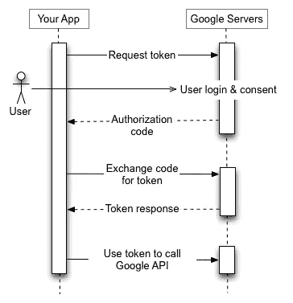

# 在 Streamlit 中实现 Google OAuth

> 原文：<https://towardsdatascience.com/implementing-google-oauth-in-streamlit-bb7c3be0082c?source=collection_archive---------10----------------------->

## 保护您的应用


由[弗兰克](https://unsplash.com/@franckinjapan?utm_source=unsplash&utm_medium=referral&utm_content=creditCopyText)在 [Unsplash](https://unsplash.com/s/photos/security?utm_source=unsplash&utm_medium=referral&utm_content=creditCopyText) 上拍摄

在 HousingAnywhere，我们经常利用 [Streamlit](http://streamlit.com/) 为我们的指标和目标构建交互式仪表盘。Streamlit 是一个相对较新的工具。它有很多潜在的用例，非常容易使用，但在某些领域(如安全性)可能会有所欠缺。大多数人用于 Streamlit 的一种流行、简单的安全方法是利用 [SessionState](https://gist.github.com/tvst/036da038ab3e999a64497f42de966a92) ，但是它非常容易受到攻击(例如暴力破解)。

在本文中，我将向您展示如何实现 Google OAuth 2.0 来更好地保护您的应用程序。

# 设置 Google OAuth

首先，让我们配置 OAuth 同意屏幕。

1.  转到 Google API 控制台 [OAuth 同意屏幕](https://console.cloud.google.com/apis/credentials/consent)页面。
2.  选择**内部**以便只有您组织内的用户可以访问该应用程序。
3.  填写必要的信息。
4.  单击添加范围，然后添加您需要的任何必要范围。对于这个例子，我们不需要任何。

接下来，我们需要从 GCP 创建一个授权凭证:

1.  进入 GCP 控制台的[凭证页面](http://Credentials page)
2.  点击**创建凭证> OAuth 客户端 ID。**
3.  在**应用类型**中选择 **Web 应用**，并填写您的客户名称。
4.  为您的申请填写重定向 URIs。这些是您希望用户登录后重定向回的链接。例如，在本地环境中，可以使用`http://localhost:8501`
5.  记下**客户端 ID** 和**客户端密码**以备后用。

# 实现逻辑

## 先决条件

安装以下库

```
streamlit==0.81.1
httpx-oauth==0.3.5
```

我们将利用 [SessionState](https://gist.github.com/tvst/036da038ab3e999a64497f42de966a92) 来存储从 Google API 返回的令牌。将此存储在`session_state.py`中:

在主应用程序中，我们首先定义这三个变量来存储之前的客户端 ID 和密码:

```
client_id = os.environ[**'GOOGLE_CLIENT_ID'**]
client_secret = os.environ[**'GOOGLE_CLIENT_SECRET'**]
redirect_uri = os.environ[**'REDIRECT_URI'**]
```

我们将使用 [httpx-oauth](https://pypi.org/project/httpx-oauth/) 作为我们的授权客户端:

```
client = GoogleOAuth2(client_id, client_secret)
```

现在，创建一个处理创建授权 URL 的函数:

```
**async def** write_authorization_url(client,
                                  redirect_uri):
    authorization_url = **await** client.get_authorization_url(
        redirect_uri,
        scope=[**"email"**],
        extras_params={**"access_type"**: **"offline"**},
    )
    **return** authorization_urlauthorization_url = asyncio.run(
    write_authorization_url(client=client,
                            redirect_uri=redirect_uri)
)st.write(**f'''<h1>
    Please login using this <a target="_self"
    href="{**authorization_url**}">url</a></h1>'''**,
         unsafe_allow_html=**True**)
```

一旦用户从谷歌授权页面被重定向回来，授权码就包含在 URL 中。我们将使用`st.experimental_get_query_params()`获得它

```
code = st.experimental_get_query_params()[**'code'**]
```

并使用此函数从 Google 获取令牌:

```
**async def** write_access_token(client,
                             redirect_uri,
                             code):
    token = **await** client.get_access_token(code, redirect_uri)
    **return** tokentoken = asyncio.run(
    write_access_token(client=client,
                       redirect_uri=redirect_uri,
                       code=code))
session_state.token = token
```

该过程可以如下所示:



来源:[谷歌](https://developers.google.com/identity/protocols/oauth2)

我们使用 SessionState 实用程序存储令牌，这样用户就不需要在会话期间重新授权。由于我们存储每个会话的令牌，刷新页面将再次触发授权过程。

保护数据安全是构建数据应用程序的一个重要方面。有了 Google OAuth，您可以高枕无忧，因为您知道您的应用程序可以更好地抵御可能的入侵。你可以在 GitHub 上点击查看整个应用程序的代码[。](https://github.com/uiucanh/streamlit-google-oauth/blob/main/app.py)