# 梯度下降的实现

> 原文：<https://towardsdatascience.com/implementing-gradient-descent-example-102b4454ea67?source=collection_archive---------46----------------------->

## 实施梯度下降的一个基本例子

我们在这里已经推导出一个如何实现梯度下降[的算法，但是在代码中实现这个算法的时候有很多细微差别。如果你一开始就试图用一个巨大的项目来解决这个算法，你会发现很难跟踪所有矩阵的形状。因此，我们将从推导中使用的相同架构开始。](https://doingengineering21.medium.com/full-implementation-of-gradient-descent-no-holding-back-86e688f36064)

首先，让我们只关注这个算法工作的一般形式。当我们有了可用的东西后，我们可以清理它，使它可用。为了测试我们的算法，我们将尝试将一个输入映射到一个输出。

## 初始化我们的神经网络

我们的第一步是为我们的神经网络创建权重。我们可以使用一个简单的 for 循环来做到这一点。首先，我们指定我们的神经网络将具有的层。

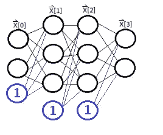

*这是我们将要创建的神经网络。**作者图片*

我们可以这样指定神经网络的层次:层= [2，3，3，2]。需要注意的是，我们没有将偏差作为每一层的一部分。我们稍后将包括它们。

在我们创建 for 循环来生成权重之前，看一下每个层的权重的形状以及它们与层大小的关系。

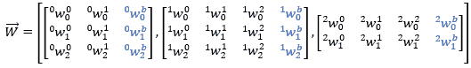

*这里只关注每个矩阵形状。**作者图片*

我们可以看到我们的体重形状是:(下一层神经元，当前层神经元+ 1)。利用这一点，我们可以创建一个 for 循环，为我们生成整个网络的权重。这些权重被初始化为随机数开始。

## 正向阶段

现在我们有了权重，我们需要执行我们的前进阶段，并收集所有层的输入。对于这个例子，我们将使用 2 个随机输入*，它们在 0 和 1* 之间。重要的是它们在 0 和 1 之间，所以我们在计算中不需要处理巨大的数字(稍后会详细介绍)。

首先，我们定义 sigmoid 函数，因为这是我们将要使用的激活函数。现在，如果我们简单地做权重和输入的点积，我们会得到一个错误。这是因为我们必须将我们的偏差项加到我们的输入中。因此，我们首先将偏差添加到输入中，然后在权重和输入之间进行点积，激活这个加权和，最后记录输出作为下一层的输入。

好了，运行完上面的代码后，让我们来看看列表' x_s'。

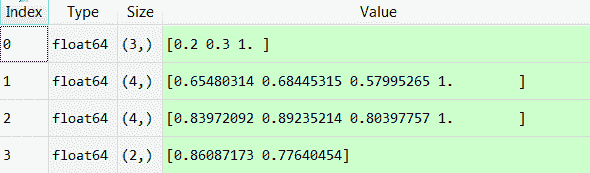

*最后一个列表是我们神经网络的最终输出。这是我们与预期输出进行比较以找出错误的地方。**作者图片*

一切都没问题。因此，我们的下一步是更新我们的权重，使我们的最终输出与我们的预期输出相匹配。对于这个例子，我们的预期输出将再次是 0 和 1 之间的两个虚构数字。

## 反向相位

如果你没有浏览我们[推导出我们的梯度下降算法](https://doingengineering21.medium.com/full-implementation-of-gradient-descent-no-holding-back-86e688f36064)的页面，或者你没有很好地理解它，实用的信息是这样的:找到我们所有层的梯度可以在 3 个步骤中完成。

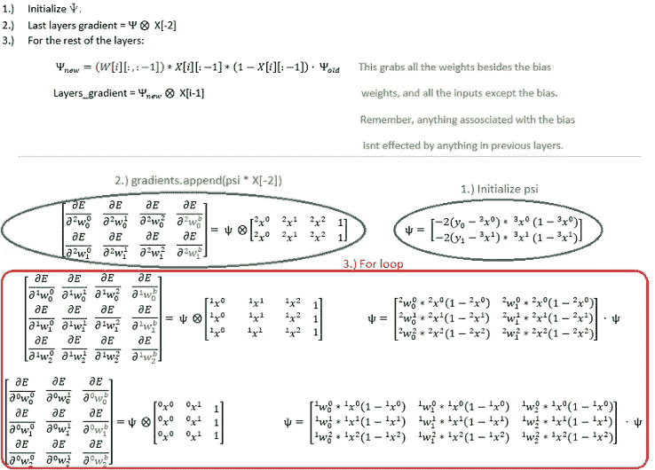

*然后我们将使用这些梯度来更新我们的权重。记住有 x 穿过的圆圈意味着我们要将行相乘。**作者图片*

我们的第一步是初始化 psi。psi 的每一项都是∂E/∂Xi * ∂Xi/∂Zi.利用 sigmoid 函数的导数= σ(x)(1-σ(x))和我们的误差的导数=-2(y _ truei-Xi)，我们很容易找到这个偏导数。因此，为了初始化 psi，我们只需遍历每个 y_true 值，并追加与该 y_true 值相关联的∂E/∂Xi * ∂Xi/∂Zi。

现在是第一个棘手的细节。现在，psi 的形状是(2，)。为了使我们的算法有效，我们需要 psi 的形状与我们的派生算法中的形状相同，即(2，1)。这是一个小的，有点令人沮丧的细节；但是很容易解决。

```
**psi = np.reshape(psi,(psi.shape[0],1))**
```

很简单。现在我们已经初始化了 psi，我们可以继续第 2 步，这是找到最后一层的梯度。这只是 psi *倒数第二个输入。或者；

```
**gradients = []
gradients.append(psi*x_s[-2])**
```

Numpy 为我们处理行乘。现在我们准备进入第三步，这有点棘手。我们想从倒数第二层开始，因为我们刚刚找到了最后一层的梯度。向后移动，然后我们更新 psi 并找到层梯度，直到我们到达最后一层。

我们首先定义我们用来更新 psi 的术语中要处理的权重和输入。这只是排除偏差的层权重和输入，因为我们试图找到的权重根本不会影响偏差(无论如何它们总是= 1)。然后，我们把这个术语变换成正确的形状。然后，我们像以前一样更新 psi 并重塑它。最后，我们添加我们的梯度。

在我们运行上面的 for 循环后，我们应该得到下面的梯度张量:

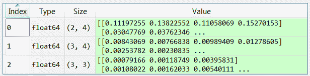

*作者提供的图片*

请注意，第一个渐变与最后一个层的权重大小相同，第二个渐变与倒数第二个层的渐变大小相同，依此类推。这是一个很好的健全检查，以便我们知道一切都正常工作。我们现在用以下有趣的索引来更新我们的权重:

```
**for i in range(len(gradients)):
  weights[i] -= .001*gradients[-(i+1)]**
```

就这样！我们刚刚更新了一次权重。现在，我们可以在一个 for 循环中运行上面的代码来更新我们的权重，比如说 2500 次，看看它是否有效。

现在是关键时刻了。让我们将最终输出与 y_true 值进行比较。

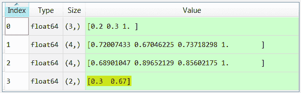

*作者提供的图片*

如您所见，我们的输出与 y_true 值完全匹配。现在，在我们清理这段代码并把它放到一个类中之前，让我们试着对它进行扩展。让我们看看这是否仍然工作将 1000 个神经元在每个隐藏层(伏笔，1000 个神经元的加权总和可能是一个非常大的数字！).去吧，你自己试试。

现在，让我向你展示当我将层更改为[2，1000，1000，2]时，经过 10，000 次训练迭代后得到的输出；

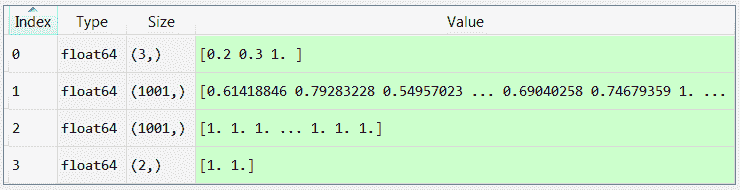

*作者提供的图片*

嗯，如你所见…根本不起作用！这是为什么呢？！

为了诊断这一点，让我们看看我们的梯度。

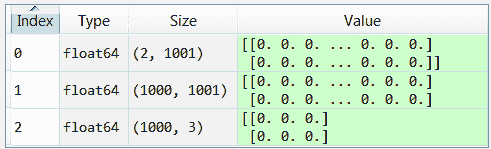

*作者提供的图片*

嗯，有个问题…试着想想为什么我们的梯度都是 0。我给你一个提示，它与我们的激活函数及其导数有关。

让我们看看最后一个梯度。∂e/∂w = ∂e/∂x[-1]* ∂x[-1]/∂z * ∂z/∂w.误差的 PD(相对于)最后输出，乘以最后输入的 PD，乘以最后加权和，乘以最后加权和的 PD。

如果我们的梯度是 0，这些中至少有一个必须是 0。记住∂X[-1]/∂Z 只是我们激活函数的导数。

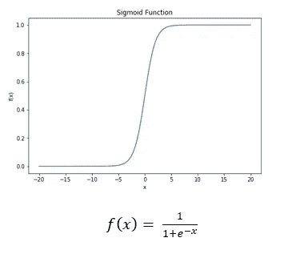

对于非常高或非常低的 x 值，斜率是多少

如果 x 很大或者很小，这个函数的导数会是多少？应该是 0！所以，让我们改变我们的 sigmoid 函数，使它更线性。我们可以通过将 x 乘以一个小常数 c 来实现这一点(这里最好用 0.01)。这是一种“贴上创可贴”的解决方案，更好的解决方案是切换到所谓的“泄漏 Relu”激活功能。如果你想的话，你可以，但是我要在 sigmoid 函数中，把 x 乘以 0.01。

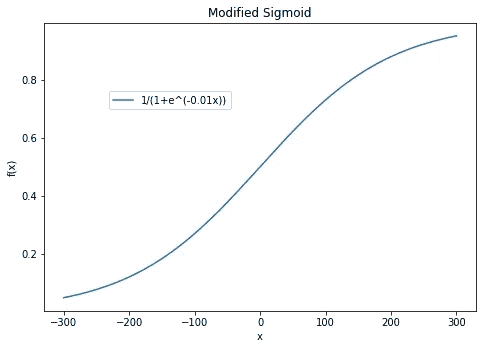

*注意拉长的 x 轴。**作者图片*

现在，我们要做的就是在 sigmoid 函数中加一个 0.01。从技术上讲，我们的新导数应该是 0.01 * σ(x)(1-σ(x))，但我们不必担心这一点，因为它只是被吸收到学习率中。此外，这样做的全部目的是扩大*对*我们衍生产品的规模。新的输出和对代码的唯一更改如下所示:

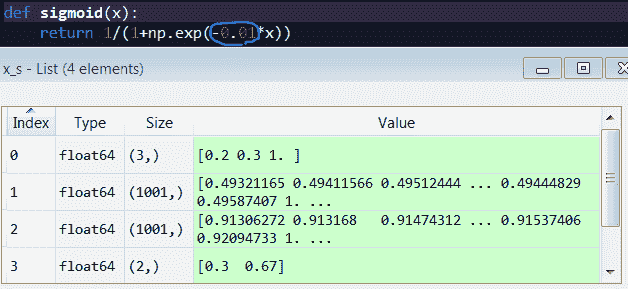

*对代码的唯一修改是用蓝色圈起来的。**作者图片*

如你所见，我们已经解决了我们的问题！这也是为什么我们必须在 0 和 1 之间输入。如果我们的加权和非常大，那么我们的导数将接近于 0。最后，我们可以稍微整理一下，然后把它放到一个类中。

现在，我们终于可以做一些有趣的事情了！有了这个算法，我们将得到一个识别手写数字的程序。这个项目很经典，但是你从来没有看到有人从零开始做(也许有很好的理由，但是我们正在学习)！你可以在这里找到这个项目[。](https://doingengineering21.medium.com/how-to-classify-handwritten-digits-in-python-7706b1ab93a3)

> 感谢您的阅读！如果这篇文章在某种程度上帮助了你，或者你有什么意见或问题，请在下面留下回复，让我知道！此外，如果你注意到我在某个地方犯了错误，或者我可以解释得更清楚一些，那么如果你能通过回复让我知道，我会很感激。

> 这是一系列文章的继续，这些文章从头开始对神经网络进行了直观的解释。其他文章请参见下面的链接:
> 
> [第 1 部分:什么是人工神经网络](/what-is-an-artificial-neural-network-b508c821ace8)
> 
> [第二部分:如何从零开始训练神经网络](/how-to-train-a-neural-network-from-scratch-952bbcdae729)
> 
> [第 3 部分:全面实施梯度下降](https://doingengineering21.medium.com/full-implementation-of-gradient-descent-no-holding-back-86e688f36064)
> 
> 第 4 部分:梯度下降的实现(一个例子)
> 
> [第 5 部分:如何在 python 中对手写数字进行分类](https://doingengineering21.medium.com/how-to-classify-handwritten-digits-in-python-7706b1ab93a3)