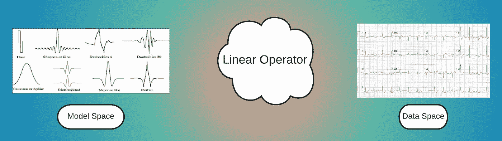
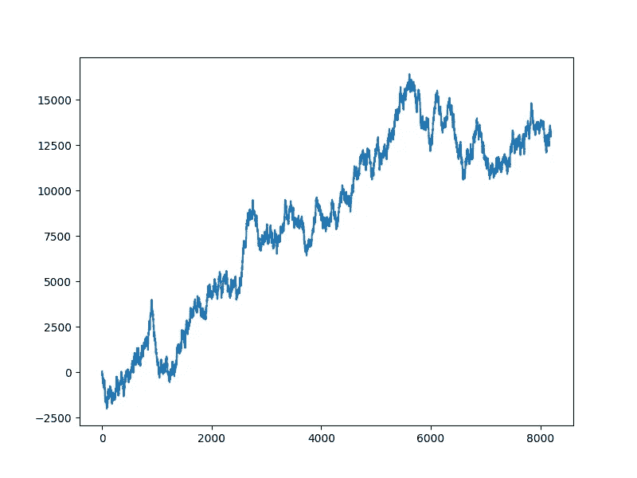
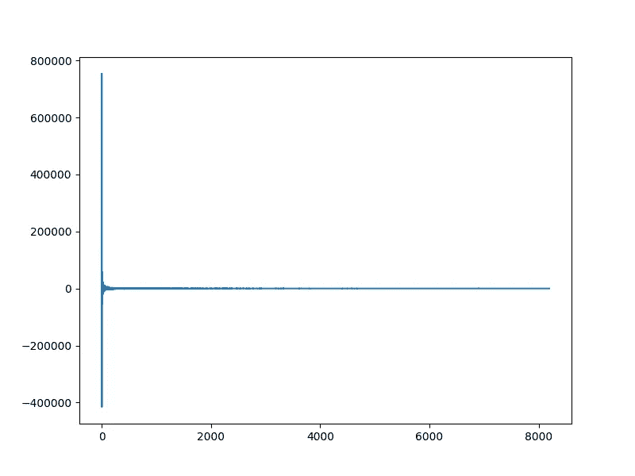
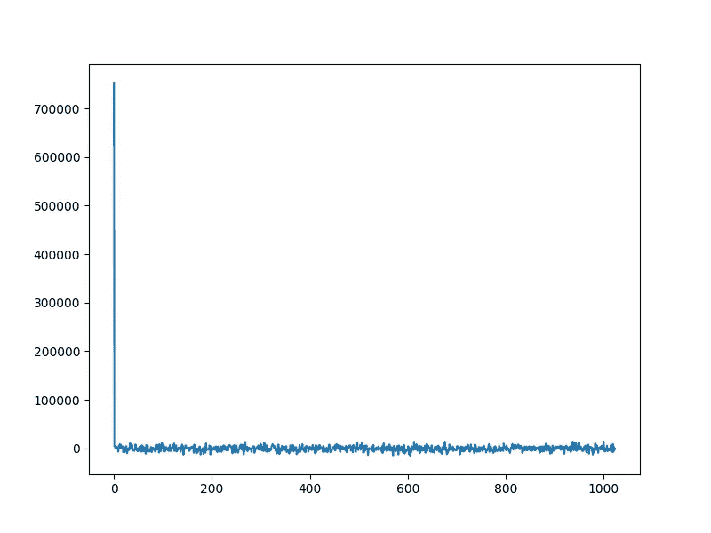
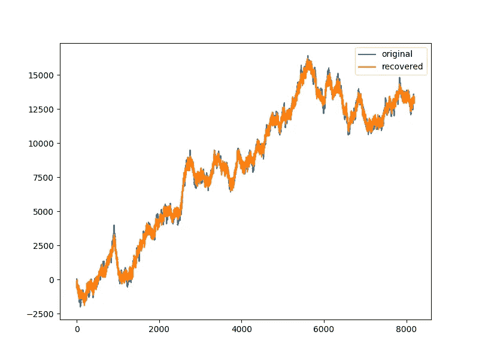

# 用谷歌 JAX 在 Python 中实现线性算子

> 原文：<https://towardsdatascience.com/implementing-linear-operators-in-python-with-google-jax-c56be3a966c2?source=collection_archive---------21----------------------->



作者插图

# 线性算子综述

[线性算子](https://en.wikipedia.org/wiki/Linear_map)或线性映射是从一个向量空间到另一个向量空间的映射，保持向量加法和标量乘法运算。换句话说，如果 **T** 是线性算子，那么 **T(x+y) = T(x) + T(y)** 和 **T (a x) = a T(x)** 其中 x 和 y 是向量，a 是标量。

线性算子在信号处理、图像处理、数据科学和机器学习中有广泛的应用。

在信号处理中，信号通常表示为正弦曲线的线性组合。[离散傅立叶变换](https://en.wikipedia.org/wiki/Discrete_Fourier_transform)是一个线性算子，它将信号分解成其单独的成分频率。[小波变换](https://en.wikipedia.org/wiki/Wavelet_transform)通常用于将信号分解成单个位置尺度的特定小波，从而可以轻松识别和定位信号内部的有趣事件或模式。

在统计学中，线性模型用于将观察值或目标变量描述为特征的线性组合。

我们可以把线性算子看作是从模型空间到数据空间的映射。每个线性算子都有一个[矩阵表示](https://en.wikibooks.org/wiki/Linear_Algebra/Representing_Linear_Maps_with_Matrices)。如果线性算子 **T** 用矩阵 **A** 表示，那么线性算子 **y = T(x)** 的应用可以写成:

```
y = A x
```

其中 **x** 是模型， **y** 是数据。在傅立叶变换中， **A** 的列是单独的正弦波，模型 **x** 描述了每个正弦波对观察信号 **y** 的贡献。通常，我们被给定数据/信号 **y** ，我们的任务是估计模型向量 **x** 。这就是所谓的逆问题。对于标准正交基，反问题是容易的。简单的解决方法是`x = A^H y`。但是，如果模型大小小于数据大小或更大，这就不起作用了。当模型尺寸更小时，我们有一个过度拟合的问题。一个基本的方法是解决最小二乘问题:

```
minimize \| A x - y \|_2^2
```

这导致了一个由[正规方程](http://mlwiki.org/index.php/Normal_Equation)组成的系统:

```
A^T A x = A^T y
```

像 [NumPy](https://numpy.org/) 和 [JAX](https://jax.readthedocs.io/) 这样的库为矩阵代数提供了广泛的支持。然而，从时间和空间复杂性的角度来看，矩阵代数的直接方法对于大型系统是不允许的。对于非常大的矩阵，存储 A 本身可能非常昂贵。计算`A^T A`是一个 O(n)运算。随着 n 的增加，计算它的逆来解正规方程变得不可行。

**线性算子的函数表示**

幸运的是，许多在科学文献中有用的线性算子可以用简单的函数来实现。例如，考虑 R⁸有限大小向量 **x** 的前向差分算子(8 维实向量)。矩阵表示是:

```
A = jnp.array([[-1\.  1\.  0\.  0\.  0\.  0\.  0\.  0.]
 [ 0\. -1\.  1\.  0\.  0\.  0\.  0\.  0.]
 [ 0\.  0\. -1\.  1\.  0\.  0\.  0\.  0.]
 [ 0\.  0\.  0\. -1\.  1\.  0\.  0\.  0.]
 [ 0\.  0\.  0\.  0\. -1\.  1\.  0\.  0.]
 [ 0\.  0\.  0\.  0\.  0\. -1\.  1\.  0.]
 [ 0\.  0\.  0\.  0\.  0\.  0\. -1\.  1.]
 [ 0\.  0\.  0\.  0\.  0\.  0\.  0\.  0.]])
```

然而，矩阵向量乘法计算 [**A @ x**](https://www.python.org/dev/peps/pep-0465/) 可以更有效地写成:

```
import jax.numpy as jnp
def forward_diff(x):
    append = jnp.array([x[-1]])
    return jnp.diff(x, append=append)
```

这将计算从 O(n)降低到 O(n)。

## 正向和伴随算子

一般来说，我们需要为一个线性操作符实现两个操作。从模型空间到数据空间的正向运算符:

```
y = A x
```

以及从数据空间到模型空间的伴随算子:

```
x = A^T y
```

对于复向量空间，伴随算子将是埃尔米特转置:

```
x = A^H y
```

## 现有实施

[SciPy](https://www.scipy.org/) 为实现[**SciPy . sparse . Lina LG**中的线性运算符提供了一个非常好的接口。**线性算子**](https://docs.scipy.org/doc/scipy/reference/reference/generated/scipy.sparse.linalg.LinearOperator.html) 。PyLops 建立在它的基础上，提供了线性操作符的广泛集合。

# CR-Sparse 中基于 JAX 的实现

[JAX](https://jax.readthedocs.io/en/latest/) 是一个新的基于函数式编程范例的高性能数值计算库。它使我们能够用纯 Python 编写高效的数值程序，这些程序可以使用针对 CPU/GPU/TPU 硬件的 [XLA](https://www.tensorflow.org/xla) 进行编译，以获得最先进的性能。

[**CR-Sparse**](https://github.com/carnotresearch/cr-sparse)**是一个基于 JAX 开发的新开源库，旨在为基于稀疏表示的信号处理提供 XLA 加速功能模型和算法。它现在包括了一个建立在 JAX 基础上的线性操作符的集合。文档[在这里](https://cr-sparse.readthedocs.io/en/latest/source/lop.html)。我们用一对函数`times`和`trans`来表示线性算子。`times`函数实现正向运算，而`trans`函数实现伴随运算。**

## **入门指南**

**可以从 [PyPI](https://pypi.org/project/cr-sparse/) 安装 [CR-Sparse](https://github.com/carnotresearch/cr-sparse) :**

```
pip install cr-sparse
```

**对于最新的代码，直接从 GitHub 安装**

```
python -m pip install git+https://github.com/carnotresearch/cr-sparse.git
```

**在下面的交互式代码示例中，以`>`开头的行有代码，没有`>`的行有输出。**

## **一阶导数算子**

**要创建一阶导数运算符(使用向前差分):**

```
> from cr.sparse import lop
> n = 8
> T = lop.first_derivative(n, kind='forward')
```

**可以看到线性算子的矩阵表示:**

```
> print(lop.to_matrix(T))
[[-1\.  1\.  0\.  0\.  0\.  0\.  0\.  0.]
 [ 0\. -1\.  1\.  0\.  0\.  0\.  0\.  0.]
 [ 0\.  0\. -1\.  1\.  0\.  0\.  0\.  0.]
 [ 0\.  0\.  0\. -1\.  1\.  0\.  0\.  0.]
 [ 0\.  0\.  0\.  0\. -1\.  1\.  0\.  0.]
 [ 0\.  0\.  0\.  0\.  0\. -1\.  1\.  0.]
 [ 0\.  0\.  0\.  0\.  0\.  0\. -1\.  1.]
 [ 0\.  0\.  0\.  0\.  0\.  0\.  0\.  0.]]
```

**计算正向操作 T x**

```
> x = jnp.array([1,2,3,4,5,6,7,8])
> y = T.times(x)
> print(y)
[1\. 1\. 1\. 1\. 1\. 1\. 1\. 0.]
```

**计算伴随运算 T^H x**

```
> y = T.trans(x)
> print(y)
[-1\. -1\. -1\. -1\. -1\. -1\. -1\.  7.]
```

## **对角矩阵乘法算子**

**对角矩阵非常稀疏，基于线性算子的实现对它们来说是理想的。让我们建造一个:**

```
> d = jnp.array([1., 2., 3., 4., 4, 3, 2, 1])
> T = lop.diagonal(d)
> print(lop.to_matrix(T))
[[1\. 0\. 0\. 0\. 0\. 0\. 0\. 0.]
 [0\. 2\. 0\. 0\. 0\. 0\. 0\. 0.]
 [0\. 0\. 3\. 0\. 0\. 0\. 0\. 0.]
 [0\. 0\. 0\. 4\. 0\. 0\. 0\. 0.]
 [0\. 0\. 0\. 0\. 4\. 0\. 0\. 0.]
 [0\. 0\. 0\. 0\. 0\. 3\. 0\. 0.]
 [0\. 0\. 0\. 0\. 0\. 0\. 2\. 0.]
 [0\. 0\. 0\. 0\. 0\. 0\. 0\. 1.]]
```

**应用它:**

```
> print(T.times(x))
[ 1\.  4\.  9\. 16\. 20\. 18\. 14\.  8.]
> print(T.trans(x))
[ 1\.  4\.  9\. 16\. 20\. 18\. 14\.  8.]
```

## **在后台**

**所有线性运算符都被构建为命名元组运算符。见其文档[此处](https://cr-sparse.readthedocs.io/en/latest/source/_autosummary/cr.sparse.lop.Operator.html#cr.sparse.lop.Operator)。下面是一个基本的轮廓。**

```
class Operator(NamedTuple):
    times : Callable[[jnp.ndarray], jnp.ndarray]
    """A linear function mapping from A to B """
    trans : Callable[[jnp.ndarray], jnp.ndarray]
    """Corresponding adjoint linear function mapping from B to A"""
    shape : Tuple[int, int]
    """Dimension of the linear operator (m, n)"""
    linear : bool = True
    """Indicates if the operator is linear or not"""
    real: bool = True
    """Indicates if a linear operator is real i.e. has a matrix representation of real numbers"""
```

**对角线线性算子的实现(如上所述)实际上非常简单:**

```
def diagonal(d):
    assert d.ndim == 1
    n = d.shape[0]
    times = lambda x: d * x
    trans = lambda x: _hermitian(d) * x
    return Operator(times=times, trans=trans, shape=(n,n))
```

**其中功能`_hermitian`如下:**

```
def _hermitian(a):
    """Computes the Hermitian transpose of a vector or a matrix
    """
    return jnp.conjugate(a.T)
```

**JAX 的伟大之处在于，当它[实时](https://jax.readthedocs.io/en/latest/jax-101/02-jitting.html)编译 Python 代码时，它可以删除不必要的操作。例如，如果`d`是实向量，那么`_hermitian`是 NOOP，并且可以在编译期间被优化掉。`[cr.sparse.lop](https://cr-sparse.readthedocs.io/en/latest/source/lop.html)`中的所有操作符都是经过精心设计的，因此可以很容易地进行 JIT 编译。我们提供了一个实用函数`[lop.jit](https://cr-sparse.readthedocs.io/en/latest/source/_autosummary/cr.sparse.lop.jit.html#cr.sparse.lop.jit)`来快速包装带有`[jax.jit](https://jax.readthedocs.io/en/latest/jax-101/02-jitting.html)`的线性操作符的时间和传递函数。**

```
T = lop.jit(T) 
```

**在此之后，`T.times`和`T.trans`操作将运行得更快(快一两个数量级)。**

**对于上面的正规方程，类似于`A^H A`的东西可以建模为一个函数:**

```
gram = lambda x : T.trans(T.times(x))
```

**其中假设`T`已经被创建并且在闭包中可用。**

# **带线性算子的预处理共轭梯度**

**一旦我们手头有了线性算子的框架，它可以用来以 JAX 兼容的方式编写像[预处理共轭梯度](https://en.wikipedia.org/wiki/Conjugate_gradient_method)这样的算法(即它们可以被 JIT 编译)。该版本包含在`[cr.sparse.opt.pcg](https://github.com/carnotresearch/cr-sparse/blob/master/src/cr/sparse/_src/opt/pcg.py)`中。**

**CR-Sparse 包含了一个很好的使用线性操作符解决逆问题的算法集合。**

*   **[贪婪稀疏恢复/近似算法](https://cr-sparse.readthedocs.io/en/latest/source/pursuit.html)**
*   **[基于凸优化的稀疏恢复/近似算法](https://cr-sparse.readthedocs.io/en/latest/source/cvx_recovery.html)**

# **压缩感测示例**

**我们考虑一个[压缩感测](https://en.wikipedia.org/wiki/Compressed_sensing)示例，它由[部分 Walsh Hadamard 测量、余弦稀疏化基础和基于 ADMM 的信号恢复](https://cr-sparse.readthedocs.io/en/latest/gallery/rec_l1/partial_wh_sensor_cosine_basis.html)组成。在压缩感知中，数据大小远小于模型大小。因此等式`A x = b`不成立。寻找解决方案需要额外的假设。一个有用的假设是寻找稀疏的`x`(即其大部分条目为零)。**

**这是我们感兴趣的`n=8192`样品的`x`信号。**

****

**非稀疏累积随机游走信号(类似于股票市场)**

**我们将使用[类型 II 离散余弦](https://en.wikipedia.org/wiki/Discrete_cosine_transform#DCT-II)正交基来模拟该信号。请注意，正常的 DCT 不是正交的。**

```
Psi  = lop.jit(lop.cosine_basis([n](https://docs.python.org/3/library/functions.html#int)))
```

**在此基础上来看看信号是否稀疏:**

```
alpha = Psi.trans(x)
```

****

**x 在正交离散余弦基中的表示**

**很明显，离散余弦基中的大多数系数都非常小，可以安全地忽略。**

**接下来，我们引入结构化压缩感知算子，该算子在[沃尔什哈达玛变换](https://en.wikipedia.org/wiki/Fast_Walsh%E2%80%93Hadamard_transform)空间中获取`x`的测量值，但是仅保留少量的`m=1024`随机选择的测量值。输入`x`也可以在测量过程中随机置换。**

```
*from jax import random
key = random.PRNGKey(0)
keys = random.split(key, 10)
# indices of the measurements to be picked*
p = random.permutation(keys[1], n)
picks = jnp.sort(p[:m])
*# Make sure that DC component is always picked up*
picks = picks.at[0].set(0)
*# a random permutation of input*
perm = random.permutation(keys[2], [n](https://docs.python.org/3/library/functions.html#int))
*# Walsh Hadamard Basis operator*
Twh = lop.walsh_hadamard_basis([n](https://docs.python.org/3/library/functions.html#int))
*# Wrap it with picks and perm*
Tpwh = lop.jit(lop.partial_op(Twh, picks, perm))
```

**我们现在可以用操作员`Tpwh`在`x`上进行测量。测量过程也可能添加一些高斯噪声。**

```
*# Perform exact measurement*
b = Tpwh.times(x)
*# Add some noise*
sigma = 0.2
noise = sigma * random.normal(keys[3], ([m](https://docs.python.org/3/library/functions.html#int),))
b = b + noise
```

****

**使用基于 Walsh Hadamard 变换的结构化压缩感知矩阵对 x 进行随机测量。**

**我们现在可以使用包含在 [CR-Sparse](https://github.com/carnotresearch/cr-sparse) 中的 [yall1 解算器](https://cr-sparse.readthedocs.io/en/latest/source/cvx_recovery.html#alternating-directions-methods)从测量值 b 中恢复原始信号 x。**

```
# tolerance for solution convergence
tol = 5e-4
# BPDN parameter
rho = 5e-4
# Run the solver
sol = yall1.solve(Tpwh, b, rho=rho, tolerance=tol, W=Psi)
iterations = int(sol.iterations)
#Number of iterations
print(f'{iterations=}')
# Relative error
rel_error = norm(sol.x-xs)/norm(xs)
print(f'{rel_error=:.4e}')
```

**求解器在 150 次迭代中收敛，相对误差约为 3.4e-2。**

**让我们看看恢复的有多好。**

****

**完整的示例代码请参见[这里的](https://cr-sparse.readthedocs.io/en/latest/gallery/rec_l1/partial_wh_sensor_cosine_basis.html)。**

# **摘要**

**在本文中，我们回顾了线性运算符的概念以及与它们相关的计算优势。我们提出了一个使用 JAX 的线性算子的函数式编程实现。然后，我们研究了这些算子在压缩传感问题中的应用。我们可以看到，使用这种方法可以实现复杂的信号恢复算法，它完全符合 JAX 对 JIT 编译的要求。我们的目标是为 CR-稀疏中的逆问题提供广泛的算子和算法集合。**

## **进一步阅读**

*   **[线性地图](https://en.wikipedia.org/wiki/Linear_map)**
*   **[JAX 文档](https://jax.readthedocs.io/en/latest/)**
*   **[PyLops 文档](https://pylops.readthedocs.io/en/latest/index.html)**
*   **[无痛共轭梯度](https://www.cs.cmu.edu/~quake-papers/painless-conjugate-gradient.pdf)**
*   **[YALL1:你的 L1 算法(原始 MATLAB 包)](http://yall1.blogs.rice.edu/)**
*   **[维基百科:压缩传感](https://en.wikipedia.org/wiki/Compressed_sensing)**
*   **[稀疏恢复算法综述](https://ieeexplore.ieee.org/document/8577023)**
*   **[稀疏信号模型注释](https://sparse-plex.readthedocs.io/en/latest/book/sparse_signal_models.html)**
*   **[压缩传感注释](https://sparse-plex.readthedocs.io/en/latest/book/compressive_sensing.html)**