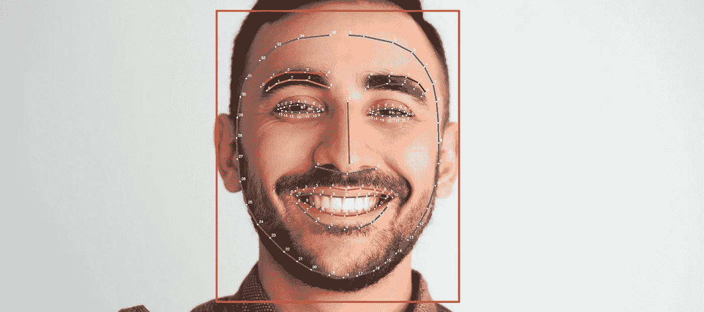
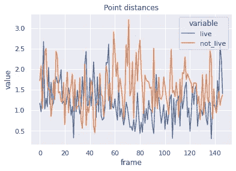
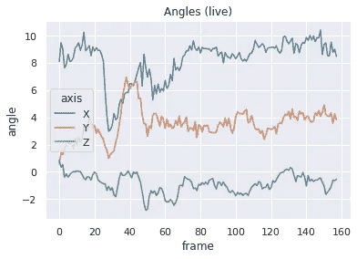
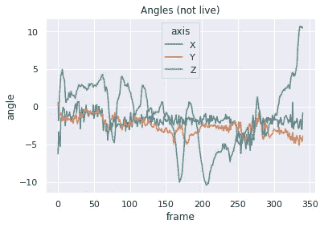
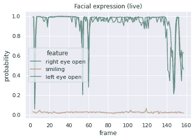
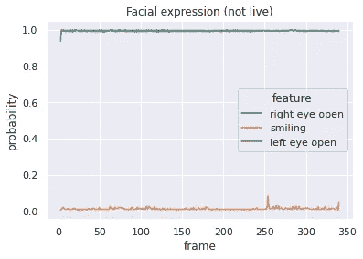

# 用 Google ML 工具包实现活性检测

> 原文：<https://towardsdatascience.com/implementing-liveness-detection-with-google-ml-kit-5e8c9f6dba45?source=collection_archive---------8----------------------->

[谷歌 ML 工具包](https://developers.google.com/ml-kit/vision/face-detection) ( [CC BY 4.0](https://creativecommons.org/licenses/by/4.0/) )

[活体检测](https://arxiv.org/pdf/1405.2227.pdf)是在给定一组照片的情况下，区分一个活生生的人和一个人的静态图像的能力。当您想要使用面部生物识别进行身份验证时，这是一项重要的功能，可以防止攻击者用用户的照片欺骗系统。

一些供应商提供了作为商业软件的活性检测的良好实现。然而，根据应用和使用量的不同，它们的成本会很快变得令人望而却步。出于好奇和好玩，我想知道用免费提供的组件构建自己的解决方案有多难。

解决这个问题有几种方法。我选择的方法包括以下几个主要步骤:

1.  检测人脸及其标志(参考点，如眼角、鼻子、嘴巴等。)在一个图像中
2.  对一系列图像(帧)执行此操作，并使用帧之间的差异来确定它们是真人还是照片

第一部分是个难题，有[几十年的研究](https://arxiv.org/pdf/1805.05563.pdf)。目前的技术水平涉及训练深度神经网络，这需要大型数据集和计算能力，所以我去寻找一个免费的实现。我能找到的最好的是谷歌的 [ML Kit Face Detection](https://developers.google.com/ml-kit/vision/face-detection) ，它是免费使用的，可用于 Android 和 iOS 移动设备(“免费使用”部分有点棘手——见帖子末尾的注释)。我开始着手研究是否有可能基于它构建一个活性检测系统。

# 实验设置

第一步是运行 [ML Kit 的示例应用程序](https://github.com/googlesamples/mlkit/tree/master/android/vision-quickstart)，添加一些日志来从 API 的输出中捕获以下信息:

*   包围盒
*   轮廓点
*   欧拉角
*   微笑、左眼和右眼睁开的概率

我只进行了两项测试:一项是让我的真实面孔出现在摄像机前，另一项是让摄像机对准我在笔记本电脑屏幕上的照片。我将这两个实验称为“活的”和“不活的”。

在这次探索中，我只是将日志保存到文本文件中，并做了一些 grep/sed 转换，将我想要的数据转换成 CSV 和 JSON 文件。然后，我将它们加载到一个笔记本中，并添加了一些 Python 数据折磨技巧。

# 第一次尝试:轮廓点差异

我的第一个想法是查看不同帧中相同轮廓点之间的坐标差异。假设是，由于自然的运动，活动人脸中的点会比静态人脸中的点有更多的变化。

我首先使用欧拉 Z 角围绕边界框的中心点旋转所有点，然后在边界框边界内对它们进行归一化，以产生范围为[0，1]的浮点数。然后，我计算了一帧中同一点与其后续点之间的欧几里德距离(每帧正好有 133 个点，这些点似乎对应于一张脸的特定位置，并且总是以相同的顺序排列，所以可以直接比较它们)，并逐帧求和。

结果如下:

连续帧中各点之间的距离总和

【悲伤长号】。看起来我的假设是不正确的，而且没有办法从这些信息中区分活体和非活体样本。也许算法是故意这样工作的，试图保持面部标志不变，尽管有运动。这让我想知道:一个人可以简单地通过索引和比较人脸上的这些点来实现面部识别吗？🤔

# 第二次尝试:欧拉角变化

接下来，我查看了库生成的欧拉角。有三个角度，对应于 3D 空间中的三个旋转轴:

*   x 表示向上或向下看的脸
*   y 表示向左或向右看的脸
*   z 表示平行于图像平面的面部旋转，例如[摇头晃脑](https://en.wikipedia.org/wiki/Head_bobble)

简单地绘制每一帧的角度就可以得到实时实验的结果:

现场实验中每一帧的欧拉角

这些是针对非实时情况的:

非实时实验中每帧的欧拉角

现在我们有进展了！在非实时情况下，Z 角度的变化似乎比其他角度大得多，这具有直观的意义:静态照片不能向上/向下或向左/向右看，但图片的角度可以改变。这可以通过查看标准偏差来确认:

*   z 角度标准偏差(活): **0.680392**
*   z 角度标准偏差(非现场): **4.112100**

X 和 Y 角度在现场情况下有更高的变化，但不是如此明显的差异(X 1.54 和 Y 1.10 现场，X 1.07 和 Y 1.06 非现场)。

因此，也许我们已经可以用 Z 角度标准差的简单阈值，或者 Z 与 X 或 Y 角度的 stddev 之比来检测活性。尽管如此，我不相信这是非常可靠的，所以我又尝试了一件事。

# 第三次尝试:睁眼和微笑的概率

ML Kit 可以检测一个人的眼睛是睁开还是闭上(独立于每个人)以及他们是否在微笑。这通过这些属性中的每一个的概率来表示。

为现场案件策划他们，我得到了这个:

真实案例中睁眼和微笑的概率

对于非实时情况:

非活体情况下睁眼和微笑的概率

头奖！微笑概率变化不大(看起来我的扑克脸不错😎)，但对于非直播来说，眼睛睁开实际上是一条平坦的线，而对于直播来说则是过山车。

观察标准差可以证实这一点:

*   直播:左眼 **0.158587** ，右眼 **0.154239** 微笑 0.006452
*   不直播:左眼 **0.022749** ，右眼 **0.003405** ，微笑 0.022245

这很有意义，因为眨眼是用于活性检测的最常见标记之一。一些系统甚至明确要求用户眨眼，但在这种情况下似乎没有必要——我没有有意识地试图眨眼，即使我没有眨眼，算法分配给我的眼睛睁开的概率也有明显的波动。

# 结论

看起来用 ML 工具包实现活性检测是可行的！我发现至少有两组变量提供了有意义的区分:旋转角度和睁眼概率，可能还有其他我没有发现的变量。当然，这只是一个初步的探索，每个案例都有一个单独的例子。为了确定可行性，我们需要至少几十个不同的人在不同的照明条件和硬件下的例子。有了这些例子，训练一个分类模型应该是相对简单的——像对标准差特征进行逻辑回归这样简单的事情看起来是可行的。

当然，为了保护有价值的资源，一个真正的活性检测系统需要对几种类型的利用策略进行严格的测试。我可能还会寻找额外的检查，比如基于纹理的算法。

如果你最终实现了这样的东西，我希望你能在评论中分享你的成果！

# 关于 ML Kit 许可证(或缺少许可证)的说明

ML 工具包显然是由谷歌提供的“免费使用”，但它不是开源的，我找不到实际的许可证——最接近的是这些术语。没有关于支持或责任的保证。而且，作为谷歌的产品，它被弃用的概率接近 100%[——尤其是像这样的免费小众产品。](https://gcemetery.co/)

尽管如此，由于这是一个可下载的库，所有处理都是离线进行的——而不是依赖于谷歌基础设施的在线服务——即使他们停止更新，你也有可能继续使用一段时间。

您可以在本笔记本中查看用于生成该分析的代码。