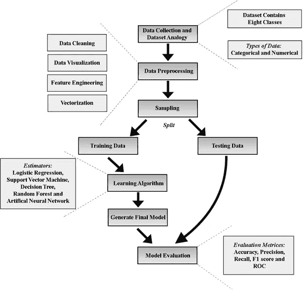
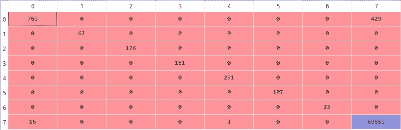

# 实现机器学习算法来检测物联网流量中的攻击

> 原文：<https://towardsdatascience.com/implementing-machine-learning-algorithm-to-detect-attacks-in-iot-traffic-df61b679e16b?source=collection_archive---------31----------------------->

## 本文阐述了通过使用随机森林分类器算法来检测物联网流量中发现的攻击和异常。

# 介绍

物联网基础设施中的攻击和异常检测是物联网领域日益关注的问题。由于物联网基础设施的使用越来越多，对这些基础设施的攻击也呈指数级增长。因此，有必要开发一个智能、安全的物联网环境，能够检测其漏洞。这里，提出了一种基于机器学习的解决方案，可以检测攻击类型并保护物联网系统。


[Bermix 工作室](https://unsplash.com/@bermixstudio?utm_source=medium&utm_medium=referral)在 [Unsplash](https://unsplash.com?utm_source=medium&utm_medium=referral) 拍摄的照片

# 解决方案的设计和工作流程

该解决方案的整个工作流程将在下面以图示的形式介绍。



物联网攻击检测解决方案的工作流程。作者图片

## 工作流程中涉及的步骤如下:

*   ***数据集收集和描述:*** *使用* **分布式智能空间协调系统** ( **DS2OS** )创建虚拟物联网环境，该系统具有一组基于物联网的**服务**，如温度控制器、窗户控制器、灯光控制器等。**用户**和服务之间的通信被捕获并存储在 **CSV** 文件格式中。在数据集中，有 357，952 个样本和 13 个特征。该数据集包含 347，935 个**正常**数据和 10，017 个**异常**数据，并包含八个已分类的类。这 8 类攻击是拒绝服务(DoS)、数据类型探测、恶意控制、恶意操作、扫描、刺探、错误设置、正常。该数据集可以免费使用，并且可以在**Kaggle**webiste[https://www.kaggle.com/francoisxa/ds2ostraffictraces](https://www.kaggle.com/francoisxa/ds2ostraffictraces)上找到。“**mainsimulationaccesstraces . CSV**”文件包含使用 pandas 库读取的数据集

```
import pandas as pd  #Pandas library for reading csv file
import numpy as np   #Numpy library for converting data into arrayDataset=pd.read_csv('mainSimulationAccessTraces.csv')
x=Dataset.iloc[:,:-2].values
y=Dataset.iloc[:,12].values
```

*   **数据预处理**:数据预处理的第一步是处理数据集中的**缺失值**。在数据集中，我们可以看到“**访问的节点类型**”列和“**值**”列包含由于数据传输过程中出现异常而导致的缺失数据。因为“访问的节点类型”列是分类类型，所以我将使用一个常数值来填充它。“值”列是数字类型的，因此我使用均值策略来填充缺失的值。下一步是**特性选择**，它包括删除对数据没有任何意义的**时间戳**特性。下一步涉及使用标签编码将名义分类数据转换成向量。

```
from sklearn.impute import SimpleImputer
imputer=SimpleImputer(missing_values=np.nan,strategy='constant',verbose=0)
imputer=imputer.fit(x[:,[8]])
x[:,[8]]=imputer.transform(x[:,[8]])imputer1=SimpleImputer(missing_values=np.nan,strategy='mean',verbose=0)
imputer1=imputer1.fit(x[:,[10]])
x[:,[10]]=imputer1.transform(x[:,[10]])from sklearn.preprocessing import LabelEncoder
labelencoder_X = LabelEncoder()
for i in range(0,10):
    x[:,i] = labelencoder_X.fit_transform(x[:,i])
x=np.array(x,dtype=np.float)y=labelencoder_X.fit_transform(y)
```

*   **采样**:这个阶段包括将数据集分成训练和测试数据集。我已经分配了 80%的数据集用于训练，剩下的 20%用于测试。

```
from sklearn.model_selection import train_test_split
x_train,x_test,y_train,y_test=train_test_split(x,y,test_size=0.2,random_state=0)
```

*   **归一化**:使用**标准定标器**库对训练和测试数据集进行归一化，使所有特征值在相似范围内。

```
from sklearn.preprocessing import StandardScaler
sc = StandardScaler()
x_train = sc.fit_transform(x_train)
x_test = sc.transform(x_test)
```

*   **建立 ML 模型**:将**训练**数据集传递给**随机森林**分类器算法进行训练，生成模型/预测器。我已经用 **sklearn** 库完成了这一步。我用了 10 棵树做模型。训练后，**测试**数据集被传递给**预测器/模型**，它将判断数据是否受到攻击。


凯文·Ku 在 [Unsplash](https://unsplash.com?utm_source=medium&utm_medium=referral) 上的照片

```
from sklearn.ensemble import RandomForestClassifier
classifier=RandomForestClassifier(n_estimators=10,criterion='entropy',random_state=0)
classifier.fit(x_train,y_train)y_pred = classifier.predict(x_test)
```

*   **模型评估**:最后一步是确定我们模型的准确性，我们已经使用混淆矩阵和准确性参数来确定性能。

> 使用随机森林算法，我得到了 99.37%的准确率。我还在下面附上了**混淆矩阵**的快照

```
from sklearn.metrics import confusion_matrix
from sklearn.metrics import accuracy_score 
cm = confusion_matrix(y_test, y_pred)
accuracy=accuracy_score(y_test, y_pred)
```



混淆矩阵

# 结论

随机森林算法能够在虚拟物联网环境数据集上提供 99.37%的准确率。还可以在此基础上执行交叉折叠验证，以避免模型过度拟合。要了解有关用于生成数据的物联网环境的更多信息，请参考以下 URL[https://www . research gate . net/publication/330511957 _ Machine _ Learning-Based _ Adaptive _ Anomaly _ Detection _ in _ Smart _ Spaces](https://www.researchgate.net/publication/330511957_Machine_Learning-Based_Adaptive_Anomaly_Detection_in_Smart_Spaces)