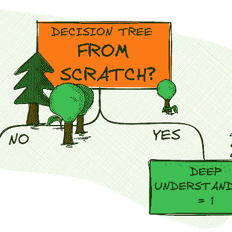

# 从头开始实现朴素贝叶斯

> 原文：<https://towardsdatascience.com/implementing-naive-bayes-from-scratch-df5572e042ac?source=collection_archive---------4----------------------->

## 从头做起

## 只用 Python 和 NumPy 编写内部工作代码

照片由[迈克·辛德尔](https://unsplash.com/@mikehindle?utm_source=medium&utm_medium=referral)在 [Unsplash](https://unsplash.com?utm_source=medium&utm_medium=referral) 上拍摄

我不喜欢“黑盒”。我个人有一种强烈的欲望想知道事情是如何运作的。我想摸摸它。我想修补一下。我想自己编码，即使已经存在一个即插即用的解决方案。这正是我们在这篇文章中要做的。

在接下来的部分中，我们将使用 Python 和 NumPy 一步一步地从头开始实现朴素贝叶斯分类器。

但是，在我们开始编码之前，让我们简单地谈谈朴素贝叶斯分类器的理论背景和假设。

# 朴素贝叶斯快速理论

朴素贝叶斯分类器的基本原理是*贝叶斯定理*——因此得名。在我们的例子中，我们可以将贝叶斯定理表述如下:

我们的总体目标是用给定的数据预测一个类的条件概率。这个概率也可以称为*后验置信*。那么我们如何计算后验概率呢？

首先，我们需要确定数据属于某一类分布`P(Data|Class)`的*可能性*。然后我们需要将它乘以之前的`P(Class)`*。为了计算先验，我们需要计算特定类的样本数*(行)*，然后除以数据集中的样本总数。*

> 注意:为了简化计算，我们可以省略分母，因为`P(Data)`可以被视为一个归一化常数。然而，我们将不再收到从零到一的概率分数。

你可能会问，朴素贝叶斯有什么天真的？

朴素贝叶斯的一个重要假设是特征的独立性。这意味着，一个事件的发生不会影响另一个事件的发生。因此，这些特性之间的所有交互和关联都将被忽略。由于这个简化的前提，我们现在能够在计算具有多个特征的某个类的概率时应用*乘法规则*。

这基本上是我们从零开始实现朴素贝叶斯分类器所需要知道的全部。

</deriving-bayes-theorem-the-easy-way-59f0c73496db>  </understanding-probability-models-and-axioms-c0f498972b80>  

# 概述

现在，我们简要地讨论了理论背景，我们可以考虑我们需要实施的不同步骤。这为我们提供了一个高层次的概述，我们可以将其用作某种蓝图。

1.  *拟合*:计算(训练)数据集中每个类的汇总统计和先验
2.  *预测*:计算(测试)数据集中每个样本的每个类的概率。因此，获得给定类别(高斯)分布的数据的概率，并将其与先验结合。

在下面，我们将只实现一个类。下面可以看到*的骨架代码*，我们将在下一节逐步完成。

# 从头开始实施

## 拟合数据

如概述中所述，我们需要计算每个类*(和特性)*以及先验的汇总统计数据。

首先，我们需要收集数据集的一些基本信息，并创建三个零矩阵来存储每个类的均值、方差和先验。

接下来，我们迭代所有的类，计算统计数据并相应地更新我们的零矩阵。

例如，假设我们的数据集中有两个唯一的类(0，1)和两个要素。因此，存储平均值的矩阵将具有两行和两列(2x2)。每个类一行，每个功能一列。

先验只是一个向量(1x2)，包含单个类别的样本除以总样本量的比率。

汇总统计数据示例[图片由作者提供]

## 做一个预测

现在，稍微复杂一点的部分…

为了进行预测，我们需要获得数据属于某一类的概率，或者更具体地说，来自同一分布的概率。

为了方便起见，我们假设数据的基本分布是高斯分布。我们创建一个类方法，它返回新样本的概率。

高斯函数。μ =均值；σ =方差；σ =标准偏差。

我们的方法接收单个样本并计算概率。然而，从参数中我们可以看出，我们还需要提供平均值和方差。

因此，我们创建另一个类方法。该方法遍历所有类，收集汇总统计数据、先验信息，并为单个样本计算新的后验置信。

> 请注意，我们应用了对数变换，以便通过增加概率来简化计算。我们还返回具有最高后验置信度的类索引。

最后，我们可以用 predict 方法把它们联系起来。

# 测试我们的分类器

现在我们已经完成了朴素贝叶斯分类器，只剩下一件事要做了——我们需要测试它。

我们将使用虹膜数据集，它由 150 个样本组成，具有 4 个不同的特征*(萼片长度、萼片宽度、花瓣长度、花瓣宽度)*。我们的目标是在 3 种不同类型的虹膜中预测正确的类别。

通过绘制前两个特征对虹膜数据集进行概述[图片由作者提供]

通过运行上面的代码，我们加载并准备虹膜数据集，并训练我们的分类器。在对测试数据进行预测时，我们达到了大约 96.6%的准确率。

下面的混淆矩阵告诉我们，我们的分类器犯了一个错误，错误地将一类分类为二类。

混淆矩阵(预测数量)[图片由作者提供]

# 结论

在本文中，我们仅使用 Python 和 NumPy 从头实现了一个朴素贝叶斯分类器。我们了解了理论背景，并有机会以实际方式应用贝叶斯定理。

如果你不喜欢“黑盒”并且想要完全理解一个算法，从头开始实现它是获得关于内部工作的亲密和深入知识的最好方法之一。

你可以在我的 GitHub 上的这里找到完整的代码。

[马文·兰亨克](https://medium.com/@marvinlanhenke?source=post_page-----df5572e042ac--------------------------------)

## 从零开始的 ML 算法

[View list](https://medium.com/@marvinlanhenke/list/ml-algorithms-from-scratch-7621d01922ad?source=post_page-----df5572e042ac--------------------------------)6 stories

> 感谢您的阅读！确保保持联系&在 [Medium](https://medium.com/@marvinlanhenke) 、 [Kaggle](https://www.kaggle.com/mlanhenke) 上关注我，或者在 [LinkedIn](https://www.linkedin.com/in/marvin-lanhenke-11b902211/) 上说声“嗨”

*喜欢这篇文章吗？成为* [*中级会员*](https://medium.com/@marvinlanhenke/membership) *继续无限学习。如果你使用下面的链接，我会收到你的一部分会员费，不需要你额外付费。*

<https://medium.com/@marvinlanhenke/membership> 