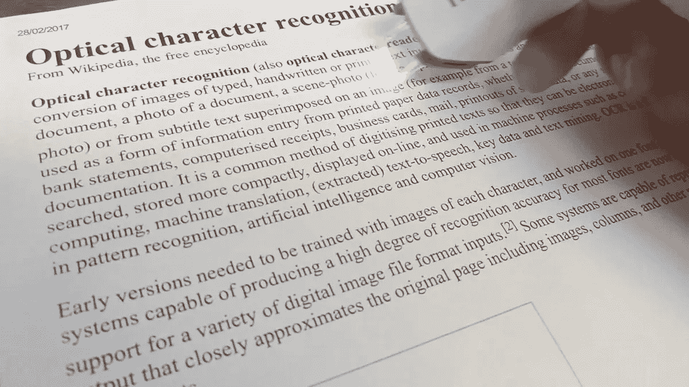
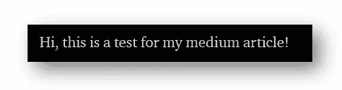
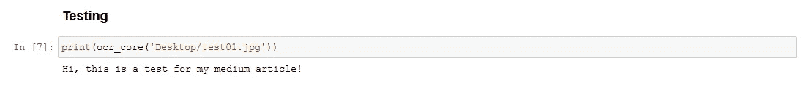
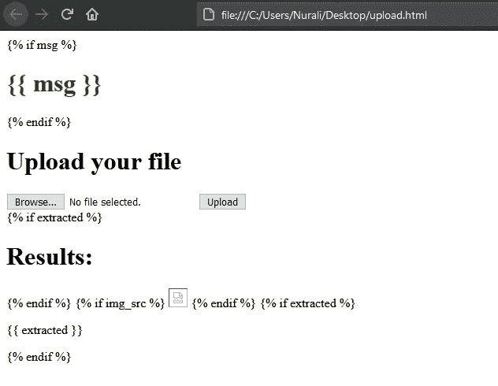
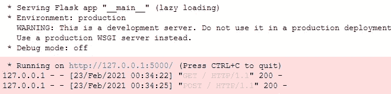
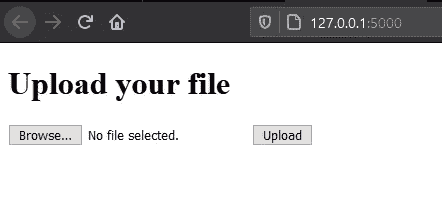
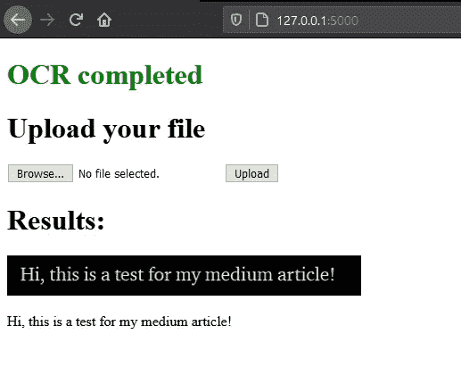
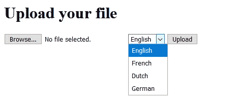

# 使用 pytesseract 实现光学字符识别(OCR)

> 原文：<https://towardsdatascience.com/implementing-optical-character-recognition-ocr-using-pytesseract-5f42cf62ddcc?source=collection_archive---------8----------------------->

## 我们如何将图像转换成机器编码的文本？



来源:[维基百科](https://en.wikipedia.org/wiki/Optical_character_recognition)

各位 python 爱好者，我想和你们分享一个简单但非常有效的 OCR 服务，它使用 pytesseract，并通过 Flask 提供 web 界面。

光学字符识别(OCR)可用于多种用途，例如用于支付目的的信用卡扫描，或将文档的`.jpeg`扫描转换为`.pdf`

没有出卖使用 OCR 的想法，或者如何使用它，让我们开始编码过程！

# 先决条件

我们将使用 pytesseract(用于 OCR)和 Flask(用于 web 界面)

```
pip install pytesseractfrom PIL import Image
import pytesseract
```

> 注意:如果你在导入宇宙魔方时遇到一些问题，你可能需要下载并安装 pytesseract.exe，可以在这里找到。
> 
> 安装后，您必须包含 pytesseract 可执行文件的路径，这可以通过一行代码完成:

```
pytesseract.pytesseract.tesseract_cmd = r'YOUR-PATH-TO-TESSERACT\tesseract.exe'
```

# 核心 OCR 功能

因为我们已经安装并导入了 pytesseract，所以让我们创建核心函数并检查它是否按预期工作:

```
def ocr_core(filename):
    text = pytesseract.image_to_string(Image.open(filename))
    return text
```

很简单，对吧？ **ocr_core** 函数获取图像文件的路径并返回其文本组件。根据[文档](https://pypi.org/project/pytesseract/)，`image_to_string` 函数使用英语作为默认识别语言，具体语言我们稍后再说。



此图片与 ocr_core 函数*【作者图片】*一起使用

结果如下:



ocr_core 函数将我们的图像作为字符串返回，耶！*【作者图片】*

一旦我们确定一切正常，就该为我们的 OCR 服务创建一个 web 界面了

# 使用 Flask 的 Web 界面

现在我们要创建一个简单的 html 表单，允许用户上传一个图像文件，并从中检索文本。

```
from flask import Flask, render_template, requestapp = Flask(__name__)# from ocr_core import ocr_core
# uncomment the line above, if your Flask fails to get access to your function, or your OCR & Flask are on different scripts
```

保持简单，让我们为上传的文件创建一些后端测试，例如允许的扩展名:

```
ALLOWED_EXTENSIONS = ['png', 'jpg', 'jpeg']def allowed_file(filename):
    return '.' in filename and \
           filename.rsplit('.', 1)[1].lower() in ALLOWED_EXTENSIONS
```

保持它的美丽和简单，就像[《Python 的禅》](https://zen-of-python.info/)建议的那样，对吗？

现在，让我们创建一个保存用户上传图像的路径:

```
import ospath = os.getcwd()UPLOAD_FOLDER = os.path.join(path, 'uploads\\')if not os.path.isdir(UPLOAD_FOLDER):
    os.mkdir(UPLOAD_FOLDER)app.config['UPLOAD_FOLDER'] = UPLOAD_FOLDER
```

如果您想知道我们为什么要导入`os` **:** 我们将需要它来获取上传图像的路径(用于后端)，并且在用户成功上传文件后为我们的``标记创建一个源。如果你想特别指定一个文件夹，只需将`os.getcwd()`更改为你想使用的任何路径。

如果你从未创建过“上传”文件夹，上面的代码也会为你创建(用爱)。

# 基于 HTML 表单的 web 界面

现在，让我们构建一个简单的表单，并将文件命名为`upload.html`

```
<!DOCTYPE html>
<html>
<head>
 <title>OCR</title>
</head>
<body>
 
 <h1 style="color: green"> {{ msg }} </h1>
 <h1> Upload your file </h1><form method=post enctype=multipart/form-data> 
  <input type="file" name=file>
  <input type="submit" name=Upload value="Upload">
 </form>
 <h1> Results: </h1>
 
 
 
 <p> {{ extracted }} </p>
 </body>
</html>
```

等等，为什么有大括号？嗯，不是完全 HTML 形式，我撒了个谎。实际上，这是 [jinja 格式化](https://jinja.palletsprojects.com/en/2.11.x/templates/)，它允许我们相应地格式化我们的 HTML。这里没什么特别的，``代表 if 语句，所以如果有什么消息，就会被包裹在`<h1>`标签里，等等。

这个表单非常简单，但是不要忘记`enctype=multipart/form-data`允许表单接受文件上传。

一旦后端进入操作，花括号内的所有变量就会出现，所以在上传任何东西之前，您的`upload.html`应该是这样的:



你的`upload.html should look like this.` *【图片由作者提供】*

> 重要提示:不要忘记将你的“upload.html”文件保存到与你的主 python 脚本相同的路径，不管你是在中心还是本地计算机上工作。如果你不知道你的工作目录在哪里，参考上面的`os.getcwd()`。

# 最终确定 OCR web 服务

一旦我们完成了以上所有的准备工作，就该通过 Flask 创建一个 web 界面了:

```
[@app](http://twitter.com/app).route('/', methods = ['GET', 'POST'])def upload_page():
    if request.method == 'POST':
        if 'file' not in request.files:
            return render_template('upload.html', msg = 'No file selected')
        file = request.files['file']if file.filename == '':
            return render_template('upload.html', msg = 'No file')if file and allowed_file(file.filename):
            file.save(os.path.join(app.config['UPLOAD_FOLDER'], file.filename))
            extracted = ocr_core(file)
            return render_template('upload.html', 
                                    msg = 'OCR completed',
                                    extracted = extracted, 
                                    img_src = UPLOAD_FOLDER + file.filename)
    else:
        return render_template('upload.html')
if __name__ == '__main__':
    app.run()
```

首先，我们检查请求方法是否为`POST`，主要是为了安全措施。然后，我们必须检查文件是否被选择和上传(换句话说，文件是否到达后端)。一旦入门级测试完成，我们检查`file`是否存在，以及它的格式是否被允许。

一旦满足所有这些条件，我们将上传的文件保存到上传文件夹，并将其赋给一个名为`extracted`的变量

运行代码后，您应该会看到应用程序运行的地址:



应用程序运行的地址。*【作者图片】*

所以在上传之前，你的界面应该是这样的:



上传前的 App。*【作者图片】*

一旦您选择了您的文件，它应该会有如下的细微变化:



上传图片后的 App。*【作者图片】*

瞧啊。您刚刚创建了一个 OCR web 服务！

# 最后的想法

正如承诺的那样，我们已经创建了一个简单但非常有效的 OCR web 服务，它允许从图像中识别文本。但是有很多方法可以改善它。例如，您可以添加选项来选择 OCR 应该使用哪种语言。后端和前端都是这样:

```
def ocr_core(filename):
     text = pytesseract.image_to_string(Image.open(filename), lang=selected_language)
    return text
```

你所要做的就是在`ocr_core`函数中指定`lang`属性。并在您的`upload.html`文件中添加一个`<select>`标签。只是不要忘记从前端获取数据，并将其传递给你的`ocr_core`函数



未来的改进。*【图片作者】*

希望这篇文章证明对你有用，并使一些事情变得更清楚。感谢您的时间，如果您有任何反馈或任何问题，请随时在下面留下评论。

再见。