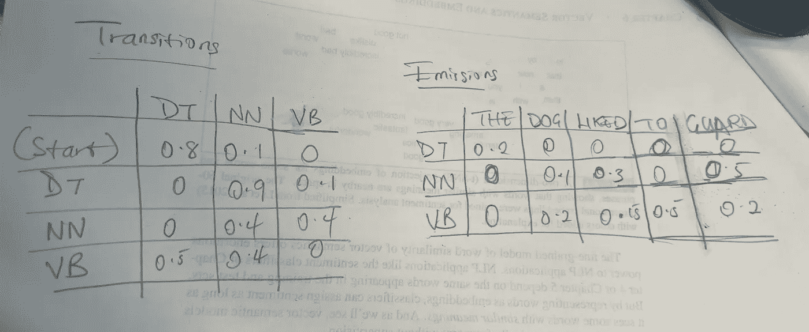
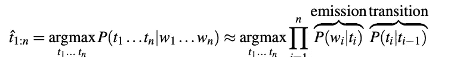

# 从零开始用 Viterbi 算法实现英语单词的词性标注

> 原文：<https://towardsdatascience.com/implementing-part-of-speech-tagging-for-english-words-using-viterbi-algorithm-from-scratch-9ded56b29133?source=collection_archive---------11----------------------->

## 词类是句子结构和意义的有用线索。以下是我们识别它们的方法。

本文的完整代码可以在[这里](https://github.com/cleopatra27/pos_tagging_viterbi)找到

词性标注是为文本中的每个单词分配词性的过程，这是一项消除歧义的任务，单词可能有多个词性，我们的目标是找到适合这种情况的正确标签。

我们将使用一个经典的序列标记算法， [**隐马尔可夫模型**](https://en.wikipedia.org/wiki/Hidden_Markov_model) 来演示，序列标记是一个任务，其中我们给输入单词序列中的每个单词 x1 分配一个标签 y1，因此输出序列 Y 与输入序列 x 具有相同的长度。HMM 是一个基于扩充[马尔可夫链](https://en.wikipedia.org/wiki/Markov_chain)的概率序列模型。马尔可夫链做了一个很强的假设，如果我们想预测序列中的未来，唯一重要的是当前状态。例如，预测我下周写一篇文章的概率取决于我本周写一篇文章，仅此而已。你可以观看视频[这里](https://www.youtube.com/watch?v=fX5bYmnHqqE&t=15s)更多的例子，我会说一个更详细的解释。

隐马尔可夫模型允许我们谈论观察到的事件——我们在 put 中看到的单词和隐藏事件——我们认为是概率模型中偶然因素的部分语音标签。

我们将使用 [Brown Corpus](https://en.wikipedia.org/wiki/Brown_Corpus) 来实现我们的 tagger，其中每个文件包含标记化单词的句子，后跟 POS 标签，每行包含一个句子。您可以在这里找到描述标签[的数据手册。注意，我们将使用二元模型 HMM 实现我们的 POS 标记器。](http://korpus.uib.no/icame/manuals/BROWN/INDEX.HTM)

我们可以在下面看到我们的数据样本:

```
[('RB', 'manifestly'), ('VB', 'admit')]
```

首先，让我们创建一个生成 n 元文法的函数。

```
def ngrams(self, text, n):
    n_grams = []
    for i in range(len(text)): n_grams.append(tuple(text[i: i + n]))
    return n_grams
```

## 转移概率


作者图片

一个 HMM 有两个组成部分，即 ***跃迁概率*** *A* 和 ***发射概率*** *B* 。



作者图片

转移概率是给定前一个标签时标签出现的概率，例如，动词 ***将*** 最有可能后跟另一种形式的动词，如 ***舞*** ，因此它将具有高概率。我们可以使用上面的等式来计算这个概率，实现如下:

这里，我们将二元模型的计数除以我们创建的每个二元模型的一元模型计数，并将其存储在 *transition_probabilities* 字典中。

## 排放概率


作者图片

发射概率是给定标签，它将与给定单词相关联的概率。我们可以使用上面的等式来计算这个概率，实现如下:

在这里，我们将该单词后面的标签的计数除以同一标签的计数，并将其存储在 *emission_probabilities* 字典中。

HMM taggers 做了两个进一步简化的假设。第一个假设是，一个单词出现的概率只取决于它自己的标签，而与相邻的单词和标签无关；第二个假设，二元模型假设，是一个标签的概率只取决于前一个标签，而不是整个标签序列。将这两个假设代入我们的 bigram 标记器，得到最可能的标记序列的以下等式:



作者图片

## 解码 HMM

对于任何模型，例如包含隐藏变量(词性)的 HMM，确定对应于观察序列的隐藏变量序列的任务称为解码，这是使用 [***维特比算法***](https://en.wikipedia.org/wiki/Viterbi_algorithm) ***完成的。***

## ***维特比算法***

**维特比算法**是一种[动态规划](https://en.wikipedia.org/wiki/Dynamic_programming) [算法](https://en.wikipedia.org/wiki/Algorithm)，用于获得最有[可能的](https://en.wikipedia.org/wiki/Likelihood_function)隐藏状态序列的[最大后验概率估计](https://en.wikipedia.org/wiki/Maximum_a_posteriori_estimation)—称为**维特比路径**——其产生一系列观察到的事件，特别是在[马尔可夫信息源](https://en.wikipedia.org/wiki/Markov_information_source)和[隐藏马尔可夫模型](https://en.wikipedia.org/wiki/Hidden_Markov_model) (HMM)的环境中。此外，一个很好的解释视频可以找到[这里](https://www.youtube.com/watch?v=IqXdjdOgXPM&t=498s)

维特比解码有效地从指数多的可能性中确定最可能的路径。它通过查看我们的传输和发射概率，将这些概率相乘，然后找到最大概率，从而找到一个单词相对于所有标签的最高概率。我们将为未知概率定义一个默认值***0.000000000001***。

我们将从计算初始概率/该状态的开始概率开始，这是单词开始句子的概率，在我们的例子中，我们使用了“开始”标记

```
def initial_probabilities(self, tag):
    return self.transition_probabilities["START", tag]
```

## **测试**

为了测试我们的解决方案，我们将使用一个已经分解成单词的句子，如下所示:

```
test_sent = ["We",
            "have",
            "learned",
            "much",
            "about",
            "interstellar",
            "drives",
            "since",
            "a",
            "hundred",
            "years",
            "ago",
            "that",
            "is",
            "all",
            "I",
            "can",
            "tell",
            "you",
            "about",
            "them",
            ]cleaned_test_sent = [self.clean(w) for w in test_sent]
print(self.vertibi(cleaned_test_sent, all_tags))
```

我们的结果一:

```
we,PPSS
have,HV-HL
learned,VBN
much,AP-TL
about,RB
interstellar,JJ-HL
drives,NNS
since,IN
a,AT
hundred,CD
years,NNS
ago,RB
that,CS
is,BEZ-NC
all,QL
i,PPSS
can,MD
tell,VB-NC
you,PPO-NC
about,RP
them,DTS
```

根据我们的文档，这是正确的。

我期待听到反馈或问题。