# 从头开始实施 PCA

> 原文：<https://towardsdatascience.com/implementing-pca-from-scratch-ea3970714d2b?source=collection_archive---------7----------------------->

## 将实现与 Scikit-Learn 的 PCA 进行比较


[杰瑞米·托马斯](http://@jeremythomasphoto)在 [Unsplash](https://unsplash.com/photos/O6N9RV2rzX8) 上拍照

> 本文是故事[的续篇](https://pub.towardsai.net/machine-learning-1096c38e6a18?sk=12a7d697e584f20e224bbd78f805fbe2)主成分分析变量约简。在上一篇文章中，我谈到了一种最著名和最广泛使用的方法，称为主成分分析。它采用高效的线性变换，在获取最大信息量的同时降低高维数据集的维数。它生成主成分，即数据集中原始要素的线性组合。此外，我一步一步地展示了如何用 Python 实现这项技术。起初我认为这篇文章足以解释 PCA，但我觉得缺少了一些东西。我使用单独的代码行实现了 PCA，但是当您每次想为不同的问题调用它们时，它们是低效的。更好的方法是创建一个类，当您想在一个地方封装数据结构和过程时，这是很有效的。此外，由于所有代码都在这个独特的类中，修改起来真的很容易。

**目录**:

1.  资料组
2.  [实施 PCA](#8006)
3.  [未标准化的 PCA](#24ef)
4.  [标准化的 PCA](#b5ac)
5.  [带 Sklearn 的 PCA](#66df)

# 1.资料组

在实现 PCA 算法之前，我们将导入乳腺癌威斯康星数据集，该数据集包含关于在 569 名患者中诊断出的乳腺癌的数据
。

```
*import* pandas *as* pd
*import* numpy *as* np
*import* random
*from* sklearn.datasets *import* load_breast_cancer
import plotly.express as pxdata = load_breast_cancer(as_frame=True)
X,y,df_bre = data.data,data.target,data.frame
diz_target = {0:'malignant',1:'benign'}
y = np.array([diz_target[y1] for y1 in y])
df_bre['target'] = df_bre['target'].apply(lambda x: diz_target[x])
df_bre.head()
```

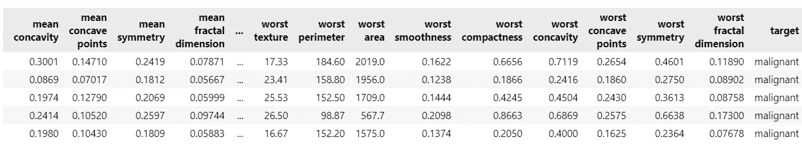

作者插图。

我们可以注意到有 30 个数字特征和一个目标变量，指定肿瘤是良性的(目标=1)还是恶性的(目标=0)。我将目标变量转换为字符串，因为 PCA 不使用它，我们只在以后的可视化中需要它。

在这种情况下，我们希望了解肿瘤是良性还是恶性时，其特征可变性的差异。这真的很难用简单的探索性分析来显示，因为我们有两个以上的协变量。例如，我们可以设想一个只有六个特征的散布矩阵，用目标变量来着色。

```
fig = px.scatter_matrix(df_bre,dimensions=list(df_bre.columns)[:5], color="target")
fig.show()
```

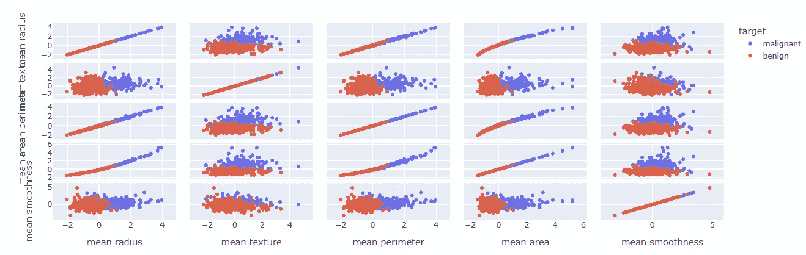

作者插图。

当然，我们可以在所有这些散点图中观察到两个不同的集群，但是如果我们同时绘制所有的特征，这将是混乱的。因此，我们需要这个多元数据集的一个紧凑的表示，它可以由主成分分析提供。

# 2.认证后活动的实施

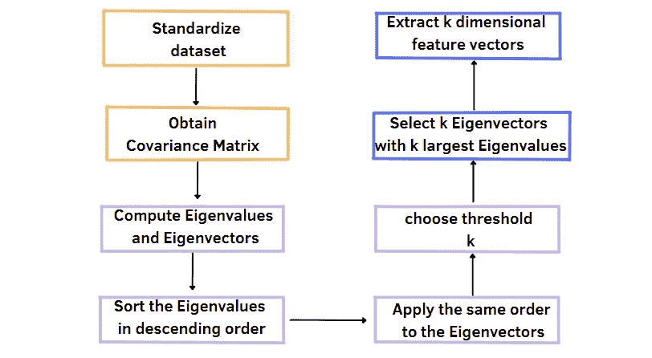

PCA 程序的框图。作者插图。

上图总结了获取主成分(或 k 维特征向量)的步骤。将应用相同的逻辑来构建该类。

我们定义了`PCA_impl`类，它在开始时初始化了三个属性。最重要的属性是我们想要提取的组件的数量。此外，我们还可以通过设置`random_state`等于 True 并仅在需要时标准化数据集来每次重现相同的结果。

这个类也包括两个方法，`fit`和`fit_transform`，类似于 scikit-learn 的 PCA。虽然第一种方法提供了计算主成分的大部分程序，但`fit_transform`方法也对原始特征矩阵 x 进行了变换。除了这两种方法，我还想可视化主成分，而无需每次指定 Plotly 表达式的函数。加速 PCA 产生的潜在变量的分析是非常有用的。

# 3.未经标准化的 PCA

最后，定义了`PCA_impl`类。我们只需要毫不费力地调用类和相应的方法。

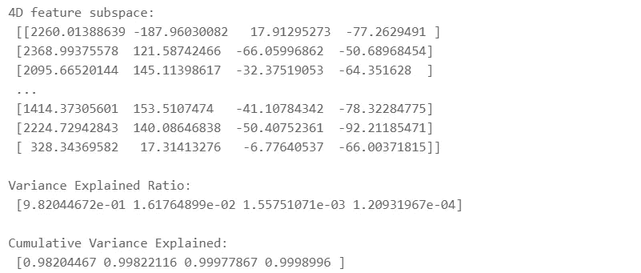

作者插图。

我们可以访问在`fit`和`fit_transform`方法中计算出的`var_explained`和`cum_var_explained`属性。值得注意的是，我们只用一个组件就捕获了 98%。让我们使用之前定义的方法来可视化 2D 和 3D 散点图:

```
pca1.pca_plot2d()
```

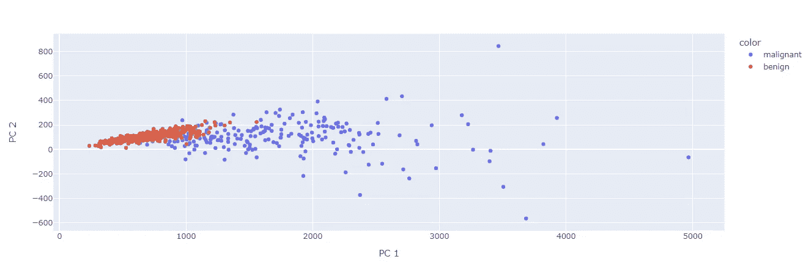

作者插图。

从可视化中，我们可以观察到出现了两个聚类，一个用蓝色标记，代表患有恶性癌症的患者，另一个关于良性癌症。此外，蓝色星团似乎比其他星团包含更多的可变性。此外，我们看到两组之间有轻微的重叠。

```
pca1.pca_plot3d()
```

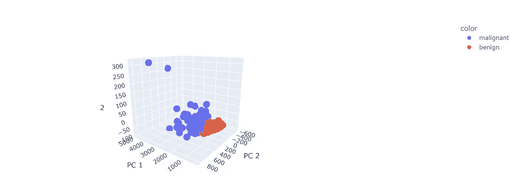

作者插图。

现在，我们来看看包含前三个部分的 3D 散点图。它没有之前的散点图那么清晰，但即使在这个图中也出现了类似的行为。基于目标变量，肯定有两个不同的组。通过观察这种三维表示，我们发现了新的信息:两名恶性肿瘤患者相对于所有其他患者而言，似乎具有完全不同的价值观。这一点在我们之前展示的 2D 图或散点图中可以稍微注意到。

# 4.标准化的 PCA

让我们重复上一节的相同过程。我们只在开始时添加标准化，以检查结果中是否有任何差异。

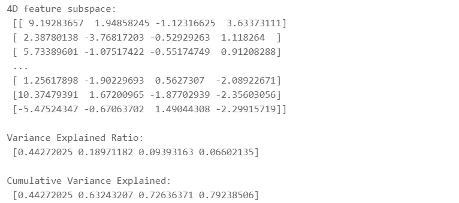

作者插图。

与前一种情况不同，我们可以注意到关于主成分的值的范围更受限制，并且解释的方差的 80%被三个成分捕获。特别地，第一成分的贡献从 0.99 变为 0.44。这可以通过以下事实来证明:所有变量都具有相同的度量单位，因此，PCA 能够对每个特征赋予相同的权重。

```
pca1.pca_plot2d()
```

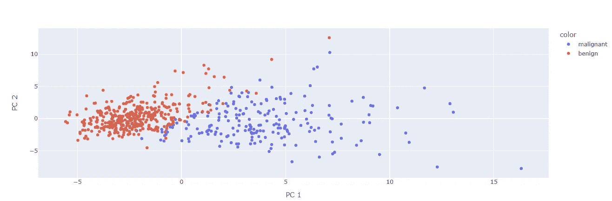

作者插图。

通过查看带有前两个分量的散点图，可以确认这些观察结果。聚类更加明显，并且具有更低的值。

```
pca1.pca_plot3d()
```

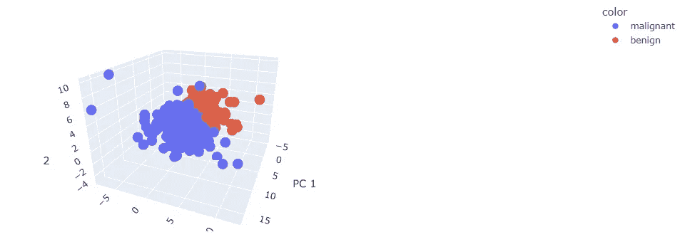

作者插图。

3D 表示更容易阅读和理解。最后，我们可以得出结论，两组患者具有不同的特征变异性。此外，仍有两个数据点与其余数据分开。

# 5.带 Sklearn 的 PCA

此时，我们可以应用 Sklearn 实现的 PCA 与我的实现进行比较。我应该指出，在这种比较中有一些差异需要考虑。虽然我的 PCA 实现基于协方差矩阵，但 scikit-learn 的 PCA 涉及输入数据的**居中**，并采用**奇异值分解**将数据投影到更低维的空间。

之前我们看到标准化是应用 PCA 前非常重要的一步。由于 Sklearn 的算法已经从每个特征的列中减去了平均值，所以我们只需要将每个数值变量除以它自己的标准偏差。

```
X_copy = X.copy().astype('float32')
X_copy /= np.std(X_copy, axis=0)
```

现在，我们将组件数量和 random_state 传递给 PCA 类，并调用`fit_transform`方法来获取主组件。

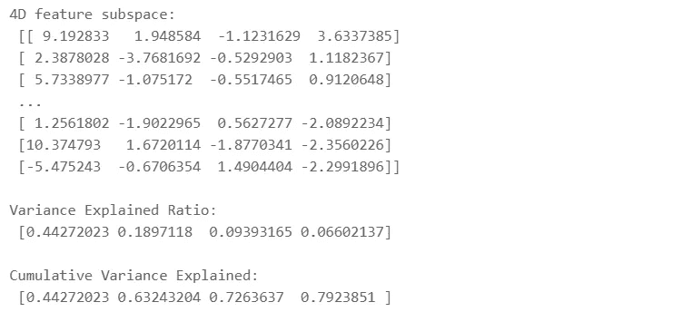

作者插图。

sklearn 的 PCA 实现了与标准化实现的 PCA 相同的结果。

```
fig = px.scatter(components, x=0, y=1, color=df.label,labels={'0': 'PC 1', '1': 'PC 2'})
fig.show()
```

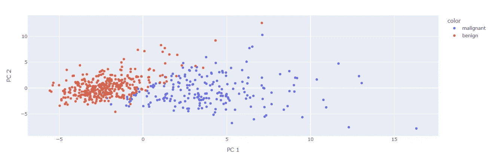

作者插图。

```
fig = px.scatter_3d(components, x=0, y=1,z=2, color=df.label,labels={'0': 'PC 1', '1': 'PC 2','2':'PC 3'})
fig.show()
```

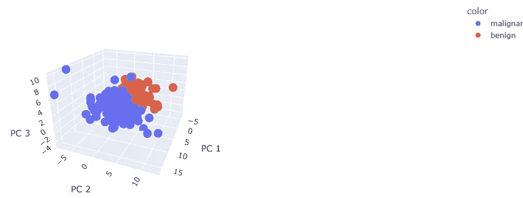

作者插图。

同样，散点图复制了我们在上一节中看到的内容。

# 最终想法:

我希望这篇文章对你有用。本文的目的是提供主成分分析的一个更紧凑的实现。在这种情况下，我的实现和 Sklearn 的 PCA 提供了相同的结果，但如果您使用不同的数据集，有时它们可能会略有不同。这里的 GitHub 代码是。感谢阅读。祝您愉快！

**参考文献:**

[1] [乳腺癌威斯康星州(诊断)数据集](https://scikit-learn.org/stable/modules/generated/sklearn.datasets.load_breast_cancer.html)

你喜欢我的文章吗？ [*成为会员*](https://eugenia-anello.medium.com/membership) *每天无限获取数据科学新帖！这是一种间接的支持我的方式，不会给你带来任何额外的费用。如果您已经是会员，* [*订阅*](https://eugenia-anello.medium.com/subscribe) *每当我发布新的数据科学和 python 指南时，您都会收到电子邮件！*