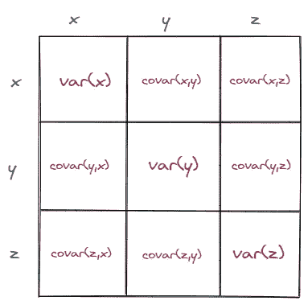
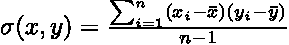
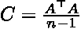
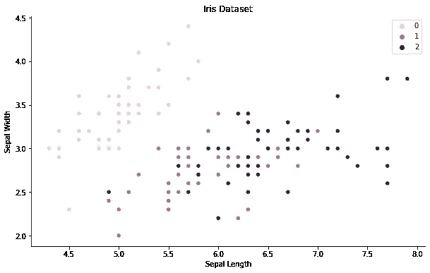
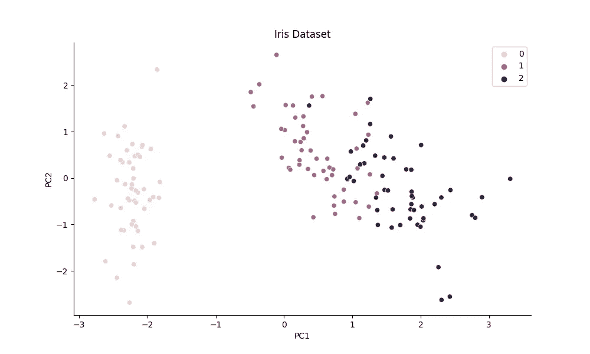
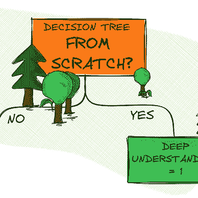
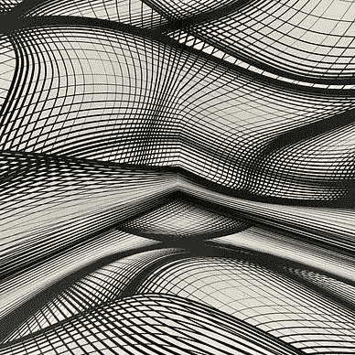

# 从头开始实施 PCA

> 原文：<https://towardsdatascience.com/implementing-pca-from-scratch-fb434f1acbaa?source=collection_archive---------10----------------------->

## 从头做起

## 仅用 Python 和 NumPy 来提高您的线性代数技能

Pawel Czerwinski 在 [Unsplash](https://unsplash.com?utm_source=medium&utm_medium=referral) 上的照片

我一直对简化数据的不同方式感到惊讶，这些方式使数据更容易获取和分析。这有时感觉像是巫术——简单地应用一个算法，它就以某种方式完成了工作。

主成分分析(PCA)就是其中一种算法。这是一种无监督的学习算法，目的是通过将一大组特征转换为一个较小的特征来降低维度，同时保留尽可能多的信息。

在本文中，我们将通过从头开始实现 PCA 来揭开一些巫术的神秘面纱。我们将使用 Python 和 NumPy 一步一步地完成这项工作。

# 概述

在直接进入实现细节之前，让我们从高层次上了解一下算法实际上是如何工作的。

主成分分析主要包括三个步骤:

1.  首先，我们需要计算*协方差矩阵*。
2.  一旦我们获得这个矩阵，我们需要使用*特征分解*来分解它。
3.  接下来，我们可以基于特征值选择最重要的特征向量，以最终*将原始矩阵投影*到其降维的维度中。

在接下来的部分中，我们将仔细研究每个步骤，在一个单独的类中实现 PCA。下面我们已经可以看一下*骨架类*，它为我们提供了某种蓝图。

# 从头开始实施

## 计算协方差矩阵

如概述中所述，我们的第一步主要涉及协方差矩阵的计算。那么我们为什么需要这样做呢？

粗略地说，协方差矩阵告诉我们两个随机变量一起变化了多少。如果协方差为正，则两个变量相关，因此沿相同方向移动(*增加或减少*)。如果协方差是负的，那么变量是反向相关的，意味着它们向相反的方向移动*(例如，一个在增加，而另一个在减少)*

假设我们有一个包含三个要素的数据集。如果我们计算协方差矩阵，我们将得到一个 3x3 的矩阵，包含每一列与所有其他列及其自身的协方差。

协方差矩阵的例子[图片由作者提供]

当应用特征分解时，协方差矩阵将是我们的核心，允许我们选择主向量或主方向，这解释了我们数据集中的大多数方差。

现在我们知道了什么是协方差矩阵，我们仍然需要知道如何计算它。计算矩阵的公式可以表述如下:

如果我们预先将数据居中，我们可以分别省略*、【x-bar】、*、【y-bar】、*的减法。简化我们的方程，用线性代数符号表示，我们得到如下结果:*

其简单地是以平均值为中心的数据矩阵本身除以样本数量的点积。

有了这些新知识，我们就可以实现前两个类方法了。

> **注**:我们通过减去平均值并除以标准差来标准化数据。这会将所有要素转换到相同的比例，从而为分析提供同等的贡献。也可以使用 NumPy 函数 numpy.cov(x)计算协方差矩阵。

## 分解协方差矩阵

我们实现的下一步主要关注协方差矩阵的分解，或者更具体地说，是*特征分解*。

特征分解描述了将矩阵分解为*个特征向量*和*个特征值*。特征向量为我们提供了关于数据方向的信息，而特征值可以解释为系数，告诉我们每个特征向量中包含多少方差。

长话短说，如果我们分解我们的协方差矩阵，我们获得特征向量，它解释了我们数据集中的大部分方差。我们可以用这些向量将原始矩阵投影到一个更低的维度。

那么我们如何分解协方差矩阵呢？

幸运的是，我们可以简单地依赖内置的 NumPy 函数，因为特征值和特征向量的*‘手动’*计算相当繁琐。我们唯一要做的事情，就是对特征值和特征向量进行相应的排序，允许我们根据指定的分量数选择最重要的特征向量。

## 投射并把它们放在一起

到现在为止，我们已经完成了大部分工作。

通过选择最重要的特征向量，我们现在能够将原始矩阵投影到低维空间中。这是通过取矩阵和特征向量的点积来实现的，这也可以解释为简单的线性变换。

在实现了剩下的两个方法之后，我们的最终类如下所示:

# 测试我们的实现

现在我们已经完成了我们的实现，只剩下一件事要做——我们需要测试它。

出于测试目的，我们将使用虹膜数据集，该数据集由 150 个样本组成，具有 4 个不同的特征*(萼片长度、萼片宽度、花瓣长度、花瓣宽度)*。让我们通过绘制前两个特征来看看原始数据。

通过绘制前两个特征对虹膜数据集进行概述[图片由作者提供]

我们现在可以实例化我们自己的 PCA 类，并将其放在数据集上。当运行下面的代码时，我们得到下面的结果。

投影到前两个主成分上的虹膜数据集[图片由作者提供]

通过应用 PCA，我们清楚地解开了一些类关系，并且更清楚地分离了数据。这种低维数据结构应该使分类任务变得容易得多。

# 结论

在本文中，我们从零开始用一种更加手动的方法实现了主成分分析。我们学习了主要的计算步骤，包括一些非常重要的线性代数概念。

主成分分析是一种简单而有效的方法来减少，压缩和解开高维数据。从零开始理解和实现该算法提供了一个很好的方法来构建强大的基础和修改我们的线性代数知识，因为它将许多重要的概念联系在一起。

你可以在我的 GitHub 上的这里找到完整的代码。

[马文·兰亨克](https://medium.com/@marvinlanhenke?source=post_page-----fb434f1acbaa--------------------------------)

## 从零开始的 ML 算法

[View list](https://medium.com/@marvinlanhenke/list/ml-algorithms-from-scratch-7621d01922ad?source=post_page-----fb434f1acbaa--------------------------------)6 stories

> 感谢您的阅读！确保保持联系&在 [Medium](https://medium.com/@marvinlanhenke) 、 [Kaggle](https://www.kaggle.com/mlanhenke) 上关注我，或者在 [LinkedIn](https://www.linkedin.com/in/marvin-lanhenke-11b902211/) 上说声“嗨”

*喜欢这篇文章吗？成为* [*中级会员*](https://medium.com/@marvinlanhenke/membership) *继续无限学习。如果你使用下面的链接，我会收到你的一部分会员费，不需要你额外付费。*

 [## 通过我的推荐链接加入 Medium-Marvin Lanhenke

### 作为一个媒体会员，你的会员费的一部分会给你阅读的作家，你可以完全接触到每一个故事…

medium.com](https://medium.com/@marvinlanhenke/membership)