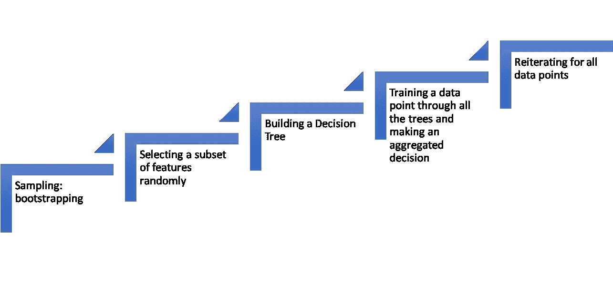
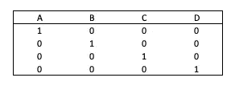
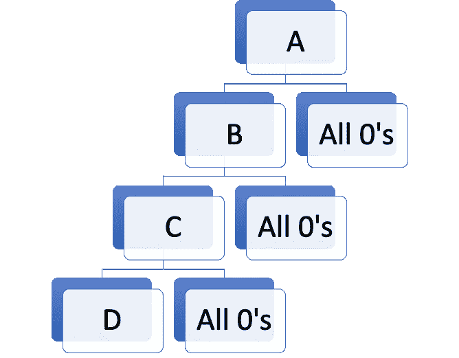
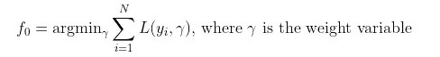
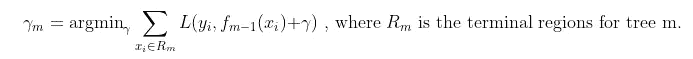
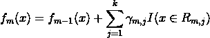

# 实现随机森林

> 原文：<https://towardsdatascience.com/implementing-random-forest-26dd3e4f55c3?source=collection_archive---------53----------------------->

雨果·德劳尼在 [Unsplash](https://unsplash.com/s/photos/random-forest?utm_source=unsplash&utm_medium=referral&utm_content=creditCopyText) 上拍摄的照片

在这篇文章中，我们将介绍随机森林背后的基本概念，讨论实现的实际问题，例如高度相关的特性、特性稀疏性、不平衡的类。然后，比较随机森林与 Boosting 树和决策树的概念和性能！如果你想讨论什么或发现错误，随时给我发电子邮件到 lvqingchuan@gmail.com:)

## 基本概念

构建随机森林

森林是如何建成的？随机森林通过 bagging(bootstrapping-aggregation 的简称)建立在决策树上。“随机性”来自两个部分:

*   Bootstrapping 是一种通过重新采样来评估建模精度的通用工具。在随机森林的框架下，使用 bootstrapping 在每棵树之间创建随机变量。作为第一步，我们用替换从训练数据中取样。每个样本都具有与原始训练数据相同的数据点。我们用每个样本建立一棵树。为什么要替换取样？实际上，没有替换的采样可能以每棵树只有非常少的数据结束，例如，从 5，000 个数据点构建 100 棵树，每棵树只给我们 5 个数据点。这意味着高偏差。理论上，替换抽样有助于保持随机森林的低方差，并防止过度拟合。
*   为每个决策树随机选择部分特征。这再次增加了树之间的随机变化，并防止过度拟合。经验法则是从 sqrt(特征数量)开始，然后通过优化器(如梯度搜索)调整每棵树的随机特征数量。

一旦构建了树，我们通过每棵树输入一个数据点，并对分类问题进行多数投票，或者对回归问题计算每棵树输出的平均值。这叫做聚合。

**边条:装袋和袋装**

如上所述，Bagging 是一种集成方法(引导，然后聚合)。你不必在装袋系统中使用一棵树。然而，装袋的树使用了树的所有特征。

## 高度相关的特征

特征非常相似的情况下还能用随机森林吗？**看情况**。具有高相关性的特征可能在因果推理研究中引起问题。如果让随机森林通过移除多少杂质来评估要素的重要性，两个高度相关的要素的排名将会非常不同，因为第一个要素移除的杂质不会被第二个要素再次移除。因此，报告的第二个特征的重要性将明显低于第一个特征，尽管它们在与目标变量的关系方面密切相关。这种情况可以通过随机选择特性来稍微改善，但不能完全解决。此外，高相关性可能不是机器学习研究中的问题。当我们的目标是进行预测时，特征之间的高度相关性很少会损害预测分数。友情提示:当你有很多冗余特性和一个大数据集时，运行时间会很长。

## 特征稀疏度/密度

特征稀疏/密度意味着数据集不平衡，例如，零(一)个值支配二进制特征称为稀疏(密集)。特征稀疏/密度是一个严重的问题，对随机森林的性能有负面影响。在零值支配二进制特征的例子中，树将朝着零的方向生长。无信息分割导致运行时间长、树深度大和错误率高。

种植一棵有偏见的树

如果不考虑运行时，构建更多的树可能有助于解决这个问题，因为每棵树都有另一组随机选择的特性。但是，不建议使用这种方法，因为随机森林在设计上容易变得稀疏/密集。如果您喜欢使用树算法，XGBoost 对稀疏/密集数据不敏感，也值得一试。

**不平衡的班级**

类别不平衡意味着一个或几个类别占了大部分样本。在极端情况下，您预测的是一个二进制类，而几乎所有的训练样本都属于零类。然后，您的决策树可能会预测所有训练样本都落在零类中，并在训练阶段达到“假的”(或“夸大的”)高精度。当看不见的测试数据确实经常落在一个类中时，这可能会给你带来麻烦。您也可以将这种极端情况推广到多标签分类。

要检测不平衡的类是否会提高模型性能:

*   使用修改后的准确度分数。通常，准确度=正确预测的样本数/总样本数。要使其反映出阶级不平衡的影响，用精度* = 1/2 *(正预测精度+负预测精度)。当你的分类器在每个类上表现得不一样好时(换句话说，多数类膨胀了模型性能)，修改后的精度*将低于常规精度；当你没有不平衡的阶级问题时，准确度* =准确度。

要解决这个问题，你有两个简单的方法:

*   ' class_weight '参数:这是一个可选的超参数，供您在决策树或随机森林模型中指定。对于不平衡的类，你可以设置' class_weight' = 'balanced '此模式自动调整输入数据中与类别频率成反比的权重，如 n _ samples/(n _ classes * NP . bin count(y))。
*   对代表性不足的类别进行过采样:通过制作属于少数类别的样本的副本，我们增加了少数类别的类别频率，从而朝着 50/50 的类别频率分割移动(用于二进制分类)。然而，我们需要确保原始数据没有偏见。再次考虑一个极端的二元情况，当我们在 A 类中有 10，000 个样本，在 B 类中有 10 个样本时，我们希望确保这 10 个样本确实包含关于 B 类人口的信息。事实上，10 个样本的特征很少能提供 B 类的所有信息；他们可能只是局外人。

## 随机森林和决策树

随机森林是一种基于决策树的集成方法。通过为每棵树引导样本和随机选择的特征，然后在所有树的最终输出上聚集决策(多数投票或平均)，随机森林应该比决策树更好地处理过拟合问题和噪声。从统计学导论课程中，我们知道:

均方差=方差+偏差。

在大多数情况下，随机森林能够减少方差(过拟合)部分的误差。在我的[沃尔玛食品销售预测](https://github.com/QingchuanLyu/Time-Series-Analysis)和[爱荷华州房价预测](https://github.com/QingchuanLyu/Predicting-House-Prices)项目中，Random Forest 确实胜过决策树。但是决策树能胜过随机森林吗？的确**是的**！由于随机森林专注于解决上述公式的“方差”部分，您可以想象，当涉及到对没有太多噪声的训练数据进行预测时，决策树不一定表现得更差-其偏差不必比随机森林设计得更高。另一个原因是随机森林的性能随着树的数量而稳定。换句话说，当你有一个非常大的训练数据集和非常少的特征时，一个决策树就足够了。(再次考虑一个极端的例子，你有 10，000 个样本和两个特征。你的随机森林能在这里施展什么魔法？)

## 随机森林和梯度增强树

Boosting 是一个连续的过程，不断更新前一阶段弱分类器的权重，最终得到一个稳定的最大化分类器集合。把分类器想象成分区，你给那些样本应该在别处的分区分配更多的权重。构建 M 个梯度提升树序列的步骤:

*   初始化一个最优常数模型:单个终端节点树，每个样本的初始权重为 1/N，假设总共有 N 个样本。

*   对于接下来的每棵树:

1.为 N 个采样点中的每一个计算梯度下降(因此梯度提升非常耗时:/)；然后，用梯度下降参数拟合树。

2.用当前树计算最小化损失函数的权重。

该权重将作为下一个树的一部分应用:

k 是树 m 的分区总数，I()是指示函数。

*   从最后一棵树输出预测。**搞定**！

一个简单的比较告诉你梯度提升树，不同于随机森林，不使用额外的采样方法，按顺序而不是并行构建树，最后不使用聚集策略。直观地说，如果你仔细调整参数，梯度推进树比随机森林更好地处理偏差。经验研究表明，当树的数量足够大时，梯度增强树几乎总是优于随机森林，稳定的梯度增强树通常比稳定的随机森林更好。然而，如上所述，当数据中有大量噪声时，随机森林非常好。在这种情况下，梯度增强树有很大的机会过度拟合。

*注:如果你对基本机器学习模型的详细解释感兴趣，我推荐 Hastie、Tibshirani 和 Friedman 的《统计学习的要素》。*