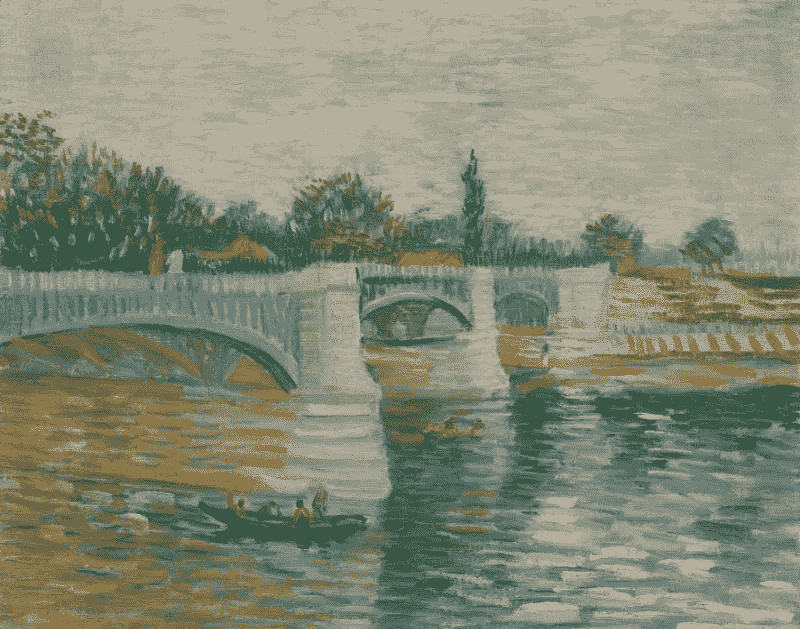
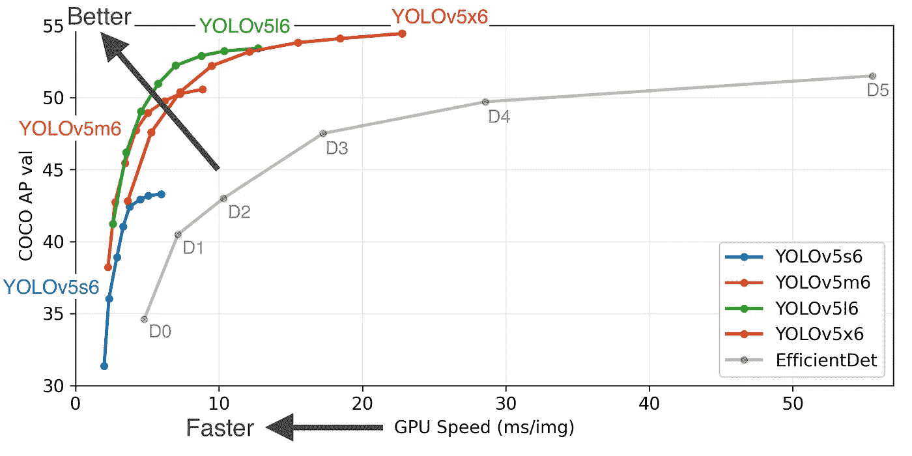
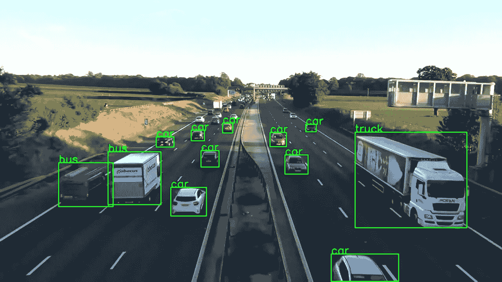
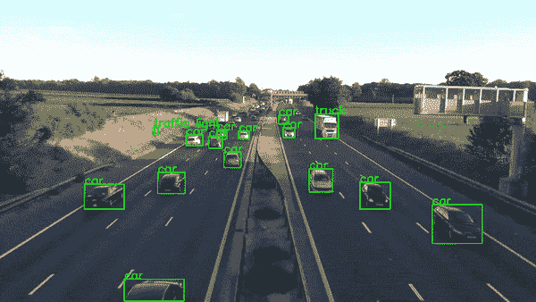

# 用 PyTorch 和 OpenCV 实现实时目标检测系统

> 原文：<https://towardsdatascience.com/implementing-real-time-object-detection-system-using-pytorch-and-opencv-70bac41148f7?source=collection_archive---------1----------------------->

## 使用 python 实现实时对象检测系统的实践指南



文森特·梵高(1853–1890)，巴黎，1887 年 5 月至 7 月([来源](https://www.vangoghmuseum.nl/en/collection/s0086V1962#details))

无人驾驶汽车可能仍然很难理解人类和垃圾桶之间的区别，但这并不影响最先进的物体检测模型在过去十年中取得的惊人进展。

结合 OpenCV 等库的图像处理能力，现在在几个小时内构建一个实时对象检测系统原型要容易得多。在本指南中，我将尝试向您展示如何开发一个简单的对象检测应用程序的子系统，以及如何将所有这些放在一起。

# Python vs C++

我知道你们中的一些人可能会想为什么我使用 Python，对于实时应用程序来说，它是不是太慢了，你是对的；在某种程度上。

大多数计算繁重的操作，如预测或图像处理，都是由 PyTorch 和 OpenCV 执行的，它们都在幕后使用 c++来实现这些操作，因此，如果我们在这里使用 c++或 python，不会有太大的区别。

但同样，它只是一个原型，只有很少的基础设施代码和附加开销。如果你想学习生产级的实时实现，我建议你不要选择 python，至少现在不要。

# 读取视频流

您的输入视频流源可以是任何东西，您可能想从您的网络摄像头读取，或解析已存在的视频，或从连接到网络的外部摄像机。无论是什么问题，OpenCV 都是解决方案。在这个例子中，我将展示如何从 youtube 或网络摄像头读取视频流。


您可以使用 OpenCV 创建一个视频流来支持您的应用程序。([来源](https://www.youtube.com/watch?v=wqctLW0Hb_0)

## 从你的试管中读取

对于您的原型，您可能不想出去创建一个新的视频，而是使用许多在线可用的视频之一。在这种情况下，你可以从 youtube 上阅读视频流。

```
import cv2 # opencv2 package for python.
import pafy # pafy allows us to read videos from youtube.URL = "https://www.youtube.com/watch?v=dQw4w9WgXcQ" #URL to parse
play = pafy.new(self._URL).streams[-1] #'-1' means read the lowest quality of video.
assert play is not None # we want to make sure their is a input to read.
stream = cv2.VideoCapture(play.url) #create a opencv video stream.
```

## 从网络摄像头读取

有时候你只想看看自己的脸。在这种情况下，请随意使用内置网络摄像头。

```
import cv2stream = cv2.VideoCapture(0) # 0 means read from local camera.
```

## 读取 IP 摄像头

如果您正在构建一个将部署在服务器上的应用程序，您的摄像机将拥有一个 IP 地址，您可以从该地址访问视频流。

```
import cv2camera_ip = "rtsp://username:password@IP/port"
stream = cv2.VideoCapture(camera_ip)
```

# 加载模型

今天的机器学习工程师被选择宠坏了，或者我应该说被选择弄糊涂了。有许多伟大的对象检测模型，每一个都有其优点和缺点。为了简单起见，我们将使用 **YoloV5** ，因为它为我们提供了快速推理，这对我们的实时应用程序至关重要。你也可以看看其他的模型，比如 FasterRCNN。



根据 Yolov5 文件，它是目前市场上最快的型号。([来源](https://github.com/ultralytics/yolov5))

我们可以直接从 PyTorch hub 加载模型，第一次运行代码可能需要几分钟，因为它会从互联网上下载模型，但下一次它将直接从磁盘加载。

```
from torch import hub # Hub contains other models like FasterRCNNmodel = torch.hub.load( \
                      'ultralytics/yolov5', \
                      'yolov5s', \
                      pretrained=True)
```

# 对单帧进行评分

俗话说“千里之行，始于足下”，所以我们可以说“解析一个视频流，始于一帧”。让我们看看如何对单个帧进行评分和解析。

我们用来执行推理的设备对我们的推理速度产生了巨大的影响，现代深度学习模型在与 GPU 一起工作时效果最佳，所以如果你有一个带有 CUDA 内核的 GPU，它将大幅提高你的性能。在我的经验中，即使只有一个 GPU 的系统也可以达到每秒 45-60 帧，而 CPU 最多只能给你 25-30 帧。

```
"""
The function below identifies the device which is availabe to make the prediction and uses it to load and infer the frame. Once it has results it will extract the labels and cordinates(Along with scores) for each object detected in the frame.
"""def score_frame(frame, model):
    device = 'cuda' if torch.cuda.is_available() else 'cpu'
    model.to(device)
    frame = [torch.tensor(frame)]
    results = self.model(frame)
    labels = results.xyxyn[0][:, -1].numpy()
    cord = results.xyxyn[0][:, :-1].numpy()
    return labels, cord
```

# 在框架上绘制方框

一旦我们对该帧进行了评分，我们就需要在将该帧写入输出流之前，在该帧上绘制出已标识的对象及其盒子。为此，我们可以使用 OpenCV 的图像处理工具包。

```
"""
The function below takes the results and the frame as input and plots boxes over all the objects which have a score higer than our threshold.
"""
def plot_boxes(self, results, frame):
    labels, cord = results
    n = len(labels)
    x_shape, y_shape = frame.shape[1], frame.shape[0]
    for i in range(n):
        row = cord[i]
        # If score is less than 0.2 we avoid making a prediction.
        if row[4] < 0.2: 
            continue
        x1 = int(row[0]*x_shape)
        y1 = int(row[1]*y_shape)
        x2 = int(row[2]*x_shape)
        y2 = int(row[3]*y_shape)
        bgr = (0, 255, 0) # color of the box
        classes = self.model.names # Get the name of label index
        label_font = cv2.FONT_HERSHEY_SIMPLEX #Font for the label.
        cv2.rectangle(frame, \
                      (x1, y1), (x2, y2), \
                       bgr, 2) #Plot the boxes
        cv2.putText(frame,\
                    classes[labels[i]], \
                    (x1, y1), \
                    label_font, 0.9, bgr, 2) #Put a label over box.
        return frame
```

一旦完成，这个函数将产生类似这样的输出。



你可以尝试不同的物体有不同的颜色。(图片由作者提供)

# 一个将他们团结起来的功能

很抱歉引用了《指环王》,但是是的，现在我们把它们都放在一个单独的调用函数中，在一个循环中执行整个操作。

因此，让我们回顾一下我们的主函数要成功运行应用程序必须执行的步骤。

1.  创建视频流输入。
2.  加载模型。
3.  当输入可用时，读取下一帧。
4.  对框架进行评分，以获得标签和坐标。
5.  在探测到的物体上画出方框。
6.  将处理后的帧写入输出视频流。

六个简单的操作步骤，虽然我们会添加一些基础设施代码来帮助我们使应用程序更加健壮，但基本原理是一样的。所以让我们开始吧。

```
"""
The Function below oracestrates the entire operation and performs the real-time parsing for video stream.
"""
def __call__(self):
    player = self.get_video_stream() #Get your video stream.
    assert player.isOpened() # Make sure that their is a stream. 
    #Below code creates a new video writer object to write our
    #output stream.
    x_shape = int(player.get(cv2.CAP_PROP_FRAME_WIDTH))
    y_shape = int(player.get(cv2.CAP_PROP_FRAME_HEIGHT))
    four_cc = cv2.VideoWriter_fourcc(*"MJPG") #Using MJPEG codex
    out = cv2.VideoWriter(out_file, four_cc, 20, \
                          (x_shape, y_shape)) 
    ret, frame = player.read() # Read the first frame.
    while rect: # Run until stream is out of frames
        start_time = time() # We would like to measure the FPS.
        results = self.score_frame(frame) # Score the Frame
        frame = self.plot_boxes(results, frame) # Plot the boxes.
        end_time = time()
        fps = 1/np.round(end_time - start_time, 3) #Measure the FPS.
        print(f"Frames Per Second : {fps}")
        out.write(frame) # Write the frame onto the output.
        ret, frame = player.read() # Read next frame.
```

您应该将所有这些组件打包到一个好的类中，该类可以与 URL 和您希望将输出流写入的输出文件一起被调用。您的最终产品将看起来像这样。



60 FPS 的实时处理视频输出流。(图片由作者提供)

# 结论

当然，生产级别的实时应用程序要比这复杂得多，但是本指南并不打算教这个。它将向您展示 Python 的惊人威力，它允许我们在几个小时内构建如此复杂的应用程序原型。这里的可能性只受到你的想象力的限制。

你可以在我的 [Github](https://github.com/akash-agni) 个人资料上查看完整的代码和更多这类令人敬畏的应用。

## 如果你喜欢这本指南。

> 留下评论让我知道你的想法。
> 
> 通过 [Twitter](https://twitter.com/agni_akash) 、 [Linkedin](https://www.linkedin.com/in/agni25/) 或 [Medium](https://www.linkedin.com/in/agni25/) 与我联系。
> 
> 与你的网络分享这篇文章。

编码快乐！！