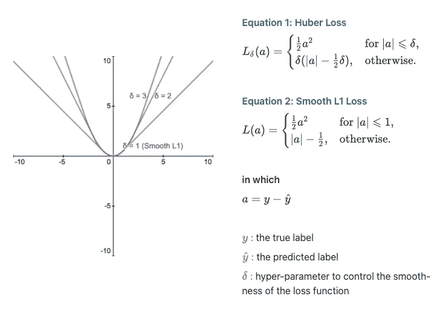
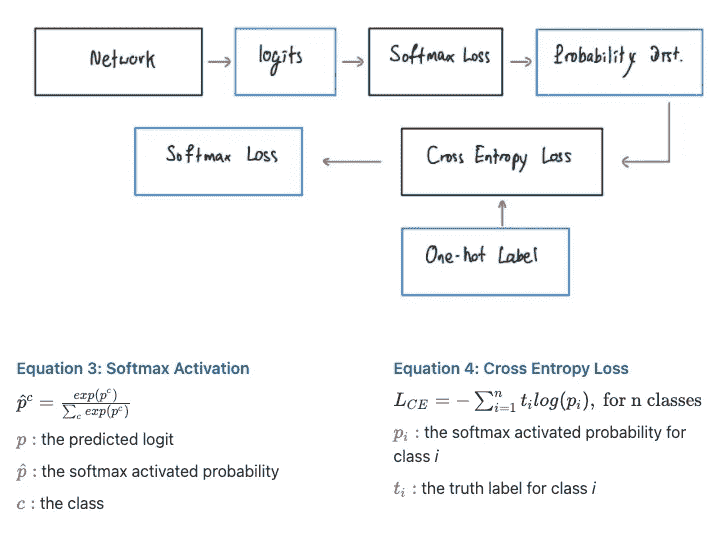
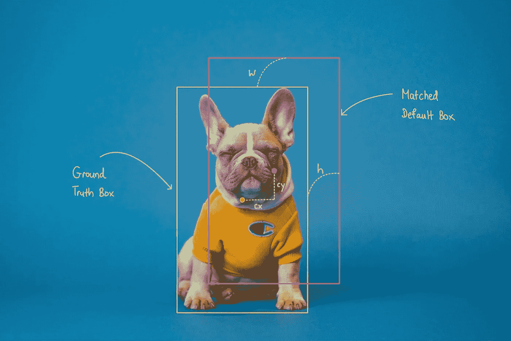
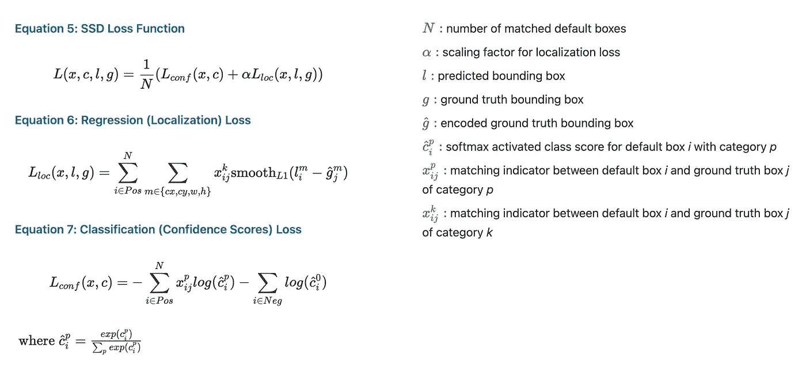

# 在 Keras 中实现单触发探测器(SSD ):第二部分——损失函数

> 原文：<https://towardsdatascience.com/implementing-single-shot-detector-ssd-in-keras-part-ii-loss-functions-4f43c292ad2a?source=collection_archive---------18----------------------->

## [Keras 中的物体检测](https://towardsdatascience.com/tagged/object-detection-in-keras)

## 在 Keras 中实现 SSD 丢失功能

# 一.导言

在本系列的[第一部分](/implementing-ssd-in-keras-part-i-network-structure-da3323f11cff?sk=2d12a3f967fd6f1c32518b30c56d0ca5)中，我们已经了解了固态硬盘的网络结构。本文现在将深入探讨“网络如何学习”。更具体地说，我们将研究它的损失函数，以及如何用它来优化网络的参数。像往常一样，文章将首先单独讨论一些主要概念。然后，会解释那些概念是如何构成 SSD 损失函数的。最后，本文将以代码示例结束，向您展示如何在 Keras 中实现它。

> *这篇文章是一个更大的系列的一部分，叫做在 Keras 中实现单次检测器(SSD)。下面是系列*的概要
> 
> [*第一部分:网络结构*](/implementing-ssd-in-keras-part-i-network-structure-da3323f11cff?sk=2d12a3f967fd6f1c32518b30c56d0ca5) *第二部分:损失函数(本文)* [*第三部分:数据准备*](/implementing-single-shot-detector-ssd-in-keras-part-iii-data-preparation-624ba37f5924?sk=39164c76031c0f60785dd3aa559cc2a6)[*第四部分:数据扩充*](/implementing-single-shot-detector-ssd-in-keras-part-iv-data-augmentation-59c9f230a910?sk=cf25ff5e9e78ea56415f1f4c8be1fa32)[*第五部分:预测解码*](/implementing-single-shot-detector-ssd-in-keras-part-v-predictions-decoding-2305a6e4c7a1?sk=4c80a5b66d49fee2055b98437d4ca474)[*部分*](/implementing-single-shot-detector-ssd-in-keras-part-vi-model-evaluation-c519852588d1?sk=797df0a4bf29d36ddd1e7ee9fe5c81a3)

# 二。概念

## 损失函数— L( *ŷ，y* )

损失函数是用于在训练期间产生损失值的数学公式。在训练期间，模型的性能通过模型为每个样本或每批样本产生的损失( *L* )来衡量。损失主要衡量预测值( *ŷ* )与期望值( *y* )之间的“距离”(Pere，2020)。如果 *ŷ* 离 *y* 很远(很不一样)，那么损耗就高。然而，如果 *ŷ* 接近于 *y* ，则损耗较低。该模型使用损失作为“指标”来更新其参数，以便在未来的预测中产生非常小的损失。这意味着生产非常接近 y 的ŷ。参数更新过程(也称为反向传播)可以通过使用优化算法(梯度下降、Ada-grad、Adam 等)来实现。

> 优化算法本身就是一个巨大的研究领域。因此，我建议你把它添加到你的“要学习的 ML 主题”列表中。

## 回归和分类损失函数

机器学习中的两个常见任务是回归和分类。为了在训练期间测量模型性能，在每个任务中使用不同的损失函数。在分类任务中，模型试图预测一组“离散”的值(深度学习去神秘化，2020)。这项任务的损失函数倾向于将概率值作为输入。因此，模型最后一层的输出在用作损失函数的输入之前，首先通过适当的激活层(用于二分类的 Sigmoid，用于多类分类的 Softmax)。对于回归任务，模型试图预测“连续”值(深度学习非神秘化，2020)。回归任务的损失函数倾向于直接从网络的最后一层获取值，而不必将这些值转换为概率。

> 可以参考[这篇文章](https://deeplearningdemystified.com/article/fdl-3)通过深度学习去神秘化了解更多关于损失函数的知识。

## 平滑 L1 损耗

作者图片

平滑 L1 损失是一种回归损失函数。平滑 L1 损耗有几个变体，但 SSD 中使用的是休伯损耗的特例，δ = 1。你可以把它看作是 L1 损失和 L2 损失的组合。当| *a|* 小于或等于 1 时，则表现为 L2 损失。否则，它的行为就像 L1 的损失。它首先由 Ross Girshick 在他的论文“Fast-RCNN”中提出，作为物体检测的 L2 损失的替代。根据 Girshick (2015 年):

平滑 L1 损失是一种稳健的 L1 损失，与 R-CNN 和 SPPnet 中使用的 L2 损失相比，它对异常值不太敏感。当回归目标是无界的时，具有 L2 损失的训练可能需要仔细调整学习速率，以防止爆炸梯度。 (Girshick，2015 年，第 3 页)

## 软最大损失(又名分类交叉熵损失)

作者图片

Softmax 损失是一种分类损失函数。更具体地说，它用于多类分类。它由两个步骤组成。首先，将网络最后一层的输出输入到 Softmax 激活中，以概率分布的形式为每个类别生成一个置信度得分，其中所有值的总和为 1。其次，得到的概率分布然后被用作交叉熵损失的输入。交叉熵损失测量标签的预测概率分布和实际概率分布之间的差异。值得注意的是，为了将实际的标签 *y* 转换成概率分布，使用了一种称为一键编码的方法。

# 三。SSD 损失函数(学习目标)

## SSD 学什么？

由作者编辑。来源:[卡斯滕·怀恩吉尔特](https://unsplash.com/@karsten116)

回想一下，在本系列的第一部分中，我们了解到 SSD 输出的预测 *ŷ* 具有(*total _ default _ box*， *num_classes* + 1 + 4 + 8)的形状。每个*total _ default _ box*项目中包含的内容有:

*   *num _ classes+*1*背景类的置信度得分*
*   *4 边界框属性:到匹配的默认框中心的 x 偏移( *cx* )、到匹配的默认框中心的 y 偏移( *cy* )、边界框宽度的对数比例变换( *w* )、边界框高度的对数比例变换( *h* )*
*   *4 默认框值:默认框从图像左侧的中心 x 偏移、默认框从图像顶部的中心 y 偏移、默认框的宽度和默认框的高度*
*   *4 方差值:用于编码/解码边界框数据的值*

*在上述 4 点中，只有前两点可由 SSD 网络学习。其他值是常量，用于帮助将来的边界框解码过程。*

> *为了找到基础事实标签匹配边界框，执行匹配过程。我们将在以后的文章中研究这个匹配过程，以及如何对基本事实边界框和置信度得分进行编码。*

## *它是如何学习的？*

**

*作者图片*

*SSD 将回归损失( *L_loc* )和分类损失( *L_conf* )与α值组合在一起，作为定位损失的比例因子。 *L_loc* 是匹配的正框的所有边界框属性( *cx* ， *cy* ， *w* ， *h* )的平滑 L1 损失的总和。这意味着它不考虑其类为背景类的默认框或不与任何基础真值框匹配的默认框。通过这种方式，它将因做出包含对象的边界框预测而获得奖励。为了产生 *L_conf* ，作者使用 Softmax loss 分别计算匹配的正默认框和负默认框的损失，然后将它们加在一起。负框也被考虑到分类损失中的原因是因为我们也想惩罚错误的预测，同时奖励背景类的正确预测。*

# *四。代码*

> *本文中显示的所有代码都可以在这个回购:[https://github.com/Socret360/object-detection-in-keras](https://github.com/Socret360/object-detection-in-keras)。在本文中，我将展示代码的关键片段，并提供包含完整代码的相关文件的链接，而不是直接展示所有代码示例。这将确保文章不会因代码示例而过载。GitHub repo 中的大部分代码都是从[https://github.com/pierluigiferrari/ssd_keras](https://github.com/pierluigiferrari/ssd_keras)中获取和修改的。*

*在 Keras 中，损失函数可以传递给 model.compile 方法。损失函数将被赋予两个自变量 y_true 和 y_pred。这实质上是 y *y* 和ŷ*的*。为了构建整体损失函数，我们首先需要对 Softmax 损失和 Smooth L1 损失的损失函数进行编码。你可以参考 [smooth_l1_loss.py](https://github.com/Socret360/object-detection-in-keras/blob/master/losses/smooth_l1_loss.py) 和 [softmax_loss.py](https://github.com/Socret360/object-detection-in-keras/blob/master/losses/softmax_loss.py) 来实现这些目标。另一个需要注意的重要事情是，在计算 SSD 损耗时，你会发现负默认框比正默认框多。为了补救这种情况并防止类不平衡，执行硬负挖掘。这实质上意味着只保留适当数量的负默认框。*

*以下代码片段演示了 Keras 中的 SSD 丢失功能:*

# *结论*

*本文演示了在 Keras 中实现 SSD 丢失功能所需的概念和代码。在下一篇文章中，我们将了解用于为 SSD 生成训练数据的 Keras 数据生成器。*

**喜欢这篇文章并想表达你的支持？关注我或给我买咖啡**

**

# *参考*

*布朗利，J. (2020 年 12 月 22 日)。*机器学习交叉熵的温和介绍*。机器学习精通。检索自[https://machine learning mastery . com/cross-entropy-for-machine-learning/](https://machinelearningmastery.com/cross-entropy-for-machine-learning/)*

*深度学习去神秘化(2020)。损失函数解释。从 https://deeplearningdemystified.com/article/fdl-3[取回](https://deeplearningdemystified.com/article/fdl-3)*

*吉尔希克河(2015 年)。Fast-RCNN。[https://arxiv.org/pdf/1504.08083.pdf](https://arxiv.org/pdf/1504.08083.pdf)*

*劳尔戈麦斯(2018 年 5 月 23 日)。*理解范畴交叉熵损失、二元交叉熵损失、Softmax 损失、Logistic 损失、焦点损失以及所有那些容易混淆的名称*。劳尔·戈麦斯博客。从 https://gombru.github.io/2018/05/23/cross_entropy_loss/[取回](https://gombru.github.io/2018/05/23/cross_entropy_loss/)*

*Koech，E. K. (2020 年 10 月 3 日)。*交叉熵损失函数*。走向数据科学。检索自[https://towards data science . com/cross-entropy-loss-function-f 38 C4 EC 8643 e](/cross-entropy-loss-function-f38c4ec8643e)*

*刘，w，安盖洛夫，d，尔汉，d，塞格迪，c，里德，s，傅，C.Y，&伯格，A. C. (2016)。SSD:单次多盒探测器。[https://arxiv.org/abs/1512.02325](https://arxiv.org/abs/1512.02325)*

*Pere，C. (2020 年 6 月 17 日)。什么是损失函数？。走向数据科学。检索自[https://towards data science . com/what-is-loss-function-1e 2605 aeb 904](/what-is-loss-function-1e2605aeb904)*

*d . rade ci(2020 年 6 月 19 日)。 *Softmax 激活功能说明*。走向数据科学。检索自[https://towards data science . com/soft max-activation-function-explained-a 7 E1 BC 3 ad 60](/softmax-activation-function-explained-a7e1bc3ad60)*