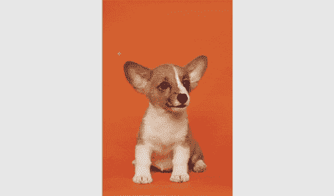
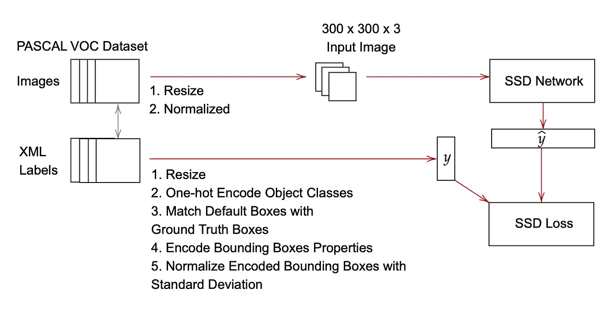
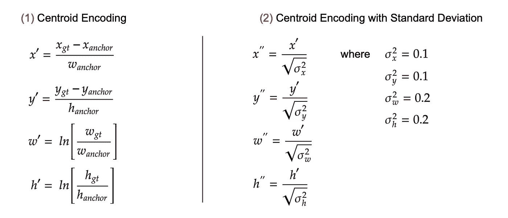

# 在 Keras 中实现单触发探测器(SSD ):第三部分——数据准备

> 原文：<https://towardsdatascience.com/implementing-single-shot-detector-ssd-in-keras-part-iii-data-preparation-624ba37f5924?source=collection_archive---------18----------------------->

## [Keras 中的物体检测](https://towardsdatascience.com/tagged/object-detection-in-keras)

## 实施 Keras 的 SSD 数据生成器

给狗的图像贴标签。由作者编辑。来源: [Alvan Nee](https://unsplash.com/@alvannee)

# 一.导言

在之前的文章中，我们已经了解了 SSD 的网络结构([第一部分](/implementing-ssd-in-keras-part-i-network-structure-da3323f11cff?sk=2d12a3f967fd6f1c32518b30c56d0ca5))和用于训练网络的 SSD 损失函数([第二部分](/implementing-single-shot-detector-ssd-in-keras-part-ii-loss-functions-4f43c292ad2a?sk=5e1265989a1e250844b0674dc670f234))。本文关注在 Keras 中实现 SSD 的下一个重要步骤:为训练准备数据。本文将首先讨论用于训练 SSD 网络的 PASCAL VOC 数据集。然后，它将研究如何从该数据集中准备一个适合训练的格式的训练样本的细节。本文将以一个用于训练 SSD 网络的 Keras 数据生成器的完整代码示例结束。

> *本文是一个更大的系列的一部分，称为在 Keras 中实现单次检测器(SSD)。下面是这个系列*的概要
> 
> [*第一部分:网络结构*](/implementing-ssd-in-keras-part-i-network-structure-da3323f11cff?sk=2d12a3f967fd6f1c32518b30c56d0ca5)[*第二部分:损失函数*](/implementing-single-shot-detector-ssd-in-keras-part-ii-loss-functions-4f43c292ad2a?sk=5e1265989a1e250844b0674dc670f234) *第三部分:数据准备(本文)* [*第四部分:数据扩充*](/implementing-single-shot-detector-ssd-in-keras-part-iv-data-augmentation-59c9f230a910?sk=cf25ff5e9e78ea56415f1f4c8be1fa32)[*第五部分:预测解码*](/implementing-single-shot-detector-ssd-in-keras-part-v-predictions-decoding-2305a6e4c7a1?sk=4c80a5b66d49fee2055b98437d4ca474)</implementing-single-shot-detector-ssd-in-keras-part-vi-model-evaluation-c519852588d1?sk=797df0a4bf29d36ddd1e7ee9fe5c81a3>

# *二。SSD 数据准备*

**

*图一。为 SSD 网络准备训练数据的过程。来源:图片由作者提供。*

> *你可以在他们的官方网页[这里](http://host.robots.ox.ac.uk/pascal/VOC/voc2012/)找到更多关于 PASCAL VOC 数据集的信息。*

*在 SSD 论文中，作者使用不同的数据集来训练/测试他们的 SSD 网络。对于 SSD 的实施，重点将放在 PASCAL VOC 数据集上。这是一个流行的数据集，用于训练/基准对象检测网络。数据集中有 20 个对象类。这些类别是:人、鸟、猫、牛、狗、马、羊、飞机、自行车、船、公共汽车、汽车、摩托车、火车、瓶子、椅子、餐桌、盆栽植物、沙发、电视/监视器。它由 xml 格式的图像及其相应的标签组成。在标签文件中，对象的类以字符串格式保存。每个对象的边界框以角格式保存(xmin、ymin、xmax、ymax)。*

*如前所述，PASCAL VOC 数据集中的每个训练样本都由一个图像及其对应的标签 xml 文件组成。为了将训练样本转换成适合训练 SSD 的格式，我们需要执行两个主要任务。首先，我们需要读取图像，将其调整到合适的尺寸(例如 300x300)，然后将其归一化。为了实现 SSD，使用了相对于 ImageNet 平均值的零中心标准化。零中心归一化调整像素值的分布，使其以零为中心(Brownlee，2019)。其次，我们需要创建一个形状数组(num_default_boxes，num_classes + 4 + 8d ),它与 SSD 网络的输出形状相匹配。在此任务中，我们需要读取类标签并对它们进行一次性编码，将所有边界框读入内存，缩放它们以适应输入大小，将它们与正确的默认框匹配，并将它们编码到适合 SSD 网络预测的范围。在这些子任务中，最复杂的两个是匹配过程和编码过程。因此，我们将在下面详细讨论它们。*

## *将基础事实框与默认框相匹配*

*匹配过程依赖于基础真值框和所有默认框之间的交集/并集(也称为 IOU，框重叠)的计算。检索 IOU 值后，匹配过程包括三个步骤。首先，每个基本事实框与具有最高 IOU 的默认框相匹配。这确保了基础事实框在训练期间将具有匹配的默认框。第二，剩余的默认框与 iou 大于某个阈值(例如 0.5)的基本事实框相匹配。这允许基础事实框与多个默认框匹配。第三，还会有既不是背景也没有足够的 IOU 分数来作为匹配的框，这些框被称为“中性框”。找到这样的默认框也很重要，这样我们就可以适当地设置它们的类标签。*

## *编码边界框*

**

*图 2:编码边界框属性的公式。来源:作者图片*

*SSD 的这种实现使用基于质心的包围盒格式来训练网络。因此，为了对边界框属性进行编码，我们使用 Figure 2–1 中的公式。此外，SSD 的许多实现用相应的方差(σ)值来划分每个边界框属性，以进一步规范化它们的范围。根据毛(2019)，这种方法可能不是正确的方式。他认为:*

**“在我看来，这实际上是一个标准归一化的过程，而不是用方差进行编码……这样，如果编码后的包围盒 X’遵循某种高斯分布，经过归一化后，该分布将变成均值为 0、方差为 1 的标准正态分布。这将是机器学习预测的理想选择。”**

*因此，不是用相应的方差(σ)值除每个编码的边界框属性，而是用相应的标准差(σ)除编码的边界框属性，如图 2–2 所示。*

# *三。Keras 的固态硬盘数据生成器*

> *本文中显示的所有代码都可以在这个回购:【https://github.com/Socret360/object-detection-in-keras。在本文中，我将展示代码的关键片段，并提供包含完整代码的相关文件的链接，而不是直接展示所有代码示例。这将确保文章不会因代码示例而过载。GitHub repo 中的许多代码都是从 https://github.com/pierluigiferrari/ssd_keras 的[中截取并修改而来的。](https://github.com/pierluigiferrari/ssd_keras)*

*下面的代码演示了如何编写 Keras 的数据生成器来训练 SSD 网络，如第一部分[所示。你需要参考](/implementing-ssd-in-keras-part-i-network-structure-da3323f11cff?sk=2d12a3f967fd6f1c32518b30c56d0ca5)[match _ gt _ boxes _ to _ default _ boxes . py](https://github.com/Socret360/object-detection-in-keras/blob/master/utils/ssd_utils/match_gt_boxes_to_default_boxes.py)来匹配边界框和缺省框，参考 [encode_bboxes.py](https://github.com/Socret360/object-detection-in-keras/blob/master/utils/ssd_utils/encode_bboxes.py) 来相应地编码边界框。*

# *四。结论*

*从本文中，您了解了如何从 PASCAL VOC 数据集准备一个训练样本，并将其转换成与 SSD 网络训练兼容的格式。在下一篇文章中，我们将研究如何用物体包围盒来扩充训练图像。*

**喜欢这篇文章并想表达你的支持？关注我或给我买咖啡**

**

# *动词 （verb 的缩写）参考*

*j . brown lee(2019 年 3 月 25 日)。*深度学习如何手动缩放图像像素数据*。机器学习精通。检索自[https://machine learning mastery . com/how-to-manually-scale-image-pixel-data-for-deep-learning/](https://machinelearningmastery.com/how-to-manually-scale-image-pixel-data-for-deep-learning/)*

*刘，w，安盖洛夫，d，尔汉，d，塞格迪，c，里德，s，傅，C.Y，&伯格，A. C. (2016)。SSD:单次多盒探测器。[https://arxiv.org/abs/1512.02325](https://arxiv.org/abs/1512.02325)*

*毛，L. (2019)。*物体检测中的包围盒编码和解码*。检索自[https://lei Mao . github . io/blog/Bounding-Box-Encoding-Decoding/](https://leimao.github.io/blog/Bounding-Box-Encoding-Decoding/)*