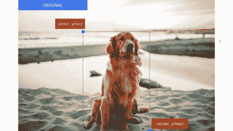
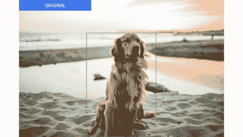
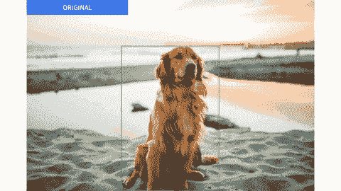
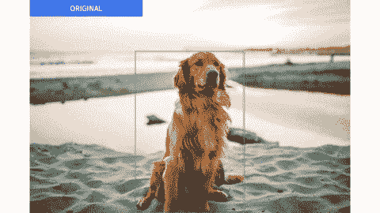
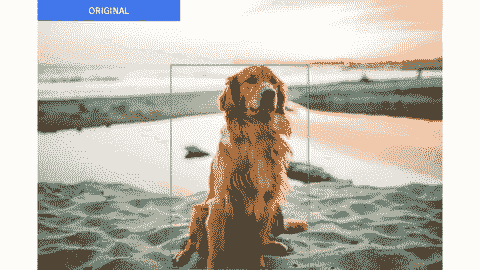
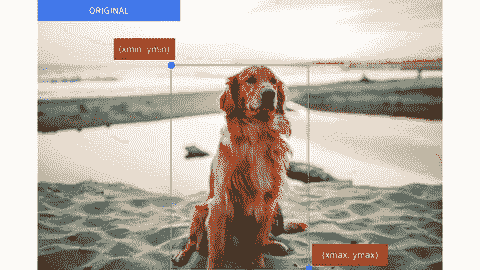

# 在 Keras 中实现单发探测器(SSD ):第四部分——数据扩充

> 原文：<https://towardsdatascience.com/implementing-single-shot-detector-ssd-in-keras-part-iv-data-augmentation-59c9f230a910?source=collection_archive---------28----------------------->

## [Keras 中的物体检测](https://towardsdatascience.com/tagged/object-detection-in-keras)

## 用于增加 SSD 网络的训练样本的 Python 代码

由作者编辑。来源:[贾斯汀·艾金](https://unsplash.com/@justnjames)

# 一.导言

在本系列的最后三部分中，我们已经完成了 SSD 网络训练的完整管道。我们对 SSD 网络、其损失函数进行编码，并将数据样本格式化/准备成适合训练的格式。虽然仅使用这些组件设置来训练网络是可能的，但 SSD 的作者建议，数据增强是提高网络泛化能力的关键(刘，Anguelov，Erhan，Szegedy，Reed，Fu & Berg，2016)。因此，本文主要关注 SSD 论文中提到的光度增强和几何增强这两种数据增强技术。

> *这篇文章是一个更大的系列的一部分，叫做在 Keras 中实现单次检测器(SSD)。下面是系列*的概要
> 
> [*第一部分:网络结构*](/implementing-ssd-in-keras-part-i-network-structure-da3323f11cff?sk=2d12a3f967fd6f1c32518b30c56d0ca5)[*第二部分:损失函数*](/implementing-single-shot-detector-ssd-in-keras-part-ii-loss-functions-4f43c292ad2a?sk=5e1265989a1e250844b0674dc670f234)[*第三部分:数据准备*](/implementing-single-shot-detector-ssd-in-keras-part-iii-data-preparation-624ba37f5924?sk=39164c76031c0f60785dd3aa559cc2a6) *第四部分:数据扩充(本文)* [*第五部分:预测解码*](/implementing-single-shot-detector-ssd-in-keras-part-v-predictions-decoding-2305a6e4c7a1?sk=4c80a5b66d49fee2055b98437d4ca474)[*部分*](/implementing-single-shot-detector-ssd-in-keras-part-vi-model-evaluation-c519852588d1?sk=797df0a4bf29d36ddd1e7ee9fe5c81a3)

> 注意:尽管这篇文章单独讨论了每种增强技术中的不同方法，但在实践中，这些方法被链接在一起以创建一个增强管道，该管道能够产生足够随机化的新图像来训练 SSD 网络。

# 二。光度增强

光度增强通过转换原始图像的 RGB 通道来生成新的数据样本。这是通过将每个原始像素值( *r* 、 *g* 、 *b* )转换成新的像素值(*r′*、*g′*、*b′*)(泰勒&尼茨克，2015)。在对象检测中，这种增强技术影响原始图像的照明和颜色，但是不影响图像内对象周围的边界框。当我们想要用各种颜色和光照条件描绘物体时，这种增强技术是有用的。我们可以使用许多方法来转换图像，以实现光度增强。本节的剩余部分将讨论:随机亮度、随机对比度、随机色调、随机照明噪声和随机饱和度。

## 随机亮度

图 1:改变图像亮度的效果。由作者编辑。来源:[贾斯汀·艾金](https://unsplash.com/@justnjames)

这种光度增强的方法是在原始像素值( *r* 、 *g* 、 *b* )的 *[-255，255】*范围内增加一个*δ*值。如果*δ*为正值，新图像将比原始图像更亮。相反，负的*δ*值会使新图像看起来比原始图像更暗。

## 随机对比

图 2:改变图像对比度的效果。由作者编辑。来源:[贾斯汀·艾金](https://unsplash.com/@justnjames)

这种光度增强方法通过将那些像素值乘以系数*δ*来减少或增加原始像素值( *r* 、 *g* 、 *b* )，其中*δ≥0*。当*0≤δ<1，*新图像中的暗区和亮区之间的区别没有原始图像中的明显。另一方面，当*δ>1*时，新图像中的暗区域和亮区域变得比原始图像中更清晰。

## 随机色调

图 3:改变图像色调的效果。由作者编辑。来源:[贾斯汀·艾金](https://unsplash.com/@justnjames)

要使用此方法实现光度增强，需要对原始图像的色调通道进行更改。更具体地，为了产生新的图像，将在 *[-360，360]* 范围内的*δ*值添加到原始图像的色调通道中的像素值。这导致在色轮上顺时针或逆时针移动图像的色调通道。

## 随机照明噪声

图 4:交换图像通道的效果。由作者编辑。来源:[贾斯汀·艾金](https://unsplash.com/@justnjames)

这种光度增强方法可以通过交换原始图像的不同通道(RGB)的顺序来实现。类似于随机色调，这种方法允许模型关注对象的形状而不是它们的颜色。

## 随机饱和

图 5:改变图像饱和度的效果。由作者编辑。来源:[贾斯汀·艾金](https://unsplash.com/@justnjames)

为了执行这种光度增强方法，通过将那些像素值乘以因子*δ*来增加或减少原始图像的饱和度通道的像素值，其中*δ≥0*。当*0≤δ<1，*新图像的颜色比原始图像更加柔和/苍白。相比之下，当*δ>1*时，新图像中的颜色比原始图像更强烈/更鲜明。

# 三。几何增强

几何增强通过将原始图像中的每个像素映射到新图像中的新位置来生成新的数据样本(Taylor & Nitschke，2015)。这种增强过程会影响对象周围边界框的几何形状，但这些对象的类别保持不变。当我们想要以各种形状和大小描绘对象时，这种增强技术是有用的。像光度增强一样，我们也可以使用许多方法来实现几何增强。这部分包括:随机垂直和水平翻转，随机扩展和随机裁剪。

## 随机垂直和水平翻转

图 6:垂直和水平翻转图像的效果。由作者编辑。来源:[贾斯汀·艾金](https://unsplash.com/@justnjames)

这种几何增强方法在给定的轴上镜像原始图像。对于垂直翻转，轴是水平轴。至于水平翻转，镜像轴是垂直轴。在这两种情况下，对象周围的边界框需要相对于相同的轴进行镜像。

## 随机扩展

图 7:扩展图像的效果。由作者编辑。来源:[贾斯汀·艾金](https://unsplash.com/@justnjames)

为了使用这种方法实现几何增强，原始图像被放置在比原始图像大一倍*δ*的新图像内，其中*δ≥1*。由于原始图像将不能覆盖新图像的所有区域，所以新图像上的剩余像素值被设置为平均像素值(例如，对于 ImageNet 平均值为[0.485，0.456，0.406])*。*

## 随机作物

图 8:裁剪图像的效果。由作者编辑。来源:[贾斯汀·艾金](https://unsplash.com/@justnjames)

这种放大方法裁剪原始图像的某一部分，以创建可以具有不同纵横比的新图像。除非裁剪中存在对象，否则裁剪是有效的。要被视为包含在裁剪内，对象边界框的中心必须在裁剪内。此外，裁剪和对象边界框之间的重叠(IOU)必须超过随机选择的某个阈值。同样，作物的长宽比也是随机选择的。

# 四。结论

总之，这篇文章展示了许多用于实现光度和几何增强的方法。此时，我们可以有效地训练 SSD 网络。在下一篇文章中，我们将研究如何解码网络产生的结果。

*喜欢这篇文章，想表示你的支持？关注我或者给我买咖啡*

# 参考

KDNuggets。(2018).包围盒的数据扩充:重新思考对象检测的图像变换。检索自[https://www . kdnugges . com/2018/09/data-augmentation-bounding-box-image-transforms . html/2](https://www.kdnuggets.com/2018/09/data-augmentation-bounding-boxes-image-transforms.html/2)

刘，w，安盖洛夫，d，尔汉，d，塞格迪，c，里德，s，傅，C.Y，&伯格，A. C. (2016)。SSD:单次多盒探测器。[https://arxiv.org/abs/1512.02325](https://arxiv.org/abs/1512.02325)

像素杂志。(2017).摄影师的饱和度和饱和度指南(及其差异)。检索自:[https://medium . com/the-coffeelicious/a-photos-guide-to-vibrance-and-saturation-and-thes-differences-4 FDE 529 cc 19](https://medium.com/the-coffeelicious/a-photographers-guide-to-vibrance-and-saturation-and-their-differences-4fde529cc19)

泰勒和尼茨克(2015 年)。使用通用数据增强改进深度学习。[https://arxiv.org/pdf/1708.06020.pdf](https://arxiv.org/pdf/1708.06020.pdf)

远程传感器。(2018).SSD(单发探测器)中的数据增强。检索自:[https://www . telesens . co/2018/06/28/data-augmentation-in-SSD/# RandomLightingNoise](https://www.telesens.co/2018/06/28/data-augmentation-in-ssd/#RandomLightingNoise)