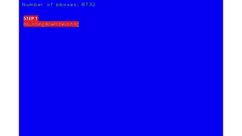
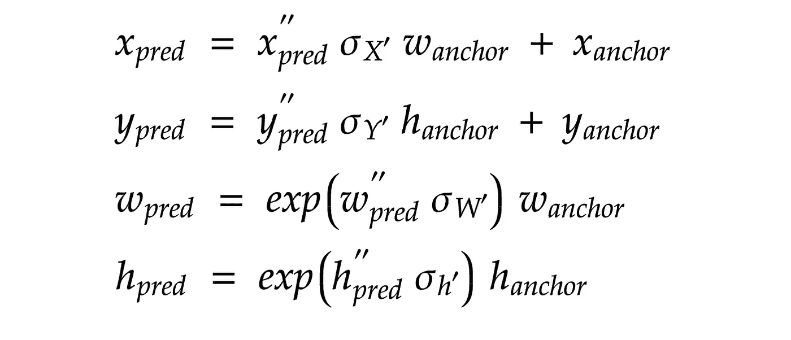

# 在 Keras 中实现单触发检测器(SSD ):第五部分——预测解码

> 原文：<https://towardsdatascience.com/implementing-single-shot-detector-ssd-in-keras-part-v-predictions-decoding-2305a6e4c7a1?source=collection_archive---------26----------------------->

## [Keras 中的物体检测](https://towardsdatascience.com/tagged/object-detection-in-keras)

## 构建 Keras 层以解码由 SSD 网络产生的预测

预测解码过程。由作者编辑。来源:[玛西娅·索利戈](https://unsplash.com/@marciasoligo)

# 一.导言

根据前面的四篇文章，我们能够训练 SSD 网络，并生成能够根据输入图像进行预测的模型权重文件。对于具有 VGG16 主干的 SSD300，网络产生(8732 * num_classes+1)个预测。显然，这是一个巨大的数量，其中大部分需要过滤掉。因此，本文将概述解码和过滤这些初步预测的步骤。此外，本文还提供了创建 Keras 层的代码片段，以达到同样的目的。

> *这篇文章是一个更大的系列的一部分，叫做在 Keras 中实现单次检测器(SSD)。下面是系列*的概要
> 
> [*第一部分:网络结构*](/implementing-ssd-in-keras-part-i-network-structure-da3323f11cff?sk=2d12a3f967fd6f1c32518b30c56d0ca5)[*第二部分:损失函数*](/implementing-single-shot-detector-ssd-in-keras-part-ii-loss-functions-4f43c292ad2a?sk=5e1265989a1e250844b0674dc670f234)[*第三部分:数据准备*](/implementing-single-shot-detector-ssd-in-keras-part-iii-data-preparation-624ba37f5924?sk=39164c76031c0f60785dd3aa559cc2a6)[*第四部分:数据扩充*](/implementing-single-shot-detector-ssd-in-keras-part-iv-data-augmentation-59c9f230a910?sk=cf25ff5e9e78ea56415f1f4c8be1fa32) *第五部分:预测解码(本文)* [*部分*](/implementing-single-shot-detector-ssd-in-keras-part-vi-model-evaluation-c519852588d1?sk=797df0a4bf29d36ddd1e7ee9fe5c81a3)

# 二。该算法

为了对 SSD 网络输出的预测进行解码，SSD 的作者设计了一种算法，该算法包括 4 个步骤:包围盒解码、置信阈值、非最大值抑制和 Top-K 滤波。下面详细讨论这些步骤。

> 下面的代码片段是基于 NumPy 的。下一节将把这些代码片段转换成 Keras，并把它们放到 Keras 的层中。
> 
> 本文中显示的所有代码都可以在这个回购:[https://github.com/Socret360/object-detection-in-keras](https://github.com/Socret360/object-detection-in-keras)。GitHub repo 中的许多代码都是从 https://github.com/pierluigiferrari/ssd_keras 的[中获取并修改而来的。](https://github.com/pierluigiferrari/ssd_keras)

## 步骤 1:边界框解码

图 1:解码 ssd(带有标准偏差编码的质心)边界框的公式。由作者创建。

从该系列的[第三部分](/implementing-single-shot-detector-ssd-in-keras-part-iii-data-preparation-624ba37f5924?sk=39164c76031c0f60785dd3aa559cc2a6)中，我们了解到 SSD 的预测是用标准差进行质心编码的。因此，第一步是解码那些编码的预测，使它们回到 *cx，cy，width，height* 的格式。这可以通过图 1 所示的公式来完成。

## 步骤 2:置信度阈值(针对每个类别)

在解码包围盒预测之后，我们需要移除置信度得分低于特定阈值的包围盒。这个过滤过程是针对每个类进行的。由于 SSD 网络通过 Softmax 函数([第二部分](/implementing-single-shot-detector-ssd-in-keras-part-ii-loss-functions-4f43c292ad2a?sk=5e1265989a1e250844b0674dc670f234))产生类别预测，我们可以通过特定类别在 Softmax 输出中的位置来获得其置信度得分。这个置信度分数告诉我们，模型有多确定该特定的对象存在于边界框内。下面的代码片段假设您已经创建了一个形状为(total_default_boxes，1 + 4)的 y_pred numpy 数组，其中 1 是我们感兴趣的类的*置信度得分*的，4 是 *xmin、ymin、xmax、ymax* 值。

## 步骤 3:非最大抑制(针对每个类别)

一旦我们过滤掉了类别置信度较低的包围盒，我们就需要将重叠的包围盒合并在一起。这个过程被称为非最大值抑制(NMS)。通过将重叠的预测合并成一个预测，有助于进一步减少预测的数量。类似于本系列第三部分中的将默认框与基础真值框匹配的过程，为了测量两个边界框预测之间的重叠程度，我们计算它们之间的 IOU。以下代码片段执行了 NMS 版本:

## 步骤 4: Top-K 选择

即使在对每个类别执行置信度阈值和 NMS 之后，剩余预测的数量仍然可能是巨大的。然而，这些预测中的大多数是不需要的，因为可以出现在图像中的(我们感兴趣的)物体的数量是有限的。因此，我们可以根据它们的置信分值对这些预测进行排序，并选择最高置信分值的 *k* 。

## 第五步:产生最终结果

顶部 K 选择产生 *k* 预测。这些 *k* 预测每一个都有一定的置信度得分。为了产生最终结果，我们进一步缩小了预测的范围，只选择那些置信度高于某个阈值的预测。通常，该阈值是通过在模型评估期间选择产生最高贴图的阈值来选择的。我们将在下一篇文章中讨论如何评估这个模型。

# 三。Keras 的 SSD 预测解码层

在理解了解码 SSD 预测的每一个步骤之后，我们可以将它们放在一个 Keras 的层中。为解码过程创建 Keras 层的好处是，我们可以创建一个内置解码过程的模型文件。当我们想要在不同的平台上部署模型时，这是很有用的。下面是对 SSD 输出的预测进行解码的 Keras 层。

# 四。结论

本文概述了对 SSD 网络产生的预测进行解码的步骤，并提供了代码片段，说明如何实现 Keras 层来实现这一目的。在下一篇文章中，我们将学习如何评估模型的性能。

*喜欢这篇文章并想表达您的支持？关注我或者给我买咖啡*

# 参考

毛，L. (2019)。*物体检测中的包围盒编码和解码*。检索自[https://lei Mao . github . io/blog/Bounding-Box-Encoding-Decoding/](https://leimao.github.io/blog/Bounding-Box-Encoding-Decoding/)

Sambasivarao。K. (2019 年 10 月 1 日)。*非最大抑制(NMS)* 。走向数据科学。检索自[https://towardsdatascience . com/non-maximum-suppression-NMS-93ce 178 e 177 c](/non-maximum-suppression-nms-93ce178e177c)