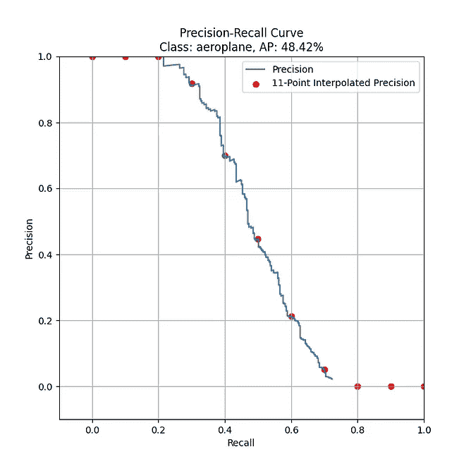
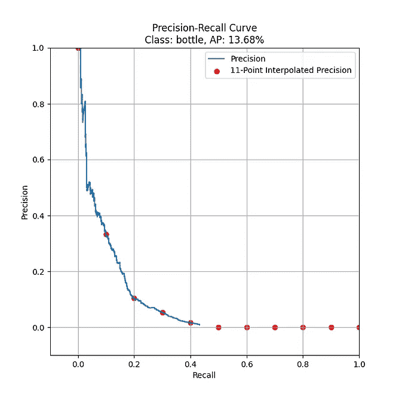

# 在 Keras 中实现单触发探测器(SSD ):第六部分——模型评估

> 原文：<https://towardsdatascience.com/implementing-single-shot-detector-ssd-in-keras-part-vi-model-evaluation-c519852588d1?source=collection_archive---------14----------------------->

## [Keras 中的物体检测](https://towardsdatascience.com/tagged/object-detection-in-keras)

## 评估经过训练的 SSD 模型

在 PASCAL VOC 2007 trainval 上训练的 SSD300-VGG16 的图在测试集上评估。图片作者。

# 一.导言

在本系列的前几部分中，我们深入探讨了 SSD 背后的概念以及这些概念是如何在代码中实现的。通过这个，我们能够构建 SSD 网络，训练它产生一个 Keras 模型，我们可以用它来进行预测。然而，我们仍然需要弄清楚模型的表现有多好。要回答这个问题，我们需要执行一个评估过程。目标检测的不同竞争/挑战有其自己的一套评估指标。由于在之前的文章中，我们在 PASCAL VOC 数据集上训练了我们的 SSD 网络，因此本文重点关注理解 PASCAL VOC 挑战评估过程所需的概念。特别地，我们将详细了解如何计算目标检测模型的*平均精度(mAP)* 。

> **注意:**除了 PASCAL VOC challenge 为本次评估提供的 Matlab 代码，您还可以在评估过程中使用其他开源工具(例如[review _ object _ detection _ metrics](https://github.com/rafaelpadilla/review_object_detection_metrics))。**此处**的目标是让您了解地图指标的使用和计算方式，以便您能够解读评估结果。
> 
> *本文是一个更大的系列的一部分，称为在 Keras 中实现单次检测器(SSD)。以下是系列*的概要
> 
> [*第一部分:网络结构*](/implementing-ssd-in-keras-part-i-network-structure-da3323f11cff?sk=2d12a3f967fd6f1c32518b30c56d0ca5)[*第二部分:损失函数*](/implementing-single-shot-detector-ssd-in-keras-part-ii-loss-functions-4f43c292ad2a?sk=5e1265989a1e250844b0674dc670f234)[*第三部分:数据准备*](/implementing-single-shot-detector-ssd-in-keras-part-iii-data-preparation-624ba37f5924?sk=39164c76031c0f60785dd3aa559cc2a6)[*第四部分:数据扩充*](/implementing-single-shot-detector-ssd-in-keras-part-iv-data-augmentation-59c9f230a910?sk=cf25ff5e9e78ea56415f1f4c8be1fa32)[*第五部分:预测解码*](/implementing-single-shot-detector-ssd-in-keras-part-v-predictions-decoding-2305a6e4c7a1?sk=4c80a5b66d49fee2055b98437d4ca474) *第六部分*

# 二。计算地图:一个简单的例子

图 1:类别“dog”的检测结果。图片作者。来源:[丹尼尔·林肯](https://unsplash.com/photos/F0a5b3DAoOU?utm_source=unsplash&utm_medium=referral&utm_content=view-photo-on-unsplash&utm_campaign=unsplash-ios)，[埃莉诺拉·卡塔拉诺](https://unsplash.com/photos/yQutKDW3H6U?utm_source=unsplash&utm_medium=referral&utm_content=view-photo-on-unsplash&utm_campaign=unsplash-ios)，[张轩睿](https://unsplash.com/photos/k9JXiwocnLg?utm_source=unsplash&utm_medium=referral&utm_content=view-photo-on-unsplash&utm_campaign=unsplash-ios)，[贾卡琳·比厄斯](https://unsplash.com/photos/CKsDMYPDgCs?utm_source=unsplash&utm_medium=referral&utm_content=view-photo-on-unsplash&utm_campaign=unsplash-ios)

图 2:类别“cat”的检测结果。图片作者。来源:[丹尼尔·林肯](https://unsplash.com/photos/F0a5b3DAoOU?utm_source=unsplash&utm_medium=referral&utm_content=view-photo-on-unsplash&utm_campaign=unsplash-ios)，[埃莉诺拉·卡塔拉诺](https://unsplash.com/photos/yQutKDW3H6U?utm_source=unsplash&utm_medium=referral&utm_content=view-photo-on-unsplash&utm_campaign=unsplash-ios)，[张轩睿](https://unsplash.com/photos/k9JXiwocnLg?utm_source=unsplash&utm_medium=referral&utm_content=view-photo-on-unsplash&utm_campaign=unsplash-ios)，[贾卡琳·比厄斯](https://unsplash.com/photos/CKsDMYPDgCs?utm_source=unsplash&utm_medium=referral&utm_content=view-photo-on-unsplash&utm_campaign=unsplash-ios)

为了更好地理解评估过程，让我们看一个简单的例子。假设我们为猫和狗这两个类训练了一个 SSD300-VGG16 模型。我们对模型在包含狗和猫的 4 幅图像的测试集上的表现感兴趣，因此我们在测试集中的所有图像中运行了我们训练的模型。基本事实边界框以绿色绘制，而检测(预测边界框)以红色绘制。图 1 显示了一组图像，这些图像显示了“狗”类的所有检测及其基本事实。类似地，图 2 显示了一组图像，这些图像显示了“cat”类的所有检测及其基本事实。我们可以看到总共有 12 个检测(5 猫 7 狗)和 7 个地面真相盒(4 猫 3 狗)。此外，如前几篇文章所述，每个检测都有一个置信度得分。请记住这些数字，因为它将在下面的步骤中对我们有用。

## 步骤 1-确定“狗”类的 AP

## 1.1-将每个“狗”检测状态确定为 TP 或 FP

在评估过程中，我们需要完成的第一件事是确定哪些检测是“正确的”，哪些是“不正确的”。这就是混淆矩阵的由来。一个类别(例如狗)的混淆矩阵将该类别的所有检测分为四类:真阳性(TP)、真阴性(TN)、假阳性(FP)和假阴性(FN)。在对象检测设置中，

*   **真阳性(TP)** —真实边界框的正确检测。
*   **误报(FP)** —对不存在的对象的错误检测或对现有对象的错误检测。
*   **假阴性(FN)** —一个未被检测到的真实边界框。
*   **真底片(TN)** —不适用，因为在一幅图像中有无限数量的边界框需要检测。

为了将检测分类为阳性或阴性，使用预测边界框和基本事实框之间的 IOU。PASCAL VOC 挑战将 IOU 阈值设置为 50% (Everingham 等人，2009 年)。如果有两个或更多的检测具有 50%或更高的 IOU，并且具有相同的基本事实，那么具有最高 IOU 的检测被标记为 TP，而所有其他的被标记为 FP。在我们的例子中，IOU 阈值设置为 30%，而不是 50%。浏览所有的检测和地面真理，我们有以上的类“狗”，我们可以构建下表:

表 1:“狗”类的检测及其 TP 和 FP 状态

请注意，检测列表也是按置信度得分降序排列的(从大到小)。这样做是为下一步做准备，在下一步中，我们需要计算所有置信度下的精确-召回对。

## 1.2 —计算每个置信度级别的精确度/召回率

> 你可以试试这个互动演示来更直观地了解精确/召回是如何工作的。

图 3:计算精度和召回率的公式。图片作者。

知道每个检测的 TP 和 FP 状态并不能为我们提供关于模型性能的任何有价值的信息。我们需要能够将这些检测的状态合并到一个指标中。为了解决这个问题，可以使用信息检索领域中的精确度和召回率之间的关系。在对象检测的情况下:

*   **精度** —测量模型仅识别相关对象的能力。(帕迪拉等人，2020 年)
*   **回忆**——测量一个模型找到所有相关案例(所有真实边界框)的能力(Padilla 等人，2020)

根据上述概念，我们需要确定哪些检测是“相关”的，哪些是“不相关”的。为此，我们使用每个检测附带的置信度阈值(𝜏)。置信度得分≥ 𝜏的检测将被认为是相关的，而置信度得分

表 2:“狗”类的检测，它们的 TP 和 FP 状态，以及在每个置信度阈值的精度/召回值。作者图片

由于 1.1 中的列表是按照置信度得分以降序排序的，因此计算每个置信度得分级别的精确召回对只是遍历列表(自上而下)，同时在每次迭代中将要考虑的项目数(从 1 开始)增加 1。因此，在第一次迭代中，要考虑的检测数量将仅为 1(检测 B)。因此，在这个置信度级别的精度是 1.00，而召回率是 0.33。在第二次迭代中，要考虑的检测的数量增加到 2(检测 B 和检测 E ),给我们 1.00 的精确度和 0.66 的召回率。重复这个过程，直到所考虑的项目数等于列表的大小。

## 1.3-绘制精度-召回(PR)曲线

计算特定置信度级别的精度和召回率，可以告诉我们特定类别的模型在特定置信度阈值下的性能。然而，要了解模型在特定类别上跨所有置信度得分阈值的整体性能，我们可以转向精确召回(PR)曲线。它显示了精确度和召回率之间的权衡。为了构建曲线，我们可以在不同的置信度下绘制精度/召回率对。PR 曲线向右上角倾斜得越多越好，因为它表明模型很可能识别相关对象(高精度)，同时还能够找到所有相关对象中的大多数(高召回率)。对于我们的示例，类别“dog”的 PR 曲线如下所示:

图 4:“狗”类的精确召回曲线。作者图片

## 1.4-确定的 11 点插值精度/召回对和 AP

我们可以通过估计曲线的曲线下面积(AUC)将 PR 曲线的特征总结为一个值。AUC 值越大，该模型在所有阈值范围内对该类别的表现越好。尽管在 PR 曲线中精度和召回率之间存在权衡关系，但精度值可能会随着召回率值的增加而降低，也可能不会。这导致曲线有时具有之字形图案，这对于估计 AUC 来说不是直线的。为了解决这个问题，PASCAL VOC 挑战赛使用了 11 点插值平均精度(AP)方法。这种方法通过对一组 11 个等距召回水平的最大精度值进行平均来总结 PR 曲线(Padilla 等人，2020)。特定召回级别的最大精度值是该召回级别右侧的最大精度值。此外，由于回忆范围从 0 到 1，11 个等间隔的回忆水平是[0，0.1，0.2，… 0.8，0.9，1]。较高的 AP 值(接近 1)意味着该模型对于该特定类别具有较高的召回率和精确度。在我们的示例中，11 点插值精度是下图中的红点:

图 5:具有 11 点插值精度的“dog”类的精度-召回曲线。作者图片

因此，在我们的例子中，类“dog”的 AP 是:(1+1+1+1+1+1+0+0+0+0)/11 = 0.63 = 63%。

## 步骤 2—确定“cat”类别的 AP

为了确定类别“cat”的 AP，我们简单地再次重复步骤 1，其中我们的检测和基础事实列表是类别“cat”。通过这种方式，我们确定“cat”类的 AP 为 45%。

表 3:类别“cat”的检测，它们的 TP 和 FP 状态，以及在每个置信度阈值的精度/召回值。作者图片

图 6:具有 11 点插值精度的“cat”类的精度-召回曲线。作者图片

## 步骤 3-计算地图

在估计了每个类的 AP 之后，我们可以通过计算 mAP 来总结模型跨所有类的性能，mAP 的值也在 0 到 1 的范围内。它只是所有班级 AP 的平均值。高 mAP 值(接近 1)意味着模型在所有类别中表现良好。因此，在我们的例子中，模型的映射是(63 + 45) / 2 = 54%。

图 7:类别“猫”和“狗”的精确回忆曲线。作者图片

# 三。SSD300-VGG16 经过 PASCAL VOC 2007 培训

> 我用来执行评估过程的代码可以在 [evaluate.py](https://github.com/Socret360/object-detection-in-keras/blob/master/evaluate.py) 中找到。

在从上述示例中了解了 mAP 计算之后，我将使用这一部分展示我在 PASCAL VOC 2007 trainval 数据集上训练的 SSD300-VGG16 模型的评估结果(批处理大小= 32，epochs = 275 ≈ 42k 迭代),并提供我对如何改进它的一些意见。评估是在同一数据集的测试集上完成的。SSD 模型产生的检测数量设置为 200(与 SSD 纸张相同),而 IOU 阈值设置为 50%,如 PASCAL VOC 挑战中一样。

图 8:在 PASCAL VOC 2007 trainval 上训练的 SSD300-VGG16 的图。图片作者。

图 PASCAL VOC 2007 数据集中 20 个类的精确召回曲线。图片作者。

很明显，一张 38.58%的地图与 SSD 的作者在他们的论文中所展示的(68%的地图)并不相符。以下是我对如何改进结果的看法:

1.  **进一步的训练:**由于时间/资源的限制，我在 42k 迭代时停止了我的训练。我相信进一步的训练可以改进模型的映射，因为 1)当我停止训练时，训练损失和验证损失仍然在很好地减少 SSD 的作者在没有随机扩展增强的情况下训练相同的模型配置多达 60k 次迭代，在有随机扩展增强的情况下训练多达 120k 次迭代。
2.  **改进数据扩充和生成器:**数据生成器的当前实现没有考虑过小的边界框或退化框(具有 xmax < xmin 和 ymax < ymin 的框)。移除这样的边界框将有助于模型产生更好的边界框预测。此外，可以改进增强管道，以更好地匹配 SSD 的原始 Caffe 实现中所示的管道。此外，在训练过程中使用的增强方法的更有效的实现也可以帮助加速训练过程。

# 三。结论

这标志着“在 Keras 中实现单次检测器(SSD)”系列的结束。就我个人而言，在这个系列的工作中，我学到了很多关于 SSD 的知识。因此，我希望这一系列文章对您有所帮助，就像它对我一样，帮助您实现了解 SSD 并自己实现它的目标。

*喜欢这篇文章，想表示你的支持？关注我或者给我买咖啡*

# 参考

j .戴维斯和 m .戈德里奇(2006 年)。精确回忆与 ROC 曲线的关系。*2006 年 ICML 第 23 届国际机器学习会议论文集。[https://doi.org/10.1145/1143844.1143874](https://doi.org/10.1145/1143844.1143874)*

Everingham，m .，Van Gool，l .，Williams，C. K .，Winn，j .，& Zisserman，A. (2009 年)。Pascal 视觉对象类(VOC)挑战。*国际计算机视觉杂志*， *88* (2)，303–338。[https://doi.org/10.1007/s11263-009-0275-4](https://doi.org/10.1007/s11263-009-0275-4)

Géron，A. (2020)。第 1 章——机器学习的前景。在*使用 Scikit-Learn、Keras 和 TensorFlow 进行机器实践学习:构建智能系统的概念、工具和技术*(第 3–34 页)中。论文，奥赖利。

谷歌。(未注明)。*分类:真与假、正与负*。谷歌。[https://developers . Google . com/machine-learning/速成课程/分类/真-假-正-负。](https://developers.google.com/machine-learning/crash-course/classification/true-false-positive-negative.)

谷歌。(未注明)。*评估模型|自动视觉物体检测|谷歌云*。谷歌。[https://cloud . Google . com/vision/automl/object-detection/docs/evaluate。](https://cloud.google.com/vision/automl/object-detection/docs/evaluate.)

马纳尔·埃尔·艾杜尼。(未注明)。[https://manalelaidouni.github.io/.](https://manalelaidouni.github.io/.)

r .帕迪拉，Netto，S. L .，& da Silva，E. A. (2020 年)。目标检测算法的性能度量综述。 *2020 年系统、信号和图像处理国际会议(IWSSIP)* 。【https://doi.org/10.1109/iwssip48289.2020.9145130 号

Phy，V. (2019 年 12 月 11 日)。*分类任务*精度不够。中等。[https://towardsdatascience . com/accuracy-is-not-sufficient-for-class ification-task-47 FCA 7d 6 a 8 EC。](/accuracy-is-not-enough-for-classification-task-47fca7d6a8ec.)

*精确召回*。sci kit-学习。(未注明)。[https://sci kit-learn . org/stable/auto _ examples/model _ selection/plot _ precision _ recall . html](https://scikit-learn.org/stable/auto_examples/model_selection/plot_precision_recall.html.)

拉斐尔·帕迪拉。(未注明)。*rafaelpadilla/对象检测指标*。GitHub。[https://github.com/rafaelpadilla/Object-Detection-Metrics.](https://github.com/rafaelpadilla/Object-Detection-Metrics.)

t .沙阿(2020 年 7 月 10 日)。*关于机器学习中的训练、验证和测试集*。中等。[https://towards data science . com/train-validation-and-test-sets-72 CB 40 CBA 9 e 7。](/train-validation-and-test-sets-72cb40cba9e7.)

Solawetz，J. (2020 年 10 月 5 日)。*什么是物体检测中的平均精度(mAP)？* Roboflow 博客。[https://blog.roboflow.com/mean-average-precision/.](https://blog.roboflow.com/mean-average-precision/.)