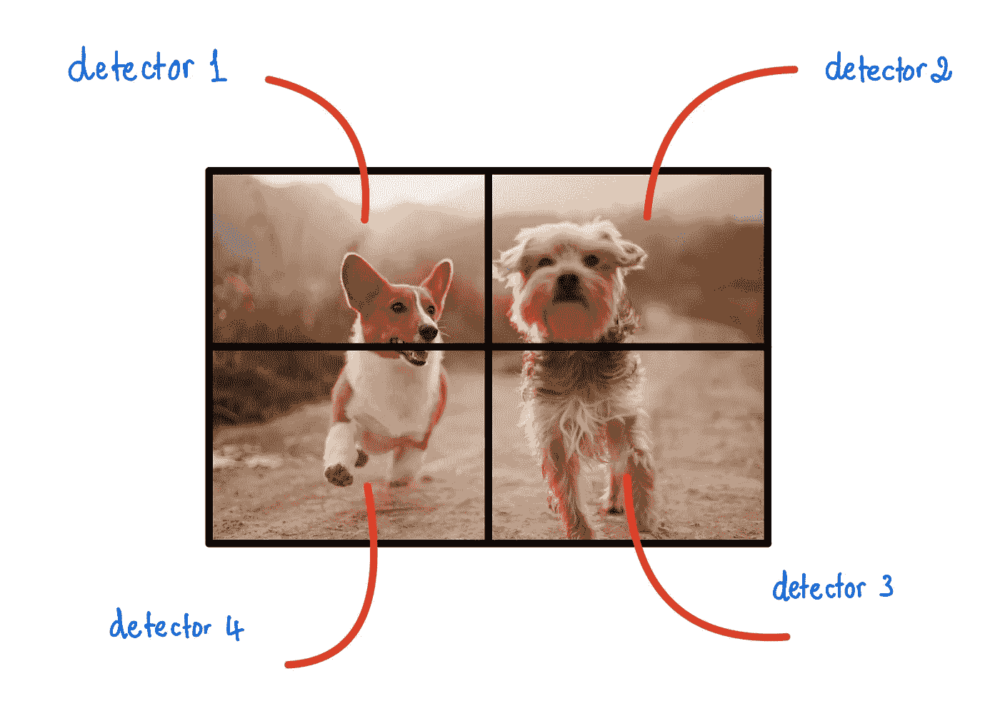
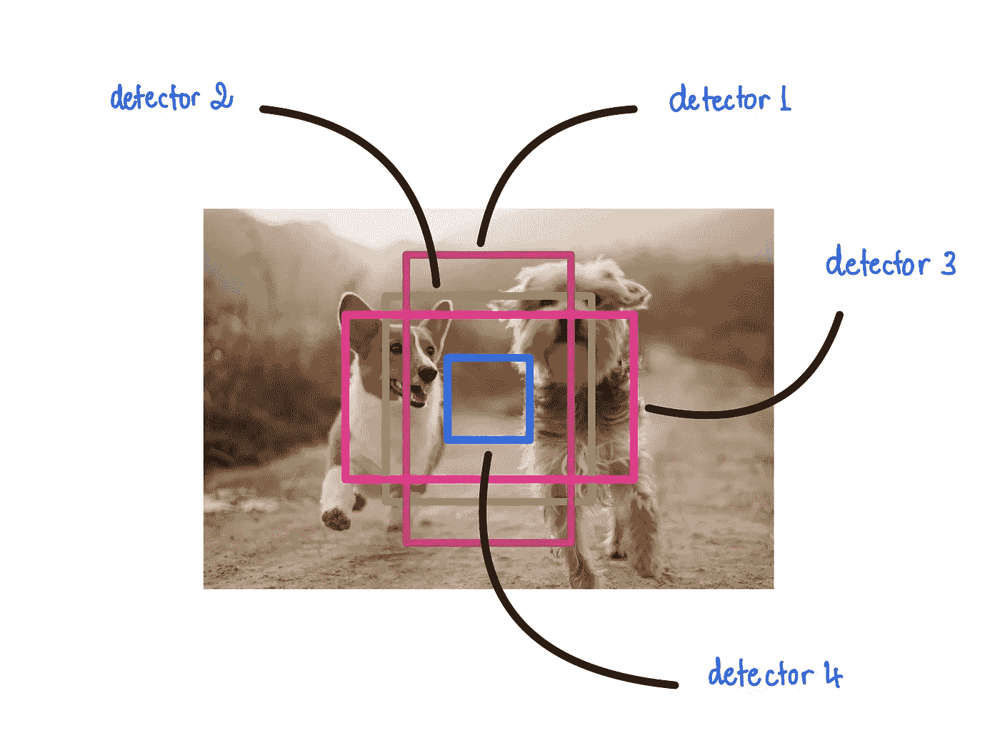
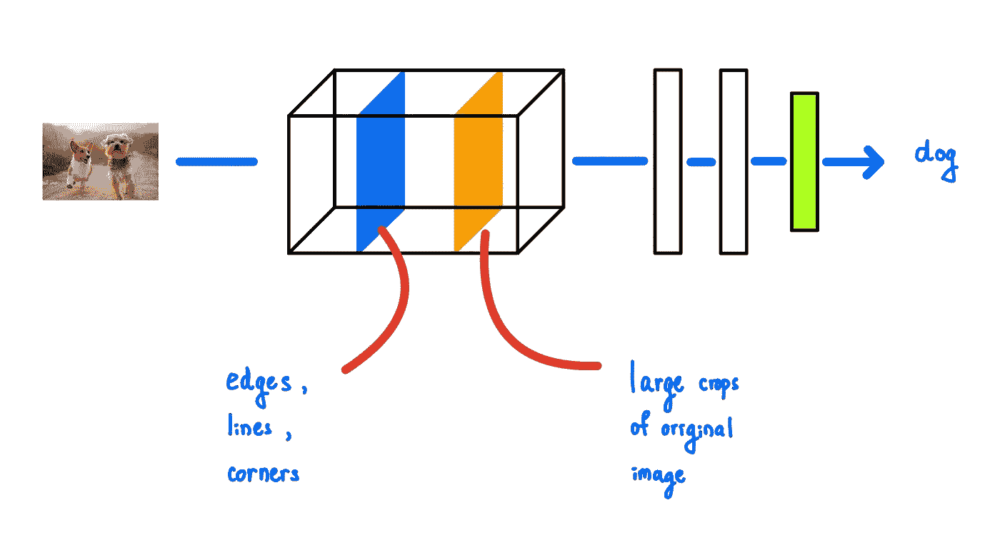
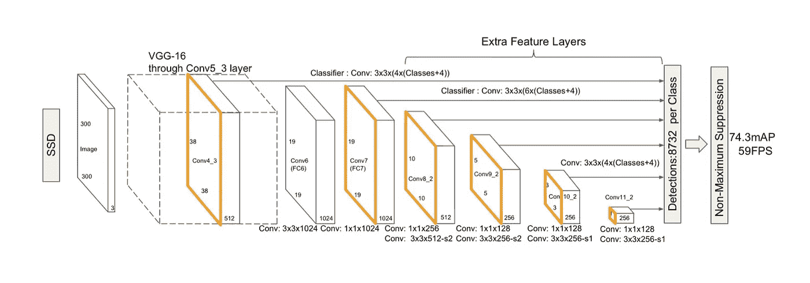
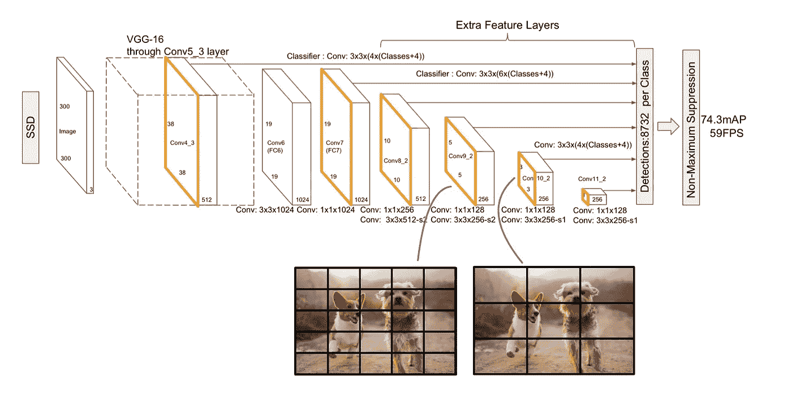
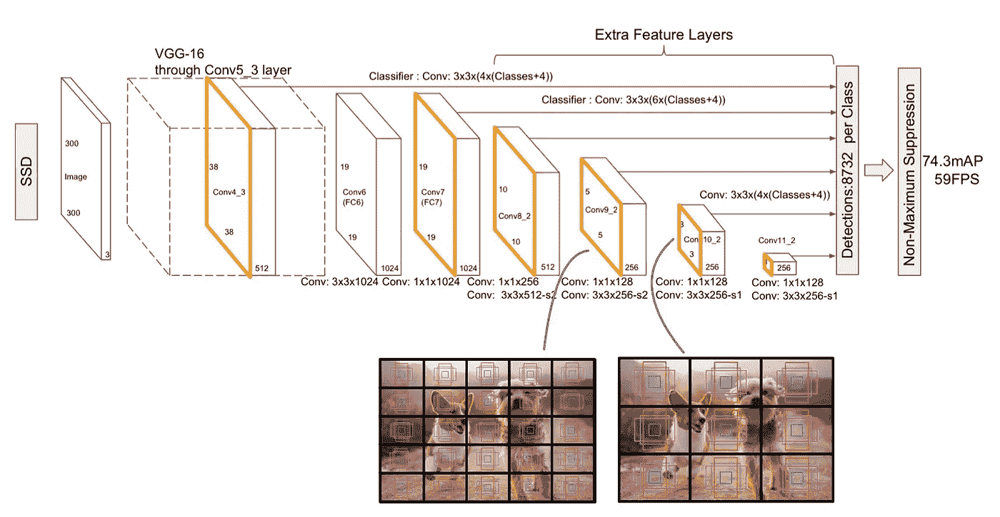
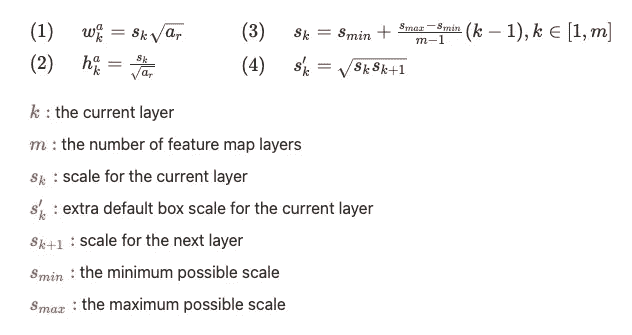

# 在 Keras 中实现单触发探测器(SSD ):第一部分——网络结构

> 原文：<https://towardsdatascience.com/implementing-ssd-in-keras-part-i-network-structure-da3323f11cff?source=collection_archive---------4----------------------->

## [Keras 中的物体检测](https://towardsdatascience.com/tagged/object-detection-in-keras)

## 在 Keras 中实施 SSD 网络

# 一.导言

当我试图在 Keras 中实现 SSD 时，我首先考虑的是 SSD 网络的结构。我只能通过首先理解所涉及的概念来理解 SSD 网络，这些概念包括网格检测器、默认框、特征图、基本网络和卷积预测器。因此，本文将首先讨论这些主要概念，然后再讨论它们如何构成 SSD 网络。本文将以在 Keras 中构建一个版本的 SSD 网络的代码示例结束。

> *这篇文章是一个更大的系列的一部分，叫做在 Keras 中实现单次检测器(SSD)。以下是系列*的概要
> 
> *第一部分:网络结构(本文)* [*第二部分:损失函数*](/implementing-single-shot-detector-ssd-in-keras-part-ii-loss-functions-4f43c292ad2a?sk=5e1265989a1e250844b0674dc670f234)[*第三部分:数据准备*](/implementing-single-shot-detector-ssd-in-keras-part-iii-data-preparation-624ba37f5924?sk=39164c76031c0f60785dd3aa559cc2a6)[*第四部分:数据扩充*](/implementing-single-shot-detector-ssd-in-keras-part-iv-data-augmentation-59c9f230a910?sk=cf25ff5e9e78ea56415f1f4c8be1fa32)[*第五部分:预测解码*](/implementing-single-shot-detector-ssd-in-keras-part-v-predictions-decoding-2305a6e4c7a1?sk=4c80a5b66d49fee2055b98437d4ca474)

# 二。概念

## 栅格探测器

图 1:网格检测器。输入图像被分成网格，以便检测不同位置的物体。来源: [Alvan Nee](https://unsplash.com/@alvannee)

训练对象检测模型的一种简单方法是将边界框预测器添加到现有的图像分类网络中。当输入图像中只有一个对象时，这种方法效果很好。当输入图像中有两个或更多对象时，模型将无法生成正确的边界框来覆盖这些对象。这是因为没有约束来帮助边界框预测器知道它负责预测哪个对象(Hollemans，2018)。网格检测器有助于对象检测模型检测不同位置的多个对象。这是通过将输入图像分成多个网格单元(例如 3×3、10×10)来完成的，其中每个网格单元具有其自己的简单对象检测模型。因此，使用 3×3 网格的对象检测模型对于每个单独的网格单元将具有 9 个简单的对象检测模型。每个检测器专门检测和分类落入各自网格单元内的对象。

> 要深入了解为什么网格探测器是有用的，请参考 Matthijs Hollemans 的这篇伟大的文章[单阶段物体探测](https://machinethink.net/blog/object-detection/)。

## 默认框

图 2:默认框。这些盒子以一定的偏移量(通常是中心)放置。来源: [Alvan Nee](https://unsplash.com/@alvannee)

再次想象通过仅仅将边界框预测器添加到图像分类模型来构建简单的对象检测模型。边界框预测器将很难预测具有许多不同形状的对象的边界框。虽然网格检测器允许对象检测模型检测输入图像上不同位置的对象，但是默认框允许对象检测模型检测具有不同形状的对象。这些默认框设置了更多的约束，允许边界框预测器仅专注于检测特定形状的对象(Hollemans，2018)。每个默认框的形状由其宽度和高度表示。每个默认框都有一个简单的对象检测模型，专门预测具有特定形状的对象。因此，使用 5 个默认框的对象检测模型将具有 5 个简单的对象检测模型，每个形状一个。我们稍后将研究如何选择这些盒子。

## 特征地图

图 3:特征地图。CNN 开头的特征映射对应于原始图像上的线条，而结尾的特征映射对应于更具描述性的特征。

CNN 中的每个卷积层都会产生一个相同比例的特征图(Seif，2019)。每个特征地图项目对应于输入图像上的特定位置/斑块(泽勒&弗格斯，2013 年)。CNN 中的卷积层越深，特征图的描述性就越强。在 CNN 的前几层中，这些层产生的特征地图项目对应于原始图像中的边缘、线或角的小块。在 CNN 的更下方，特征地图项目对应于输入图像上更大的补丁。这些大块可能是物体的一部分，甚至是完整的物体(泽勒&弗格斯，2013)。

## 基于 CNN 网络

基础网络(又名。主干网络)是一种 CNN 网络，用于对象检测中的特征地图提取(Amjoud & Amrouch，2020)。它们大多是为处理图像分类任务而开发的 CNN。这是因为在图像分类任务上表现良好的网络也被证明是对象检测模型的良好特征图提取器。流行的基础网络包括 AlexNet、VGG-16、ResNets、DarkNet-19、GoogLeNet、MobileNet、ShuffleNet 等。当训练对象检测模型(即 SSD)时，这些基本网络通常是预训练的，并且它们的权重在训练过程中保持不变。这些基本网络的预训练权重往往是在大型图像分类数据集(如 ImageNet、COCO 等)上训练的权重。这是因为由这些预先训练的权重产生的特征图已经显示为对象检测模型提供了有用的表示，以检测和分类新的或类似的对象。

## 卷积预测器

为处理图像分类任务而创建的 CNN 通过完全连接的层产生其最终输出。然而，全连接层的使用提出了两个主要问题。首先，它会导致特征地图所提供的空间信息的丢失(张、李普顿、李& Smola，2020)。第二，如果有大量的特征图，参数的数量会变得非常大。卷积预测器可以解决这些问题。不是将特征图展平成 1D 向量并将其馈入完全连接的层，而是使用小的卷积滤波器(例如大小为 1×1、3×3 等)来产生预测。由于我们没有将宽 x 高 x 通道大小的要素地图转换为完全连接图层的 1D 矢量，因此空间信息不会丢失。此外，如果我们使用完全连接的图层，大小为 38 x 38 x 512 的要素地图将产生 739，328 个参数，而不考虑我们需要预测的类的数量。另一方面，卷积预测器只会产生大小为 38 x 38 x num_classes 的预测。

# 三。SSD 网络结构

了解了上述概念后，我们可以开始研究这些部分如何组合在一起形成 SSD 网络结构。SSD 网络背后的核心思想是让 CNN 接受图像作为输入，并在不同的比例、形状和位置进行检测。

> SSD 的论文中提到了两个版本的 SSD:SSD 300 和 SSD500。下面，我们将只看 SSD300，因为两者之间唯一的主要区别是输入大小。

## 检测不同比例的物体

图 3:基于 VGG16 网络的 SSD300 的功能图。来源:

为了产生不同尺度的检测，SSD 网络使用来自修改的 VGG16 网络的不同层的特征图。VGG16 网络的变化包括:

*   通过使用阿特鲁卷积，VGG16 的 fc6 和 fc7 变成卷积层。
*   pool5 的池大小从(2，2)更改为(3，3)，步长为(1，1)。
*   VGG16 网络的 conv4_3 增加了 L2 归一化功能。然后，网络通过 SSD 的额外功能层进行扩展。

在 SSD 论文中，基础网络是 VGG16，更具体地说是 VGG16 配置 D(刘，安盖洛夫，尔汉，赛格迪，里德，傅，& Berg，2016)。即使选择的基础网络是 VGG16，SSD 的作者提到也可以使用任何其他基础网络(刘等人，2016)。由于每个特征映射项目对应于原始图像中的不同位置/小块，在网络起点的特征映射允许检测小物体，而在网络终点的特征映射允许检测大物体。用于利用 VGG16 基本网络构建 SSD300 的特性图为:conv4_3、fc7、conv8_2、conv9_2、conv10_2 和 conv11_2。

## 检测不同位置的物体

图 4:特征图的大小被用来将图像划分成网格。

为了在图像中产生不同位置的检测，SSD 网络使用网格检测器。特征图的前两个维度可以被认为是将输入图像划分成的网格大小。因此，38 x 38 x 512 的特征地图可以被视为将输入图像分成 38 x 38 的网格。conv4_3 的栅极尺寸为 38 x 38，fc7 为 19 x 19，conv8_2 为 10 x 10，conv9_2 为 5 x 5，conv10_2 为 3 x 3，conv11_2 为 1 x 1。这允许 SSD 网络检测每个要素地图图层的不同位置的对象。

## 检测不同形状的物体

图 5:默认框被添加到每个特征地图中的每个网格单元。

为了在图像中产生不同形状的检测，SSD 网络使用默认框。每个网格单元都被分配了 N 个默认框，其中心位于距网格单元一定偏移量处(通常是中心)。在 SSD 中，每个默认框的宽度和高度可以通过两个值来检索:框的纵横比和框相对于输入图像大小的比例(即，SSD300 为 300，SSD500 为 500，等等)(图 6，等式 1 和 2)。两个值(纵横比、比例)在不同的特征地图之间是不同的。特定要素地图的纵横比列表可通过查看数据集中对象的纵横比来确定，并由浮点值表示。在 SSD 论文中，对于在 Pascal VOC 数据集上训练的具有 VGG16 基础网络的 SSD300，作者说:

*“对于 conv4_3、conv10_2 和 conv11_2，我们仅在每个功能图位置关联 4 个默认框，忽略 1/3 和 3 的纵横比。对于所有其他层，我们放置 6 个默认框(1，2，3，2/3，1/3)。”*

图 6:计算默认框的宽度、高度和比例的公式。

同样，特定要素地图图层的默认框的比例由图 6 中的公式 3 确定。该公式的作用是根据 CNN 中的顺序输出要素地图的比例值。最低的要素地图的比例为 sₘᵢₙ，较高的图层的比例为 sₘₐₓ，而所有其他图层的比例值在 sₘᵢₙ和 sₘₐₓ.之间保持一定的间隔此外，对于默认框列表中长宽比为 1 的要素地图，作者添加了另一个长宽比为 1 的默认框，s'ₖ的比例由图 6 的等式 4 给出。

## 产生检测

在 SSD 中，预测的数量固定为( *total_default_boxes* ， *num_classes* + 1 + 4 + 8)，其中 *total_default_boxes* 是所有要素地图中默认框的总数，而 *num_classes* 是类的数量。为了对某个特征图进行预测，SSD 应用了两个小的 3 x 3 卷积滤波器:

*   3×3×(num _ default _ boxes * 4)来产生所有边界框的边界框预测。
*   3 x 3 x(num _ default _ boxes *(num _ classes+1))为数据集中的所有类加上一个背景类生成类预测。

然后，它使用过滤算法的组合来过滤掉这些预测。我们将在本系列的后续文章中研究如何过滤掉这些检测。

# 四。代码

> 本文中显示的所有代码都可以在这个回购:[https://github.com/Socret360/object-detection-in-keras](https://github.com/Socret360/object-detection-in-keras)。在本文中，我将展示代码的关键片段，并提供包含完整代码的相关文件的链接，而不是直接展示所有代码示例。这将确保文章不会因代码示例而过载。GitHub repo 中的许多代码都是从 https://github.com/pierluigiferrari/ssd_keras 的[中获取并修改而来的。](https://github.com/pierluigiferrari/ssd_keras)

代码示例将展示如何使用 VGG16 作为基础网络构建 SSD300。以下是我在工作时采取的步骤:

1.  创建一个配置文件来存储所有参数。
2.  构建所有必要的自定义 Keras 层，以完成 SSD 网络。其中包括:默认盒子层和 L2 规范化层
3.  构建固态硬盘网络

## 创建一个配置文件来存储所有参数

当我开始编写 SSD 网络结构时，我发现将所有必要的/参数分组到一个配置文件中很有帮助。我可以将这个配置文件加载到 python 字典中，然后将该字典传递给函数，而不是将大量参数传递给函数。你可以看一下 [ssd300_vgg16.json](https://github.com/Socret360/object-detection-in-keras/blob/master/configs/ssd300_vgg16.json) 作为这个文件的样本。将 json 文件加载到 python 字典中相对容易。您可以使用下面的代码来实现:

## 构建默认框和 L2 归一化图层

为了构建一个完整的 SSD 网络，我们需要首先构建 2 个自定义 Keras 层，它们是默认的盒子和 L2 归一化层。以下是需要这些层的原因:

**默认框层:**该层用于构建特征地图的默认框。在训练阶段，不需要该层的值。然而，在推断阶段，来自该层的值对于解码由网络产生的边界框预测将是至关重要的。关于构建该层的完整代码，您可以参考 [default_boxes.py](https://github.com/Socret360/object-detection-in-keras/blob/master/custom_layers/default_boxes.py) 。

**L2 归一化层:**该层用于应用带有可学习标度值的 L2 归一化。它将仅用于 conv4_3 要素地图图层。据作者称，

*“与其他图层相比，conv4_3 具有不同的特征比例，我们使用 L2 归一化技术将特征图中每个位置的特征范数缩放至 20，并在反向传播过程中学习该比例。”*

要构建这一层，你可以遵循 [l2_normalization.py](https://github.com/Socret360/object-detection-in-keras/blob/master/custom_layers/l2_normalization.py) 中的代码。

## 构建固态硬盘网络

由于前面几节已经完成了所有的基础工作，我们终于可以构建 SSD 网络了。实现这一点的思考过程概述如下:

1.  构建基础网络，加载预训练的权重，并冻结基础网络层，使其权重在训练期间不会改变。
2.  构建 SSD 的额外功能层。
3.  确定默认框的所有可能比例。
4.  对于每个特征图:(1)应用 3×3 卷积预测器来产生形状的分类预测(w，h，num _ default _ boxes *(num_classes + 1))和形状的定位预测(w，h，num_default_boxes*4)，其中 w 和 h 分别是特征图的宽度和高度(2)将那些预测重新整形为用于分类的形状(w*h*num_default_boxes，num _ classes+1)和用于定位的形状(w*h*num_default_boxes，4)。(3)为该特定层生成默认框，并将其从(w，h，num_default_boxes，8)的形状重新整形为(w*h*num_default_boxes，8)的形状
5.  将来自每个特征映射的分类预测连接在一起，并应用 Softmax 激活以获得最终分类结果。
6.  将每个特征地图的本地化预测连接在一起
7.  将每个要素地图图层的所有默认框连接在一起
8.  将所有分类、本地化和默认框连接在一起，以产生 shape 的最终输出(*total _ default _ box*， *num_classes* + 1 + 4 + 8)

# 结论

看完这篇长文，希望它能给你提供足够的理解，让你在 Keras 中构造自己的 SSD 网络。在下一篇文章中，我们将探讨用于优化 SSD 网络的损失函数，当然还有如何在 Keras 中对它们进行编码。

*喜欢这篇文章并想表达您的支持？关注我或者给我买咖啡*

# 参考

阿姆茹德，文学学士和硕士(2020 年)。用于目标检测的卷积神经网络主干。图像和信号处理(第 282-290 页)。多伊:https://doi.org/10.1007/978-3-319-94211-7

霍利曼斯，M. (2018)。一阶段目标检测。检索自:https://machinethink.net/blog/object-detection/

刘，w，安盖洛夫，d，尔汉，d，塞格迪，c，里德，s，傅，C.Y，&伯格，A. C. (2016)。SSD:单次多盒探测器。https://arxiv.org/abs/1512.02325

Seif，G. (2019)。用于深度学习的可视化过滤器和特征地图。检索自:https://link.medium.com/EkLIlHHOycb

Simonyan 和 a . zisser man(2015 年)。用于大规模图像识别的非常深的卷积网络。2015 年学习代表国际会议(ICLR)。https://arxiv.org/abs/1409.1556

泽勒博士和弗格斯博士(2013 年)。可视化和理解卷积网络。检索自:https://arxiv.org/abs/1311.2901

张，李春钟，李，m，斯莫拉，J. A. (2020)。现代卷积神经网络。深入学习(第 268-270 页)。检索自:https://d2l.ai/d2l-en.pdf