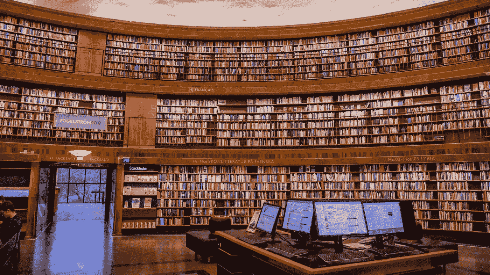
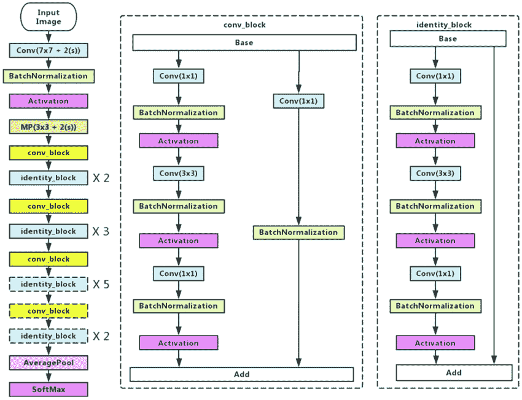
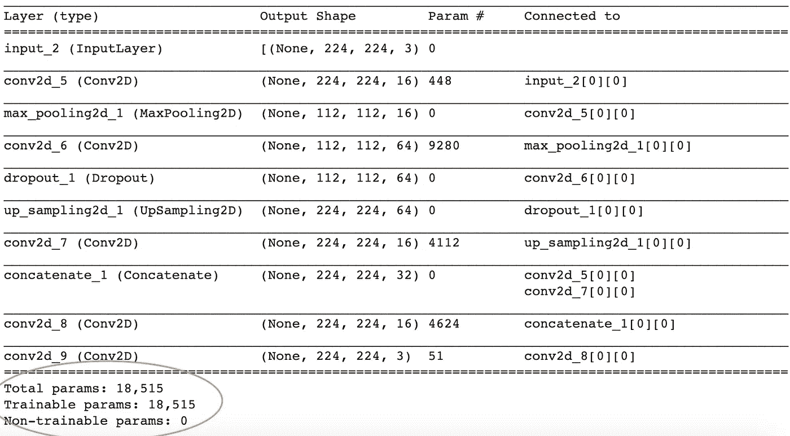
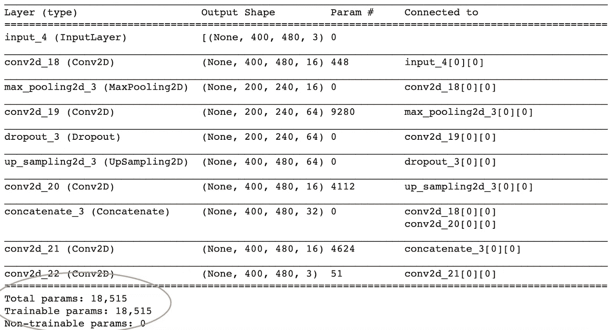
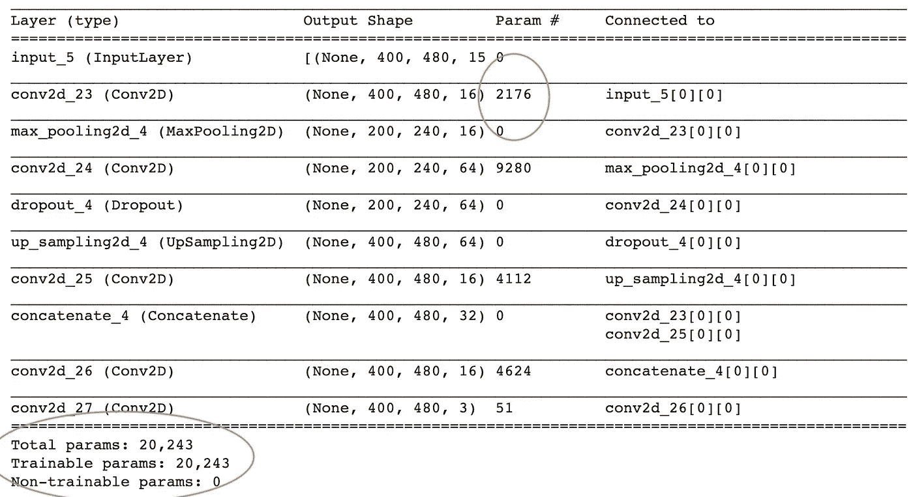
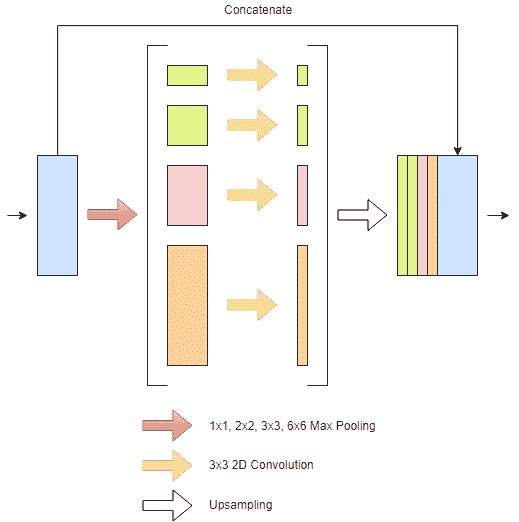

# 实现从 RGB 到多通道图像的迁移学习

> 原文：<https://towardsdatascience.com/implementing-transfer-learning-from-rgb-to-multi-channel-imagery-f87924679166?source=collection_archive---------10----------------------->

## 使用 ResNet50 主干+金字塔池的语义分割

# 介绍

最近，我有幸有机会与 [Omdena](https://omdena.com/) 和 [WeedBot](https://weedbot.eu/) 合作参加了一个计算机视觉挑战赛，这是一个受影响驱动的初创公司，开发了一种激光除草机械，让农民可以用激光束找到并清除杂草。



照片由[贡纳尔·里德斯特伦](https://unsplash.com/@gunnarridder?utm_source=unsplash&utm_medium=referral&utm_content=creditCopyText)在 [Unsplash](/s/photos/computer-library?utm_source=unsplash&utm_medium=referral&utm_content=creditCopyText) 拍摄

我们探索了作物与杂草分类的图像分割技术，并探索了语义和实例分割方法。在本文中，我们将探索在项目的语义分割部分中实现的两个不同的概念——

# **多通道输入的迁移学习**

## 什么是迁移学习？

> 迁移学习是一种机器学习技术，用于在新问题上重用预先训练好的模型。

在迁移学习中，机器利用从不同任务中获得的知识，通过为新的但相关的任务从新样本中提取有用的特征来提高泛化能力。

例如，在训练一个分类器来预测狗的品种时，人们可以使用在训练中获得的知识来区分一般的动物。

## 优势

使用迁移学习有很多好处。好处是它节省时间，提供更好的性能，并且需要更少的数据。

自然语言处理和计算机视觉问题的深度学习模型通常需要大量数据供模型学习。这可能既耗时又昂贵，并且可能是个人和小组织采用机器学习的巨大障碍。

迁移学习减少了这一障碍，它允许一个人采用一个已经训练好的模型，并将其应用于一个不同但相关的问题。因为模型是预先训练的，这意味着我们不是完全从零开始训练，而是利用模型已经学到的东西。

为挑战提供的是分辨率为 3008x3008 的 775 幅图像。鉴于图片数量较少，迁移学习似乎是一个很好的探索途径。

公开可用的是在公开可用的数据集上训练的开源模型，例如 ResNet、AlexNet、VGG 等等。两个这样的常见数据集是 [ImageNet](http://image-net.org/about) 和 [Coco](https://cocodataset.org/) 数据集。这些数据集分别由超过 14M 和 330K 的图像组成。

## 从 RGB 到多通道

我们的研究提出了三种方法，可以用来将 3 个通道上训练的模型转换为更多的通道。这些方法跨越不同的复杂程度。我们将简要讨论这些方法—

*   一种方法是简单地扩展权重维度以考虑额外的通道数量，并随机初始化这些值。
*   第二种方法与第一种类似，只是我们不是用随机初始化的值来填充这些值，而是用其他值的平均值来填充。我们在一篇科学论文中发现了这种方法，该论文描述这种方法比第一种方法更有效。这是我们将在本文中探索的方法。
*   理论上，最终方法应该提供最佳性能。然而，就训练时间而言，这种方法需要更长的时间。这种方法表明，前面讨论的方法会偏向于前三个通道，因为这是预训练模型最初训练的内容。相反，这种方法提出的是，我们创建第二个并行网络，对剩余的通道执行特征提取，然后将输出与原始预训练模型的输出连接起来。以这种方式，第二模型学习特定于附加通道的表示，并且我们仍然利用按原样使用预先训练的模型。这种方法将在另一篇文章中探讨。

## ResNet50 主干和 15 通道图像

为此问题选择的主干模型是 ResNet50。ResNet50 是“残差网络”的缩写，是一个 50 层深度卷积神经网络，利用残差学习。



resnet50 架构

值得一提的是，使用预训练模型的一个特征是，模型期望新任务的输入维度与其预训练的旧任务的输入维度相同。

resnet50 模型在高度和宽度为 224x224 的输入维度上进行预训练，RGB 有 3 个通道。

对于这个分割任务，我们使用了许多特征生成技术，在原始的 3 通道 RGB 图像上增加了额外的 12 通道。有关如何生成额外通道的更多信息，请参阅本文。

当时的挑战是获得预训练的 resnet50 模型，以 480x400 的新图像尺寸作为输入，第三维具有 15 个通道。

我们将做一个代码演练，看看这是如何实现的。首先，我们使用 Keras 下载并导入 resnet50 模型—

在这里，我们指定希望下载 imagenet 的预训练权重。通常，在迁移学习中，我们会排除最后一层，用对新任务更具体的层来代替它。设置“include_top=False”允许我们排除最后一层。如果我们用预先训练好的模型进行推理，而不是实现迁移学习，那么这个应该设置为真。

此时，我们需要将分辨率(高度和宽度)从 224x224 更改为 480x400，并将通道数量从 3 更改为 15。因为更改输入的高度和宽度不会影响权重的尺寸，所以更改起来更简单。

另一方面，改变输入通道的数量确实会影响权重的维数。让我们更详细地研究一下这个问题。

出于比较目的，我们将使用修改后的 uNet 架构，我们可以通过首先改变高度-宽度，然后改变通道数量，来比较 224x224x3 输入和 480x400x15 输入的模型概要。

```
semantic_segmentation(224, 224, 3).summary()
```



```
semantic_segmentation(400, 480, 3).summary()
```



我们注意到参数的总数保持不变。这证实了输入的高度和宽度不会影响重量尺寸。现在，让我们来看看改变频道的数量—

```
semantic_segmentation(400, 480, 15).summary()
```



我们注意到参数的数量从 18，515 增加到 20，243。我们还注意到，这仅仅是因为第一卷积层的参数从 448 增加到 2176，而后续层的参数数量保持不变。

无需在 Keras 中进行尝试，通过回忆卷积层的权重维度由滤波器的高度和宽度、输入深度和输出深度决定，就可以从理论上确认这一点。图像的高度和宽度与此无关。

更改输入维度的第一步涉及复制模型的配置信息。这为我们提供了字典格式的模型组成。我们可以通过更改输入维度来编辑这个字典，并使用编辑过的配置字典创建一个新模型—

我们现在已经创建了一个与 ResNet50 具有相同网络结构的新模型。值得注意的是，这不会自动复制 resnet50 模型的重量，这是这样做的主要目的。

为此，我们需要遍历 resnet50 模型和新创建的模型的层，并复制权重。

然而，我们会遇到一个问题，因为尺寸不匹配。我们之前证实了改变通道的数量会影响权重的维度。为了解决这个问题，我们扩展了权重维度，以更准确地表示通道的增加，并复制权重的平均值。这是按如下方式完成的—

这负责语义分割模型的 ResNet50 主干。

# 金字塔池模块

在另一篇[文章](https://medium.com/omdena/deep-learning-pipeline-for-image-segmentation-laser-weed-removal-3a7b21aebcba)中，我讨论了在探索语义分割时，我们分成多个团队来探索不同的分割模型。在探索 PSPNet 的时候，我们注意到虽然这个模型不完全准确，但是它产生了平滑的分段。

我们推测这可能是模型利用金字塔池模块的结果。为了最终的模型。我们决定将它与 resnet50 一起用作主干。



金字塔池模块

金字塔池通过观察整个要素地图以及不同位置的子区域来工作。池内核覆盖图像的全部、一半、1/4 和 1/8，并被融合为全局先验。然后，这与来自主干的原始特征图相结合。

## 跟随这个 [Colab 笔记本](https://colab.research.google.com/drive/1n5an_9zvWSirvx9KLTx06WXvFIZodxDA?usp=sharing)。

# 参考

林 T，梅尔 M，贝隆吉 S，布尔德夫 L，吉尔希克 R，海斯 J，佩罗娜 P，拉玛南 D，兹尼克 L，多尔 P 2014 微软可可:背景中的共同对象【https://arxiv.org/abs/1405.0312

[甲等](https://ieeexplore.ieee.org/author/38307037500)；[魏东](https://ieeexplore.ieee.org/author/38277671200)；[理查德·索彻](https://ieeexplore.ieee.org/author/37547163200)；[李——](https://ieeexplore.ieee.org/author/38273260200)；[李凯](https://ieeexplore.ieee.org/author/37277619300)；https://ieeexplore.ieee.org/document/5206848[李菲菲](https://ieeexplore.ieee.org/document/5206848) 2009 ImageNet:一个大规模分层图像数据库

Donges N 2019 什么是迁移学习？探索流行的深度学习方法[https://builtin.com/data-science/transfer-learning](https://builtin.com/data-science/transfer-learning)

何 K，张 X，任 S，孙 J 2015 用于图像识别的深度残差学习[https://arxiv.org/pdf/1512.03385.pdf](https://arxiv.org/pdf/1512.03385.pdf)

赵等人 2016 传销资金池模块[、](https://arxiv.org/abs/1612.01105v2)