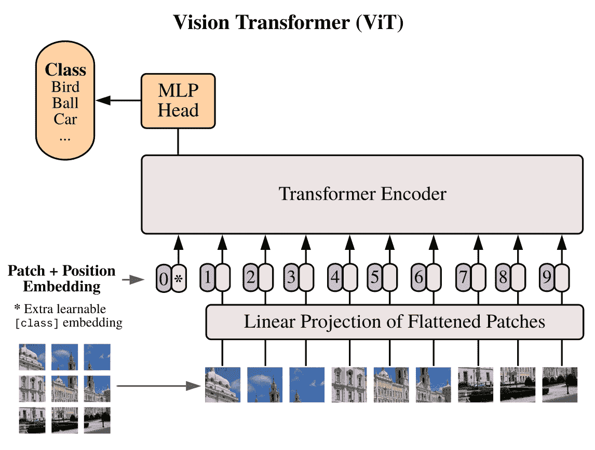
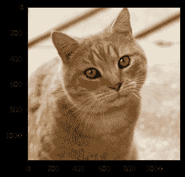
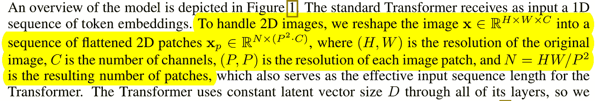
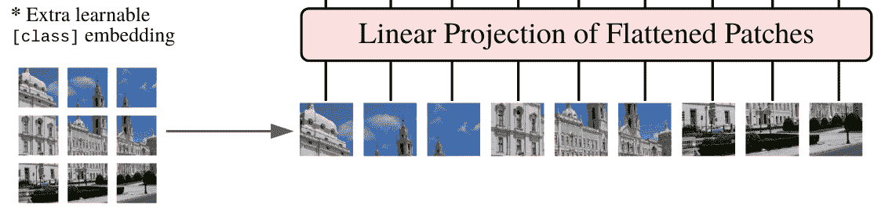
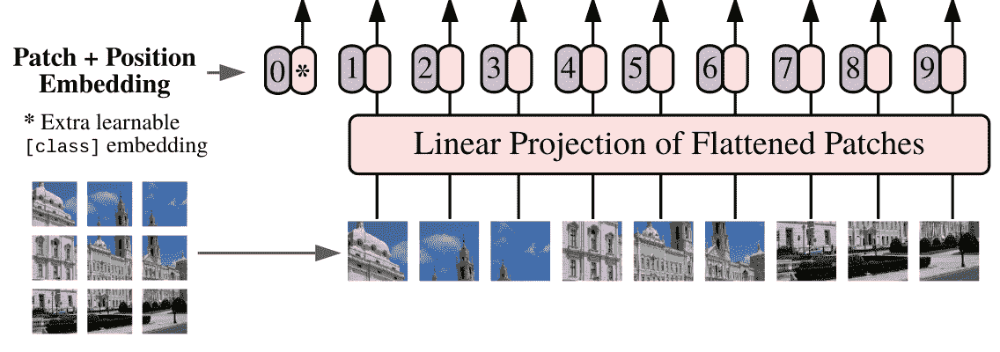
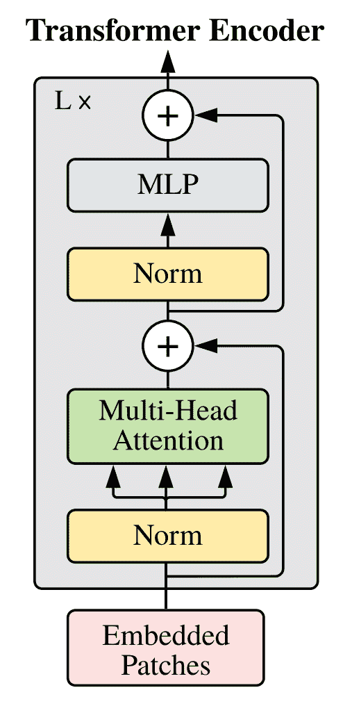
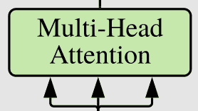
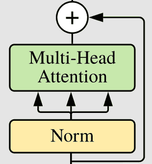
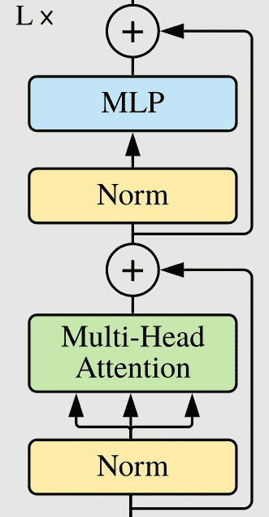
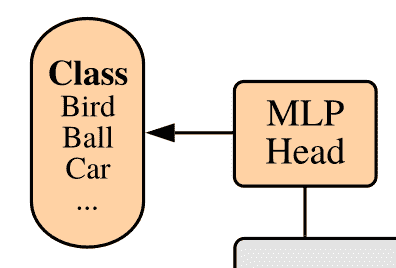

# 在 PyTorch 中实现视觉转换器(ViT)

> 原文：<https://towardsdatascience.com/implementing-visualttransformer-in-pytorch-184f9f16f632?source=collection_archive---------1----------------------->


作者图片

***我在***[***LinkedIn***](https://www.linkedin.com/in/francesco-saverio-zuppichini-94659a150/?originalSubdomain=ch)***，过来打个招呼*** 👋

嗨，伙计们，新年快乐！今天我们要实现[中提出的著名的**Vi**(sion)**T**(transformer)一个图像抵得上 16X16 个字:大规模图像识别的变形金刚](https://arxiv.org/pdf/2010.11929.pdf)。

代码在这里，本文的互动版可以从[这里](https://github.com/FrancescoSaverioZuppichini/ViT)下载。

ViT 可在我的**新计算机视觉库上获得，名为** [**眼镜**](https://github.com/FrancescoSaverioZuppichini/glasses)

这是一个技术教程，而不是你的普通媒体文章，在那里你可以找到熊猫的五大秘密功能，让你变得富有。

因此，在开始之前，我强烈建议您:

-看看令人惊叹的[图文并茂的变形金刚](https://jalammar.github.io/illustrated-transformer/)网站
-观看 [Yannic Kilcher 关于 ViT](https://www.youtube.com/watch?v=TrdevFK_am4&t=1000s)的视频-阅读 [Einops](https://github.com/arogozhnikov/einops/) doc

因此，ViT 使用一个普通的转换器(在[中提出的那个，你所需要的就是注意力](https://arxiv.org/abs/1706.03762))来处理图像。但是，怎么做呢？

下图是 ViT 的架构



论文作者(Alexey Dosovitskiy 等人)提供的图片

输入图像被分解成 16x16 的拼合面片(图像未按比例缩放)。然后，使用正常的全连接层嵌入它们，在它们前面添加一个特殊的`cls`令牌，并对`positional encoding`求和。产生的张量首先被传递到标准转换器，然后传递到分类头。就是这样。

这篇文章分为以下几个部分:

```
- Data
- Patches Embeddings
    - CLS Token
    - Position Embedding
- Transformer
    - Attention
    - Residuals
    - MLP
    - TransformerEncoder
- Head
- ViT
```

我们将采用自底向上的方法一个模块一个模块地实现这个模型。我们可以从导入所有需要的包开始

这里没有什么花哨的，只是 PyTorch +的东西

首先，我们需要一张图片，一只可爱的猫就可以了:)



图片来自[维基百科](https://de.wiktionary.org/wiki/cat#/media/Datei:Cat03.jpg)

然后，我们需要对它进行预处理

```
torch.Size([1, 3, 224, 224])
```

第一步是将图像分解成多个小块并展平。


论文作者(Alexey Dosovitskiy 等人)提供的图片

引用报纸上的话:



使用 einops 可以很容易地做到这一点。

现在，我们需要使用一个正常的线性层来投影它们



论文作者(Alexey Dosovitskiy 等人)提供的图片

我们可以创建一个`PatchEmbedding`类来保持代码整洁

```
torch.Size([1, 196, 768])
```

**注意**在检查了原始实现后，我发现作者使用 Conv2d 层而不是线性层来提高性能。这是通过使用等于“补丁大小”的内核大小和步幅来获得的。直观地说，卷积运算单独应用于每个面片。因此，我们必须首先应用 conv 层，然后平坦的结果图像。

# CLS 代币

下一步是添加`cls token`和位置嵌入。`cls token`只是一个放在每个序列的**中的数字**

```
torch.Size([1, 197, 768])
```

`cls_token`是一个随机初始化的火炬参数，在`forward`方法中，它被复制`b`(批处理)次，并使用`torch.cat`添加在投影的补丁之前

# 位置嵌入

到目前为止，这个模型还不知道这些碎片的原始位置。我们需要传递这个空间信息。这可以用不同的方法来完成，在 ViT 中我们让模型学习它。位置嵌入只是一个形状为`N_PATCHES + 1 (token), EMBED_SIZE`的张量，它被添加到投影的面片上。



论文作者(Alexey Dosovitskiy 等人)提供的图片

```
torch.Size([1, 197, 768])
```

我们在`.positions`字段中添加了位置嵌入，并将其与`.forward`函数中的面片相加

现在我们需要工具转换器。在 ViT 中，仅使用编码器，其架构如下图所示。



论文作者(Alexey Dosovitskiy 等人)提供的图片

让我们从注意力部分开始

# 注意力

因此，注意力接受三个输入，著名的**查询、键和值，**使用查询和值计算注意力矩阵，并使用它来“关注”值。在这种情况下，我们使用的是**多头**注意力，这意味着计算被分割到具有较小输入大小的`n`头上。



论文作者(Alexey Dosovitskiy 等人)提供的图片

我们可以使用 PyTorch 的`nn.MultiHadAttention`或者实现我们自己的。为了完整起见，我将展示它的样子:

所以，一步一步来。我们有 4 个完全连接的层，一个用于查询、键、值，最后一个用于删除。

好的，这个想法(真的去读一下[图中的 Transformer](https://jalammar.github.io/illustrated-transformer/) )是使用查询和键之间的乘积来知道每个元素相对于其他元素的重要性。然后，我们使用这些信息来调整这些值。

`forward`方法将来自前一层的查询、键和值作为输入，并使用三个线性层对它们进行投影。因为我们实现了多头注意力，我们必须在多头中重新排列结果。

这是通过使用 einops 的`rearrange`完成的。

*查询、键和值*总是相同的，所以为了简单起见，我只有一个输入(`x`)。

产生的键、查询和值具有`BATCH, HEADS, SEQUENCE_LEN, EMBEDDING_SIZE`的形状。

为了计算注意力矩阵，我们首先必须执行查询和关键字之间的矩阵乘法，也就是最后一个轴上的总和。这可以使用`torch.einsum`轻松完成

产生的矢量具有形状`BATCH, HEADS, QUERY_LEN, KEY_LEN`。那么注意力最终是所得向量的 softmax 除以基于嵌入大小的缩放因子。

最后，我们用注意力来衡量价值

我们得到一个大小为`BATCH HEADS VALUES_LEN, EMBEDDING_SIZE`的向量。我们将标题连接在一起，最终返回结果。

**注意**我们可以使用单个矩阵一次性计算`queries, keys and values`。

# 残差

变压器块有残余连接



论文作者(Alexey Dosovitskiy 等人)提供的图片

我们可以创建一个漂亮的包装器来执行剩余的加法，这在以后会很方便

注意力的输出被传递到一个完全连接的层，该层由两层组成，并以输入的`expansion`倍进行上采样



论文作者(Alexey Dosovitskiy 等人)提供的图片

简单补充一下。我不知道为什么，但我从未见过有人子类化`nn.Sequential`来避免编写`forward`方法。开始做吧，这就是对象编程的工作方式！

**最后，**我们可以创建变压器编码器模块


论文作者(Alexey Dosovitskiy 等人)提供的图片

`ResidualAdd`允许我们以优雅的方式定义这个模块

让我们测试一下

```
torch.Size([1, 197, 768])
```

您也可以 PyTorch 内置多头注意力，但它需要 3 个输入:查询、键和值。您可以将其子类化并传递相同的输入。

# 变压器

在 ViT 中，只使用原始变压器的编码器部分。很容易，编码器是`TransformerBlock`的`L`块。

很简单！

最后一层是正常的全连接，给出了类概率。它首先对整个序列进行基本平均。



论文作者(Alexey Dosovitskiy 等人)提供的图片

我们可以组合`PatchEmbedding`、`TransformerEncoder`和`ClassificationHead`来创建最终的 ViT 架构。

我们可以使用`torchsummary`来检查参数的数量

```
summary(ViT(), (3, 224, 224), device='cpu')
```

好了

我检查了其他实现的参数，它们是相同的！

在本文中，我们看到了如何以一种良好的、可伸缩的、可定制的方式实现 ViT。我希望它是有用的。

顺便说一下，我正在开发一个名为 [**眼镜**](https://github.com/FrancescoSaverioZuppichini/glasses) **的**新计算机视觉库，如果你喜欢**的话，可以去看看**

保重:)

弗朗西斯科