# 损失函数在深度学习和 Python 实现中的重要性

> 原文：<https://towardsdatascience.com/importance-of-loss-functions-in-deep-learning-and-python-implementation-4307bfa92810?source=collection_archive---------19----------------------->

来源:Unsplash 上的 Mikael Kristenson

我们知道在神经网络中，神经元用相应的权重、偏置和它们各自的[激活函数](/intuitions-behind-different-activation-functions-in-deep-learning-a2b1c8d044a)工作。权重与输入相乘，然后在进入下一层之前对元素应用激活函数。最后通过输出层得到预测值(yhat)。但是预测总是更接近实际(y)，我们称之为误差。因此，我们定义了损失/成本函数来捕捉误差，并试图通过反向传播来优化它。

基于问题陈述，有不同类型的损失函数，我们试图对其进行优化。在本文中，我们将讨论深度学习中的不同损失函数。我们将详细讨论下面的损失函数:

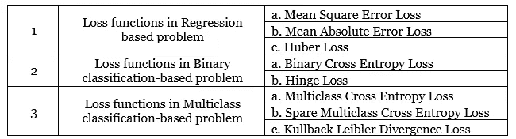

作者图片

# **1)** **回归基础问题中的损失函数**

**a)** **均方误差损失**

均方差(MSE)是回归问题中非常常用的损失函数。

如果目标变量的分布是高斯分布，则 MSE 是优选的损失函数。均方误差被定义为预测值和实际值之间的平方差的平均值。成本函数看起来像:

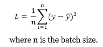

作者图片

结果总是积极的。由于正方形，较大的错误比较小的错误导致更多的错误。换句话说，MSE 是在惩罚犯了更大错误的模型。

**优点:**

由于该方程本质上是二次的，梯度下降只有一个全局最小值。

二。不存在局部最小值。

三。惩罚犯较大错误的模型。

**缺点:**如果数据包含异常值，这个损失函数是不稳健的

**注意:**如果目标列的范围相当分散，在这种情况下，由于 MSE 的性质，预测大值可能会严重影响模型。在这种情况下，代替 MSE，使用**均方对数误差(MSLE)损失**。这里，首先计算实际值和预测值的自然对数，然后计算均方误差。成本函数看起来像:

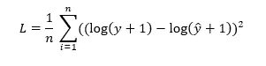

作者图片

**b)** **平均绝对误差损失**

平均绝对误差(MAE)也是回归问题中另一个重要的损失函数。它被定义为实际值和预测值之间的绝对差值的平均值。成本函数看起来像:

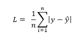

作者图片

**优点:**与 MSE 相比，MAE 对异常值更稳健。

**缺点:**

I .计算成本高，因为与平方误差相比，模数误差很难求解。

二。可能存在局部最小值。

三。即使损失很小，梯度也会变大，因为梯度在过程中保持不变，这不适合学习。为了解决这个问题，可以使用动态学习率。

**c)** **胡伯损失(平滑平均绝对误差)**

Huber 损耗通过结合 MSE 和 MAE 起着重要的作用。如果损失更高，它将二次方程变为线性方程。如果误差小于临界值(ε),则使用 MSE，否则可以使用 MAE。损失函数定义为:

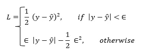

作者图片

Huber 损耗曲线围绕最小值，这降低了梯度，这与 MAE 相比更好，因为 MAE 具有恒定的大梯度。这导致在使用梯度下降的训练结束时丢失最小值。另一方面，与均方误差损失相比，Huber 损失对异常值不太敏感。

请注意，增量的选择很重要，因为它有助于确定异常值标准。

**优点:**

I .对异常值的处理是明智的。

二。不存在局部最小值。

三。它在 0 也是可微的。

**缺点:**需要优化额外的超参数(ε)，这是一个迭代的过程。

从下图可以清楚地看出，Huber 结合了 MAE 和 MSE，并采用了一种理想的方法来克服 MSE 和 MAE 的缺点。

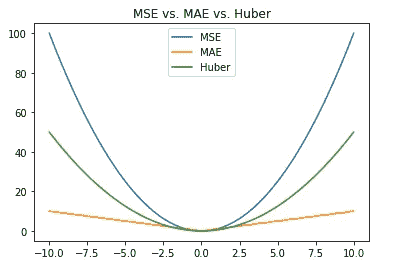

图片来自作者

# **2)** **基于二值分类问题中的损失函数**

**a)**二元交叉熵

交叉熵是用于分类问题的常用损失函数。它测量两个概率分布之间的差异。如果交叉熵很小，则表明两个分布彼此相似。

在二元分类的情况下，预测概率与目标/实际(0 或 1)进行比较。二元交叉熵计算分数，该分数提供了用于预测类别 1 的实际概率和预测概率之间的负平均差。该分数基于与期望值的距离来惩罚概率。损失函数定义为:

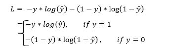

作者图片

**b)** **铰链损耗**

铰链损失是二进制分类问题的另一个损失函数。它主要是为支持向量机(SVM)模型开发的。铰链损耗是根据“最大裕度”分类计算的。

如果目标值在集合(-1，1)中，则使用该损失函数。必须将目标变量修改为集合中的值(-1，1)，这意味着如果 y 的值为 0，则需要将其更改为-1。

损失函数定义为:

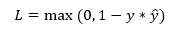

作者图片

如果实际类别值和预测类别值之间的符号存在差异，则铰链损失函数试图通过分配更多误差来确保正确的符号。

# **3)** **基于多类分类问题中的损失函数**

**一)**多类交叉熵

在多类分类的情况下，将预测概率与目标/实际概率进行比较，其中每个类被分配一个唯一的整数值(0，1，3，…，t)，假设数据有 t 个唯一的类。它计算一个分数，该分数提供所有类的实际概率和预测概率之间的负平均差。损失函数定义为:

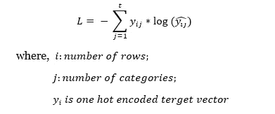

作者图片

对于分类交叉熵损失函数，需要确保在 n 维向量中，除了对应于类别的条目为 1(一次热编码)之外，所有条目都为 0。

例如，对于 3 类分类问题，其中第一个观察属于第三类，第二个观察属于第一类，第三个观察属于第二类，目标(y)将是: *y = [[0，0，1]，[1，0，0]，[0，1，0]]*

**b)** **稀疏多类交叉熵损失**

两者，多类交叉熵和稀疏多类交叉熵具有相同的损失函数，上面提到过。唯一的区别是真实标签(y)的定义方式。对于稀疏分类交叉熵，只需要提供一个整数单元，而不是一个 n 维向量。请注意，整数代表数据的类别。

对于多类交叉熵，实际目标(y)是一热编码的。对于三级分类[[0，0，1]，[1，0，0]，[0，1，0]]

对于稀疏多类交叉熵，实际目标(y)是整数。对于以上三类分类问题:[3]、[1]、[2]

**与多类交叉熵相比的优势:**以上示例表明，对于多类交叉熵，目标需要一个包含大量零值的热编码向量，这导致了显著的存储器需求。通过使用稀疏分类交叉熵，可以**节省计算时间，降低内存需求**，因为它只需要一个单一的整数作为一个类，而不是一个完整的向量。

**稀疏多类交叉熵的缺点:**多类交叉熵可用于任何一类分类问题。然而，稀疏分类交叉熵只能在每个输入只属于一个类时使用。

例如，如果我们有 3 个类(a，b，c ),假设一个输入属于 b 类和 c 类，那么多类交叉熵的标签可以表示为[0，1，1],但不能表示为稀疏多类。

**c)**kull back lei bler(KL)发散损失

Kullback Leibler 散度是一种度量，它显示了两个概率分布彼此之间的差异程度。损失函数定义为:

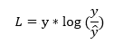

作者图片

KL 散度损失为 0 表明分布是相同的。

KL 散度在某种程度上类似于交叉熵。像多类交叉熵一样，这里也需要对实际目标(y)进行一次性编码。如果使用预测的概率分布来近似期望的目标概率分布，则它计算有多少信息丢失。

KL 散度主要用于变分自动编码器。在这里，自动编码器学习如何将样本编码成潜在的概率分布，该概率分布被进一步馈送到解码器以生成输出。此外，KL 散度可用于多类分类。

# **使用 Keras 定义不同损失函数的 Python 片段**

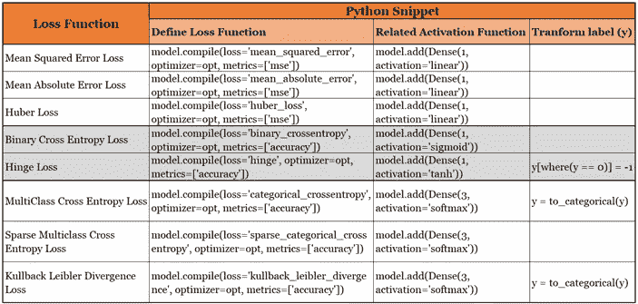

作者图片

# **何时使用哪些损失函数**

如果目标变量是连续的(回归问题)，那么可以使用 MSE、MAE 和 Huber 损失。通常，MSE 是常用的损失函数，但如果数据有异常值，则可以使用 MAE。但是如果使用 MAE，由于模数函数，它的计算量很大，并且还会产生梯度下降的问题。为了克服这些问题，Huber 损失被公认为损失函数，尽管δ的选择是迭代的和重要的。

对于分类问题，如果目标类是二进制的，则使用二进制交叉熵损失。另一方面，对于多类分类，可以使用多类交叉熵损失。与多类交叉熵相比，稀疏多类交叉熵要快得多，因为输入目标考虑的是整数，而不是一次性编码的向量。然而，多类交叉熵更一般化，因为输入目标可以表示为前面提到的多个类。铰链损失主要用于 SVM 模型的二元分类。KL 散度主要用于比简单的多类分类更复杂的函数(如变分自动编码器)。

希望你喜欢这篇文章！！

*免责声明:本文所表达的观点是作者以个人身份发表的意见，而非其雇主的意见*

**参考文献:**

[https://ml-cheat sheet . readthedocs . io/en/latest/loss _ functions . html #交叉熵](https://ml-cheatsheet.readthedocs.io/en/latest/loss_functions.html#cross-entropy)

[https://keras.io/api/losses/](https://keras.io/api/losses/)

[https://heart beat . fritz . ai/5-regression-loss-functions-all-machine-learners-should-know-4fb 140 e 9 D4 b 0](https://heartbeat.fritz.ai/5-regression-loss-functions-all-machine-learners-should-know-4fb140e9d4b0)

[https://www . machine curve . com/index . PHP/2019/12/21/how-to-use-kull back-lei bler-divergence-KL-divergence-with-keras/](https://www.machinecurve.com/index.php/2019/12/21/how-to-use-kullback-leibler-divergence-kl-divergence-with-keras/)