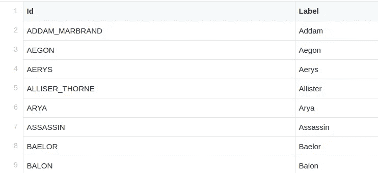

# 在 Neo4j 中导入 CSV 文件

> 原文：<https://towardsdatascience.com/importing-csv-files-in-neo4j-f3553f1a76cf?source=collection_archive---------1----------------------->

## [实践教程](https://towardsdatascience.com/tagged/hands-on-tutorials)

## 为简单或快速而设计的两种不同方法的比较


图由马丁格兰德让，马丁格兰德让，CC BY-SA 3.0<[https://creativecommons.org/licenses/by-sa/3.0](https://creativecommons.org/licenses/by-sa/3.0)>，通过维基共享。我没有改变这个形象。

最近，基于图的数据科学和机器学习已经成为各个领域的热门话题，从欺诈检测到知识图生成，社交网络分析等等。 [Neo4j](http://neo4j.com) 是世界上最受欢迎和使用最广泛的图形数据库之一，为数据科学社区提供了巨大的好处。虽然 Neo4j 在系统中内置了一些训练图，但在某些时候，数据科学家会希望用自己的数据填充它。

Neo4j 接收数据最简单的格式是 CSV。关于如何填充数据库的网络搜索揭示了几种潜在的方法，但是在这篇文章中，我将把重点放在两种最常见和最强大的方法上，您可能希望考虑每一种方法，并浏览一些如何使用它们的示例。

我们将要经历的方法是

1.  `LOAD CSV`:当图形很小时的简单方法
2.  Neo4j 管理工具:当图形变大时的快速方法

我将在这篇文章中演示这两种方法，并讨论你什么时候会用到它们。

# 必要的工具

为了开始，我们需要在我们的主机上安装 Neo4j。您可以使用 [Neo4j Desktop](https://neo4j.com/download/) 浏览下面的数据加载示例，它提供了一个不错的 UI，是学习如何使用数据库的好地方。

然而，为了这篇教程，我选择使用一个简单的 ***Docker 容器*** ，原因如下。


[伊恩·泰勒](https://unsplash.com/@carrier_lost?utm_source=unsplash&utm_medium=referral&utm_content=creditCopyText)在 [Unsplash](https://unsplash.com/s/photos/container-ship?utm_source=unsplash&utm_medium=referral&utm_content=creditCopyText) 上的照片

*首先是*，容器是凉的。我总是把事情搞砸，这是一个不会毁掉一切的非常安全的方法。

*其次*，如今 Docker 容器中发生了如此多的数据科学，以至于可以认为 Neo4j 也在容器中。

*最后一点*，再现性在数据科学中非常重要，因此使用容器可以实现这一点。

综上所述，您将需要以下内容来运行下面的示例:

1.  Docker(安装说明可以在[这里](https://docs.docker.com/get-docker/)找到)
2.  一个 [Neo4j Docker 镜像](https://hub.docker.com/_/neo4j)(我将使用`neo4j:latest`，在我写这篇文章的时候是 4.2.2 版本)
3.  CSV 格式的数据集

对于数据集，我将使用流行的*权力的游戏*图来演示数据加载，该图可从 Andrew Beveridge 维护的[知识库](https://github.com/mathbeveridge/gameofthrones)中获得。

[](https://github.com/mathbeveridge/gameofthrones) [## mathbeveridge/gameoftrones

### HBO 连续剧《权力的游戏》的角色互动网络这些网络是通过解析…

github.com](https://github.com/mathbeveridge/gameofthrones) 

使用该图作为演练的一个原因是数据被很好地格式化并且相当干净— *您将发现在加载数据时属性非常有用*！尽管如此，随着我们继续进行下去，我们将不得不做一些数据清理和重新格式化，但这些都不是太重要。

[](https://networkofthrones.wordpress.com/) [## 权力的网络

### 我已经添加了第八季的网络分析。就像故事情节一样，随着角色们把他们的…

networkofthrones.wordpress.com](https://networkofthrones.wordpress.com/) 

> 说到清理数据集，请注意在其中一个文件名中存在拼写错误或命名约定不一致。你会看到第五季节点文件被命名为`got-s5-node.csv`，而不是我们期望的`got-s5-nodes.csv`的模式。

最后，我假设读者对 Cypher 有些熟悉。如果这不是你目前拥有的技能，我强烈推荐 Neo4j 网站上的在线[密码教程](https://neo4j.com/graphacademy/training-intro-40/enrollment/)(esp。关于创建数据的部分)。特别是，如果你刚刚开始学习密码，我可能会建议你查看一下`[LOAD CSV](https://neo4j.com/docs/cypher-manual/current/clauses/load-csv/)`、`[MERGE](https://neo4j.com/docs/cypher-manual/current/clauses/merge/)`、`[MATCH](https://neo4j.com/docs/cypher-manual/current/clauses/match/)`、`[SET](https://neo4j.com/docs/cypher-manual/current/clauses/set/)`和`[PERIODIC COMMIT](https://neo4j.com/docs/cypher-manual/current/clauses/load-csv/#load-csv-importing-large-amounts-of-data)`的文档，我们将在下面使用这些文档。

[](https://neo4j.com/graphacademy/training-intro-40/enrollment/) [## Neo4j 4.x 系列简介-Neo4j 4 . x 系列简介

### “Neo4j 4.0 简介”课程已被我们建议您按以下顺序学习的课程所取代:如果…

neo4j.com](https://neo4j.com/graphacademy/training-intro-40/enrollment/) 

# 码头集装箱

在启动 Docker 容器之前，我们需要做一些整理工作，将数据文件放在正确的位置。

首先，我们要确保 CSV 文件在正确的位置。当然，你可以告诉 Docker 在你想放它们的地方找。在我的例子中，我创建了一个目录`~/graph_data/gameofthrones/`,并将我所有的。csv 在那里。

所有这一切就绪后，从 CLI 运行以下命令:

```
**docker** run -p 7474:7474 -p 7687:7687 \
  --volume=$HOME/graph_data/data:/data \ 
  --volume=$HOME/graph_data/gameofthrones/data:/var/lib/neo4j/import \
  --env NEO4JLABS_PLUGINS='["apoc", "graph-data-science"]' \
  --env apoc.import.file.enabled=true \
  --env NEO4J_AUTH=**neo4j/1234** \
  neo4j:latest
```

让我们来分析一下。我们在那里进行了一些端口转发，这将允许您通过 BOLT 协议在端口 7687 连接到`localhost:7474.`上的网络浏览器中的 *Neo4j 浏览器 UI* ，您可以通过 Python 或其他编程语言的程序进行访问数据库的连接。

接下来，我们将一系列文件夹转发到容器中，以便在本地机器和容器之间进行读/写。

之后，我们引入一些环境变量。这些几乎都是可选的，但我把它们包括在上面，以防你想使用像 APOC 或 GDS 这样的库。第一个命令告诉容器加载最新版本的 APOC 和 GDS 库作为插件。我们还传递了一个配置设置作为环境变量，告诉 Neo4j 允许 APOC 读取文件。

最后为默认的`neo4j`用户设置一个密码(非常复杂的`1234`)。(您可以选择不使用这个位，但是如果您这样做了，那么您必须在每次启动容器时为用户重置密码。)


唷，好了。

> 最后要注意的是，容器会自动改变文件的所有权和权限，并且只有根用户才能访问。所以如果你打算在`sudo`之外查看或编辑它们，你可以考虑在容器接触不到它们的地方保存它们的备份。

假设一切顺利，您应该能够将 web 浏览器指向`localhost:7474`并看到一个正在运行的 UI。所以现在我们可以进入下一步了！


Neo4j 浏览器 UI

# 加载 CSV:简单的方法

`LOAD CSV`命令是将数据存入数据库的最简单的方法之一。这是一个 Cypher 命令，通常可以通过 Neo4j UI 运行。然而，它也可以通过 Python 连接器(或者您选择的语言的连接器)传入。对于另一篇博文，我们将通过 Python 保存与数据库的接口。

[](https://neo4j.com/docs/cypher-manual/current/clauses/load-csv/) [## 加载 CSV - Neo4j 密码手册

### CSV 文件的 URL 是通过使用 FROM 后跟一个任意表达式来指定的，该表达式计算出…中的 URL

neo4j.com](https://neo4j.com/docs/cypher-manual/current/clauses/load-csv/) 

如果您有一个“小”图，这种方法非常好。但是什么构成了小呢？一个很好的经验法则是，如果你的节点和边少于 100，000 个，而*权力的游戏*图确实有，那么这是一个很好的选择。但是，这并不是最快的方法(就像批量加载器一样)，所以如果您的图形有点大，您可能需要考虑切换到其他加载方法。

查看我们的节点文件，我们可以看到每个季度都有一个文件。文件本身遵循一种非常简单的格式`Id, Label`，其中 ID 只是名称的大写，标签是实际的角色名称。



got-s1-nodes.csv

一般来说， ***在节点上创建一些唯一性约束*** 是很好的实践，以确保没有重复。这样做的一个好处是，这将为给定的标签和属性创建一个索引。除了加快对该数据的查询搜索之外，它还将确保节点上的 MERGE 语句(比如我们的 load 语句中使用的那个)明显更快。为此，我们使用:

```
CREATE CONSTRAINT UniqueCharacterId ON (c:Character) ASSERT c.id IS UNIQUE
```

请注意，在 Neo4j 中，标签、关系类型和属性键是区分大小写的。所以`id`不等同于`Id.`常见错误！

现在，我们可以使用以下方法将节点数据加载到数据库中:

```
WITH "file:///got-s1-nodes.csv" AS uriLOAD CSV WITH HEADERS FROM uri AS rowMERGE (c:Character {id:row.Id})
SET c.name = row.Label
```

是的，您确实需要使用 3 个斜线，但是好消息是，如果您将您的数据链接到`/var/lib/neo4j/import`，这是容器中用于读取文件的默认目录，并且您不需要指定冗长的目录结构，这是非常危险的！

从上面我们可以看到，我们一次加载一行字符，并创建一个名为`Character`的节点标签和一个名为`id`的属性，同时创建一个名为`name`的新属性，我们将该属性设置为等于`Label`的 CSV 值(不要将该名称与所有节点都有一个`Character`标签的事实相混淆)。

(请注意，`uri`实际上也可以替换为 CSV 文件的 web 位置，因此您不必受限于将实际文件保存在本地计算机上。)

注意，我们在这里使用了`MERGE`命令。我们也可以使用`CREATE`命令，但是它们的作用有很大的不同。`MERGE`查看是否已经有节点的实例，然后不创建它。它充当`MATCH`或`CREATE`。只有在数据库中尚未找到新节点时，才会创建新节点。
***如此这般，*** `***MERGE***` ***命令都是等幂的。***

接下来是引入边缘文件的时候了。这些格式与`Source, Target, Weight, Season`类似。


got-s1-edges.csv

要加载这些内容，我们将在浏览器中使用以下命令:

```
WITH "file:///got-s1-edges.csv" AS uri
LOAD CSV WITH HEADERS FROM uri AS row
MATCH (source:Character {id: row.Source})
MATCH (target:Character {id: row.Target})
MERGE (source)-[:SEASON1 {weight: toInteger(row.Weight)}]-(target)
```

同样，上面的命令逐行读取文件，并用源角色和目标角色设置边。在这种情况下，这些引用节点文件中`Id`的值。

我还分配了一个边缘类型`:SEASON1`(并在随后的几季中改变它)，根据源角色和目标角色在那一季中的互动次数来加权边缘。

我还应该简单提一下，这个图是作为*无向图*加载的(如数据存储库中所指定的)。根据没有箭头显示从源到目标的方向，您可以在最后一行中看出这一点。如果我们希望这是一个有向图，我们可以通过使用箭头来表示，这将改变格式为`(source)-[...]->(target)`。

请注意，Neo4j 将 CSV 中的每个值 ***视为一个字符串*** ，因此我已经通过`toInteger`将权重转换为整数，如果您希望使用算法，这对于一些计算是必要的。同样，如果你想引入其他季节，你只需冲洗和重复每个边缘文件。

关于以这种方式导入较大的图形，有一点需要注意:Neo4j 是事务性的，对于单个事务中的大量导入，它会占用大量内存。

您可能需要通过定期将数据写入数据库来减少导入的内存开销。为此，在查询前添加以下内容(前缀`:auto`仅在 Neo4j 浏览器中有效):

```
:auto USING PERIODIC COMMIT 500
```

这告诉 Neo4j 每隔 500 行写入数据库。这是一个很好的实践，特别是当你的内存有限的时候。

现在我们有了一个用于未来图形分析的填充数据库！它应该大致看起来像这样(虽然我没有显示每个节点，并修补了毛团以画出某些字符):


Neo4j UI 中所有季节的《权力的游戏》图表

有许多可视化选项，有兴趣的读者可以参考[列表](https://neo4j.com/developer/tools-graph-visualization/)中的选项。

[](https://neo4j.com/developer/tools-graph-visualization/) [## 图形可视化工具-开发人员指南

neo4j.com](https://neo4j.com/developer/tools-graph-visualization/) 

# neo4j-管理导入

既然我们已经看到了通过简单的 CSV 文件加载数据，我们将使它稍微复杂一些，但是 ***明显更快*** 。

让我们假设你有一个真正“大”的图表。在这种情况下，我说的是节点和边数超过 1000 万的图。上面的方法需要很长时间，主要是因为它是事务性的，而不是离线加载。

如果实时更新数据库，您可能需要使用 LOAD CVS。但是即使在这种情况下，相对于整个数据库的大小，更新通常会以较小的批次进行。

## 导入工具的数据格式

在填充图表之前，我们必须以一种非常特殊的方式格式化我们的数据。我们还需要确保数据异常干净。对于节点列表，我们将把格式改为(显示前几行):

```
Id**:ID**,name,**:LABEL**
ADDAM_MARBRAND,Addam,Character
AEGON,Aegon,Character
AERYS,Aerys,Character
ALLISER_THORNE,Allister,Character
ARYA,Arya,Character
```

对于这个数据集来说，这可能看起来相当简单，但是我们不应该低估它的力量。这是因为它允许一次轻松导入多个节点类型。

例如，也许你有另一种节点类型，它是故事中的一个位置。你所要做的就是改变`:LABEL`的值来达到这个目的。此外，您可以通过添加一个像`propertyName`这样的列来添加节点属性，然后在每一行中给出值作为另一个单元格条目。

以类似的方式，我们重新构造边缘文件，如下所示:

```
:START_ID,:END_ID,weight:int,:TYPE
NED,ROBERT,192,SEASON1
DAENERYS,JORAH,154,SEASON1
JON,SAM,121,SEASON1
LITTLEFINGER,NED,107,SEASON1
NED,VARYS,96,SEASON1
```

如您所料，我们需要图中的每条边都有一行，即使边的类型发生了变化(例如:`:SEASON1`和`:SEASON2`中两个字符之间的关系)。

这里保持命名约定是非常重要的！例如，您的节点文件必须总是有一个标记为`:ID`的列，并且可以有一个名为`:LABEL`的可选列用于节点标签。此外，还可以在这里指定任意数量的节点属性(尽管这个数据集中没有任何节点属性)。您的 edge 文件必须始终有一个`:START_ID`、`:END_ID`和可选的`:TYPE`。这些标记后缀的名称不能更改。

(注意，在这种情况下，我已经创建了新的文件和文件名来反映格式的变化。)

> **重要提示！！！第一季的 edge 列表中有一个关于 Vardis Egen 的错别字(别担心…我也必须查一下那是谁)。节点列表有他的`Id`拼写为`VARDIS_EGEN`，但是边列表有几个地方，虽然不是全部，是拼写为`VARDIS_EGAN`的地方。这个问题最近已经得到了解决，但是如果您有一个旧版本的存储库，您可能需要进行更新。
> 否则，假设您不关心这个特定字符，最简单的解决方法就是将他作为另一个节点添加到拼写错误的节点列表中，或者解决边列表中的拼写问题(这就是我所做的)。这不会导致前面的方法出现问题，但是导入工具对这类问题更加敏感。**

有很多选项可以用于这种格式…太多了，这篇文章无法一一介绍。鼓励有兴趣的读者阅读这种格式的文档，可以在[这里](https://neo4j.com/docs/operations-manual/current/tutorial/neo4j-admin-import/)找到。

[](https://neo4j.com/docs/operations-manual/current/tutorial/neo4j-admin-import/) [## Neo4j 管理导入-操作手册

### 本教程提供了详细的示例来说明使用…从 CSV 文件导入数据的功能

neo4j.com](https://neo4j.com/docs/operations-manual/current/tutorial/neo4j-admin-import/) 

## 使用导入工具

在摄取大量数据的情况下，Neo4j 提供了一个用于摄取大量数据的命令行工具:`neo4j-admin import`，可以在容器内部的`/var/lib/neo4j/bin/neo4j-admin`处找到。

[](https://neo4j.com/docs/operations-manual/current/tools/neo4j-admin/) [## Neo4j 管理-操作手册

### Neo4j Admin 是管理 Neo4j 实例的主要工具。它是一个命令行工具，作为…

neo4j.com](https://neo4j.com/docs/operations-manual/current/tools/neo4j-admin/) 

这个工具的问题是，当数据库(至少在 Neo4j Community Edition 中)正在运行时，您不能实际使用它来创建图表。数据库必须首先关闭，这给我们的 Docker 容器带来了一点问题。在这种情况下，我们将从数据库尚未运行的新容器开始。

然后，我们将在本地机器的命令行中发出以下命令:

```
docker run \
  --volume=$HOME/graph_data/data:/data \
  --volume=$HOME/graph_data/gameofthrones/data:/var/lib/neo4j/import \ 
  neo4j:latest bin/neo4j-admin import --nodes import/got-nodes-batch.csv --relationships import/got-edges.batch.csv
```

这将启动一个容器，该容器立即运行导入工具。我们在容器中指定数据文件所在的目录(确保使用更复杂的 CSV 格式的文件)，相对于`/var/lib/neo4j`。在我们的例子中，本地机器上的数据将连接到`import/`中。

一旦运行这个命令，就会创建一个数据库，您可以在`$HOME/graph_data/data`本地访问这个数据库。从这里，我们可以使用本文顶部的命令启动容器。(但是，请注意，如果您想要使用新的数据库和容器重新开始，必须通过 root 删除整个目录。)

既然已经填充了数据库并且启动了容器，我们可以通过`localhost:7474`进入 UI 并像平常一样与之交互。

# 总结想法

一旦所有东西都被加载(包括所有 8 个季节)，不管你用什么方法，你都应该得到一个如下所示的模式:


看起来像泰里尔家族:)

你会发现你有 407 个节点，4110 个关系。

我介绍了两种将数据从 CSV 文件导入 Neo4j 数据库的常用方法。然而，像任何软件一样，实际上有无数种方法可以达到同样的效果。

我希望这篇文章提供了一种清晰的方式来理解主要的方法，希望这只是你数据科学和机器学习之旅的开始！

如果你正在寻找下一步如何实际做一些与图形数据科学相关的事情，请查看我在[如何开始使用 Neo4j](/how-to-get-started-with-the-new-graph-data-science-library-of-neo4j-3c8fff6107b) 的图形数据科学库的帖子。

[](/how-to-get-started-with-the-new-graph-data-science-library-of-neo4j-3c8fff6107b) [## 如何开始使用 Neo4j 的新图形数据科学库

### Neo4j 中图形数据科学管理方式的巨大变化带来了巨大的机遇

towardsdatascience.com](/how-to-get-started-with-the-new-graph-data-science-library-of-neo4j-3c8fff6107b) 

*特别感谢 Mark Needham 在一些查询调优方面的帮助！*

PS:另一个注意事项是，告诉 Neo4j 应该给数据库分配多少内存通常是个好主意。数据科学家想要运行的许多 Neo4j 算法都是内存密集型的。当然，确切的配置取决于您运行的机器。数据库配置是您的独特需求，超出了本文的范围。有兴趣的读者可以在这里查阅文档[进行微调。现在我只是继续使用(尽管有限的)内存设置。](https://neo4j.com/docs/operations-manual/current/docker/configuration/)