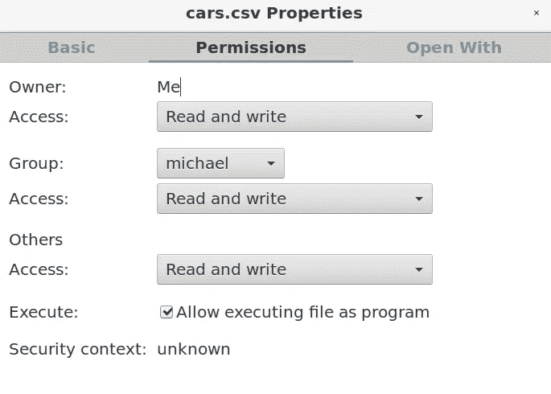

# 在 PostgreSQL 中导入 CSV 并进行回归分析

> 原文：<https://towardsdatascience.com/importing-csvs-in-postgresql-and-conducting-regression-analysis-77ff92f5a283?source=collection_archive---------31----------------------->

## 如何将数据集导入 PostgreSQL 并进行回归分析


来源:图片由 [geralt](https://pixabay.com/users/geralt-9301/) 从 [Pixabay](https://pixabay.com/photos/data-computer-internet-online-www-2899901/) 拍摄

作为数据科学家，我们通常更喜欢用 Python 和 r 进行回归分析——当然也包括几乎所有形式的分析。

也就是说，虽然跨小型数据集或在辅助项目中使用 CSV 文件是很常见的，但任何实际大小的真实世界数据几乎总是存储在 SQL 数据库中。

通常，将整个表导入 Python 或 R(取决于其大小)是不切实际的。

假设我们希望对从 SQL 数据库导入的特定数据集进行回归分析。据我们所知，对该数据集进行回归分析的结果可能是虚假的，这意味着提取数据进行更高级的分析浪费了宝贵的时间和资源。

在将数据导入外部程序进行更高级的分析之前，用 SQL 进行一些初步的分析不是更有效吗？

嗯，使用 SQL 进行简单的回归分析确实是可能的。让我们来看看这是如何做到的。

# 数据集和从 CSV 导入

考虑一个汽车销售数据集([可从我的 GitHub](https://github.com/MGCodesandStats/datasets/blob/master/cars.csv) 获得)，其中提供了特定车辆的**售价**，以及诸如购买者的月**收入**水平、他们的总**债务**以及每月驾驶的平均**英里数**等因素。

虽然数据可能已经在 SQL 数据库的一个表中提供了，但我们经常希望从 CSV 文件中导入数据。让我们看看如何做到这一点。

首先要确保 SQL 具有访问 CSV 文件的适当权限。例如，假设您正在使用 LibreOffice Calc(我是一个 Linux 用户)，您将需要通过右键单击 CSV 文件，选择 Properties，并切换到 permissions 来确保权限是允许的:



资料来源:图书馆办公室计算

在导入 CSV 文件之前，需要创建数据库和表，并在后者中定义适当的变量。

创建并打开数据库(在本例中称为**车辆**，输入以下内容:

```
sudo -u postgres createdb vehicles
sudo -u postgres psql vehicles
```

现在，名为**汽车**的表格被创建:

```
vehicles=# create table cars (
vehicles(# age decimal(8,2),
vehicles(# gender decimal(8,2),
vehicles(# miles decimal(8,2),
vehicles(# debt decimal(8,2),
vehicles(# income decimal(8,2),
vehicles(# sales decimal(8,2)
vehicles(# );
```

创建表格后，我们现在可以将数据从 CSV 文件导入表格:

```
vehicles=# copy cars (age, gender, miles, debt, income, sales)
vehicles-# from '/home/Desktop/cars.csv'
vehicles-# DELIMITER ','
vehicles-# CSV HEADER;
COPY 963
```

对于数据集中的 963 个条目， **COPY 963** 消息表明这些值被正确传输。

我们现在可以通过从表中选择前 10 个观察值来验证这些值是否存在:

```
vehicles=# select * from cars limit 10;
  age  | gender | miles |   debt   | income  |  sales   
-------+--------+-------+----------+---------+----------
 28.00 |   0.00 | 23.00 |     0.00 | 4099.00 |   620.00
 26.00 |   0.00 | 27.00 |     0.00 | 2677.00 |  1792.00
 30.00 |   1.00 | 58.00 | 41576.00 | 6215.00 | 27754.00
 26.00 |   1.00 | 25.00 | 43172.00 | 7626.00 | 28256.00
 20.00 |   1.00 | 17.00 |  6979.00 | 8071.00 |  4438.00
 58.00 |   1.00 | 18.00 |     0.00 | 1262.00 |  2102.00
 44.00 |   1.00 | 17.00 |   418.00 | 7017.00 |  8520.00
 39.00 |   1.00 | 28.00 |     0.00 | 3282.00 |   500.00
 44.00 |   0.00 | 24.00 | 48724.00 | 9980.00 | 22997.00
 46.00 |   1.00 | 46.00 | 57827.00 | 8163.00 | 26517.00
(10 rows)
```

# 相关系数和回归分析

现在数据已经导入，让我们开始进行一些分析。

特别是，我们想确定哪些变量对每辆车的销售价格有特别的影响。如上所述，在考虑更高级的分析之前，我们希望通过使用 SQL 来确定是否有特别相关的发现。

## 相关系数

首先，让我们生成以下变量之间的相关系数(衡量两个变量之间关系的强度):

*   销售和收入
*   销售和债务
*   销售额和里程

为了计算销售和收入之间的相关系数，我们将输入以下内容，首先输入 Y(因变量),然后输入 X(自变量):

```
vehicles=# select corr(sales, income) as correlation from cars;
    correlation    
-------------------
 0.674685436054842
(1 row)
```

分析得出的相关系数为 0.67，表明这两个变量之间存在正相关。

作为参考，相关系数 1 表示完全正相关，-1 表示完全负相关，而 0 表示不相关。

以下是其他变量的相关系数:

```
vehicles=# select corr (sales, debt) as correlation from cars;
   correlation    
------------------
 0.83554132018907
(1 row)vehicles=# select corr (sales, miles) as correlation from cars;
    correlation    
-------------------
 0.636675650108261
(1 row)
```

有趣的是，我们看到销售额和债务在 0.83 处有最强的相关性。这可能向我们表明，持有更多债务的客户更有可能贷款购买汽车。直觉上，这是有道理的——因为更昂贵的汽车通常是通过债务融资，而不是现金购买。

## 回归分析

为了更深入，让我们进行一个回归分析。

我们将首先根据收入回归销售额:

```
vehicles=# select round(regr_slope(sales, income)::numeric, 2) as slope, round(regr_intercept(sales, income)::numeric, 2) as y_intercept from cars;
 slope | y_intercept 
-------+-------------
  1.86 |      205.29
(1 row)
```

分析得出的斜率为 1.86，表明收入每增加 1 美元，销售额就会增加 1.86 美元。在这种情况下，截距有些虚假，但本质上代表了如果客户的收入为 0 美元时的最小销售额。

现在，让我们对其他变量进行回归分析:

```
vehicles=# select round(regr_slope(sales, debt)::numeric, 2) as slope, round(regr_intercept(sales, debt)::numeric, 2) as y_intercept from cars;
 slope | y_intercept 
-------+-------------
  0.41 |     5892.27
(1 row)vehicles=# select round(regr_slope(sales, miles)::numeric, 2) as slope, round(regr_intercept(sales, miles)::numeric, 2) as y_intercept from cars;
 slope  | y_intercept 
--------+-------------
 427.69 |     -158.93
(1 row)
```

*   债务每增加 1 美元，销售额就增加 0.41 美元。截距表明，如果债务为 0 美元，最小销售数将为 5，892.27 美元。
*   每天平均行驶里程每增加 1 英里，销售价格就会增加 427.69 美元。这与我们的预期相反——我们认为汽车行驶的里程越多，销售价格就越低。然而，在这种情况下,**平均每天行驶的英里数**才是问题中的变量——而不是总英里数。在这种情况下，从建模的角度来看，这个变量很可能是虚假的，并不能真正告诉我们对销售价格的具体影响。

## r 平方

为了更好地衡量这些读数的意义，让我们来看看一个被称为 **R 平方**的统计数据。

本质上，任何因变量(在这种情况下，销售)都受模型中的自变量和这些变量没有拾取的随机变量的影响。

R-Squared 用于衡量模型在多大程度上解释了因变量的总变化。R 平方值介于 0 和 1 之间，0 表示模型考虑了因变量的**无**变化，而 1 表示模型考虑了因变量的**所有**变化。

以下是对相关变量的 R 平方计算:

```
vehicles=# select round(regr_r2(sales, income)::numeric, 3) as r_squared from cars;
 r_squared 
-----------
     0.455
(1 row)vehicles=# select round(regr_r2(sales, debt)::numeric, 3) as r_squared from cars;
 r_squared 
-----------
     0.698
(1 row)vehicles=# select round(regr_r2(sales, miles)::numeric, 3) as r_squared from cars;
 r_squared 
-----------
     0.405
(1 row)
```

我们可以看到，销售额对债务的回归具有最高的 R 平方，接近 70%，这意味着债务变量几乎占销售额总变化的 70%。

# 结论

这是对 PostgreSQL 中回归分析使用的介绍。您还看到了如何导入 CSV 格式的数据集，并将其传输到 SQL 表中。

我推荐阅读 Anthony DeBarros 的《实用 SQL 》,更深入地了解如何使用 SQL 实现回归分析和其他分析工具。

如前所述，在对特定数据集进行“快速而粗略”的分析时，SQL 非常有用——这可以极大地帮助确定是否需要使用外部程序(如 Python 或 r)进行进一步的分析。

虽然更深入的回归分析(如 t-test 计算)可能难以在 SQL 中实现(通常不推荐)，但在数据库表本身中进行初步分析总是有其优势的。

非常感谢您的宝贵时间，非常感谢您的任何问题或反馈。你可以在[michael-grogan.com](https://www.michael-grogan.com/)找到更多我的内容。

# 参考

*   [postgresqltutorial.com:将 CSV 文件导入 PostgreSQL 表](https://www.postgresqltutorial.com/import-csv-file-into-posgresql-table/)
*   [Anthony DeBarros 的实用 SQL](https://www.practicalsql.com/)
*   [stackoverflow.com](https://stackoverflow.com/questions/54031813/i-am-trying-to-copy-a-file-but-getting-error-message)

*免责声明:本文是在“原样”的基础上编写的，没有任何担保。它旨在提供数据科学概念的概述，不应被解释为专业建议。本文中的发现和解释是作者的发现和解释，不被本文中提到的任何第三方认可或隶属于任何第三方。作者与本文提及的任何第三方无任何关系。*