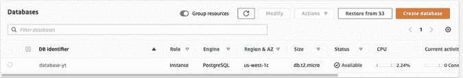

# 用 Python 将熊猫数据帧导入数据库

> 原文：<https://towardsdatascience.com/importing-pandas-dataframe-to-database-in-python-7212de1028c9?source=collection_archive---------24----------------------->

## 了解如何将你的数据从熊猫数据框架上传到云中的数据库。


作者创造的形象

在本文中，我们将讨论如何将您的数据从 pandas 数据框架上传到云中的数据库。这是一篇文章的续篇— [*数据分析项目理念将让你得到这份工作*](https://www.stratascratch.com/blog/data-analytics-project-ideas-that-will-get-you-the-job/?utm_source=medium&utm_medium=click&utm_campaign=blog) ，在这篇文章中，我们讨论了构建你需要的唯一一个数据科学项目，并且我介绍了你可以为数据科学项目构建的基础设施。第一部分是从一个 API 收集数据作为数据源。在我们之前的博客— [*使用 Python APIs 进行数据科学项目*](https://www.stratascratch.com/blog/working-with-python-apis-for-data-science-project/?utm_source=medium&utm_medium=click&utm_campaign=blog) 中，我已经向您介绍了如何做到这一点。既然您已经将来自 API 的数据保存在 pandas dataframe 中，我们需要将它放入数据库表中。

Github 链接:[https://github.com/Strata-Scratch/api-youtube](https://github.com/Strata-Scratch/api-youtube)

作者通过 [YouTube](https://www.youtube.com/channel/UCW8Ews7tdKKkBT6GdtQaXvQ/) 发布的视频

# 为什么我们需要将熊猫数据帧导入数据库？

将数据保存到数据库的最大原因是将所有数据保存在另一个服务器(数据库)上，而不是存储在本地计算机上，这样会占用内存。您可以存储数据的清理版本，而不必在每次构建分析时都进行清理。

另一个原因是，大多数[数据科学公司](https://www.stratascratch.com/blog/ultimate-guide-to-the-top-5-data-science-companies/?utm_source=medium&utm_medium=click&utm_campaign=blog)将他们的数据存储在数据库中，因此学习如何从数据库中提取和推送数据非常重要。

让我们看一下如何将数据从 pandas 数据帧加载到云中的数据库表，并执行第二次操作，用新数据更新同一个表。我们将以一种可伸缩的方式做到这一点，这意味着我们的代码可以处理潜在的数百万行，而不会破坏 pandas 或耗尽内存。

# 设置

## 在云上创建数据库(AWS)

我们将在 AWS 上创建一个 Postgres 数据库，并使用 psycopg2 库连接到 python 上的数据库。有很多关于如何做到这一点的教程，所以我不会详细介绍如何启动数据库。

我正在 AWS 上创建一个 RDS 实例，如您所见，我的数据库名为“database-yt”



截图自 [AWS](https://aws.amazon.com/rds/)

我们所有的连接信息也可以在 AWS 上找到。


截图来自 [AWS](https://aws.amazon.com/rds/)

保存所有信息，以便在 python 中连接到数据库时使用。

## 创建一个 Google Colab 或 Jupyter 笔记本

就像我们的其他项目一样，我们可以使用 Google Colabs 或 Jupyter 笔记本。我要用 Google Colabs。

要做的第一件事是安装 python-postgres 包装器 psycopg2，以便更容易通过 python 连接到您的数据库。我也在导入必要的库来完成我的工作，比如熊猫。

```
!pip install psycopg2
import psycopg2 as ps
import pandas as pd
```

## 连接到数据库

输入您创建的数据库的凭据。

```
host_name = 'database-XXXX.us-west-1.rds.amazonaws.com'
dbname = 'XXXX'
port = '5432'
username = 'XXXX'
password = 'XXXXX'
```

现在，让我们创建一个函数，允许您将凭证传递给数据库并建立连接。

```
def connect_to_db(host_name, dbname, port, username, password):
   try:
       conn = ps.connect(host=host_name, database=dbname, user=username, password=password, port=port)

   except ps.OperationalError as e:
       raise e
   else:
       print('Connected!')
       return conn
```

## 上传/导入数据

此时，您可以导入您的数据并将其保存为 pandas dataframe。如果你知道我在做什么，我通过连接到 Youtube API 并从那里提取数据来提取我的数据。参考我们之前的文章— [*使用 Python APIs 进行数据科学项目*](https://www.stratascratch.com/blog/working-with-python-apis-for-data-science-project/?utm_source=medium&utm_medium=click&utm_campaign=blog) 。

在这里，我们将保持整洁，使用两个独立的笔记本将我们的数据从一个笔记本转移到另一个，我们将它保存为 csv 并上传。但实际上，如果我们从 API 中收集数据，并将其保存为熊猫数据帧，我们将使用相同的笔记本将其上传到我们的数据库。

```
youtube_videos = pd.read_csv('youtube_videos.csv', index_col=0)
youtube_videos.head()
```

# 创建数据库表

## SQL 创建表命令

让我们创建表格。很明显，我们将使用 SQL 来创建表，但是我们将在 CREATE TABLE 命令中添加一个变量 *%s* ，这样我们就可以在不使用实际 SQL 命令的情况下更改表名。这使得实验和测试更容易，减少了人为错误。

我们有一个 CREATE TABLE IF NOT EXISTS，然后是参数 *%s* ，其中 *%s* 是我的表名的占位符。因为我们已经知道了表模式，因为我们已经有了数据的 pandas 数据框架，所以我们将命名列并添加数据类型。这是一个标准的创建表 SQL 查询。然后，我们将所有内容保存在名为 *create_table_command* 的变量中。

```
create_table_command = ("""CREATE TABLE IF NOT EXISTS %s (
                   video_id VARCHAR(255) PRIMARY KEY,
                   video_title TEXT NOT NULL,
                   upload_date DATE NOT NULL DEFAULT CURRENT_DATE,
                   view_count INTEGER NOT NULL,
                   like_count INTEGER NOT NULL,
                   dislike_count INTEGER NOT NULL,
                   comment_count INTEGER NOT NULL
           )""")
```

就像创建到数据库的连接一样，我们将把一切都包装在一个名为 create_table 的函数中。

```
def create_table(curr, tablename):
   create_table_command = ("""CREATE TABLE IF NOT EXISTS %s (
                   video_id VARCHAR(255) PRIMARY KEY,
                   video_title TEXT NOT NULL,
                   upload_date DATE NOT NULL DEFAULT CURRENT_DATE,
                   view_count INTEGER NOT NULL,
                   like_count INTEGER NOT NULL,
                   dislike_count INTEGER NOT NULL,
                   comment_count INTEGER NOT NULL
           )""")

   curr.execute(create_table_command, [ps.extensions.AsIs(tablename)])
```

## 将数据库连接传递给函数

我们将把名为 *curr* 的 Postgres 连接 *cursor()* 和表名传递给 *create_table* 函数。游标是一个类实例，允许您运行 SQL 命令并获取结果。它基本上允许 python 代码在数据库会话中执行 sql 命令。

```
conn = connect_to_db(host_name, dbname, port, username, password)
curr = conn.cursor()
```

## 执行 SQL 命令

然后，我们将对我们的 *cursor()* 类使用 *execute()* 方法来执行 SQL 命令。

```
curr.execute(create_table_command, [ps.extensions.AsIs(tablename)])
```

execute()方法的第一部分需要保存在 *create_table_command* 中的 SQL CREATE TABLE 命令，因为有一个参数 *%s* 表示表名，所以我们还需要将表名传递到命令中。我们可以通过使用[PS . extensions . asis(tablename)]在变量 *tablename* 中传递表名来做到这一点。

*AsIs()* 是一个函数，用来去掉表名两边的引号。因为如果我们传递一个没有这个函数的表名，它会像“video”一样在 SQL 查询中加引号，所以我们使用 AsIs()告诉 postgre 你应该把它作为没有引号的名字。

现在，我们可以连接到数据库，命名我们的表，并使用这三行代码在云中的数据库上创建表。

```
curr = conn.cursor()
TABLE_NAME = "videos"
create_table(curr,TABLE_NAME)
```

# 将数据加载到数据库表中

数据在我们的熊猫数据框里。有两种方法可以将所有数据从 dataframe 传递到数据库。您选择的方法取决于数据的性质和大小。

1.  行一旦进入数据库，就不会被更新。
    ~在这种情况下，您只需要在数据库表中添加新数据作为新行。
2.  当列中有新数据时，行被更新
    ~在这种情况下，不仅需要添加新数据作为新行，还需要更新现有行中的值。例如，因为我正在处理来自我的频道的 Youtube 视频数据，所以我有一个我的频道上的视频列表，它们的观看计数和评论计数。这些数量会随着时间的推移而变化，所以当我第二次从 Youtube API 中提取数据时，我需要更新现有视频的数量，并向数据库表中添加新的视频。这是一个复杂得多的过程。

## 可扩展性案例

根据您从 API 或数据库获得的数据量，您可能不希望一次更新所有的表。这可能会导致大量的插入和更新，从而根据数据量带来性能和内存问题。一种解决方法是一次更新一行。

在我们的例子中，我们没有很多数据，但是我们需要检查数据库表中是否存在一个视频，并用新的计数更新它。我们还需要插入从 Youtube API 中提取的新视频。所有这些数据都保存在我们的本地计算机(或谷歌的 Colab 服务器)上，直到它进入我们的数据库，所以随着我的视频列表的增长，更新所需的内存量也在增长。这就是为什么逐行更新是最好的。

# 更新数据库表中的现有视频

## 检查视频是否存在

我们先检查一下视频是否存在。这将有助于我们第一次将所有视频加载到数据库中，以及以后的所有时间。

但是，如果视频存在，我们希望执行更新；如果视频不存在于数据库表中，我们希望将新视频追加到数据库表中。所以一些伪代码可能是这样的。

```
for i, row in df.iterrows():
       if check_if_video_exists(): # If video already exists then we will update 
update_row()
       else: # The video doesn't exists so we will append to the db table append(row)
```

基本上，这段代码说的是使用 *iterrows()* 一次遍历数据帧的一行，并检查视频是否存在。如果是，则对该行进行更新。如果没有，则将视频信息附加到数据库表中。 [DataFrame.iterrows](https://pandas.pydata.org/pandas-docs/stable/reference/api/pandas.DataFrame.iterrows.html#pandas-dataframe-iterrows) 是一个生成索引和行(作为一个序列)的生成器。

这也适用于初始加载，因为视频将不存在，因为表中没有视频。

## 我们先写 check_if_video_exists()函数

为了检查数据库中是否存在视频，我们运行一个简单的 SQL 命令。我们只需要给命令提供来自熊猫数据帧的视频 id。

```
query = ("""SELECT video_id FROM VIDEOS WHERE video_id = %s""")
curr.execute(query, (video_id,))
```

为了将它包装在一个函数中，我们将编写:

```
def check_if_video_exists(curr, video_id):
   query = ("""SELECT video_id FROM VIDEOS WHERE video_id = %s""")

   curr.execute(query, (video_id,))
   return curr.fetchone() is not None
```

fetchone()从表中返回一行，所以如果我们找到一个具有所需 id 的视频，它应该返回该行，否则它将返回 None。([https://py native . com/python-cursor-fetchall-fetchmany-fetch one-to-read-rows-from-table/](https://pynative.com/python-cursor-fetchall-fetchmany-fetchone-to-read-rows-from-table/))

## 如果视频存在，则更新表格

假设我们的视频存在于数据库表中。现在，我们应该用从 Youtube API 中提取的新计数来更新这些数据库记录，这些新计数保存在我们的 pandas 数据帧中。

这是一个简单的更新 SQL 命令:

```
query = ("""UPDATE videos
           SET video_title = %s,
               view_count = %s,
               like_count = %s,
               dislike_count = %s,
               comment_count = %s
           WHERE video_id = %s;""")
   vars_to_update = (video_title, view_count, like_count, dislike_count, comment_count, video_id)
   curr.execute(query, vars_to_update)
```

这是一个常规的更新 SQL 命令。%s 只是变量的参数，因此我们可以在 SQL 命令中插入适当的值。

同样，让我们用一个函数来包装它:

```
def update_row(curr, video_id, video_title, view_count, like_count, 
dislike_count, comment_count):
   query = ("""UPDATE videos
           SET video_title = %s,
               view_count = %s,
               like_count = %s,
               dislike_count = %s,
               comment_count = %s
           WHERE video_id = %s;""")
   vars_to_update = (video_title, view_count, like_count, dislike_count, comment_count, video_id)
   curr.execute(query, vars_to_update)
```

我们的循环的*和函数现在看起来如下。两个函数的共同之处是数据库连接。*行['video_id']* 和其他列代表熊猫数据帧中的列，在那里我们的*循环的*将逐行进行。 *df.iterrows()* 返回两个参数 I 即行索引和 row 即作为元组的行，但是在我们的例子中，我们不需要使用 I，只需要 row。*

```
for i, row in df.iterrows():
       if check_if_video_exists(curr, row['video_id']): # If video already exists then we will update

update_row(curr,row['video_id'],row['view_count'],row['like_count'],
row['dislike_count'],row['comment_count'])
       else: # The video doesn't exists so we will add it to a temp df and append it using append_from_df_to_db
           tmp_df = tmp_df.append(row)
```

这里，我们将把所有新视频(即数据库表中不存在的视频)追加到另一个 pandas 数据帧中。

## 在新的熊猫数据帧中存储新的视频

但是数据库表中不存在的新视频怎么办？让我们在另一个 *for* 循环中解决这个问题。但是我们能做的是将所有的新视频存储在一个新的熊猫数据框架中。我们的 *for* 循环现在完成了这个逻辑。

```
for i, row in df.iterrows():
       if check_if_video_exists(curr, row['video_id']): # If video already exists then we will update

update_row(curr,row['video_id'],row['view_count'],row['like_count'],row['dislike_count'],row['comment_count'])
       else: # The video doesn't exists so we will add it to a temp df and append it using append_from_df_to_db
           tmp_df = tmp_df.append(row)
```

# 将新视频插入数据库表

## 创建插入 SQL 命令

为了在我们的数据库表中插入新的视频，我们需要编写一个 SQL INSERT 命令。

```
 insert_into_videos = ("""INSERT INTO videos (video_id, video_title, upload_date,view_count, like_count, dislike_count,comment_count)
   VALUES(%s,%s,%s,%s,%s,%s,%s);""")

   row_to_insert = (video_id, video_title, upload_date, view_count, 
   like_count, dislike_count, comment_count)

   curr.execute(insert_into_videos, row_to_insert)
```

以同样的方式，我们编写了 UPDATE 和 CREATE TABLE SQL 语句，我们只需要编写一个常规的 SQL 语句，并使用 *%s* 作为列的参数。

我们将创建一个函数来存储这些命令，这样我们只需要传递视频信息和连接来执行插入。

```
def insert_into_table(curr, video_id, video_title, upload_date, 
view_count, like_count, dislike_count, comment_count):
   insert_into_videos = ("""INSERT INTO videos (video_id, video_title, upload_date, view_count, like_count, dislike_count,comment_count)
   VALUES(%s,%s,%s,%s,%s,%s,%s);""")
   row_to_insert = (video_id, video_title, upload_date, view_count, 
   like_count, dislike_count, comment_count)
   curr.execute(insert_into_videos, row_to_insert)
```

## 逐行添加新视频

让我们一行一行地将视频数据插入表中。为此，我们需要使用一个 *for* 循环来逐行遍历 pandas 数据帧，并将行一行一行地插入数据库。

就像上一个循环的*一样，这个 *for* 循环将遍历数据帧中的每一行，然后运行 *insert_into_table()* 函数，该函数将对数据库中的表执行插入命令。*

```
def append_from_df_to_db(curr,df):
   for i, row in df.iterrows():
       insert_into_table(curr, row['video_id'], row['video_title'], 
       row['upload_date'], row['view_count'], row['like_count'], 
       row['dislike_count'], row['comment_count'])
```

# 把所有东西打包

我们已经编写了处理所有工作的所有函数。我们需要一些代码来执行脚本主要部分的功能。

main 的第一部分将调用 *update_db()* 函数，在这里我们传递数据库连接和熊猫数据帧以及我们的视频信息。 *update_db()* 函数将使用新的计数更新数据库表中找到的现有视频，或者将数据库表中没有找到的视频信息存储在新的 pandas 数据帧中，我们称之为 *new_vid_df* 。

```
new_vid_df = update_db(curr,df)
conn.commit()
```

现在我们有了一个要插入到数据库表中的新视频列表，让我们调用 append_from_df_to_db()函数将这些视频插入到数据库表中。

```
append_from_df_to_db(curr, new_vid_df)
conn.commit()
```

如果你看一下数据库表，数据就在那里。现在，尝试使用这段代码更新数据库中的数据，使用一个新的 pandas dataframe，它是从 API 中提取的更新数据。

# 结论

在这篇文章和上一篇关于从 API 中提取数据的文章之间，我们基本上建立了一个数据管道。所有需要做的就是添加一个调度程序来自动从 API 中提取新数据并刷新数据库表。如果你能够建立一个数据管道，你就已经成功地在你的[项目中迈出了第一步，这是你需要的](https://www.stratascratch.com/blog/data-analytics-project-ideas-that-will-get-you-the-job/?utm_source=medium&utm_medium=click&utm_campaign=blog)。

这个解决方案是可伸缩的，因为它可以处理数百万甚至数十亿行。并且代码是用良好的软件开发基础编写的。

【https://www.stratascratch.com】最初发表于[](https://www.stratascratch.com/blog/importing-pandas-dataframe-to-database-in-python/?utm_source=medium&utm_medium=click&utm_campaign=blog)**。**