# 从 Kaggle Noob 的印象

> 原文：<https://towardsdatascience.com/impressions-from-a-kaggle-noob-dd923e8024bf?source=collection_archive---------29----------------------->

## 我从我的第一个 Kaggle 比赛中学到的是:泰坦尼克号数据集

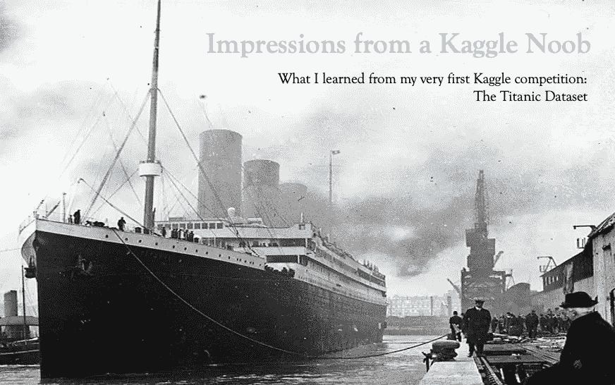

未知作者，公共领域，通过维基共享

这段时间从圣诞节前后到新年的第一周或第二周，通常是留给学习和提高技能，或者尝试新事物的。去年，我研究了深度学习，对它的工作原理有了基本的了解。可惜还是离我现在的工作现实太远了，所以就到此为止了。尽管如此，我还是对新知识感到高兴。

从去年夏天开始，我越来越关注成为一名更好的数据科学家的旅程。我最近换到了商业智能部门，处理数据成了我的日常工作。下班后和周末，我赶上了基本的 ML 算法，并使用 Scikit-Learn 编写了一些分析脚本。这被证明是非常富有成效的，因为我能够直接将我所学到的应用到我的日常工作中。

机器学习是我仍然欠缺的，也是我在 2021 年最关注的领域。圣诞节后，我得到了一些关于这个话题的好书。此外，我终于开始关注吴恩达在 Coursera 上的著名课程，尽管我发现自己很容易对被动的坐听课程感到厌倦(公平地说，Ng 的课程并不是这样)。

**然而，用真实的数据集解决真实的问题通常会让我进入心流状态。在重新开始工作之前，我还有一整个周末的时间，我很想尝试一些新的东西。在书本、课程和工作之外，我可以提高我的数据科学技能，并从实践中学习。**

我并没有告诉任何人什么新的东西，我只是说 Kaggle 似乎是一个很好的地方。虽然我自己从未尝试过。由于我的印象是完全新鲜的，我想与你分享这些。**不要指望这篇文章会成为成为一名卡格尔大师的指南！**我最近刚从新手毕业成为竞赛贡献者(这还没什么值得骄傲的)。然而，如果你自己也要开始，并且不想重复我的错误，这可能仍然是一个有趣的阅读。

我将描述我的一般方法，并在最后总结我的五点心得。

# 关于我自己的一点背景

如前所述，我是一家快速消费品巨头的初级数据分析师。在我的工作中，我创建商业报告，钻研 CRM 和数字媒体数据，并与同事讨论如何让他们的工作生活更有成效。我不是 ML 工程师，也不是计算机科学家。我学了哲学(文学学士)和管理学(理学硕士)

为了从数据中创造更多的知识，我不断努力提高我的数据科学技能，但我才刚刚开始我的旅程。我可以用 R 和 Python 编写代码，熟悉像 PowerBI 这样的报告工具，并使用像 SQL 和 BigQuery 这样的查询语言。我知道一些最大似然算法和回归问题，但是，我的经验有限(因此初级)。

简而言之:虽然我在工作中从数据中创造商业价值，但我并不期望拥有在激烈的竞争中表现出色的必要工具。但这对我来说不是重点。目标是通过在工作之外的数据集上应用机器学习算法来获得更多经验。跳下飞机，一边下落一边组装降落伞，对吧？

# 过程:进入泰坦尼克号竞赛

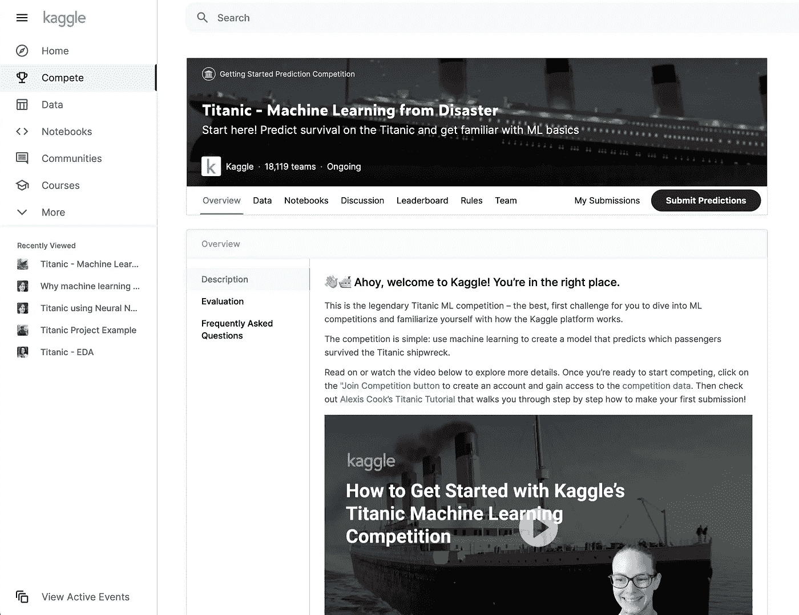

当开始阅读数据科学时，没有人能够逃避一些数据集。对于图像分类来说，MNIST 数据集是 Kaggle 初学者的泰坦尼克号数据集。卡格尔泰坦尼克号比赛的任务是预测谁将在泰坦尼克号失事中幸存。

> 1912 年 4 月 15 日，在她的处女航中，被广泛认为是“不沉”的皇家邮轮泰坦尼克号在与冰山相撞后沉没。不幸的是，没有足够的救生艇容纳船上的每个人，导致 2224 名乘客和船员中的 1502 人死亡。
> 
> 虽然幸存有一些运气成分，但似乎某些群体比其他群体更有可能幸存。
> 
> 在这个挑战中，我们要求你建立一个预测模型来回答这个问题:“什么样的人更有可能生存？”使用乘客数据(即姓名、年龄、性别、社会经济阶层等)。— Kaggle 网站

您从大约 900 个实例和 10 个特征开始，构建您的模型，预测另外 400 个实例的生存状态，并将您的预测上传到 Kaggle 以检查准确性。

所以**每个人都从相同的数据开始**但是参赛的模特表现非常不同。如你所知，重要的不仅仅是型号。发现新特性(特性工程)和决定在训练阶段保留哪些特性和忽略哪些特性可能同样重要，甚至更重要**。**

尽管如此，由于这是一个相当小的数据集，而且竞争已经存在了一段时间，所以有许多共同的策略。然而，由于我的目标是通过尝试学习尽可能多的东西，我决定在我第一次上传之前什么都不读。

在最初的**特征工程**中，第一阶段仅创建了“甲板”特征，该特征基于船舱编号中的字符(例如船舱“C103”中的“C”)。一项小小的研究表明，上层甲板(A、B 和 C)的船舱是最豪华、最昂贵的，装饰精美，并且尽可能远离船底隆隆作响的机器。这肯定起作用了吧？有钱人生存？事实证明，拥有一间小屋已经是财富的象征了。

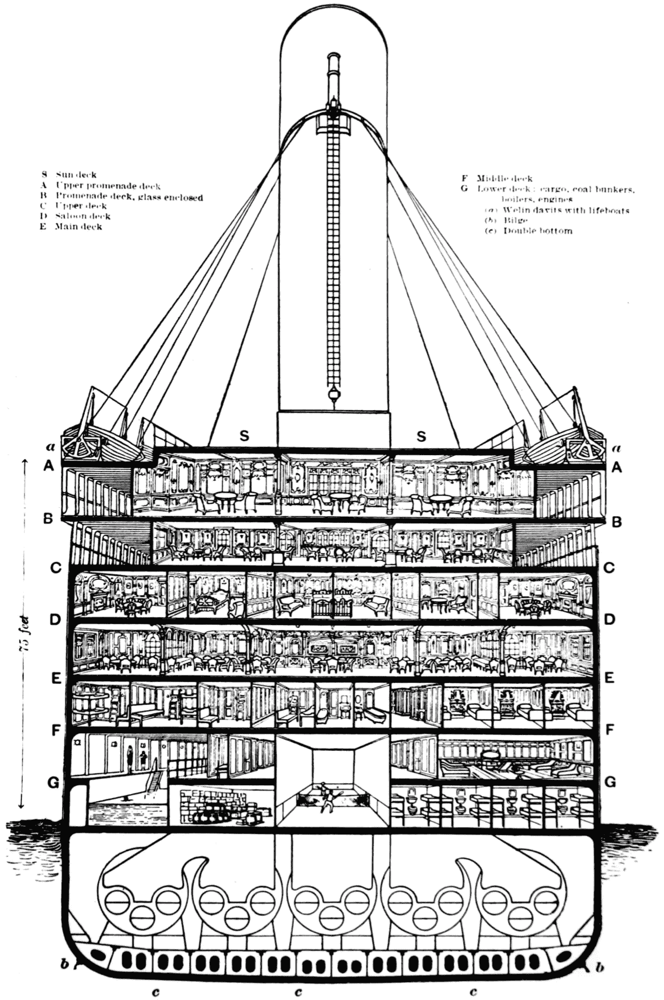

维基百科:[https://en . Wikipedia . org/wiki/First-class _ facilities _ of _ the _ 泰坦尼克号](https://en.wikipedia.org/wiki/First-class_facilities_of_the_Titanic)

在那之后，我开始查看 **EDA 阶段**的数据，看看我是否能在视觉上找到特征之间的关系。我不想在这里关注它，我计划很快写一个关于我的过程和发现的 Kaggle 笔记本(链接将在这里添加，但请随意关注我的 [Kaggle 个人资料](https://www.kaggle.com/jonasschroeder))。我创建了一个总结图表，你应该提供一个清晰的画面:主要是上层阶级和女性在这场悲剧中幸存下来。

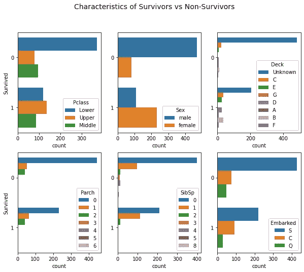

接下来，我**对数据**进行预处理，为 ML 算法做准备。我做了一些非常标准的事情，比如用变量的中值替换缺失值(比如年龄和费用)，用 sklearn 的 StandardScaler 标准化数值，用 sklearn 的 OneHotEncoder 将类别转换成“数值”，所有这些都放在 ColumnTransformer 中。如果你对代码感兴趣，可以看看我的 [GitHub repo](https://github.com/JonasSchroeder/kaggle_titanic) 来了解一下。

train_df 和 test_df(我需要预测)已经为某些模型做好了准备！现在有趣的部分来了，**训练 ML 模特**！从我的工作经验来看，我已经非常熟悉基本的随机森林，所以很自然地，这就是我开始的地方。我没有过多关注交叉验证或选择的准确性分数，因为我只想得到一个基线。我上传了我的预测，得到了……0.46 分……对于二进制分类问题，我可能会使用类似抛硬币(np.random.binomial(1，0.5))的方法得到比我的“复杂”ML 模型更好的结果。

这是我开始研究其他人如何处理数据集以及他们的特征工程和模型如何工作的地方。我的目标是学习更多关于一般过程的知识，我已经花了几个小时完全靠自己，所以我对得到一些灵感没什么意见。

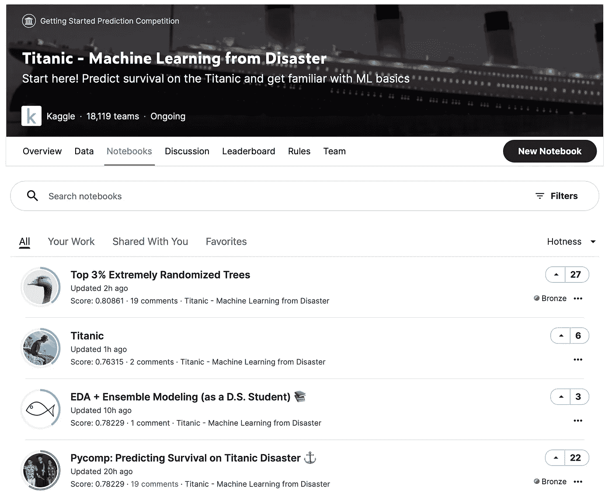

我特别喜欢 Ken Jee 的视频[初学者 Kaggle 数据科学项目走查(泰坦尼克号)](https://www.youtube.com/watch?v=I3FBJdiExcg)。在坚持使用我的预处理数据集和特征的同时，在观看了他的视频并阅读了他在 Kaggle 上的[笔记本](https://www.kaggle.com/kenjee/titanic-project-example)后，我又创建了几个模型，如逻辑回归、朴素贝叶斯和基于这些模型的投票分类器。

【https://www.youtube.com/watch?v=I3FBJdiExcg 

Kaggle 笔记本以及泰坦尼克号比赛的讨论区被证明是向他人学习的好地方。虽然你基本上可以从其他人那里“窃取”完整的代码，以便在比赛中取得好成绩，但这并不是一个符合我目标的策略。尽管如此，它帮助我提出了几个平均交叉验证分数达到 0.82 的模型(这尖叫着过度拟合，但我决定现在忽略它)。

我准备上传更多的预测。

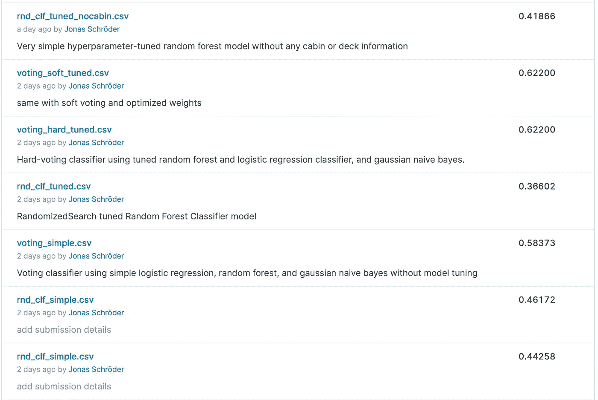

总的来说，虽然在训练阶段很好，但我发现随机森林模型在实际的待预测数据集上效果不佳(或者我是这样认为的)。然而，投票分类器在硬投票和软投票版本中的表现明显更好，得分为 0.62200。

当时我很开心，但也很困。所以我决定今天到此为止，去睡觉。第二天，我回到了特性工程阶段，并结合了一些我在讨论部分读到的技术。我的分数变得更差了，我又回到了前一天晚上离开的地方。

一些模型现在达到了 0.62200 分，我决定比较预测结果。结果是，所有的模型都一致地预测了这个班级:**无人幸存，全是 0** 。当然，当泰坦尼克号的基线存活率大约为 32%时，我肯定经常是对的。

用我后来在阅读**分类性能测量**时了解到的术语来说:我的召回率是完美的(我识别了所有的非幸存者)，但我的精确度(考虑到假阳性)是糟糕透顶。原来这个问题被称为[精确-召回权衡](https://medium.com/@syuumak/precision-recall-tradeoff-1f5b10cc729d)。只有随机森林分类器预测了几个幸存者，但没有正确的，因此得分更低。

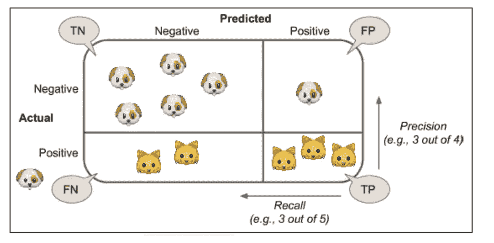

作者[小土豆](https://medium.com/u/ebb1fdf86a5d?source=post_page-----dd923e8024bf--------------------------------)[https://medium . com/@ syuumak/precision-recall-trade off-1 F5 b 10 cc 729d](https://medium.com/@syuumak/precision-recall-tradeoff-1f5b10cc729d)

我最终在代码的预处理部分发现了问题，解决了它，重新运行了所有的模型。这一次，我在将预测表上传到 Kaggle 之前检查了它们，结果成功了。由于现在的模型是根据正确的训练数据训练的，**我的分数显著提高了**。

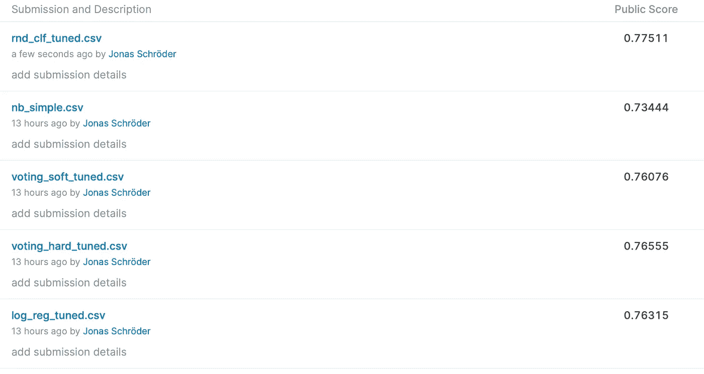

截至撰写本文时，用 RandomizedSearchCV 调优的随机森林模型是我最好的模型，得分为 0.77511，我对此非常满意。它仍然落后于 Jee 的模型 0.79425，但它使我达到了前 55%，并让我对 Kaggle 如何工作以及在处理这样的分类问题时什么是重要的有了更好的了解。

下面总结一下这两天学到的东西。

# 学习、收获和未来

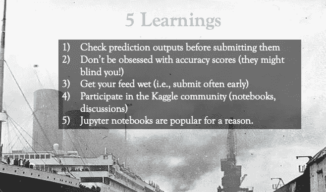

嗯，最明显的收获和**学习 1 是在将预测上传到 Kaggle** 之前检查输出，并思考它们是否脱离模型有意义。当你处于心流状态和兴奋时(尤其是缺乏睡眠时)很容易忘乎所以，但这是一个容易实现的目标！

我很晚才发现我的错误的原因是我对 Kaggle 分数的痴迷。0.62200 的分数高于我的其他型号，所以它一定更好，对不对？嗯，模型预测所有人都死了，当存活率为 0.31 时，大多数情况下都是正确的。**学习二:不要太执着于准确率分数否则会蒙蔽你的双眼。**

训练阶段的分值也被证明是误导性的。尽管我使用了交叉验证，让<1000k instances and 30+ features resulted in overfitting. The Kaggle score was found to be 3% to 8% less than the training score using cross validation. **学习 3:不时地尝试一下，上传一些预测，看看哪些模型在真实数据上工作得很好，而不是在训练数据上过度拟合。**

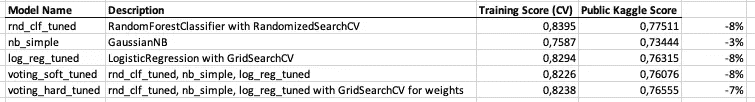

Kaggle 在学习方面比我想象的要好。这个社区非常活跃，人们在讨论区和笔记本区以及 Kaggle 之外的 YouTube 视频、GitHub 上或通过媒体帖子分享他们的方法和代码。我听说在真实的竞争中这是真的，而且结合其他人的方法甚至是获得高分的必要条件，这让我想起了股票估值中的市场效率辩论，但那是另一个故事了。然而，在 Kaggle 的世界里工作(例如，通过阅读和写笔记本，参与讨论)是提高个人技能的一个很好的方法，这也是我的学习 4。

谈论 Kaggle 笔记本:我倾向于在 Spyder 中工作，并将我的脚本分割成多个部分，以便我随后运行。Spyder 4 的新功能是一个很好的扩展，我可以在新的绘图部分观察所有的绘图。在用 Kaggle 做实验之前，我就知道数据科学家喜欢 Jupyter 笔记本，主要是因为它将编码和文档以一种发布就绪的格式结合在一起。没有 Spyder 的变量资源管理器和 df，我无法生活。head(5)对我来说不合适。但是，Spyder 一个人真的没有 EDA 那么伟大。在#comments 和' ' ' docstrings ' ' '中记录调查结果在视觉上不如一个优秀的笔记本吸引人。这让我想到了我最后的**学习 5:数据科学家喜欢 Jupyter/Kaggle/Google Colab 笔记本是有原因的，我应该开始在那种工作中更多地使用它们(EDA，记录方法，总结发现，与他人分享，等等。).**

2021 年 1 月 4 日更新:在 Jupyter 笔记本上工作时摆弄功能让我进入了前 7%。我在卡格尔的第三天。

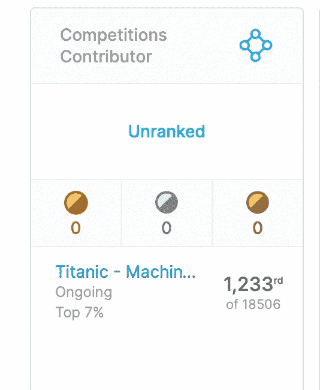

**联系我:**

https://www.kaggle.com/jonasschroeder

领英:[https://www.linkedin.com/in/jonas-schr%C3%B6der-914a338a/](https://www.linkedin.com/in/jonas-schr%C3%B6der-914a338a/)

研究门:[https://www.researchgate.net/profile/Jonas_Schroeder](https://www.researchgate.net/profile/Jonas_Schroeder)

**资源:**

GitHub 泰坦尼克号回购:[https://github.com/JonasSchroeder/kaggle_titanic](https://github.com/JonasSchroeder/kaggle_titanic)

**乔纳斯·施罗德的大众媒体文章:**

[可以从 LinkedIn 抓取数据吗？(走向数据科学)](/can-you-crawl-data-from-linkedin-f5fbe629a92d)

[线下和线上社交网络影响力研究(面向数据科学)](/research-of-influence-in-offline-and-online-social-networks-6ed162bb94dc)

[insta gram 上相关标签的社交网络分析(使用 InstaCrawlR，GitHub 上的代码)](/social-network-analysis-of-related-hashtags-on-instagram-using-instacrawlr-46c397cb3dbe)