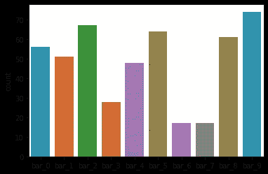
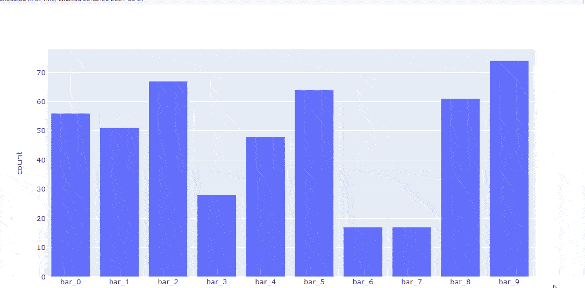
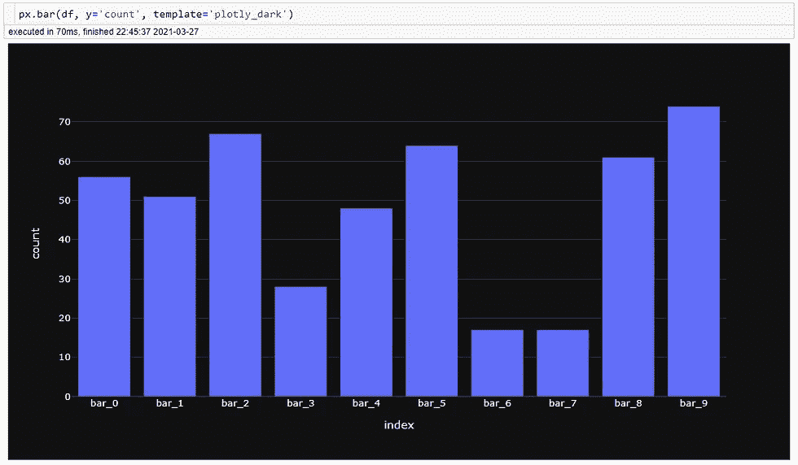
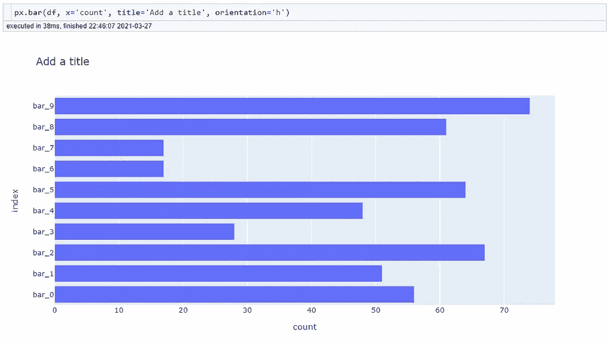
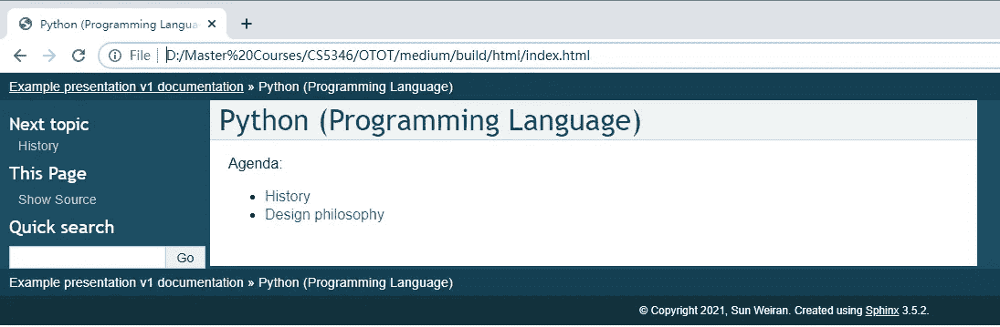
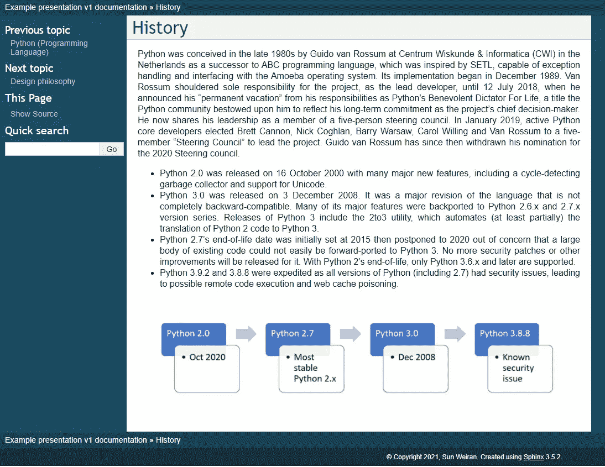
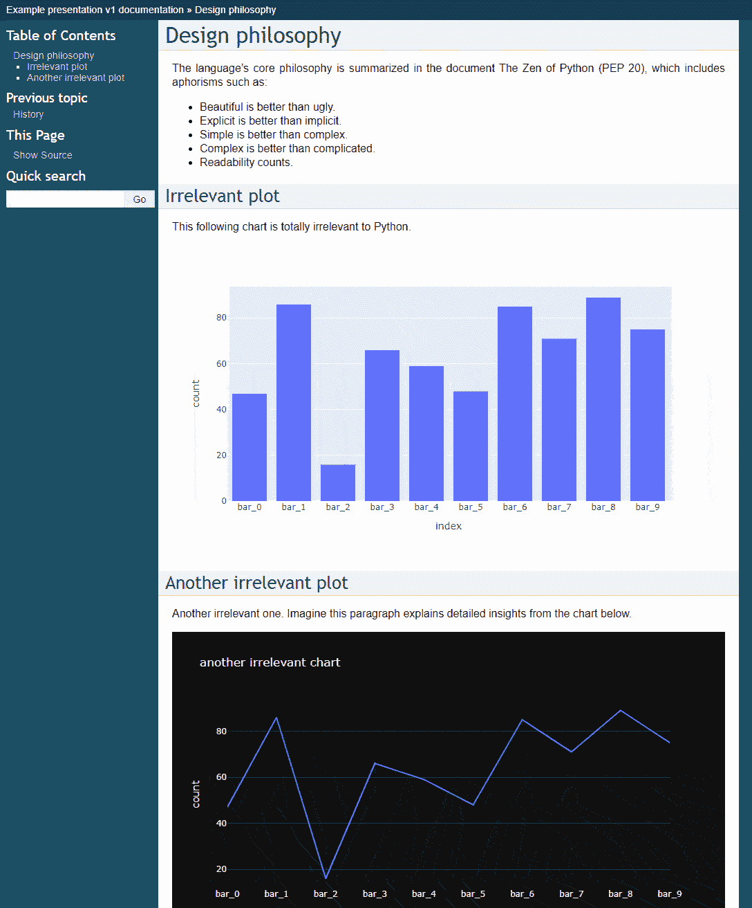

# Plotly 和 Sphinx 令人印象深刻的互动演示

> 原文：<https://towardsdatascience.com/impressive-and-interactive-presentation-with-plotly-and-sphinx-1c55ee829bbb?source=collection_archive---------3----------------------->

## 数据科学家不用 PowerPoint 也能做更好的演示

新加坡 HDB 公寓——照片由 [Unsplash](https://unsplash.com?utm_source=medium&utm_medium=referral) 上的 [Rigel](https://unsplash.com/@rigels?utm_source=medium&utm_medium=referral) 拍摄

## PowerPoint 的局限性是什么？

至少 25%的数据科学家的日常工作涉及沟通和管理利益相关者，从管理层和客户那里获得认同和信心。这些都需要强有力的演示。大多数时候，PowerPoint 幻灯片是主要的工具，但它并不总是最好的选择。

*   **PowerPoint 幻灯片没有交互性**——你可以在 Jupyter 笔记本上创建交互式图表，但是一旦你把它们粘贴到桌面上，它们就变成静态的了。
*   **PowerPoint 幻灯片不能包含太多信息**——受画布大小和美学设计的限制，不建议在幻灯片上详细说明信息。然而，当其他人在演讲后提到你的幻灯片时，这样的记录会很有帮助。

Jupyter 笔记本是比较好的展示选择，但肯定不是最好的。原因是与他人共享笔记本并不简单——您需要设置 Python 依赖项并传输图表背后的数据，以便为您的同事和客户启用笔记本。我们都知道这可能非常麻烦，有时甚至是不可能的。

那么，如何才能为演示文稿创建文档，使**支持交互式图表**、**允许详细阐述、**和**易于与他人分享？**我们可以通过结合 Plotly 和 Sphinx 来实现！

## 第一步:交互式图表——非常精彩！

Plotly 是 Python 中最流行和最有用的图形和图表库之一。它有精心设计的高级功能，用户可以简单地调用这些功能来创建交互式图表。与其他 Python 绘图库不同，例如 [Matplotlib](https://matplotlib.org/) 或 [Seaborn](https://seaborn.pydata.org/) 生成静态图表，Plotly 生成支持悬停、缩放甚至动画的图表。

让我们在下面的例子中比较一下最简单的 Seaborn 和 Plotly 条形图。很明显，由于悬停信息和放大/缩小功能，Plotly 表现更好。

Seaborn 和 Plotly 基本条形图的比较—图片由作者提供

更重要的是，创建上面的图表一点也不难！参考下面的截图，这两个图表都是由一行代码生成的。只需将参数传递给函数，就可以轻松调整快速格式化。在 [Plotly](https://plotly.com/python/) 画廊展示了许多更酷的例子。看看他们。

轻松格式化—按作者排序的图像

与将图表导出为 JPG/PNG 格式的 [Matplotlib](https://matplotlib.org/) 或 [Seaborn](https://seaborn.pydata.org/) 不同，Plotly 可以导出 HTML 格式的图表。导出的图表可以直接用浏览器打开，所有的交互都保持不变。

## 步骤 2:演示文档——Sphinx！

[Sphinx](https://www.sphinx-doc.org/en/master/usage/quickstart.html) 是一个文档生成器，它基于输入的 [reStructuredText](https://www.sphinx-doc.org/en/master/usage/restructuredtext/index.html) (RST)或 [Markdown](https://www.sphinx-doc.org/en/master/usage/markdown.html) 文档创建 HTML/PDF 文件。它通常用于代码、API 和包文档中。比如[这个网站](https://docs.readthedocs.io/en/stable/index.html)就是斯芬克斯创建的。Sphinx 还提供了详细的[快速入门介绍](https://www.sphinx-doc.org/en/master/usage/quickstart.html)。

为了说明如何使用 Sphinx 进行演示，我在这里创建了一个示例文档。内容摘自[维基百科](https://en.wikipedia.org/wiki/Python_(programming_language))。

**登陆页面**作为一个议程。通过点击链接，您将被引导至相应的主题。您也可以点击左侧面板“下一主题”下方的“历史”链接进入下一页。

登录页面—作者图片

**根据日程安排，第一个主题**是 Python 的历史。您可以插入流程图、时间线或任何类型的图像，并在演示过程中与他们交谈。文本描述可以作为单独的会话添加，以补充可视化，供人们更详细地参考。

首页—作者图片

**第二个话题**是 Python 的设计哲学。以 HTML 格式保存的 Plotly 图表可以直接加载到 Sphinx 页面中。如示例所示，图表的所有交互都保持不变。在演示过程中，你可以在现场进行切割，更清晰地传递信息。

第二页—作者图片

## **第三步:与他人分享斯芬克斯文档**

Sphinx 创建了带格式化文件的离线 HTML 页面，这些页面可以压缩在一起，并通过正常方式共享，例如电子邮件/SharePoint。如果您选择在安装时将源目录和构建目录分开，那么您只需要共享构建文件夹。保持文件夹结构不变，告诉你的同事查找。/build/html/index.html。在下一个级别，这些文件可以很容易地托管在 web 服务器上。托管完成后，您可以像访问任何其他网站一样，通过在浏览器中输入 URL 来访问这些页面。

## 结束语

概括地说，使用建议的演示方法有三个主要优点:

*   图表交互性
*   允许详细的文本解释
*   通过电子邮件/URL/SharePoint 轻松与他人分享

根据我与客户和领域专家的个人经验，我发现使用这种方式比 PowerPoint 幻灯片更容易说服他们。它使工作更加透明和可信。

感谢阅读。提前祝耶稣受难日快乐！