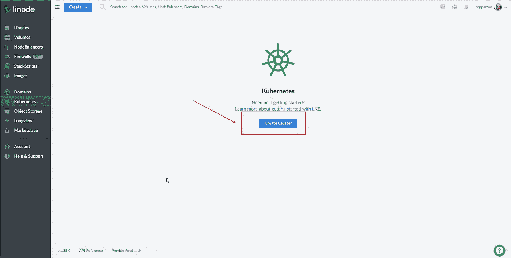
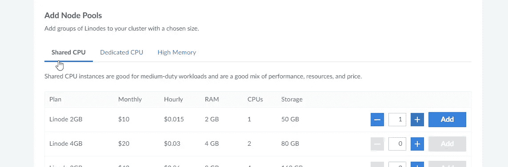
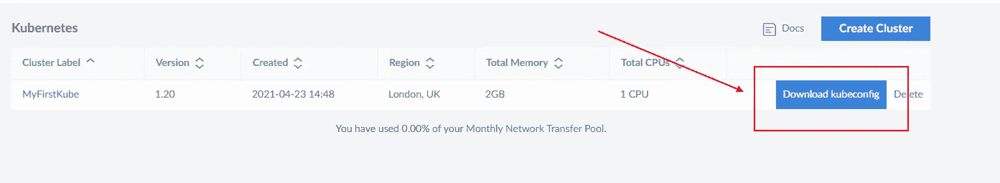
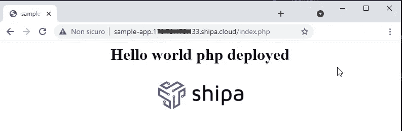

# 如何改善 Kubernetes 上的开发体验

> 原文：<https://towardsdatascience.com/improve-development-experience-kubernetes-5d16da4105d7?source=collection_archive---------22----------------------->

## 如何减少与 Kubernetes 的摩擦，走得更快

容器的抽象是消除复杂性和减少开发人员与基础设施之间摩擦的一大步。然后，用 Kubernetes 编排这样一个容器也使 DevOps 方面的事情变得容易了。

反正我们对这个结果不满意。即使我们通过应用这些技术节省了大量时间并提高了质量，我们仍然想知道我们是否能节省更多时间并简化管理部分。

这就是为什么，现在有许多应用程序开发平台旨在创建一种开发体验，其中唯一的焦点是应用程序，自动化和抽象所有其他部分。

在本文中，我将测试 Shipa Corp 的解决方案，它在 Kubernetes 的基础上运行，用于管理应用程序，而无需了解 YAML 文件、Helm、Docker 或市场上的任何其他工具。


由 [Kurt Cotoaga](https://unsplash.com/@kydroon?utm_source=medium&utm_medium=referral) 在 [Unsplash](https://unsplash.com?utm_source=medium&utm_medium=referral) 上拍摄

# 什帕是什么

Shipa 的目标是通过添加一个与任何 DevOps 工具兼容的层来减少使用 Kubernetes 的影响，并且只将注意力集中在需要您努力的地方。Shipa 提供了一个以开发人员为中心的工作流程来管理和操作您在 Kubernetes 上的应用程序。

这种方法让[开发者](https://www.shipa.io/app-developer/)专注于交付应用程序，而不是 Kubernetes 清单或其他技术细节。相反， [DevOps](https://www.shipa.io/platform-engineer/) 只需预定义控件和护栏，并为相关团队提供高效的工作流程。因此，DevOps 将不再需要输入应用程序逻辑，因为开发人员将完全自主地管理应用程序。此外，在对应用程序和服务进行全面观察的同时，每个人都将能够了解幕后发生的事情。

当您将 Shipa 框架连接到 CI 管道时，Shipa 会自动为集群中的应用程序创建 Kubernetes 对象。所以，你不会被 YAML 的定义拖慢速度，你也不必处理大量的舵图模板。随着部署的进行，框架策略会自动应用，您只需关注应用程序代码。

# 创建集群

第一个要求是要有一个工作的集群。为此，我们可以使用数以千计的主机提供商之一。我在本文中解释了如何创建一个 Kubernetes 集群，但是这次我想使用提供 100 美元免费积分的 Linode 服务。

第一步是登录并创建一个集群。下图显示了如何做到这一点。



集群创建

第二步是在集群上添加一个节点来运行我们的应用程序。在下图中，您可以看到可以配置节点大小的面板。



向群集中添加节点

现在，我们必须下载连接到集群的配置文件。



正在下载集群配置

要检查连接是否正常，我们只需运行以下命令:

```
kubectl get pod -A
```

运行此命令后，您应该会在控制台中看到来自集群的系统窗格的一些行。

现在我们有了集群，是时候开始玩 Shipa 了。

# 安装和配置 Shipa

Shipa 的安装相当容易。它主要通过命令行完成，包括以下步骤:

1.  为 Shipa 创建一个名称空间。这使得 Shipa 资源与其他资源隔离开来，并且避免在手工操作 Kubernetes 安装时造成混乱
2.  使用 Helm 命令安装 Shipa 资源

作为第一步，我们必须为您的新 Shipa 安装创建一个带有管理设置的配置文件。用以下内容创建一个名为`values.override.yml`的文件:

```
auth:   
  adminUser: admin-email-here   
  adminPassword: admin-password-here
```

终端是我们完成这一部分所需要的，所以让我们打开它玩吧！运行以下命令:

```
kubectl create namespace shipa-systemhelm repo add shipa-charts [https://shipa-charts.storage.googleapis.com](https://shipa-charts.storage.googleapis.com)helm install shipa shipa-charts/shipa -n shipa-system  --timeout=1000s -f values.override.yaml
```

上面的命令只是为 Shipa 创建了一个名为`shipa-system`的新名称空间，并将使用 Helm 脚本安装软件。

在这一步之后，你会看到你的系统稍微思考了一下，因为这是一个需要时间来完成的步骤。几分钟后，您应该会看到这样的消息:

```
NAME: shipa
LAST DEPLOYED: Fri Apr 23 17:22:55 2021
NAMESPACE: shipa-system
STATUS: deployed
REVISION: 1
NOTES: <omitted for brevity>
```

上面的消息确认安装已成功完成。为了简洁起见，这里省略了注释部分，它将为您提供一些完成安装的进一步说明。

现在，如果我们想看看 Shipa 名称空间内部发生了什么，我们只需启动`kubectl get pod -n shipa-system`命令并检查创建了多少个 pod。

下一步需要确定您的输出 IP 地址和主机名。

```
kubectl --namespace=shipa-system get svc shipa-ingress-nginx -o jsonpath="{.status.loadBalancer.ingress[0]}
```

输出将采用以下格式:

```
map[hostname:myhostname.com ip:xxx.xxx.xxx.xxx]
```

现在安装已经完成，我们可以进入下一部分，学习如何安装 Shipa 客户端。

# 安装和配置 Shipa 客户端

要安装 Shipa 客户端，您只需在终端中运行一个命令:

```
curl -s https://storage.googleapis.com/shipa-client/install.sh | bash
```

这将完成所有的步骤，你将在几秒钟内准备好。现在，您可以使用 Shipa 客户机来部署 web 应用程序。

看下一个剧本。

```
shipa target-add shipa $SHIPA_HOST -sshipa login [m](mailto:daniele.fontani@gmail.com)yloginaddress
shipa app-list
```

上面的命令为部署添加了一个目标，登录到平台并显示您已经安装了多少应用程序。

现在，我们已经安装了 Shipa 客户机，并准备好部署新的应用程序了！在下一节中，我们将看到这一点。

# 用 Shipa 部署第一个应用程序

在本节中，我们将创建并部署一个简单的 web 应用程序。Shipa 支持最常见的框架，如 [Python](https://medium.com/u/845dbbffa85e?source=post_page-----5d16da4105d7--------------------------------) ，。Net、Java、Ruby 等等。在我们的例子中，我们将使用 PHP。设置分为三个步骤:

1.  通过运行`shipa platform add php`启用 PHP 框架
2.  创建应用程序，通过运行命令`shipa app create appname php`，你基本上告诉添加一个名为`appname`的应用程序，并基于`php`框架。
3.  开始发展！

如您所见，设置非常简单，我们可以从头开始关注应用程序开发。我们要做的就是创建一个标准的 PHP 应用程序。

在我们的例子中，我们将创建一个包含以下内容的简单 PHP 页面

```
<center>
   <h1>
     <?php echo "Hello world php deployed"; ?>
   </h1>
   
</center>
```

然后是看到代码运行前的最后一步。我们必须向 Shipa 解释我们的应用程序是如何工作的。事实上，PHP 框架允许许多场景(使用 Nginx 或 Apache 作为前端、主机配置、PHP 版本等等)。所有这些设置都可以用源代码中的一个 YML 文件进行配置，开发者可以理解和掌握。在我们的例子中，我们使用了下面的方法:

```
php:
 version: 5.6
 frontend:
  name: nginx
 interpretor:
  name: fpm
 composer: true
```

这个文件必须被命名为`shipa.yml`，并放在项目根目录下。现在，最后，是时候通过运行以下命令来部署我们的应用程序了:

```
shipa app deploy -a appname -f .
```

这将把应用程序部署到 Kubernetes 集群，并且它将是可用的。接下来的窗口显示最终结果。



应用程序已部署

# 带什么回家

Kubernetes 是一个巨大的框架，它制造复杂的东西(可伸缩性、编排等..)简单。所有这些功能的副作用是，您经常需要付出额外的努力来正确定义您的设置，并且理解整个过程并不总是容易的。一个解决方案可能是转向完全无服务器的解决方案:这将消除 Kubernetes 的摩擦，但也有 Kubernetes 的优势，这可能是不必要的。切换无服务器解决方案的替代方法是找到一种自动化和简化与 Kubernetes 交互的方法。

Shipa 是市场上众多旨在实现这一目标的工具之一。在本文中，我们看到了如何安装和配置部署应用程序

## 利益

*   减少开发人员和运营人员之间的摩擦，让他们各司其职
*   该操作是基于终端的，因此可以很容易地自动化
*   您不必玩容器，开发人员也不需要了解 YAML 文件或任何其他 Kubernetes 细节
*   Dev 和 Ops 之间的结合是一个包含应用程序需求的简单文件。
*   支持大多数应用程序框架
*   成本适中(免费自托管，然后按使用付费模式)

**缺点**

*   它适用于定制应用程序，但是如果您必须使用遗留应用程序或产品，它可能更难配置
*   在开发过程中，您必须建立一个本地环境，该环境是生产环境的复制品:您失去了使用容器的部分好处，因为开发部分

包装所有的东西 Shipa 是降低 Kubernetes 复杂性的好工具，如果它适合您的需要，也是加速应用程序开发的好方法。

## 参考

*   【Shipa 官方网站
*   [Shipa 文档](https://learn.shipa.io/docs/intro-to-shipa)
*   [devo PS 和 NoOps 的区别](https://betterprogramming.pub/devop-noops-difference-504dfc4e9faa)