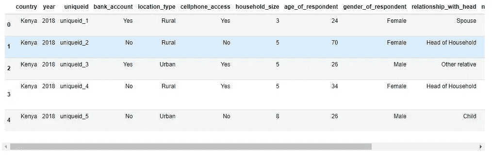
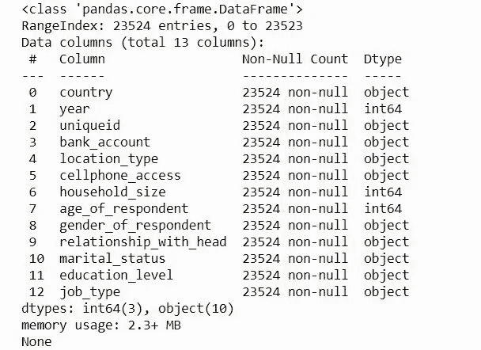
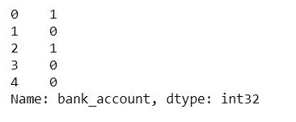

# 通过组合分类特征提高 ML 模型性能

> 原文：<https://towardsdatascience.com/improve-ml-model-performance-by-combining-categorical-features-a23efbb6a215?source=collection_archive---------21----------------------->

## 提高模型性能的一个简单技巧。


照片由来自[佩克斯](https://www.pexels.com/photo/selective-focus-photoraphy-of-chains-during-golden-hour-119562/?utm_content=attributionCopyText&utm_medium=referral&utm_source=pexels)的[乔伊·凯伯](https://www.pexels.com/@joey-kyber-31917?utm_content=attributionCopyText&utm_medium=referral&utm_source=pexels)拍摄

当您训练机器学习模型时，您的数据集中可以有一些表示分类值的要素。分类特征是可以分组的数据类型。

有三种常见的分类数据类型，它们是:

1.  **序数** —这有一组顺序。例如:用 1-10 的尺度给幸福打分
2.  **二进制** —只有两个值。例如:男性或女性
3.  **名义** —它没有任何订单集。示例:国家

大多数机器学习算法需要数字输入和输出变量。因此，您必须将数据集中的分类特征转换为整数或浮点数，以供机器学习算法使用。您可以对二进制特征使用[标签编码](https://www.freecodecamp.org/news/feature-engineering-and-feature-selection-for-beginners/)，或者对名义特征使用[一次热编码](https://hackernoon.com/what-is-one-hot-encoding-why-and-when-do-you-have-to-use-it-e3c6186d008f)方法。

在本文中，您将了解组合分类特征如何提高机器学习模型的性能。

所以让我们开始吧。🚀

# 在机器学习模型中组合分类特征

您可以创建一个由其他两个分类要素组合而成的新要素。您还可以组合三个或四个以上甚至更多的分类特征。

```
df["new_feature"] = (
	df.feature_1.astype(str)
	 + "_"
	 + df.feature_2.astype(str)
	)
```

在上面的代码中，您可以看到如何使用 pandas 合并两个分类要素，并在数据集中形成一个新要素。

那么你应该结合哪些分类特征呢？这个问题没有简单的答案。这取决于您的数据和要素类型。一些领域知识可能对创建这样的新特性有用。

为了说明整个过程，我们将使用来自 [Zindi competition 页面](https://zindi.africa/competitions/financial-inclusion-in-africa)的[非洲金融包容性数据集](https://zindi.africa/competitions/financial-inclusion-in-africa/data)，它具有许多分类特征，我们可以将其中一些特征结合起来，看看我们是否可以改进模型性能。

该数据集的目标是预测谁最有可能拥有银行帐户。所以这是一个分类问题。

# 1.加载数据集

我们的第一步是确保我们已经下载了比赛中提供的数据集。你可以在这里下载数据集。

导入重要的 python 包。

```
import pandas as pd
import numpy as np
import matplotlib.pyplot as plt
import seaborn as sns
import warnings
np.random.seed(123)
warnings.filterwarnings('ignore')
%matplotlib inline
```

加载数据集。

```
# Import datadata = pd.read_csv('data/Train_v2.csv')
```

让我们观察数据集的形状。

```
# print shapeprint('data shape :', data.shape)data shape : (23524, 13)
```

上面的输出显示了数据集中的行数和列数。数据集中有 13 个变量，12 个自变量和 1 个因变量。

我们可以通过使用 pandas 库中的 **head()** 方法来观察数据集中的前五行。

```
# inspect data data.head()
```



样本 daa

理解每个要素的含义非常重要，这样您才能真正理解数据集。您可以阅读 **VariableDefinition.csv** 文件来理解数据集中出现的每个变量的含义。

# 2.了解数据集

通过使用 pandas 的 **info()** 方法，我们可以获得更多关于这些特性的信息。

```
#show Some information about the datasetprint(train_data.info())
```



数据描述

输出显示变量/特征列表、大小(如果包含缺失值)以及每个变量的数据类型。从数据集中，我们没有任何缺失值，我们有 3 个整数数据类型的特征和 10 个对象数据类型的特征(大多数是分类特征)。

# 3.机器学习模型的数据准备

下一步是从数据中分离出自变量和目标(bank_account)。然后使用 [LabelEncoder](/categorical-encoding-using-label-encoding-and-one-hot-encoder-911ef77fb5bd) 将目标值从对象数据类型转换成数值。

```
#import preprocessing module
from sklearn.preprocessing import LabelEncoder
from sklearn.preprocessing import MinMaxScaler# Convert target label to numerical Data
le = LabelEncoder()
data['bank_account'] = le.fit_transform(data['bank_account'])#Separate training features from target
X = data.drop(['bank_account'], axis=1)
y = data['bank_account']print(y)
```



目标值已转换为数字数据类型，1 表示“是”，0 表示“否”。

我创建了一个简单的预处理函数来:

*   处理数据类型的转换。
*   使用[一键编码器和/或标签编码器](/categorical-encoding-using-label-encoding-and-one-hot-encoder-911ef77fb5bd)将分类特征转换为数字特征。
*   删除 uniqueid 变量。
*   执行[特征缩放](/preprocessing-with-sklearn-a-complete-and-comprehensive-guide-670cb98fcfb9)。

```
# function to preprocess our data def preprocessing_data(data): # Convert the following numerical labels from interger to float
    float_array = data[["household_size", "age_of_respondent", "year"]].values.astype(float
    )

    # categorical features to be converted to One Hot Encoding
    categ = [
        "relationship_with_head",
        "marital_status",
        "education_level",
        "job_type",
        "country",
    ]

    # One Hot Encoding conversion
    data = pd.get_dummies(data, prefix_sep="_", columns=categ)

    # Label Encoder conversion
    data["location_type"] = le.fit_transform(data["location_type"])
    data["cellphone_access"] = le.fit_transform(data["cellphone_access"])
    data["gender_of_respondent"] = le.fit_transform(data["gender_of_respondent"])

    # drop uniquid column
    data = data.drop(["uniquid"]), axis=1)

    # scale our data 
    scaler = StandardScaler()
    data = scaler.fit_transform(data)

    return data
```

让我们预处理我们的数据集。

```
# preprocess the train data processed_test_data = preprocessing_data(X_train)
```

# 4.模型建立和实验

数据集的一部分将用于评估我们的模型。

```
# Split train_data
from sklearn.model_selection import train_test_spilt
X_Train, X_val, y_Train, y_val = train_test_split(processed_train_data, y_train, stratify = y, test_size = 0.1, random_state=42)
```

只有数据集的 **10%** 将用于评估机器学习模型。参数**分层= y** 将确保训练集和验证集的两个类的值相等(“是”和“否”)。

对于这个分类问题，我们将使用**逻辑回归算法**来训练和预测谁最有可能拥有银行账户。

```
#import classifier algorithm here
from sklearn.linear_model import LogisticRegression# create classifier
lg_model = LogisticRegression()#Training the classifier
lg_model.fit(X_Train,y_Train)
```

训练完分类器之后，让我们使用训练好的模型来预测我们的评估集，看看它的表现如何。我们将使用准确性作为我们的评估标准。

```
# import evaluation metrics
from sklearn.metrics import confusion_matrix, accuracy_score# evaluate the model
y_pred = lg_model.predict(X_val)# Get the accuracy
print("Accuracy Score of Logistic Regression classifier: ","{:.4f}".format(accuracy_score(y_val, lg_y_pred)))
```

Logistic 回归分类器的准确率得分: **0.8874**

# 第一个实验:结合教育水平和工作类型特征。

现在我们知道了基本的模型性能，让我们看看是否可以通过结合 **education_level** 和 **job_type** 特性来改进它。

我们在第一个实验中需要做的是更新我们已经创建的预处理函数，然后运行剩余的代码。

```
# function to preprocess our data 

def preprocessing_data(data): # Convert the following numerical labels from integer to float
    float_array = data[["household_size", "age_of_respondent", "year"]].values.astype(float) # combine some cat features 
    data["features_combination"] = (data.education_level.astype(str) + "_" + data.job_type.astype(str) ) # remove individual features that are combined together
    data = data.drop(['education_level','job_type'], axis=1) # categorical features to be converted by One Hot Encoding
    categ = [
      "relationship_with_head",
      "marital_status",
      "features_combination",
      "country"
      ] # One Hot Encoding conversion
    data = pd.get_dummies(data, prefix_sep="_", columns=categ) # Label Encoder conversion
    data["location_type"] = le.fit_transform(data["location_type"])
    data["cellphone_access"] = le.fit_transform(data["cellphone_access"])
    data["gender_of_respondent"] = le.fit_transform(data["gender_of_respondent"]) # drop uniquid column
    data = data.drop(["uniqueid"], axis=1) # scale our data 
    scaler = StandardScaler()
    data = scaler.fit_transform(data) return data
```

在上述预处理函数中，我通过以下方式更新了代码

*   将 educaion _ level 和 job_type 组合起来，创建一个名为" **features_combination** "的新特性。
*   从数据集中移除单个要素(education_level 和 job_type)。
*   在分类特征列表中添加一个名为“**feature _ combination**的新特征，通过 **One Hot Encoding** 进行转换。

**注意:**我只选择了名义分类特征(有 2 个以上的唯一值)。

在为第一个实验重新训练逻辑回归分类器后，模型性能从 **0.8874** 提高到 **0.8882** 。这表明组合分类特征可以提高模型性能。请记住，我们没有改变任何东西，如机器学习分类器中的超参数。

# 第二个实验:结合与头部的关系和婚姻状况特征

在我们的第二个实验中，我们将结合另外两个分类特征，它们是**与头部的关系**和**婚姻状况**。

我们只需要更新预处理函数(就像第一个实验一样)，然后运行剩下的代码。

```
# function to preprocess our data def preprocessing_data(data): # Convert the following numerical labels from integer to float
    float_array = data[["household_size", "age_of_respondent", "year"]].values.astype(
        float
    )

    # combine some cat features 
    data["features_combination"] = (data.relationship_with_head.astype(str) + "_"
                           + data.marital_status.astype(str) 
                      )
    # remove individual features that are combined together
    data = data.drop(['relationship_with_head','marital_status'], axis=1) # categorical features to be converted by One Hot Encoding
    categ = [
        "features_combination",
        "education_level",
        "job_type",
        "country",
    ] # One Hot Encoding conversion
    data = pd.get_dummies(data, prefix_sep="_", columns=categ) # Label Encoder conversion
    data["location_type"] = le.fit_transform(data["location_type"])
    data["cellphone_access"] = le.fit_transform(data["cellphone_access"])
    data["gender_of_respondent"] = le.fit_transform(data["gender_of_respondent"]) # drop uniquid column
    data = data.drop(["uniqueid"], axis=1) # scale our data 
    scaler = StandardScaler()
    data = scaler.fit_transform(data) return data
```

在上述预处理函数中，我通过以下方式更新了代码

*   结合 relation_with_head 和 marriage _ status 创建一个名为“ **features_combination** ”的新特征。
*   从数据集中移除单个要素(relation_with_head 和 marriage _ status)。
*   在分类特征列表中添加一个名为“ **feature_combination** 的新特征，通过 **One Hot Encoding** 进行转换。

在为第二个实验重新训练逻辑回归分类器之后，模型性能从 **0.8874** 下降到 **0.8865** 。这表明，有时当你结合分类特征时，你的机器学习模型不会像你预期的那样改善。因此，你将需要运行大量的实验，直到你从你的机器学习模型中获得令人满意的性能。

# 包扎

在本文中，您了解了如何组合数据集中的分类特征，以提高机器学习模型的性能。正如我所说的，为了让您的模型获得令人满意的性能，您需要拥有关于您正在解决的问题的领域知识。此外，您需要运行大量需要更多计算资源的实验。

**恭喜**👏👏，你已经做到这篇文章的结尾了！我希望你学到了一些新的东西，对你的下一个机器学习或数据科学项目有所帮助。

如果你学到了新的东西或者喜欢阅读这篇文章，请分享给其他人看。在那之前，下期帖子再见！

也可以在 Twitter [@Davis_McDavid](https://twitter.com/Davis_McDavid) 上找我。

之前发布的[此处](https://hackernoon.com/improve-machine-learning-model-performance-by-combining-categorical-features-g21u34ep)。