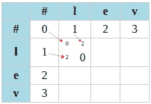

# 使用 ctypes 提高 Python 性能

> 原文：<https://towardsdatascience.com/improve-python-performances-with-ctypes-ef51cee2eb59?source=collection_archive---------22----------------------->

## ctypes 的一个应用实例:Levenshtein 距离计算

unsplash 上来自 [@chrislivernani](https://unsplash.com/@chrisliverani) 的转速表

# 语境

当谈到 python 的性能时，如果与 C 或 C++之类的编译和低级语言相比，python 通常被证明是非常慢的。大幅提高代码速度的一个方法是借助 numpy 将其矢量化。为了进一步提高速度，你可以看看 numba，它通常是一个很好的选择，只需要一个装饰器就可以把一个缓慢的算法变成一个真正快速的算法。

也就是说，我喜欢回到像 C 这样的低级语言。Python 内核是用 C 写的，所以我们为什么不试着为计算密集型部分建立自己的库呢？这就是下一篇文章的目标。

# Python-C 接口

当需要将 python 代码与一些 C 库接口时，您主要有两种选择:

*   使用第三方工具/库，它用 transpiler 把你的代码翻译成相应的 C 代码
*   手动加载 C 库并将数据整理到相应的 C 部分

## 运输工具

第一种方法不是我最喜欢的，是使用中间 transpiler 将 python 代码转换成 C 代码。我只知道 Cython，但也许还有其他人存在。Cython 非常接近 python(支持原生 python 和 numpy ),这是一个很大的优势。然而，我发现它太接近 python 了，调整代码以真正提高性能可能很难。有时候你必须声明变量的类型，有时候不需要。你有一个分析器来帮助你找到代码中的瓶颈，这很有帮助，但是真的，我发现这很难学，也很难达到最佳性能。

因此，与其尝试修改一些不那么 python 化、不那么 C 的代码，我们为什么不直接使用 C 代码呢？这就是 ctypes 发挥作用的地方。

## 用 ctypes 编组

ctypes 是 python 中的一个本地库，根据它的[文档](https://docs.python.org/3/library/ctypes.html)

> ctypes 提供了 C 兼容的数据类型，并允许调用 dll 或共享库中的函数。它可以用来用纯 Python 包装这些库。

因此，ctypes 真正有趣的是，您可以用纯 C 语言开发您的库，像使用任何 C 库一样编译和调试它，并直接在 python 中使用它！有点神奇。

加载 C 库非常简单:

我们现在能够调用库的任何函数，就像您调用 python 模块一样。唯一困难的是要意识到你调用了一个 C 函数，所以它需要类型化的参数，所以你必须给它正确的[参数类型](https://docs.python.org/3/library/ctypes.html#fundamental-data-types)。

为了说明所有这些，让我们举一个简单的例子。两弦间 Levenshtein 距离的计算

# 莱文斯坦距离

Levenshtein 距离是一个距离(从数学上来说),它度量两个字符串之间的版本距离。它测量要插入、删除或替换的字符数，以匹配两个字符串。两根弦相差越大，距离就越大。

为了计算距离，我们允许三种编辑操作:删除、插入或替换一个字符。有时与每个操作相关的成本是相同的，等于 1，有时我们将替换操作的成本设置为 2，因为它可以被分解为一个删除操作和一个插入操作。该算法非常简单，包括构建一个秩为`MxN`的矩阵，其中`M`是源字符串的字符数加 1，`N`是目标字符串的字符数加 1。于是，Levenshtein 距离就是矩阵的元素`D[M,N]`。

## 矩阵初始化

计算矩阵`D`的第一步是初始化它。我们构造一个秩为`MxN`的空矩阵，其中`M`是源字符串的字符数加 1，而`N`是目标字符串的字符数加 1，以允许使用空字符`#`。

然后，矩阵的第一行计算从空字符串到目标字符串的每个子字符串的距离。例如，让我们把单词`levenshtein`作为我们的源字符串，把`levenstein`作为我们的目标(这里省略了字母`h`)。然后，对于目标的每个子字符串，我们在每一列中都有一个成本`ins_cost`。的确，要从空字符串`'#'`到达字符串`'l'`，我们必须插入一个字母，所以距离`'#' → 'l'`等于`ins_cost`。我们用同样的方法计算第一行的距离`'#' → 'le'`，它等于`2 x ins_cost`，依此类推。推理与第一列相同，但是使用了`del_cost`而不是`ins_cost`，因为从`'l'`到`'#'`的距离是通过删除成本来测量的。删除和插入成本为 1 时，得到的初始矩阵为

距离矩阵初始化

## 矩阵元素计算

一旦矩阵被初始化，就该根据 Levenshtein 算法填充它了:

Levenshtein 距离计算算法

因此，我们从两个字符串的第一个字母开始，即我们感兴趣的单元格`D[1, 1].`

*   该算法的第一行告诉我们获取当前列的前一行的内容(`'#' → ‘l'`的成本)并将其添加到删除成本中
*   第二行开始添加当前行前一列的插入成本(`'l' → '#'`的成本)，因此它是总成本`'l' → '#' → 'l'`，等于 2
*   对于最后一行，我们注意到对于这个单元格，源和目标的字母是相同的，所以我们简单地取前一行和前一列的成本，即我们不需要任何编辑来执行这个步骤。
*   最后，我们保留三个成本中的最小值，在本例中为 0

矩阵计算

使用这种算法，我们迭代矩阵的每个单元

矩阵计算结果

两个字符串`'levenshtein'`和`'levenstein'`之间的最小编辑距离等于 1，这非常有意义，因为我们只需要从源字符串中删除一个字母就可以到达目标字符串。

# 算法实现

Levenshtein 算法实现起来非常简单(您可以找到它的许多版本),使用 C 语言通常不会有什么挑战。尝试 ctypes 的最佳时机！这里是我的算法的简单 C 实现:

我们已经遵循了算法的所有步骤，从初始化到每个单元的迭代。我选择了返回整个矩阵，但是我们也可以选择只输出距离。

如果我们注意到在计算时只需要访问前一行(或前一列)的内容，那么前面的实现可以得到改进。因此，我们可以只使用一行，并在执行计算时更新其内容。实现的改进版本如下(注意，我们现在返回的是距离，而不是整个矩阵，因为我们没有把它保存在内存中)

# 从 python 调用 C 函数

现在我们已经构建了我们的 C 库，由于`ctypes`，我们可以将它直接加载到 python 代码中，并调用其中的任何函数。

用`ctypes`加载库很简单:

唯一棘手的部分是 C 是一种类型化语言，而不是 python，因此`ctypes`需要将 python 变量整理成相应的 C 类型。在第 5 行和第 11 行中，我们明确地告诉 C 函数它期望什么类型的变量，以及我们得到什么类型的结果。在我们的例子中，我们传递两个字符串(指向二进制格式的`char`的指针)加上三个整数，我们期望结果是一个整数。

我们现在只需要调用这个函数:

# 结论

我们在这里对`ctypes`做了一个简单的介绍，以展示我们可以多么容易地用 C 库提高 python 代码的性能:

Levenshtein 距离的 C 版本的性能

Levenshtein 距离的 python 版本的性能

正如我们已经提到的，`numba`或`cython`是可供选择的商品，但我个人觉得它们更难使用和优化。使用原始 C 代码对我来说非常有意义，我真的很喜欢使用`ctypes`这样简单的代码。