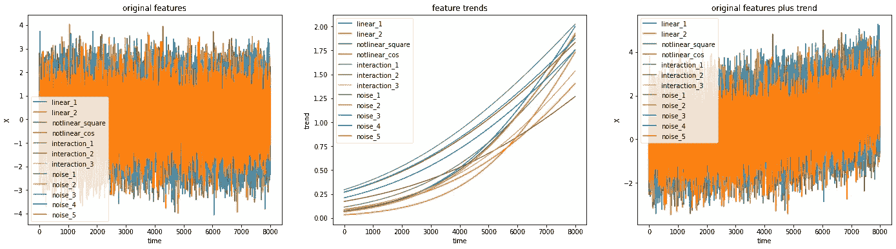
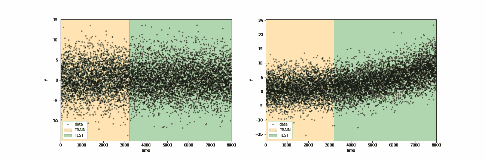
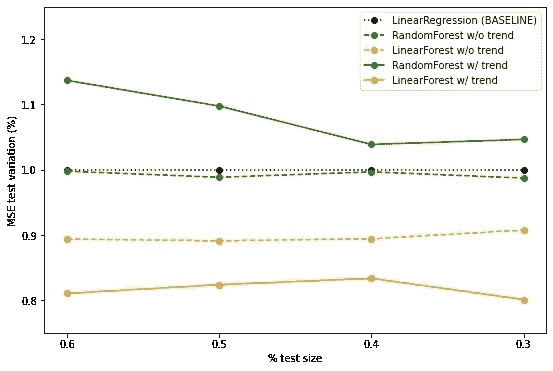

# 用线性模型改进随机森林

> 原文：<https://towardsdatascience.com/improve-random-forest-with-linear-models-1fa789691e18?source=collection_archive---------10----------------------->

## 随机森林如何在漂移中生存

奥利弗·帕斯克在 [Unsplash](https://unsplash.com?utm_source=medium&utm_medium=referral) 上拍摄的照片

随机森林可能被大多数人认为是监督预测任务中的银弹。当然，任何参与标准机器学习应用的数据科学家都被用来拟合和测试随机森林。原因是多方面的。**随机森林是文献中众所周知的算法，并且被证明在回归和分类环境中都达到了令人满意的结果**。它能够轻松地学习复杂的数据关系。有许多开源的高效实现可供我们所有人使用(scikit-learn 提供的实现肯定是最著名的)。

*“权力越大，责任越大”。* **随机森林达成的成功可能隐藏了它的弱点**。众所周知，当样本属于训练期间探索程度较低的区域时，可能会产生低质量的预测。这在许多实际使用案例中很典型，在这些案例中，数据不是静态的，并且超出了拟合时所探索的范围。**作为数据科学家，我们的职责是提前发现这些可能的缺陷，并帮助我们的模型尽最大努力**。根据我们的领域知识和初步的数据探索，我们可以开发最合适的预处理流水线。我们还可以更进一步，根据我们数据的特点选择最佳模型。

从这个意义上来说，当对一个不稳定的系统建模时，线性模型可能与基于树的模型一样好，因为它们能够学习趋势行为。为什么不把它们结合起来呢？**为什么不创建一个模型，同时学习线性和更复杂的关系？**

在这篇文章中，我们将介绍线性随机森林，如本书中[所建议的。我们尝试执行一个模拟回归任务，其中我们希望预测未来的目标是多个复杂源(不仅仅是线性源)的组合。我们使思想变得更加辛辣，引入了一个增加的趋势，这可能会在简单的基于树的模型的推理时引起一些问题。我们很想知道在这种情况下，如何从线性模型和随机森林的结合中获益。](https://arxiv.org/pdf/1904.10416.pdf)

线性随机森林的实现在 [**线性树**](https://github.com/cerlymarco/linear-tree) 库*中简单可用。*它为分类和回归上下文提供了 *LinearTree* 、 *LinearForest、*和 *LinearBoosting* 的实现。**该软件包旨在提供现成的算法，与 scikit-learn 生态系统完全兼容，混合了线性模型和决策树的学习能力**。

# 数据

我们模拟来自高斯分布的数据。然后，我们对特征子集应用特定类型的变换，例如线性、平方、正弦和交互。我们想要预测的目标是先前转换的特征的组合。下一步，我们复制我们的数据，并为所有特征添加增长趋势。新目标显示了所有预测指标的相同增长趋势。

无趋势的模拟数据(左)；模拟趋势(中间)；趋势模拟数据(左)[图片由作者提供]

# 建模

我们必须执行双重预测任务。首先，我们尝试在没有数据偏移的情况下预测我们的目标，然后我们做同样的事情，但数据会发生漂移。为了模拟我们的模型如何随时间变化，我们为各种训练测试重新划分重复拟合。我们从少量的训练数据开始，然后逐步增加。

培训-测试策略概述[图片由作者提供]

在没有移位的情况下，特征的分布随着各种分裂重新划分而保持不变。这与数据漂移的情况完全不同。在后一种情况下，数据开始遵循较高的趋势行为。训练区和试验区的分布差别很大。

对于建模阶段，我们选择在两种场景中测试三种不同的替代方案。我们从一个简单的线性回归开始，然后传递到一个随机森林，最后，我们评估它们的混合是否能提供一个提升。像往常一样，在对我们的训练数据进行简单的调整和交叉验证之后，我们报告测试数据的性能。

我们根据简单线性回归获得的误差的均方误差偏差(MSE)来探索结果。大于 1 的值意味着该模型获得的误差比线性回归获得的误差更差。对于小于 1 的值，情况正好相反。我们在同一张图中绘制了两种情况下(有趋势和无趋势)、所有模型和所有测试规模的所有误差。

测试结果与线性回归性能的偏差[图片由作者提供]

我们可以看到，同样在没有趋势的情况下，线性森林比线性回归和随机森林做得更好。简单的线性基线模型可以获得与随机森林相同的结果。在漂移的情况下，差异变得更大。Randon Forest 从基线开始恶化，而 Linear Forest 改善了与其竞争对手之间的差距。

如果我们知道线性森林是如何工作的，这些结果是可以预料的。首先，我们选择一个线性模型来拟合原始数据，以逼近目标。第二步(也是最后一步),在同一组数据上训练一个随机森林，以再现上一步的残差。最终预测是线性预测和森林预测的总和。线性森林达到的良好性能是通过混合线性回归学习线性关系的能力(也是在不稳定的情况下)和随机森林逼近复杂模式的更复杂的能力而获得的。

# 摘要

在这篇文章中，我们介绍了线性随机森林，这是一种推广算法，在某些情况下，可以提高简单随机森林和线性回归的学习能力。结果反映了我们的预期，并与[论文](https://arxiv.org/pdf/1904.10416.pdf)中显示的结果一致。一如既往，在任何情况下都能达到最佳效果的完美算法是不存在的。作为数据科学家，我们有责任选择并验证最佳方案。

[查看我的 GITHUB 回购 ](https://github.com/cerlymarco/MEDIUM_NoteBook)

保持联系: [Linkedin](https://www.linkedin.com/in/marco-cerliani-b0bba714b/)