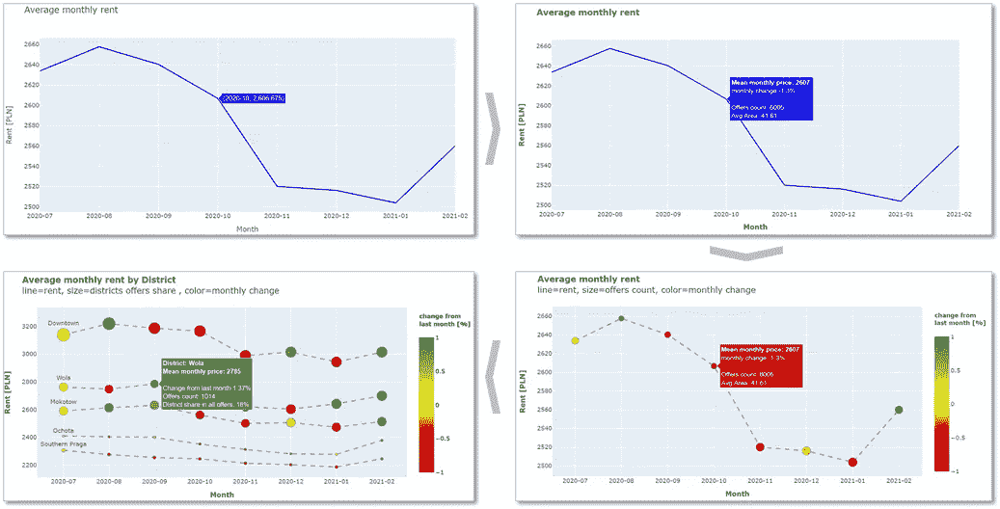
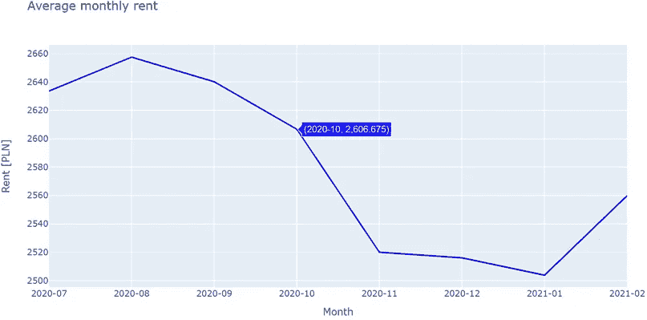
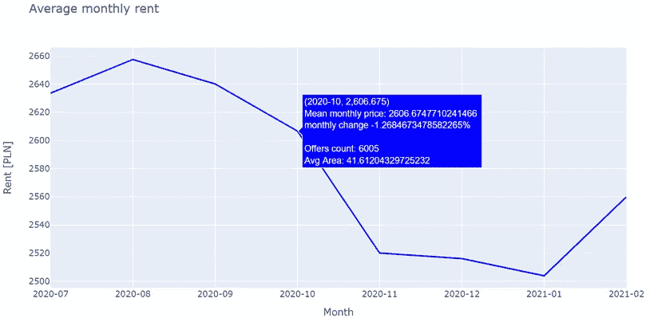
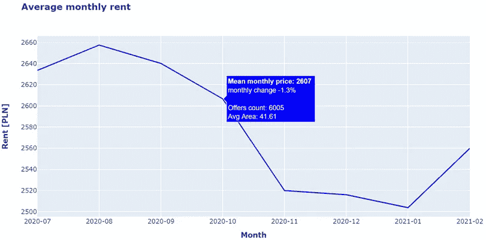
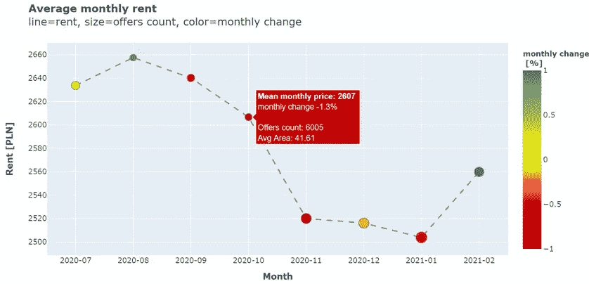
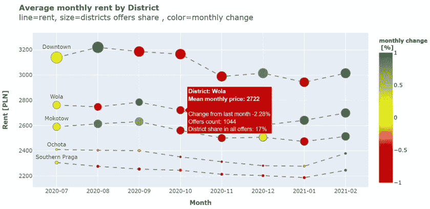

# 通过有意义的文本和注释提高可视化可读性

> 原文：<https://towardsdatascience.com/improve-visualization-readability-with-meaningful-text-and-annotations-b5d93eaadf4b?source=collection_archive---------11----------------------->

## 确保其他人能够欣赏你用 Plotly 有效描述的可视化的全部潜力

作者照片

文本肯定不是可视化中最有趣的部分，但正确的文本可以显著提高可读性，并提供额外的细节和深度。另一方面，忽略足够的描述会大大降低你的 viz 清晰度，并使接收者感到困惑。

如果您的分析是跨团队共享的，那么好的注释尤其重要，因为它使得在没有可视化数据集的先验知识的情况下更容易阅读。充分的解释有助于避免诸如“这种颜色是什么意思”之类的问题，这使得每个人的工作都更容易。

在本文中，我的目的是演示如何通过对注释和文本的一些改进，使 Plotly 的可视化更具吸引力，更易于阅读。我使用了华沙 60 平方米以下房产的租金价格和折线图。同样的技术可以用于任何数据集和图表类型。

样本数据和代码可在 [***GitHub***](https://github.com/Jan-Majewski/Medium_articles/blob/master/04_Plotly/04_01_Annotations.ipynb) 获得，使用[***nb viewer***](https://nbviewer.jupyter.org/github/Jan-Majewski/Medium_articles/blob/f55055506d0c3613b74a103809f210630ad52a73/04_Plotly/04_01_Annotations.ipynb)探索交互情节。

# 1.基本线图

基本折线图

基本折线图的代码

我们从一个简单的线图开始，向我们展示了过去 8 个月华沙月租金的总体趋势。vanilla Plotly 注释只显示了 x 和 y 值，没有任何额外的解释——让我们看看如何改进它。

# 2.向注释添加多个尺寸

具有多维注释的折线图

带有额外注释的折线图代码

首先，我们可以在注释中添加多个维度，并在文本属性中添加一些额外的描述，如上面的代码所示。数据很少只有两个我们可以轻松可视化的维度——添加其他维度作为注释有助于我们更好地理解数据点之间的关系。

在分析的案例中，我添加了每月变化、报价计数和平均面积，以便能够快速评估每月价格变化和分析报价的关键特征。为了向文本字符串中添加这些特性，我使用了一个. format()函数，并在数据帧的第 14–19 行中的每一行上进行迭代。

既然我们能够更好地描述可视化数据，我们应该集中精力改进格式，使其更具可读性，更整洁。

# 3.改进的格式

带批注的格式化折线图

带注释的格式化折线图的代码

这个情节看起来比上一个整洁多了。这一实质性的视觉改进只需要对 Plotly 中的文本属性进行 3 处小的修改。

首先，我用 *hovertemplate= '%{text}'* 属性移除了 x 和 y 的基本 Plotly 注释，以仅显示来自*文本*变量的特征和格式。

然后，我限制了显示的小数位数，就像在 print()函数中一样——使用{:。xf}，其中 x 表示我们希望看到的小数位数—取决于我使用的变量 0 到 2。

最后但同样重要的是，我利用使用基本 html 格式化文本数据的能力来突出最重要的特性:标题和轴标题以及注释中的月平均价格特性。我所需要做的就是在文本和标题中添加**或 **…** HTML。**

# 4.用颜色和尺寸可视化多维度

多维可视化折线图

多维可视化折线图代码

我们可以通过添加颜色和标记大小来增加图表上显示的功能数量，以突出每月变化和报价计数。增加显示的维度数量会使图形更加健壮，但是如果没有适当的描述，它会变得更加难以理解。

在本例中，我添加了一行额外的标题来解释线条、大小和颜色所代表的内容，并为颜色图例添加了一个有意义的标题来提高可读性。

# 5.比较多个数据段

多段折线图

在这个额外的可视化中，我想展示当我们深入到更复杂的图形中时，清晰的注释变得更加重要。按主要地区划分平均价格要求我们添加单独的散点图，用 mode="text "显示地区标签。

当有多个细分市场时，我们可以使用注释来显示横向和纵向关系，在本例中，我们显示了每个地区的月度变化以及每个地区在月度总报价中的份额。

# 6.摘要

我希望我成功地展示了一些小的改变如何显著地提高你的图表的质量和可读性。

此外，在维数、数据类型、数量级和单位方面，文本的限制比绘图少。这允许用细节特征丰富基本图，增加我们分析的深度，并确保我们不会错过影响我们关键变量的其他重要特征。

由于好奇心是数据科学家的关键美德之一，我们可能会倾向于忽略最简单的解决方案，而去寻找更复杂、更有趣的解决方案。

不要让你的数据可视化的最简单的元素对整体效果产生负面影响——花几分钟在文本上，这样其他人可以欣赏你的可视化的全部潜力！