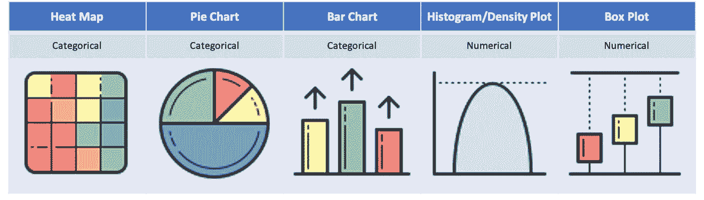
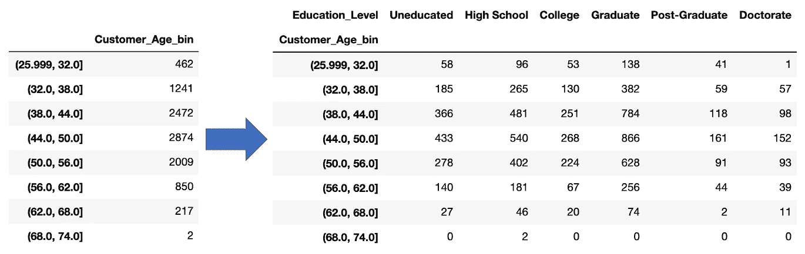
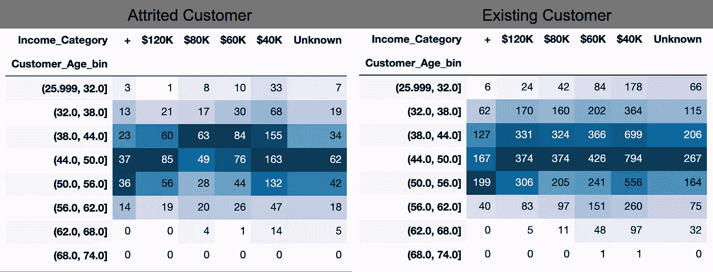
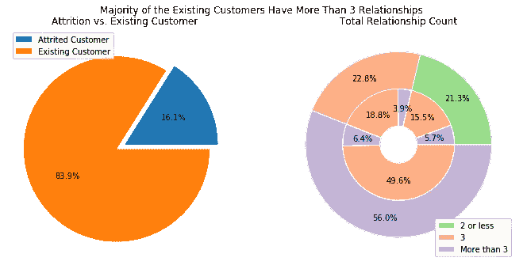
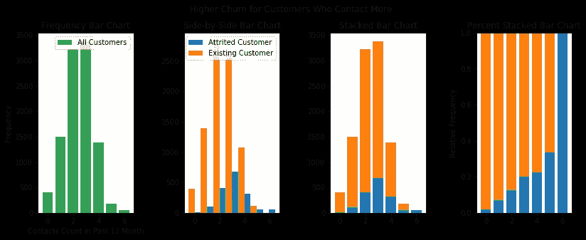
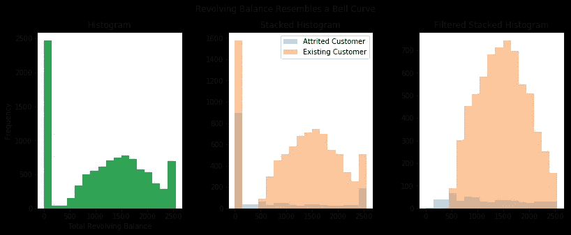
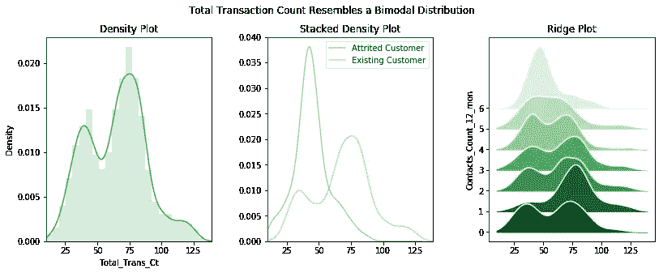
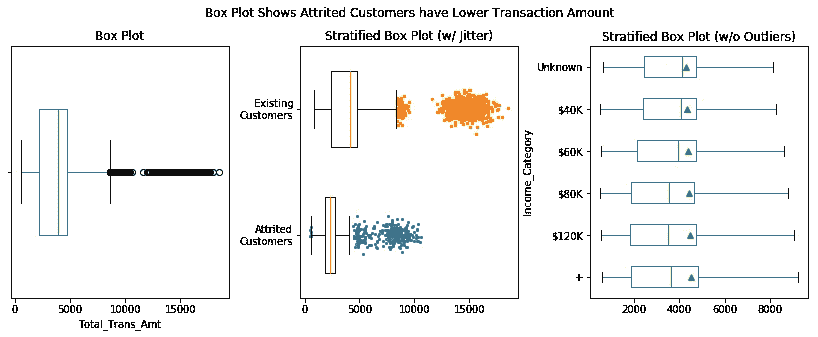

# 利用这些数据分布可视化改进您的分析项目

> 原文：<https://towardsdatascience.com/improve-your-analytics-projects-w-these-data-distributions-visualizations-7ba3821f2092?source=collection_archive---------4----------------------->

## 带有增强的示例代码，可以激发您的制图创造力

*注:本帖代码可在* [*这里*](https://github.com/kevinclee26/credit_card_churn) 找到



可视化发行版的不同方法(图片由作者提供)

理解变量在数据中的分布是一个重要的步骤，应该在**探索性数据分析** ( **EDA** )过程的早期进行。有许多工具可以用来分析数据的分布。**可视化辅助工具**可能是最受欢迎的，因为一个构造良好的图表可以快速回答关于数据的重要问题。例如:

*   有哪些**中枢倾向**？平均值、中间值和众数。
*   有哪些**分散措施**？范围、IQR、方差和标准差。
*   分布的**形状**是什么？均匀、参数化、对称还是偏斜？
*   是否存在**异常值**或极值？

在本文中，我们将看看用来表达数据分布的最流行的图表。我们主要关注单变量数据，但也有机会根据第二个变量对子集进行比较。

## 数据集介绍

数据集来自对一家信用卡发行商的流失分析，包括人口统计和财务数据。既有**分类**又有**数值**是**离散**还是**连续**。离散变量只能取某些值，而连续变量可以取不可数的值。离散变量的值是通过计数获得的，而连续变量是通过测量获得的。大约有 10，000 行，其中一行代表一个客户。

```
# Import Dependenciesimport pandas as pd
import os
import matplotlib.pyplot as plt
import math# Import Datafile_path=os.path.join('BankChurners.csv')
df=pd.read_csv(file_path)
```

本文的主要目标是分析数据是如何分布的，即**查看不同类别**中的记录数量。所演示的语法假设之前没有执行转换，并且每一行代表一个唯一的客户端。对于文章中包含的基本绘图，我们将使用 [*熊猫。DataFrame.plot()*](https://pandas.pydata.org/pandas-docs/stable/reference/api/pandas.DataFrame.plot.html) 方法，而对于更高级的绘图，我们将结合使用 [Numpy](https://numpy.org/) 和 [Matplotlib。Pyplot](https://matplotlib.org/3.3.3/api/_as_gen/matplotlib.pyplot.html) 允许更多的**定制**。

## 频率表和列联表

很多数据探索都是从 ***频率表*** 开始的。频率表显示了与单变量数据的每个类别相关的记录数。[列联表](https://en.wikipedia.org/wiki/Contingency_table#:~:text=In%20statistics,%20a%20contingency%20table,,%20engineering,%20and%20scientific%20research.)是频率分布表的二元版本。它一目了然地显示了多个变量之间的高层关系。

```
# Frequency Tabledf['Customer_Age_bin'].value_counts()
df.pivot_table(columns='Education_Level', 
               index='Customer_Age_bin', 
               aggfunc='size')
```



客户年龄和教育水平频率表

我们首先检查我们的数据集是否能很好地代表不同的人群。这将让我们了解数据中是否存在[采样偏差](https://en.wikipedia.org/wiki/Sampling_bias#:~:text=In%20statistics%2C%20sampling%20bias%20is,higher%20sampling%20probability%20than%20others.)。频率表显示，在 10K 顾客中，大多数顾客年龄在 40 至 55 岁之间。进一步观察教育水平的权变表，大多数人口统计组都有代表，尽管具有大学教育水平的客户比我预期的要少。

> 升级——百分比列联表可能有助于了解比例。

权变 _ 表格. py

对频率表的工作原理有了大致的了解后，我们可以探索表达频率表的各种可视化方式。

## 热图

热图可以使包含许多类别的列联表更容易理解。它强调使用颜色来表示每个汇总统计量的大小。结果是相对频率的非常直观和易于阅读的表示。



流失客户和现有客户的人口统计分布热图显示了相似的分布

Pandas 中热图的语法需要对数据帧进行样式化。根据偏好，*style . background _ gradient()*方法可以采用其他颜色图( [cmap](https://matplotlib.org/tutorials/colors/colormaps.html) )。

```
df[['Customer_Age']].style.background_gradient()
```

热图显示，虽然数据中流失的客户明显较少，但他们的人口统计特征分布似乎与现有客户相似。这可能表明 1)与收入和流失决定没有很强的关联，或者 2)数据是有意抽样的，以保持两组在每个类别中的比率。我们可以继续检查两组的其他特征。

## 饼图

也许可视化分布的最简单图表是 ***饼状图*** 。饼状图简单易懂。它在展示跨类别的分数关系方面是有效的。

Pandas 中饼图的语法要求将数据从原始数据转换成唯一值的计数:

```
# Need to transform raw data into counts of unique values - the number of rows in the series that is calling the .plot() method will represent the number of slicesdf['Attrition_Flag'].value_counts().plot(kind='pie')
```



现有客户与流失客户以及每个客户的关系数量

此客户流失指标饼图代表与流失客户和现有客户相关的数据集部分。上面的可视化显示了 16.1%的流失率，这对公司来说确实是一个大问题。通过总关系计数的**嵌套饼图**进一步研究，可以发现大多数现有客户(83.9%中的 49.6%)与该金融机构有 3 个以上的关系。相比之下，流失客户的比例要小得多(16.1%中的 6.4%)，这表明与金融机构有更多关系的客户不太可能流失。

> 升级-嵌套饼图可以通过将一个饼图层叠在另一个饼图上来创建。如果处理得当，它可以提供一个有趣的视角。

绘图嵌套饼图

## 条形图

当有太多窄的切片时，饼图会失去效用，因为它会变得太忙。当有许多类别时，另一种可视化是频率 ***条形图*** 。这种类型的条形图为每个选定的类别绘制一个条形，每个条形的高度表示该类别的频率。

Pandas 中频率条形图的语法再次要求将数据从原始数据转换为唯一值的计数:

```
# Need to transform raw data into counts of unique values - the number of rows in the series that is calling the .plot() method will represent the number of barsdf['Contacts_Count_12_mon'].plot(kind='bar')
```



现有与流失的客户和联系人数量(过去 12 个月)

该条形图显示了 12 个月内联系次数，将联系次数为 0 到 6 次的客户分为不同类别。上面的图像显示，大多数客户在 12 个月内联系 2 到 3 次。我们可以通过分层进一步研究这如何影响他们继续或停止使用服务的决定。**并排条形图**和**堆积条形图**并不能完全说明问题。然而，与交叉制表的**百分比堆积条形图**一起，它们表明联系更频繁的客户可能是流失客户。此外，客户可能会在第 6 次也是最后一次联系时终止关系。

> 升级-通过将一个条形图层叠在另一个之上并设置底部或每个后续条形图，可以创建百分比堆积条形图。

绘图 _ 堆叠 _ 条形图 _ 百分比

## 直方图

我们可以使用条形图来比较分类(或离散)变量的频率。这与 ***直方图*** 非常相似，也是列表频率的图形表示。用于显示离散和连续**数值**变量的分布。为了计算连续变量出现的频率，必须首先将它们放入离散区间——这一过程称为宁滨。直方图的 x 轴代表平均划分为一组条柱的数据，y 轴(条形高度)代表每个条柱的观察计数。对于直方图，x 轴上的条块顺序很重要，并且条块之间没有间隙。

Pandas 中直方图的语法不需要任何转换。虽然 Matplotlib 和 Pandas 会自动选择一个合理的 bin 宽度，但创建自定义 bin 可能会更有利——这可以通过 Numpy 轻松完成。

```
# No need to transform raw data - the series that is calling the .plot() method needs to contain all values in the distributionmin_amt=data['Total_Revolving_Bal'].min()
max_amt=data['Total_Revolving_Bal'].max()
first_bin=min_amt//bin_width*bin_width
n_bins=math.ceil((max_amt-min_amt)/bin_width)bins=[first_bin+i*bin_width for i in range(n_bins+1)]df['Total_Revolving_Bal'].plot(kind='hist', bins=bins)
```



大约在 1500 美元左右，循环余额直方图类似于钟形曲线

循环余额直方图显示，有一群客户的余额为 0 美元，正好是 2，517 美元，其中许多客户会流失。过滤掉两个极端的客户后，分布显示出大约 1500 美元左右的对称性，至少对现有客户是这样。他们通常还保持大约 500 美元以上的余额。这种钟形分布因其“**正态性**”而被认可，正态性可以通过其均值、标准差来定义，在这种情况下是峰度(也称为“尾部”)。了解这个分布的这些特征会非常有用。流失客户的分布看起来更加均匀。这表明循环余额本身可能不是损耗的好信号。

> 升级-可以通过将一个直方图层叠在另一个直方图上来创建重叠直方图。它可以显示数据集中不同类别出现的频率。这是并排直方图或堆积直方图的更好的替代方法，因为它易于解释。

绘图 _ 重叠 _ 历史

> 升级-选择料箱宽度是一个重要参数。为了避免在选择箱子宽度时出错，通常要尝试不同的选项。

实验历史箱

## 密度图

查看直方图的一个有用的统计方法是将计数表示为**相对频率**，或总数的百分比。对于离散数据和箱大小为 1，这是每个选项的**密度**。对于连续变量，相对频率需要进一步除以箱的大小，以得到每个箱的密度。这可以解释为给定值出现在 bin 中的**经验概率**。因此，所有条形的面积总和等于 100%。这就是所谓的**归一化**直方图。在 ***密度图*** 中，我们试图通过在无限小的面元宽度处绘制密度曲线来可视化连续变量的潜在概率分布——这被称为**概率密度函数**。该图/函数的一个重要方面是，它通过**估算**使概率分布变得“平滑”。估算背后的想法是，我们将我们的数据视为我们感兴趣的更大列表的子集——总体。我们可以通过对所有成分进行加权求和来估计该分布，其中一个成分是以记录数据点为中心的分布(基于选择的**内核**)。查看密度图时，我们可以将某个值落在某个范围内的概率解释为曲线下的**面积。**

密度图的语法与直方图的语法非常相似。

```
# No need to transform raw data - the series that is calling the .plot() method needs to contain all values in the distributiondf['Total_Trans_Ct'].plot(kind='kde')
```



交易计数的密度图显示了两种模式

总事务数的密度图显示，在~45 和~75 处有两种分布模式。巧合的是，这些接近于由磨损标志分层的个体密度图的模式。这表明总事务计数可能是流失的良好信号。也就是说，交易越频繁的客户流失的可能性越小。或许直觉告诉我们，经常使用信用卡的顾客可能在他们的账户上设置了自动支付功能，这使得他们不愿离开。知道了高联系数和客户流失之间的关联，过去 12 个月联系数的**岭图**显示，客户可能在每次联系后开始逐步停止使用信用卡。

> 升级-山脊图按不同类别对密度图进行分层。它可以通过使用来自 Scipy 的期望核迭代计算概率密度函数来创建。每个数据子集的统计。比较概率密度可以揭示不同类别的行为差异。

## 箱线图

直方图和密度图的另一种选择是 ***箱形图*** 。*盒须图*，也简称盒图，是一种常用的通过四分位数概括数据集分布的定性方法。方框包围了上四分位数和下四分位数之间分布的中间一半，而触须则用于表示外部的可变性。箱线图也可以将异常值显示为与须状线一致的单个点。虽然它们可能看起来很原始，但它们有简单的优点，这在比较不同群体时很有用。

Pandas 中方框图的语法不需要任何转换。有许多修饰性配置可以与盒图相关联地进行调整:平均值、中值、异常值、须状和盒形。(参见[文档](https://matplotlib.org/3.3.3/api/_as_gen/matplotlib.pyplot.boxplot.html))。重要的是，当使用带有*shower filers*参数的图表时，我经常选择关闭异常值。

```
# No need to transform raw data - the series that is calling the .plot() method needs to contain all values in the distributiondf[‘Total_Trans_Ct’].plot(kind=’box’, vert=False)
```



具有不同配置的箱线图

总交易量的箱线图揭示了与总交易计数非常相似的故事。也就是说，流失客户倾向于减少信用卡消费。尽管分布是以更简单的方式总结的。我们可以清楚地看到，现有客户的支出比流失客户分散得多。此外，通过在手动绘制的异常值上应用一点抖动，我们可以看到有一个高消费的现有客户集群。这些客户的流失风险非常低。通过根据收入类别对盒状图进行分层，我们可以看到，虽然在收入阶梯上的中间支出没有明显的模式，但在平均值上有一个模式。

> 升级-当异常值变得很多时，将异常值单独绘制成散点图可能更容易。如果我们对一个轴施加小的“抖动”,那么为了便于观察，它们就变得交错。

在另一项分析中，我们将着眼于高消费客户群，看看我们能否识别出他们的一些独特特征。

## 摘要

在本文中，我们查看了用于可视化数据分布的不同图表。我们通过对客户流失的分析，强调并展示了每种图表类型的优势。我希望这些要点对你有所帮助。请随意使用/修改它们用于其他目的。我很高兴看到你会创造出什么样的创造性的视觉效果。