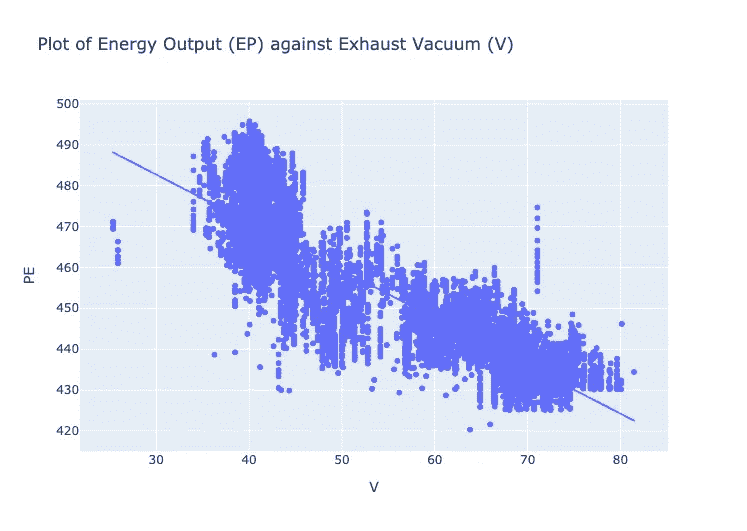

# 提高你的底线

> 原文：<https://towardsdatascience.com/improve-your-bottom-line-8f2db94f3e7e?source=collection_archive---------29----------------------->

## [实践教程](https://towardsdatascience.com/tagged/hands-on-tutorials)

## 预测联合循环电厂电力输出的机器学习模型。

加州圣克拉拉硅谷电力公司。美国公共权力协会。

# 介绍

加快气候变化的速度需要开发和部署更多的可再生能源，同时减少化石燃料的消耗。增加电能消耗可以进一步对气候变化产生积极影响；随着世界从内燃机过渡到电动汽车，人类对电力的需求可能会增加的一个领域是汽车。

满足这种需求激增可能需要增加发电量，但如果我们要实现气候变化目标，就必须在不增加发电所需化石燃料使用量的情况下实现这一增产。进入联合循环发电厂(CCPP)。

这项研究的目标是设计一个最佳的机器学习模型，使用四个变量预测 CCPP 的电力输出(本文中标为 PE ),这四个变量是以摄氏度测量的环境温度(AT)、以毫巴测量的环境压力(AP)、以百分比记录的相对湿度(RH)以及以厘米汞柱测量的工厂气体压缩机的排气真空压力(V)。输出功率以兆瓦(MW)为单位，研究中的 CCPP 发电能力约为 490 MW。

原始数据集是在一项实验中产生的，在该实验中，放置在 CCPP 特定位置的传感器用于收集 2006 年至 2011 年期间电厂满负荷运行时的环境温度、压力、相对湿度、排气真空度和净发电量的读数。每个观测点的值都是每小时的平均值，包含所有变量的完整数据子集总共有 9658 个观察值。

这项研究基于从长达 6 年的实验中收集的数据集，该实验随后被捐赠给加州大学欧文分校的机器学习和智能系统中心。你可以在这里找到数据。在迭代了三个机器学习回归器模型后，我发现随机森林回归器(RFR)的性能最好。然后，我对 RFR 模型进行了一些超参数调整，结果均方根误差为 3.443，平均绝对误差为 2.418，R 平方值为 0.960。

# 联合循环电厂——概述

CCPP 结合了两种涡轮机系统的使用，一种是燃烧燃料来发电的燃气涡轮机，另一种是利用燃气涡轮机的废热产生的蒸汽来产生额外的电力的蒸汽涡轮机。从燃气轮机排出的热量被转换成蒸汽，该蒸汽被引导到蒸汽轮机用于额外的发电。

CCPP 用同样数量的燃料比传统的简单循环发电厂多生产 50%的电力。因此，CCPP 每生产一兆瓦能源消耗的天然气较少。要了解更多关于 CCPP 内部运作的信息，请访问本页。联合循环工艺流程图见图(1)。

*图①。联合循环工艺流程图，显示从燃气轮机回收的热量如何用于通过蒸汽轮机产生额外的电力。余热蒸汽发生器是 CCPP 系统的关键部件。资信证明:* [*马丁安德森普利司通联合有限公司。*](https://brdgstn.com/combined-cycle/)*2020 年 5 月*

# 方法学

该数据集有 40 个重复行，在数据争论过程中被删除。结果，最终的数据集减少到大约 9527 个观察值，而原始的 5 个变量保持不变。

在五个变量中，电力输出(PE)被设置为目标，而天气参数被设置为特征；燃气轮机的功率输出主要取决于环境温度、大气压力和相对湿度。

汽轮机的功率输出和汽轮机的排气真空之间也有关联。因此，排气真空被添加到三个天气参数中，以形成 9527×4 的特征矩阵。

一旦目标和特征被建立和分离，我就对数据集进行 80/20 的训练/测试分割，分成 X_train、y_train 和 X_test、y_test。然后，我使用 Select K Best for k=1 到 4 加上一个线性回归模型来确定用于测试模型的最佳特征数。接下来是训练和测试回归模型，以找到产生最低误差度量的模型。我测试的回归模型如下:

1.  线性回归
2.  随机森林回归量，以及
3.  梯度推进回归器

为了挑选最好的模型，我重点测量了三个关键的回归指标:均方根误差(RMSE)、平均绝对误差(MAE)和每个测试模型的 R 平方值。然后，我做了一些超参数调整，以优化最终模型。

# 探索性数据可视化

下面是一些图表，可以更好地理解每个变量，并了解这些变量之间的一般关系，尤其是与目标变量的关系。

## 功率输出直方图(PE)

图(2)是显示目标变量的分布的直方图，以兆瓦(MW)测量的电能功率(PE)的输出。该曲线看起来有点双峰，大部分数据在 435 MW 到 445 MW 范围内。在 420 MW 附近似乎也有一个异常值。

图(2)。以兆瓦为单位测量的电力输出(PE)分布。

## 热图

图(3)中的热图显示了变量之间的相关性。我们看到输出(PE)和温度(AT)之间的负相关系数约为-0.95，输出和排气(V)之间的负相关系数约为-0.87。大气压力(AP)和相对湿度(RH)与 PE 呈正相关，但相关性较弱。

图(3)相关热图

## 回归图—功率(PE)和温度(AT)

图(3)还显示了在-0.95 处功率和环境温度之间存在最高的相关性。这种强相关性在图(4)所示的回归图中很明显。温度以摄氏度为单位。

图(4)。PE V AT 的回归图

## 回归图—功率(PE)和相对湿度(RH)

功率和相对湿度之间的相关性显示为正，但是在大约 0.39 处较弱。与上面显示的温度点相比，这些点看起来更加分散。这种关系见图(5)中的图表。

图(5)。PE 对 RH 的回归图

## 回归图—功率(PE)和大气压力(AP)

与目标变量正相关的另一个特征是大气压力(AP)，它与目标的相关系数为 0.52。图(6)中所示的图表上的点比图(5)的相对湿度图中的点更集中在趋势线周围。大气压是以毫巴为单位测量的。

图(6)。PE 与 AP 的回归图

## 回归图—功率(PE)和排气真空(V)

除了环境温度，排气真空是与目标变量负相关的另一个特征。它还具有第二高的相关性，为-0.87。真空度的测量单位是厘米汞柱。这种关系的曲线图见图(7)。

图(7)。排气真空回归图。

# 基线分析

在深入构建任何预测模型之前，有必要建立一个基线作为衡量模型性能的标准。从图(2)所示的目标变量的分布来看，一个好的基线估计将是目标变量的平均值。在这种情况下，它是 y_train 的平均值。

> 对于训练数据，RMSE 是 17.012，平均误差是 14.765，而对于测试数据，RMSE 是 17.143，平均误差是 14.973。训练和测试数据的 R 平方值都为零。

# 特征选择

为了确定使用哪些功能运行我们的模型，我使用 Select K Best 从 k=1 到 k=4 迭代来拟合和转换数据，然后通过线性回归模型运行拟合和转换的数据。这样做了四次，从一个特性开始，然后每次运行增加一个额外的特性。对于每次运行，计算由使用的特征数量产生的 MAE。

> 对于 1 个特征，MAE 是 4.283，对于 2 个特征是 3.897，对于 3 个特征是 3.870，对于 4 个特征是 3.621。因此，当数据集的所有 4 个特征都用于构建模型时，MAE 最低。

# 构建和测试模型

我使用数据集中的所有四个特征运行了方法会议中列出的所有三个模型；我在训练数据集上拟合每个模型，对训练数据运行预测以获得训练指标，然后对测试数据运行预测以获得测试指标。以下是从每次模型运行中获得的指标。

## 线性回归

> 对于训练数据，RMSE 为 4.551，平均平均误差为 3.625，R 平方为 0.928。对于测试数据，RMSE 为 4.587，平均相对误差为 3.621，R 平方值为 0.928。对于线性回归模型，训练和测试数据的指标实际上是相同的，我们看到了相对于基线模型的显著改进。

## 随机森林回归量

> 对于训练数据，RMSE 为 1.240，平均平均误差为 0.878，R 平方为 0.995。对于测试数据，RMSE 为 3.453，平均相对误差为 2.419，R 平方值为 0.959。随机森林回归器的训练和测试数据的指标显示出比线性回归模型有所改进。

## 梯度推进回归器

> 对于训练数据，RMSE 为 3.671，平均平均误差为 2.804，R 平方为 0.953。对于测试数据，RMSE 是 3.984，平均相对误差是 3.007，R 平方值是 0.946。梯度推进回归器的训练和测试数据的度量也显示出相对于线性回归模型的改进，但是度量不如从随机森林回归器模型获得的度量好。

## 随机森林回归方程的超参数调整

随机森林回归器具有最低的误差数字，是我进行超参数调整的候选对象。我用来调优随机森林回归器的代码片段显示在单元格(1)中。

单元格(1)。使用 GridSearchCV 和 5 折交叉验证的超参数调整方法。

运行调优代码后，我使用最佳估计器来创建电力输出预测的最终模型。最终模型显示为单元格(2)。最终模型中未显示的调整阶段中包含的任何超参数都有默认值。

单元格(2)。网格搜索最佳超参数的随机森林回归模型

> 对于训练数据，RMSE 为 1.435，平均平均误差为 1.000，R 平方为 0.993。对于测试数据，RMSE 为 3.443，平均相对误差为 2.418，R 平方值为 0.960。超参数调整的随机森林回归模型的训练和测试数据的指标显示，与常规的未调整随机森林模型相比，有非常轻微的改进，并用作该项目的最终预测模型。

# 结果和可视化

表(1)显示了使用优化的随机森林回归器测试的所有模型的测试数据的指标，显示了所有方面的最佳数字。

表(1)显示了模型性能的最终结果

## 排列重要性

排列重要性告诉我们一个特性对模型的整体性能有多重要。图(8)中的条形图显示了用于构建模型的四个特征的重要性。

图(8)。与其他特征相比，环境温度具有不成比例的重要性。这表明环境温度对模型性能的影响最大。

> 如图所示，毫不奇怪，环境温度的变化对模型性能的影响最大，排气真空(V)对模型性能的影响仅次于环境温度，尽管其影响远远小于环境温度。相对湿度和环境压力对模型性能的影响几乎可以忽略不计。

## 部分相关性图(PDP)

接下来，我将展示一些部分依赖图，以可视化对模型输出影响最大的两个特性的具体效果。图表将显示环境温度和排气真空对功率输出的影响。

图(9)。环境温度的部分相关图。

> 图(9)中的曲线显示了环境温度的变化如何影响模型对目标变量的预测。随着温度的升高，我们看到总功率输出稳步下降，考虑到这两个变量之间的反比关系，这是有意义的。但具体来说，PDP 告诉我们，如果我们将环境温度从大约 2.5 摄氏度更改为大约 26.5 摄氏度，假设其他变量保持不变，我们应该预计预测的功率输出会下降大约 50 MW。超过 26.5 度。在数据集中标记最高温度点，输出不受干扰。

图(10)。排气真空的部分依赖图(V)

> 在图(10)中排气真空的情况下，PDP 显示，对于大约 20 cm Hg 和大约 42 cm Hg 之间的真空点，预测的功率输出不变。但是随着排气真空继续增加，预测的功率输出开始下降。具体来说，在大约 42.5 厘米汞柱和大约 68 厘米汞柱之间，预测的功率输出遭受大约 7.5 毫瓦的下降，如果我们将真空从 72 厘米汞柱增加到大约 80 厘米汞柱，模型预测输出将看到大约 0.5 毫瓦的边际增加。

图(11)。PDP 互动图表—输出对 V 和 AT 的部分依赖性。

> 图(11)中的 PDP 图表显示了预测输出对排气真空(V)和环境温度(AT)组合的部分依赖性。因此，网格中的任何点都代表模型仅基于 AT 和 V 的预测。我们注意到，与横轴(at)上的变化相比，纵轴(V)上的功率变化较小，这进一步表明模型的预测更依赖于环境温度而不是排气真空。

## 最高和最低温度的 SHAP 观测图

图(12)。观测到的最高温度的 SHAP 图。

> 图(12)中的 SHAP 图是测试数据集中最大观察温度下的模型功率输出预测。此时的环境温度(AT)为 35.2℃，排气真空(V)为 73.56 cmHg，大气温度(AP)为 1000.56 毫巴，相对湿度(RH)为 45.72%。该模型预测的功率输出为 434.36 MW，并且该图显示 at 和 V(蓝色)比 RH(红色)对较低结果的贡献更大，RH 对预测值的正面影响小得多。

图(13)。观测最低温度的 SHAP 图。

> 在温度谱的另一端，图(13)示出了 SHAP 曲线图，其中温度(At)为 2.58℃，排气(V)为 39.42 cmHg，压力(AP)为 1028.68 毫巴，相对湿度(RH)为 69.03%。由于 RH、V 和 AT 的积极影响，该点的预测功率输出为 489.81 MW。在上述两个图中，环境压力没有显示，因为其对预测的贡献可以忽略不计。

# 结论、局限性和展望

随着世界向更清洁、更可再生的能源过渡，CCPP 将继续在应对气候变化方面发挥关键作用；在这个关键的过渡时期，它可以作为燃煤发电厂的有价值的替代品，并随着更多零排放能源的出现，有助于减少对全球能源系统的冲击。

为了确保 CCPPs 持续高效运行，需要预测电厂的满负荷输出能力。做出这一预测是必要的，不仅是为了最大限度地提高效率，也是为了确保电厂的可持续性和可靠性，所有这些都有助于提高发电业务的底线。

在这项研究中，我能够应用机器学习算法建立一个模型来预测 CCPP 的满载功率输出。我测试的最佳模型是超参数调整的随机森林回归器，它给出了均方根误差和平均绝对误差的最低值。

为 CCPP 等能源生产系统建立预测模型的一个主要障碍是缺乏公开可用的数据，这是由于这些数据的专有性质。这项研究中设计的模型肯定会得到更多数据的增强，这些数据来自世界不同地区的不同植物，在更长的时间内收集。

对于目前没有使用机器学习作为预测工具的 CCPPs，我计划开发和部署一个 web 应用程序，它可以用作满负荷功率输出预测器，以提高运营效率。随着越来越多的发电厂被数字化，我预计将有更多的领域应用机器学习的力量，作为能源和相关行业的持续改进工具。

## 参考资料:

[1]:图费克奇，2014 年 9 月。“使用机器学习方法预测基本负荷运行的联合循环发电厂的满负荷电力输出”*国际电力杂志&能源系统*，第 60 卷，第 126-140 页，ISSN 0142-0615