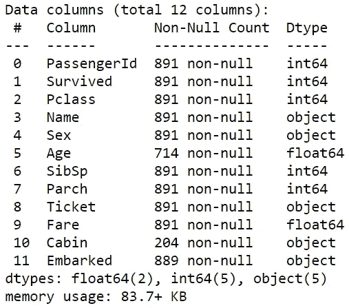
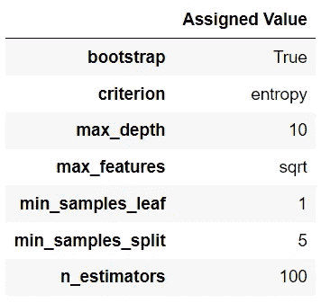
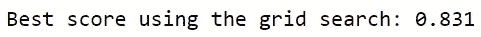
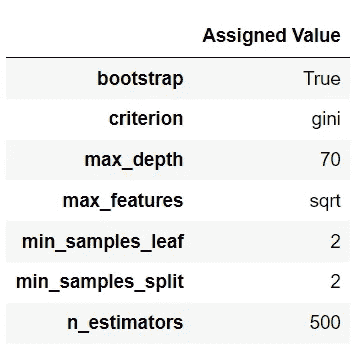
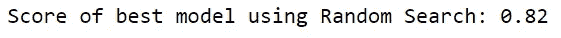
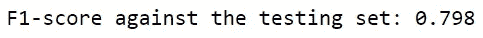

# 使用随机搜索改善您的超参数调谐体验

> 原文：<https://towardsdatascience.com/improve-your-hyperparameter-tuning-experience-with-the-random-search-2c05d789175f?source=collection_archive---------23----------------------->

## 学习通常比常规网格搜索更实用的超参数优化方法的内部工作原理

照片由 [Pexels](https://www.pexels.com/photo/person-holding-volume-knob-1345630/?utm_content=attributionCopyText&utm_medium=referral&utm_source=pexels) 的 [Nicholas Githiri](https://www.pexels.com/@githirinick?utm_content=attributionCopyText&utm_medium=referral&utm_source=pexels) 拍摄

当开发一个机器学习分类器时，不存在哪个超参数将为您提供最佳性能模型的经验法则。出于这个原因，获得最佳超参数的一种非常常见的方法是尝试超参数的每种组合。

这种类型的超参数调整被称为**网格搜索**，它需要测试超参数的每一个组合，以找到为相关数据提供最佳模型的组合。

网格搜索是最广为人知的超参数优化形式，原因显而易见。

网格搜索不仅易于直观理解，而且保证为您的分类器获得理想的超参数。

也就是说，还有一种超参数优化技术没有得到足够的重视:随机搜索。

# 随机搜索

随机搜索与网格搜索非常相似。

然而，随机搜索只测试随机选择的一定数量的组合，而不是测试超参数的每个组合。

乍一看，随机搜索似乎没有吸引力。毕竟，如果你不能测试每一个超参数组合，你不太可能找到最好的一个。

然而，这种方法确实有一些好处。

首先，由于随机搜索测试更少的模型架构，所以它需要更少的时间和更少的计算来获得结果。

尽管随机搜索不一定能找到最佳的超参数集，但它可以提供在性能方面接近理想模型的模型。

# 随机搜索与网格搜索

如果您是数据科学项目的新手，您可能会坚持使用网格搜索。毕竟，多花一点时间有什么问题，如果这意味着你可以获得最好的模型？

在处理简单数据集时，这可能是一个合理的论点。然而，当您开始处理包含数百万条记录的数据时，测试每一个模型架构所需的时间和计算将是巨大的。

此外，如果您正在为客户构建一个模型，您将无法证明仅仅为了模型性能的轻微提高而分配这么多资源是合理的。

不幸的是，网格搜索很浪费；它不会从以前的模型中“学习”。

例如，如果您要通过从 1000 个不同的超参数组合中进行选择来构建一个分类器，那么您只对产生最佳性能指标的单个组合感兴趣。测试其他 999 种组合不会带来额外的好处。

随机搜索通过限制被测试的超参数组合的数量来解决这个问题。尽管这意味着该模型的性能指标可能没有理想模型的高，但这种差异可以忽略不计。

随机搜索可能不像纸上的网格搜索那样吸引人，但是在实践中，它们是获得期望的模型体系结构的更具成本效益的方式。

# 个案研究

让我们通过建立一个预测泰坦尼克号生存能力的模型来探索随机搜索方法(数据集可访问[此处](https://www.kaggle.com/sureshbhusare/titanic-dataset-from-kaggle))。

资料组

代码输出(由作者创建)

在任何数据建模之前，需要为机器学习算法准备数据集。

数据预处理包括:

*   移除不需要的功能
*   删除缺少值的记录
*   编码分类特征
*   将数据分成训练集和测试集
*   归一化整数特征

数据预处理

在使用随机搜索之前，我们将使用网格搜索作为一种参考形式来进行超参数调整。

sklearn 模块中的 [GridSearchCV](https://scikit-learn.org/stable/modules/generated/sklearn.model_selection.GridSearchCV.html) 对象允许我们使用每个期望的超参数组合对分类器执行网格搜索。

对于本案例研究，我们将重点关注使用最佳超参数构建随机森林分类器。将使用 f-1 评分标准对模型进行评估(即最佳模型的 f-1 评分最高)。

这里是将要测试的所有超参数，以及存储在字典中的分配给每个超参数的值。

超参数

如果你使用网格搜索方法，你将不得不用 **5832** 不同的超参数组合来构建随机森林分类器。

下面的代码显示了适合每个可能的模型架构的数据。每个模型都被赋予训练集的 f-1 分数。

GridSearchCV

GridSearchCV 提供了一些属性，有助于获得关于最佳性能模型的更多信息。这些属性包括:

*   best_estimator_:返回得分最高的估计值
*   best_params_:返回理想模型中的超参数值
*   best_score_:返回最佳模型的平均交叉验证分数

使用实现最高性能模型的最佳参数属性。

使用最佳参数

代码输出(由作者创建)

使用 best_score_ 找出最佳模型的平均 f1 分数。

使用最佳分数

代码输出(由作者创建)

理想模型的 f-1 分数为 0.831。

现在我们已经用网格搜索建立了一个模型，让我们用随机搜索做同样的事情，并比较一下它的效果。

sklearn 模块中的 [RandomizedSearchCV](https://scikit-learn.org/stable/modules/generated/sklearn.model_selection.RandomizedSearchCV.html) 对象允许我们使用随机选取的一定数量的超参数组合对分类器进行随机搜索。

随机搜索

随机搜索的实现与常规网格搜索非常相似。但是，在分配的参数方面有一些关键的区别。

由于随机搜索并不测试每一个可用的组合，您可以通过为“n_iter”参数赋值来选择构建和评估的模型数量。这里，我们将值 500 分配给参数(即测试 500 个超参数组合)。

注意:该函数还允许您选择一个随机状态。这不是强制性的，但仍然鼓励这样做，以便您的结果是可重复的。

让我们看看随机搜索产生的最佳模型是什么样的。sklearn 模块为 RandomizedSearchCV 提供了与 GridSearchCV 相同的属性。

这里是用随机搜索建立的最佳模型的超参数。

使用最佳参数

代码输出(由作者创建)

现在让我们来看看使用这组超参数得到了什么样的 f-1 分数。

使用最佳分数

代码输出(由作者创建)

可以看出，随机搜索选择的超参数与网格搜索选择的超参数非常不同。因此，它登记的分数也较低。

但是 f-1 成绩的差距只有 0.013。此外，该结果是通过测试少于十分之一***的用网格搜索测试的超参数组合获得的。***

***在使用 RandomizedSearchCV 找到最佳模型架构之后，您可以使用 best_estimator_ attribute 来使用测试集创建预测。***

***生成预测***

******

***代码输出(由作者创建)***

***总而言之，网格搜索比随机搜索稍微好一点。但是，为了这样一点点的性能提升，测试 10 倍以上的模型架构是合理的吗？***

***如果一个项目优先考虑限制成本和时间，那么随机搜索无疑是更好的选择。***

# ***结论***

******

***照片由 [Unsplash](https://unsplash.com?utm_source=medium&utm_medium=referral) 上的 [Prateek Katyal](https://unsplash.com/@prateekkatyal?utm_source=medium&utm_medium=referral) 拍摄***

***总而言之，您对超参数调优技术的选择应该取决于您在模型成本和性能之间权衡的优先级。***

***网格搜索可以获得理想的模型体系结构，但是考虑到它所引起的成本，它不一定适用于许多现实生活场景。***

***另一方面，随机搜索提供了一种获得可靠模型(尽管不是最好的)的方法，同时节省了金钱和时间。***

***我祝你在机器学习的努力中好运！***