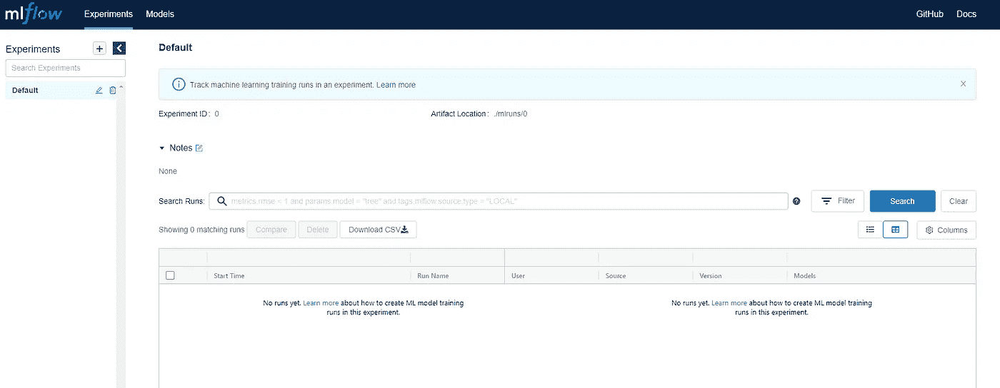
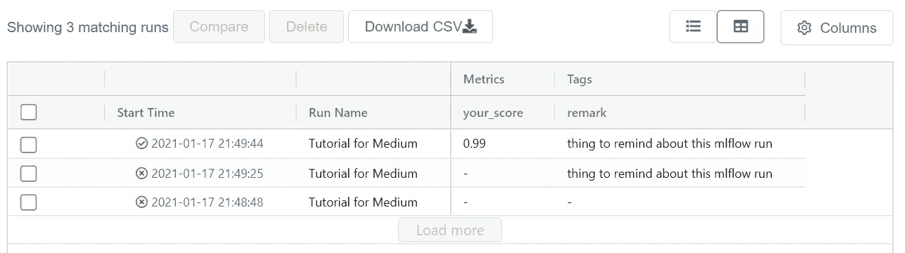

# 使用 MLflow 改善您的机器学习渠道

> 原文：<https://towardsdatascience.com/improve-your-machine-learning-pipeline-with-mlflow-6bdbb70fde36?source=collection_archive---------26----------------------->

## 一个让你的机器学习管道更有能见度的教程

亚历杭德罗·皮涅罗·阿梅里奥在 [Unsplash](https://unsplash.com?utm_source=medium&utm_medium=referral) 拍摄的照片

## **简介**

机器学习管道是数据应用的重要组成部分。我们构建它是为了将原始数据转化为有洞察力的预测。管道包含许多步骤，如数据摄取、数据预处理、特征工程、模型拟合和性能评估。

当数据科学家开始开发 ML 管道时，他们试图快速构建整个管道，并通过改变一些超参数来重复该过程，以获得最佳结果。在这个过程中有许多超参数需要调整。

如果能 ***跟踪那些超参数*** 的变化就最好了。我们将对我们的 ML 用例有更深入的了解。例如，当我们更改特定的超参数时，我们可以看到准确性或 AUC 等性能指标是如何上升或下降的。

另一个好处是，我们可以 ***分析那些测井数据*** 并得出在特定区域开发模型的内部最佳实践。

例如，我们可以推导出**随机森林深度的合适范围**或神经网络层的数量，以在像倾向或流失模型这样的超参数调整过程中进行尝试。它有助于减少模型开发的大量时间消耗。

## 我们如何做到这一点？

这就是本文的目的。有几个有用的开源库支持机器学习管道的创建。今天我们将关注一个图书馆。

*   [MLflow](https://mlflow.org/) 是一个管理 **ML 生命周期**的开源平台，包括实验、可复制性、部署和中央模型注册。
*   截至 2020 年 12 月 17 日，MLflow 在 GitHub 上接收 **8K 颗星星**。许多公司使用这个项目并为此做出贡献。
*   我有机会使用集成了 MLflow 的 Databricks 平台。这是一次宝贵的经历，它教会了我记录/跟踪系统有多重要。

## 让我们看看如何利用它来改善我们的 ML 管道。

您可以从使用`pip install mlflow`安装 MLFlow 开始。然后，您可以通过在终端中键入一个`mlflow ui`命令行来启动 MLFlow 提供的跟踪用户界面。

如果你能看到下图，那么你就可以开始了。我在这里提供了一个在 [GoogleColab](https://colab.research.google.com/drive/1QpukmxO4B10S2HBgT5Jq4OhlGC3twjlU?usp=sharing) 中使用它的例子。

ML 流量跟踪用户界面:作者图片

可以看到 MLflow 提供给用户的一个漂亮的追踪系统。我们这里还没有任何数据。所以让我们放点东西进去。

首先，您必须了解如何将 MLFlow 元素插入到代码中。

无论您的代码是什么模式，您都可以用上面的代码片段包装一切，让 MLflow 为您跟踪结果。结果将根据 MLflow 的安装位置存储在本地。

在数据块中，有一个专门的空间用于存储指标数据。

通过这简单的 3 行代码，您可以在 MLflow 中跟踪任何您想要的东西。MLFlow 将跟踪您在`with`条件下运行的任何东西，并通过跟踪系统显示出来，如下图所示。

没有 MLflow，可能需要自己做一个日志系统。 ***这减少了你的登录系统的设置时间*** ， ***帮助你更专注于机器学习代码。***

使用 MLflow 可以记录很多东西，比如模型的混淆度量图、拟合模型本身、重要特性名称的 pickle 文件。我在 Databricks 平台上使用它时就是这么做的。

## 有了这个能力，MLflow 有什么好的用例？

***通常，当我用第三方工具如[hyperpt](https://github.com/hyperopt/hyperopt)调整超参数*** 时，我总是使用 MLflow。超点是一个超参数调整使用贝叶斯方法，以找到一个更好的超参数集使用。

我们可以整合 MLflow 来记录每个远视试验，以查看合适的超参数范围。这减少了我过去达到可接受的模型性能所需的大量建模时间。

此外，它让您 ***更好地了解您的模型中的每个参数如何表现*** 。下一次，你可以直接去它应该去的地方，而不用浪费时间在超参数空间里进行网格/随机搜索。

让我向您展示如何使用 MLflow 和 hyperOpt 库。我们可以通过下面的代码片段创建一个远视。

通常，超点通过将超参数空间传递给目标函数来工作。然后计算出在试验次数内使目标函数最小的值。

上面的例子是为了最小化从`fit_model`函数返回的损失值。

根据上面的代码，hyperOpt 将从提供的`space`变量运行 100 次`max_evals`，并返回 hyper-parameter 的`best`组合。

每次运行中使用的所有模型、超参数和分数都将存储在 MLflow 目录中。您可以在完成超视跑步后访问最佳模式。这有助于确保您的机器学习模型在开发过程中的可重复性。

一旦你意识到模型开发过程中跟踪系统的好处。你将永远不会停止使用它。❤️

## MLflow 有用的另一个方面是

第二个用例是，我一直在我部署的机器学习管道中使用它。MLflow 使我能够在拟合最新数据时跟踪新的重新拟合模型的性能。我们可以记录特性的重要性，并可视化随时间的变化。

每次运行时，所有拟合的模型都可以存储在 MLflow 工件存储中。我们可以回头参考当时的模型以获得再现性。它帮助您确保模型版本的有效性。

我通常用测试数据来模拟我的预测结果。例如，我从我的人群中随机抽取 A 边组，并将它们与我的预测的最高分进行比较。然后我测量了这两个群体中销售的产品的转化率。这是带有历史数据的 A/B 测试模拟，可以帮助您在现实世界中更舒适地使用您的预测。

所有的模拟结果都可以用 MLflow 记录和可视化。不需要数据科学家手动跟踪他们的模型结果。您可以使用 MLflow 实现自动化和可视化。

不仅是机器学习的相关内容，MLflow 也可以用于质量检查和测试过程。我曾经编写过将测试结果记录到 MLflow 的单元测试。代码运行后，我可以在同一个地方立即检查结果。

## 用 MLflow 养成良好的习惯

[马丁·施瑞德](https://unsplash.com/@martinshreder?utm_source=medium&utm_medium=referral)在 [Unsplash](https://unsplash.com?utm_source=medium&utm_medium=referral) 上的照片

我曾经为临时工作做快速的机器学习模型开发。对我来说，跟踪开发过程中的所有度量和参数是一件痛苦的事情。有时候，我会报告重启 Jupyter 笔记本内核后无法重现的结果。这根本不是一个愉快的时刻。

幸运的是，正如我上面提到的，这些问题可以用 MLflow 来解决。如果你把它变成一种习惯，我相信你在机器学习管道中的开发时间和错误将会缩短。此外，当您使它自动化时，推广到其他上下文也变得简单了。

> “最成功的男人工作聪明，不努力”
> ― **【哈比亚利马纳】、** [**【智慧明珠】**](https://www.goodreads.com/work/quotes/46911351)

这是我认为对数据科学至关重要的技能。但在网络课程或互联网上并没有指出那么多。这就像是你在工作旅途中逐渐积累的最佳实践。它将成为您达到更高水平的工具箱，让您的数据科学生活更加成功。

此外，MLflow 提供了许多令人兴奋的特性，我在这里没有提到，比如模型部署和自动化日志记录。如果你想了解更多，请点击[这里](https://www.mlflow.org/docs/latest/index.html)

## 帕泰鲁什·西达

如果你喜欢这篇文章，并希望看到更多这样的东西。

*   在[媒体](http://padpathairush.medium.com)上跟随我
*   其他渠道？[领英](https://www.linkedin.com/in/pathairush-seeda-b7a62ab6/)、[推特](https://twitter.com/data_products)和[脸书](https://www.facebook.com/DataProds-106431271287292/)