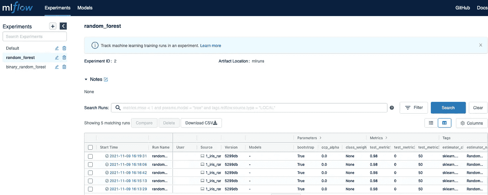
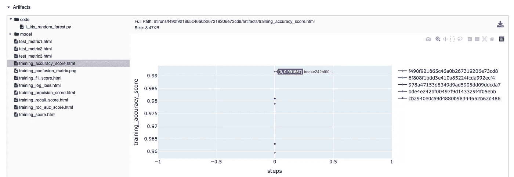

# 改进您的 MLflow 实验，跟踪历史指标

> 原文：<https://towardsdatascience.com/improve-your-mlflow-experiment-keeping-track-of-historical-metrics-6e70a6c7b201?source=collection_archive---------21----------------------->

## 今天，我们将扩展我们的 SDK，增加交互跟踪运行指标的功能，我们将最终运行我们的 SDK


图片由[萨汉德·巴巴里](https://unsplash.com/@sahandbabali)在 [Unsplash](https://unsplash.com/photos/owjrvbyXYyc) 上拍摄

[](https://medium.com/@stefanobosisio1/membership) [## 通过我的推荐链接加入 Medium-Stefano Bosisio

### 作为一个媒体会员，你的会员费的一部分会给你阅读的作家，你可以完全接触到每一个故事…

medium.com](https://medium.com/@stefanobosisio1/membership) 

欢迎回到我们 MLflow 旅程的第二部分。今天，我们将扩展当前的 SDK 实现，增加两个功能来报告历史指标和自定义指标。然后，我们将最终看到 SDK 与一个简单的例子一起工作。下一次，我们将深入探讨 MLflow 插件，我们将为 GCP 人工智能平台创建一个“部署”插件

这是我关于 MLflow SDK 创建的第一篇文章:

[](/scale-up-your-models-development-with-mlflow-4b78a5f22cb7) [## 使用 MLflow 扩展您的模型开发

### 在本文中，让我们看看您的数据科学团队如何👩‍💻👨‍💻可以享受试验🧪的新模式与…

towardsdatascience.com](/scale-up-your-models-development-with-mlflow-4b78a5f22cb7) 

## 目录

— [我们今天需要什么](#f4c0)—[将实验的运行指标报告给最近一次运行](#e0f7)
—[将自定义指标报告给一次运行](#d013)
—[更新实验跟踪界面](#1f3c)
— [创建您最终的 MLflow SDK 并安装它](#e36b)
— [SDK 运行！](#8668)

# 我们今天需要什么

首先，让我们考虑主 SDK 协议的设计。今天的目标是让数据科学家能够:

1.  将先前运行中计算的历史指标添加到给定的实验运行中
2.  向特定运行添加自定义计算指标

因此，我们可以考虑实现以下两个功能:

*   这个函数将从以前的实验运行中收集所有的指标，并将它们分组到一个交互式的图表中，这样用户可以立即发现问题并了解总体趋势
*   `report_custom_metrics`:该函数返回数据科学家的度量注释，向给定的实验发布一个字典。如果数据科学家希望坚持使用一些关于看不见的数据的指标进行特定的实验，这可能是有用的。

## 将实验的运行度量报告给最近的运行

该功能利用 MLflow Tracking 中的`MLflowClient`客户端管理实验及其运行。从`MLflowClient`中，我们可以检索给定实验的所有运行。从那里，我们可以提取每次运行的指标。一旦我们收集了所有的指标，我们就可以进行第二步，我们将使用`plotly`来制作一个交互式`html`图。这样，用户可以在 MLflow 服务器人工制品框中分析所有运行的每个数据点。

图 1 显示了`report_metrics_to_experiment`功能的第一部分。首先，用给定输入`tracking_uri`初始化`MlflowClient`。然后，用`client.get_experiment_by_name`检索实验的信息，并将其转换成一个字典。这里列出了每个实验的运行情况，`runs_list`。每次运行都有自己的`run_id`，它可以将度量信息存储在字典`models_metrics`中。此外，可以通过`run.to_dictionary()['data']['metrics']`访问指标。该值返回指标的名称。

图 1:函数 report_metrics_to_experiment 的第一部分。在这个片段中，我展示了如何从实验运行中检索指标的数据点。最终的指标值与运行 id、指标的步骤和值一起存储在一个字典中

根据指标的名称，可以通过`client.get_metric_history()`记录指标的数据点。该属性返回指标的步骤和值，因此我们可以添加到列表中并保存在`models_metrics[single_run_id][metric] = [x_axis, y_axis]`中

图 2 显示了`report_metrics_to_experiment`的第二部分。首先，初始化一个新的`plotly`数字`fig = go.Figure().`，然后从`models_metrics`中读取指标并添加为散点图。最终的图形以`html`格式保存，以便进行交互式可视化。

图 2:功能报告的第二部分-度量-实验。这里，所有检索到的指标都显示在 plotly 图上，然后以 html 格式保存

## 向跑步者报告自定义指标

我们今天要实现的最后一个功能是报告特定运行的自定义输入。在这种情况下，数据科学家可能从运行的模型中获得一些带有看不见的数据的指标。该函数如图 3 所示。给定一个输入字典`custom_metrics`(例如`{accuracy_on_datasetXYZ: 0.98}`)，该函数使用`MlflowClient`到`log_metric`来表示一个特定的`run_id`

图 3: report_custom_metrics 获取一个输入字典，其中包含看不见的度量或数据，它使用 log_metric 向 MLflow 运行报告键和 val。

## 更新实验跟踪界面

现在，两个新闻函数已经添加到主 MLflow 协议中，[让我们将它们封装到我们的](/scale-up-your-models-development-with-mlflow-4b78a5f22cb7#b9d2) `[experiment_tracking_training.py](/scale-up-your-models-development-with-mlflow-4b78a5f22cb7#b9d2)`中，特别是，`end_training_job`可以调用`report_metrics_to_experiment`，因此，在任何训练结束时，我们都可以跟踪给定实验的所有历史指标，如图 4 所示

图 4:可以在任何培训作业结束时调用 report_metrics_to_experiment，并将其添加到 end_training_job 功能中。

此外，为了允许用户向特定的运行添加他们自己的度量，我们可以考虑一个`add_metrics_to_run`函数，它接收实验跟踪参数、我们想要处理的`run_id`和自定义字典`custom_metrics`(图 5)作为输入:

图 5:可以通过 experiment _ tracking _ training . add _ metrics _ to _ run 模块报告自定义指标。

# 创建您的最终 MLflow SDK 并安装它

将所有部分修补在一起，SDK 包应该以类似的方式构建:

```
mlflow_sdk/
           mlflow_sdk/
                      __init__.py
                      ExperimentTrackingInterface.py
                      experiment_tracking_training.py
           requirements.txt
           setup.py
           README.md
```

`requirements.txt`包含了我们安装 SDK 所需的所有包，特别是默认情况下需要`numpy, mlflow, pandas, matplotlib, scikit_learn, seaborn, plotly`。

`setup.py`允许在给定的 Python 环境中安装您自己的 MLflow SDK，脚本的结构应该是这样的:

图 6:在给定的 Python 环境中安装 mlflow_sdk 包的 Setup.py

要安装 SDK，只需使用 Python 或 virtualenv Python:`python setup.py install`

# SDK 在行动！

是时候将我们的 MLflow SDK 付诸行动了。我们将用一个`sklearn.ensemble.RandomForestClassifier`和[虹膜数据集](https://archive.ics.uci.edu/ml/datasets/iris) ⁴ ⁵ ( [来源和许可](https://onlinelibrary.wiley.com/doi/epdf/10.1111/j.1469-1809.1936.tb02137.x)，[开放数据共享公共领域专用和许可](https://datahub.io/machine-learning/iris))来测试它。图 7 显示了我们将要使用的完整示例脚本(我的脚本名是`1_iris_random_forest.py`)

`tracking_params`包含设置 MLflow 服务器的所有相关信息，以及运行和实验名称。加载数据集后，我们将使用`sklearn.model_selection.train_test_split`创建一个列车测试分割。为了在 MLflow 工件中显示不同的度量和图表，我运行了`1_iris_random_forest.py` 5 次，用以下值改变`test_size`:`0.3, 0.2, 0.1, 0.05, 0.01`

图 7:在这个例子中，我们将对 iris 数据集运行一个随机森林。MLflow SDK 将在训练期间跟踪模型信息，并使用 add_metrics_to_run 报告所有附加指标。

一旦数据已经设置好，`clf=RandomForestClassifier(n_estimators=2)`我们就可以调用`experiment_tracking_training.start_training_job`。该模块将与 MLflow 上下文管理器交互，并向 MLflow 服务器报告运行模型的脚本以及模型的信息和工件。

在培训结束时，我们希望在一个图中报告所有实验运行的指标，并且，仅仅为了测试，我们还将保存一些“假”指标，如`false_metrics = {"test_metric1":0.98, ... }`

在新的终端选项卡中运行`1_iris_random_forest.py`之前，打开与 MLflow 服务器的连接，如`mlflow ui`所示，并导航至`http://localhost:5000`或`http://127.0.0.1:5000`。然后，按照`python 1_iris_random_forest.py`运行上述示例，并针对`test_size`的不同值重复运行 5 次



图 8:运行示例脚本后的 MLflow UI

图 8 应该类似于运行示例脚本后的结果。在`Experiments`下面列出了实验的名称。每个实验都有一系列的跑步，特别是在`random_forest`下，你会找到来自`1_iris_random_forest.py`的随机森林跑步

对于每次运行，我们可以立即看到一些参数，这些参数由`mlflow.sklearn.autolog()`自动记录，以及我们的假指标(例如`test_metric1`)自动记录功能也保存`Tags`，报告估计器类(例如`sklearn.ensemble._forest.RandomForestClassifier`)和方法(`RandomForestClassifier`)。

单击单次运行，将显示更多详细信息。首先，您将看到所有的模型参数，这些参数也是由 autolog 功能自动报告的。向下滚动页面，我们可以访问指标图。在这种情况下，我们只有一个数据点，但对于更复杂的模型，您可以有一个完整的图，作为步骤数的函数。



图 MLflow SDK 保存的工件。在 artifacts 框中，您可以找到用于运行模型的代码(在我的例子中是 1_iris_random_forest.py ),以及 model 文件夹下的模型 pickle 文件和所有交互式度量图以及混淆矩阵。

然后，最重要的信息将存储在工件箱下(图 9)。在这里，您可以找到由我们的`mlflow_sdk:`创建的不同文件夹

*   首先，`code`是一个文件夹，它存储了用于运行我们的模型的脚本——这是在第 24 行的`experiment_tracking_training`中用`traceback`、[这里是](/scale-up-your-models-development-with-mlflow-4b78a5f22cb7#a308)链接完成的，并被推送到第 31 行的`run_training`函数的 MLflow artefacts、[这里是链接](/scale-up-your-models-development-with-mlflow-4b78a5f22cb7#6cac)。
*   接下来，`model`存储二进制 pickle 文件。MLflow 自动保存模型文件及其要求，以允许结果的再现性。这在部署时非常有用。
*   最后，你会看到所有的互动情节。(`*.html`)，在培训结束时生成，以及我们在培训期间计算的其他指标，如`training_confusion_matrix.png`

如您所见，我们以最少的干预为 ML 模型添加了完整的跟踪路线。实验在开发阶段至关重要，通过这种方式，数据科学家可以轻松使用 MLflow 跟踪功能，而无需过度修改他们现有的代码。从这里，您可以探索报告的不同“色调”,为每次运行添加进一步的信息，以及在专用服务器上运行 MLflow 以允许跨团队协作。

罗纳德·费希尔《分类问题中多重测量的使用》*优生学年鉴*7.2(1936):179–188。

爱德华·戴明。“对数理统计的贡献。拉。纽约:威利；伦敦:查普曼&霍尔出版社，1950 年。655 页“*科学*113.2930(1951):216–217。

R. O .杜达和 P. E .哈特。“模式分类和场景分析。(Q327。D83)约翰·威利父子公司。”(1973): 218.

⁴·达萨拉西，贝鲁尔 v 在邻居周围搜寻:在部分暴露环境中识别的新系统结构和分类规则〉 *IEEE 模式分析和机器智能汇刊*1(1980):67–71。

⁵·盖茨，杰佛瑞。“简化的最近邻规则(corresp。)."IEEE 信息论汇刊 18.3(1972):431–433。

今天就到这里吧！希望您喜欢这两篇关于 MLflow 及其 SDK 开发的文章。下一次，我们将深入 MLflow 插件世界，从理论上讲，这也可以引导您的团队进入部署阶段。

如果你有任何问题或好奇，请给我发电子邮件到 stefanobosisio1@gmail.com