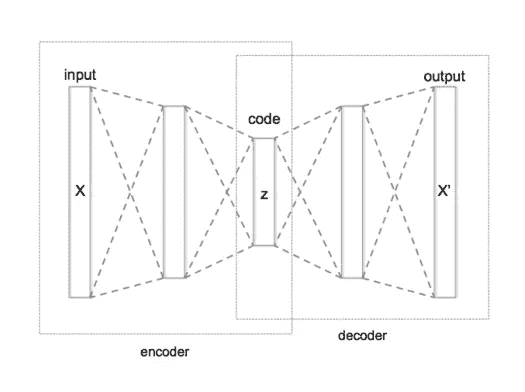

# 使用自动编码器提高模型性能

> 原文：<https://towardsdatascience.com/improve-your-model-performance-with-auto-encoders-d4ee543b4154?source=collection_archive---------6----------------------->

## 使用自动编码器作为特征提取器

图片由 [ar130405](https://pixabay.com/users/ar130405-423602/?utm_source=link-attribution&amp;utm_medium=referral&amp;utm_campaign=image&amp;utm_content=2081168) 来自 [Pixabay](https://pixabay.com/?utm_source=link-attribution&amp;utm_medium=referral&amp;utm_campaign=image&amp;utm_content=2081168)

除非您评估模型的性能，否则您永远不知道模型的性能如何。数据科学家的目标是开发一个健壮的数据科学模型。模型的健壮性是通过计算它在验证和测试指标上的表现来决定的。如果模型在验证和测试数据上表现良好，则它在生产推断期间往往表现良好。

有各种各样的技术或技巧来提高模型的性能。正确的特征工程策略有助于提高模型的性能。在本文中，我们将讨论并实现使用自动编码器的特征提取。

# 什么是自动编码器？

自动编码器是一种无监督的神经网络，它从输入的未标记数据中学习有效的编码。自动编码器试图通过最小化重建损失来重建输入数据。

标准自动编码器架构具有编码器和解码器层:

*   **编码器:**从输入空间到低维空间的映射
*   **解码器:**从低维空间重构到输出空间

([来源](https://en.wikipedia.org/wiki/Autoencoder))，自动编码器架构

> 跟随我以前的文章来了解自动编码器的应用或用法

</6-applications-of-auto-encoders-every-data-scientist-should-know-dc703cbc892b>  

# 想法:

自动编码器将输入数据(X)编码成另一维度(Z)，然后使用解码器网络重构输出数据(X’)。与输入层相比，编码嵌入优选地在维度上较低，并且包含输入层的所有有效编码。

想法是通过在训练样本上训练自动编码器来学习编码器层权重。通过在训练样本上训练自动编码器，它将试图最小化重构误差并生成编码器和解码器网络权重。

稍后，解码器网络可以被裁剪掉，并且可以使用编码器网络来生成特征提取嵌入。这种嵌入可用于监督任务。

现在，让我们深入研究上面讨论的思想的一步一步的实现。

## 第 1 步—数据:

我使用的样本数据集是使用 make_classification 函数生成的，包含 10k 个实例和 500 个特征。将数据集分成训练、验证和测试样本，以避免数据泄漏。此外，标准化数据样本。

## 步骤 2 —定义自动编码器:

我已经在自动编码器架构中定义了两层编码器和两层解码器网络。每个编码器和解码器层都有一个批量标准化层。

编码层的尺寸需要通过实验来决定。

## 步骤 3 —自动编码器培训:

使用 Keras 和 adam optimizer 编译并运行自动编码器架构，并使用均方误差损失来重构输入数据。

我将运行流水线 50 个时期，批处理大小为 64。

## 步骤 4——绘制重建误差:

将训练和测试重建损失的变化可视化。

(作者提供图片)，用纪元训练和验证 MSE

## 步骤 5 —定义编码器并保存权重:

一旦自动编码器、权重被优化，我们可以裁剪解码器网络，并且仅使用编码器网络来计算输入数据的嵌入。这些嵌入可以进一步用作监督机器学习任务的特征。

## 第 6 步—训练受监督的任务:

来自解码器网络的嵌入可以用作分类或回归任务的特征。

# 基准测试:

现在，让我们通过将原始输入要素更改为编码要素来比较模型的性能。我们将用两个模型的默认超参数训练一个逻辑回归估计量。

(图片由作者提供)，性能指标评测

第一列提到了具有 500 个特征的原始输入数据的度量性能。对于使用自动编码器的编码器网络的编码特征，我们观察到性能指标的改进。

# 结论:

使用自动编码器的特征提取捕获输入数据的有效编码，并将其投影到相同或更低的维度。对于具有大量输入要素的输入数据，最好将数据投影到较低的维度中，并将这些要素用于监督学习任务。

另外，请阅读我以前的一些文章来提高模型性能:

<https://medium.com/geekculture/essential-guide-to-improve-imbalanced-data-classification-model-performance-c8cf0125b731>  

# 参考资料:

[1][https://machine learning mastery . com/auto encoder-for-class ification/](https://machinelearningmastery.com/autoencoder-for-classification/)

*喜欢这篇文章吗？成为* [*中等会员*](https://satyam-kumar.medium.com/membership) *继续无限制学习。如果你使用下面的链接，我会收到你的一小部分会员费，不需要你额外付费。*

<https://satyam-kumar.medium.com/membership>  

> 感谢您的阅读