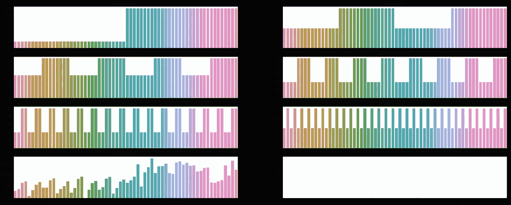

# 通过贝叶斯优化超参数调整提高模型性能

> 原文：<https://towardsdatascience.com/improve-your-model-performance-with-bayesian-optimization-hyperparameter-tuning-4dbd7fe25b62?source=collection_archive---------19----------------------->

## [实践教程](https://towardsdatascience.com/tagged/hands-on-tutorials)


照片由[丹尼斯·莱昂](https://unsplash.com/@denisseleon?utm_source=medium&utm_medium=referral)在 [Unsplash](https://unsplash.com?utm_source=medium&utm_medium=referral) 上拍摄

# 介绍

*“我为什么要看这篇文章？”*

如果你已经开始在你的项目中使用 ML，或者只是为了好玩，你可能已经意识到调整你的模型的任务是多么的具有挑战性，尤其是它是非常耗时的。如果你不是一个专业的 ML 从业者，对应该使用哪些超参数做出有根据的猜测将是一个挑战。此外，您正在使用的算法可能对**超参数选择**非常敏感，因此测试更多的实现是有用的。在本文中，我将根据经验展示**贝叶斯优化**对于超参数调优的强大功能，并将其与更常见的技术进行比较。

# 背景

*“超参数调优快速回顾”*

在 ML 领域，评估几组超参数的最已知技术是**网格搜索**和**随机搜索。**下面是它们工作原理的形象化展示:


作者图片，灵感来自[随机搜索超参数优化](https://www.jmlr.org/papers/volume13/bergstra12a/bergstra12a.pdf) (James Bergstra，Yoshua Bengio)

x 轴和 y 轴代表两个假设超参数的取值范围，在左图中，您可以看到算法尝试预定义的参数组合(GridSearch)，而在右图中，超参数是从一个范围内随机选择的(RandomSearch)。

在图中，您还可以看到，对于每个超参数，都有一个函数来定义超参数本身与其对模型性能的贡献之间的关系。你的目标是**优化函数**以找到最大值。然而，超参数越多，就越难找到最佳点。

然而，这个例子不是很现实，因为 ML 算法可能有一个**长的可以调整的超参数列表**，并且可能组合的数量可能变成**无法估计**。我们的**目标**确实是试图找到**性能最好的**型号，同时尝试**最少的组合**。

# 贝叶斯优化

*“让超参数搜索更加数据驱动”*

网格搜索和随机搜索并不是仅有的两种进行超参数调整的技术。我确实想展示另一个可以用来实现这个目标的方法，那就是**贝叶斯优化**。

我不会深究算法是如何工作的，我将只限于给出一个大概的概述。由此，您可以找到算法所采取的步骤:

*   它**通过对**超参数**的**随机**值进行采样来启动**。
*   它**观察生成的输出**(模型性能)。
*   基于这些观察，它符合高斯过程。
*   它使用这个 G **高斯过程**的**均值**作为未知的**函数**的**近似值**。
*   为了理解哪个**超参数**应该在下一个被**采样，它**使用**和**采集函数**(我们可以将其视为采样策略)。采集功能**还定义了**算法应该**探索**超参数空间或**利用**已知区域的程度。**
*   再次安装**模型**并观察输出**并在相同过程中重复**直到达到最大迭代次数。

通过阅读以上几点，你应该已经明白为什么这个方法在理论上比我在上一段提到的方法更好。该方法使用来自**上一次运行**到**的信息通知**下一次运行。这是一个**非常强大的工具**，因为它允许我们在整个过程中**缩小**超参数搜索的范围，以主要关注超参数范围中非常有利可图的领域。

更一般地说，每当你需要优化一个**黑盒**函数时，可以使用贝叶斯优化。这意味着您可以使用这种方法来搜索任何函数的全局最优解，而您只能观察该函数的输入和输出。

为了使用贝叶斯优化进行超参数调整，我使用了模块' **scikit-optimize** ，我发现它非常直观和用户友好。在他们的文档中没有很多例子，但是你需要做的就是实现它。

# 实验设置

*“不错的理论，但它在实践中意味着什么？”*

在这个实验中，我们将比较 GridSearch、RandomSearch 和 Bayesian 优化超参数调优的结果。我使用的数据是**加州住房数据集**，其目标是**预测中值房价**。为了达到这个结果，我使用了 **GBM 算法**。

值得一提的是，这个练习**旨在**到**比较**超参数算法和**而非** **以获得最佳模型**，因此我不对数据进行任何转换。我正在做一个被蒙住眼睛的插件和游戏，这当然是不建议在现实世界中做的(总是吃你的胡萝卜和看数据)。

为了解决模型性能问题，我使用了 **MAE 指标**和 **K 倍交叉验证**。

在每个模型之后，我**绘制每次迭代的超参数**以及跨越 K 倍的平均负 MAE 度量(我所绘制的实际上是跨越迭代的负 MAE 和最高负 MAE 之间的差异)。我这样做是为了更清楚地了解超参数对模型性能的影响。

我选择优化的超参数是:

*   最大深度
*   最小样本分割
*   学习率
*   子样品
*   最大 _ 特征
*   n _ 估计量

# 实验

*“我们来看一些剧情”*

在下面的代码块中，我将导入必要的模块，并生成一些函数来可视化结果。

```
import pandas as pd
import numpy as np
from sklearn.model_selection import GridSearchCV, RandomizedSearchCV, train_test_split
from sklearn.ensemble import GradientBoostingRegressor
from sklearn.metrics import mean_absolute_error
from scipy.stats import randint, uniform
import seaborn as sns
import matplotlib.pyplot as pltdef parameter_over_iterations(model_result):
  '''
  This function is generating a subplots with the hyperparameter values for each iteration and the overall performance score.
  The performance score is the difference between the best performing model and the worst performing model

  model_result: CV object
  '''
  param_list = list(model_result.cv_results_['params'][0].keys())
  max_col_plot = 2
  row_plot =int(np.ceil((len(param_list) + 1)/max_col_plot))
  fig, axs = plt.subplots(nrows=row_plot, ncols=np.min((max_col_plot, (len(param_list) + 1))), figsize=(30,12))
  for i, ax in enumerate(axs.flatten()):
    if i == len(param_list):
      break
    par = param_list[i]
    param_val = list()
    for par_dict in model_result.cv_results_['params']:
      param_val.append(par_dict[par])
    sns.barplot(y=param_val, x=np.arange(len(param_val)), ax=ax)
    ax.set_title(par)
  dt = pd.DataFrame({key:val for key,  val in model_result.cv_results_.items() if key.startswith('split')})
  mean_metric = dt.mean(axis=1)
  sns.barplot(y=(mean_metric.values + abs(np.min(mean_metric.values))), x=np.arange(len(mean_metric) ), ax=axs.flatten()[i])
  axs.flatten()[i].set_title('overall metric')
```

# 网格搜索

在本节中，我们将看到使用 GridSearch 选择最佳超参数的结果。

```
param_test = {'max_depth':range(5,15,5), 'min_samples_split':range(200,800,300), 'learning_rate': np.arange(0.05,0.55,0.25), 'subsample': np.arange(0.4,1,0.4),
              'max_features': np.arange(0.4,1,0.3), 'n_estimators': np.arange(40,160,60)}gsearch = GridSearchCV(estimator = GradientBoostingRegressor(random_state=10), 
param_grid = param_test, scoring='neg_mean_absolute_error',n_jobs=4,iid=False, cv=5)
gsearch.fit(X_train,y_train)parameter_over_iterations(gsearch)
```



在上图中，我们可以看到每个超参数选择的**模型性能**。在前 6 个子图中，我绘制了在每个特定迭代中使用的**超参数值**(迭代总数为 64)。

最后一个图(在左下方)是性能图，对该图的解释是,**越高，**和**越好，模型的性能就越好。**

从上面的图中，我们可以清楚地看到两件事:学习率为 0.3 会对模型性能产生积极影响(您可以看到图右侧的值更高)，估计器的数量越多，性能也越好(在图的开始，您可以看到当估计器的数量较高时，峰值最高)

总之，通过这次搜索，我发现最佳超参数组合是

*   学习率:0.3
*   最大深度:5
*   最大特征数:0.4
*   最小样本数:500
*   n _ 估计值:100
*   子样本:0.8

这导致了一场 **35212.30** 的 MAE。

# 随机搜索

RandomSearch 应该比 GridSearch 产生更好的结果，即使它通常不能达到未知函数的全局最优。

```
param_distrib = {'max_depth':randint(5,15), 'min_samples_split':randint(200,800), 'learning_rate': uniform(loc=0.05, scale=0.50), 'subsample': uniform(loc=0.4, scale=0.6),
              'max_features': uniform(loc=0.4, scale=0.6), 'n_estimators': randint(40,160)}rsearch = RandomizedSearchCV(estimator = GradientBoostingRegressor(random_state=10), 
param_distributions = param_distrib, scoring='neg_mean_absolute_error',n_jobs=4, n_iter=64,iid=False, cv=5)
rsearch.fit(X_train,y_train)parameter_over_iterations(rsearch)
```


事实上，随机搜索方法导致了更好的超参数选择，导致 MAE 为 **33942** 。

选定的超参数有:

*   学习率:0.23
*   最大深度:5
*   最大 _ 特征:0.88
*   最小样本数:337
*   n _ 估计值:125
*   子样本:0.75

# 贝叶斯优化

现在是测试贝叶斯优化算法来调整模型的时候了。

正如您在下面的脚本中看到的，除了我为每个超参数指定值范围的字典之外，我还指定了一些将影响贝叶斯算法行为的值。我为**获取函数**指定了一些参数(xi 和卡帕)。这两个参数控制了采集函数在多大程度上倾向于**探索到开发**。较高的 xi 和卡帕值意味着更多的探索，而较低的值意味着更多的开发。

关于这个主题的更多信息可以在这里找到:[https://sci kit-optimize . github . io/stable/auto _ examples/exploration-vs-exploitation . html？highlight=kappa](https://scikit-optimize.github.io/stable/auto_examples/exploration-vs-exploitation.html?highlight=kappa)

```
from skopt import BayesSearchCV
from skopt.space import Real, Integeroptimizer_kwargs = {'acq_func_kwargs':{"xi": 10, "kappa": 10}}space  = {'max_depth':Integer(5, 15),
          'learning_rate':Real(0.05, 0.55, "uniform"),
          'min_samples_split':Integer(200, 800),
          'subsample': Real(0.4, 1, "uniform"),
          'max_features': Real(0.4, 1, "uniform"),
          'n_estimators': Integer(40, 160)}bsearch = BayesSearchCV(estimator = GradientBoostingRegressor(random_state=10), 
search_spaces = space, scoring='neg_mean_absolute_error',n_jobs=4, n_iter=64,iid=False, cv=5, optimizer_kwargs=optimizer_kwargs)
bsearch.fit(X_train,y_train)parameter_over_iterations(bsearch)
```


如果我们在迭代中观察超参数，我们确实看到，对于某些参数，随着时间的推移，这些值趋向于变得更加**稳定。这表明算法正在**向最优值**收敛。然而，对于相当多的迭代来说，该算法似乎在某些**局部最优**上停滞不前(这表明更多的探索将对该算法有益)。事实上，如果我们查看学习率，我们会发现在迭代 10 和迭代 53 之间，该值几乎没有变化，但学习率为 0.19 时会获得最佳结果。**

看起来这种方法**将受益于更多的迭代**，然而，这种方法能够找到一组可能导致 **32902** 的 MAE 的超参数。

*   学习率:0.19
*   最大深度:7
*   max_features: 0.73
*   最小样本数:548
*   n _ 估计数:134
*   子样本:0.86

# 结论

*“贝叶斯优化值得吗？”*

在这个简短的(肯定不是详尽的)例子中，我们可以清楚地看到 **GridSearch 肯定是探索超参数空间最差的**方法，而 **RandomSearch 和贝叶斯优化都表现良好**。然而，特别是当超参数的数量很高时，随机搜索可能不会提供最好的结果，而潜在的贝叶斯优化会提供最好的结果，因为它基于观察到的性能通知未来的超参数选择。此外，贝叶斯优化应该花费**较少的迭代**来达到**全局最优**，而随机搜索可能需要大量的迭代才能达到。